# AI Development Patterns

[](https://github.com/PaulDuvall/ai-development-patterns/actions/workflows/pattern-validation.yml)
[](https://opensource.org/licenses/MIT)
[](https://github.com/PaulDuvall/ai-development-patterns#ai-development-patterns)
[](#complete-pattern-reference)
[](https://github.com/PaulDuvall/ai-development-patterns/tree/main/tests)
[](https://github.com/PaulDuvall/ai-development-patterns/actions/workflows/pattern-validation.yml)

> **📋 How ready is your team for AI-assisted development?** Take the free [AI Development Readiness Scorecard](https://redactedventures.com/scorecard) to find out — and discover which patterns to adopt first.

A comprehensive collection of patterns based on my experience for building software with AI assistance, organized by implementation maturity and development lifecycle phases. These patterns are subject to change as the field evolves.

Adoption verdicts are mechanically recomputed from structured, tiered evidence. Model-backed evidence research runs only on demand in a signed-in local Codex session with an explicit plan approval; GitHub Actions never calls an evaluator model or receives an evaluator API key. CI performs deterministic schema, provenance, derivation, status-drift, link, and content checks, including a weekly read-only freshness check. See [verification/STATUS.md](verification/STATUS.md) for every stable and exploratory pattern's assessed, pending, and freshness state, and [verification/](verification/README.md) for the local-agent workflow and trust model.


```mermaid
graph TB
    subgraph F[Foundation]
        RDY[Agent Readiness] --> CR[Codified Rules] --> SS[Security Sandbox]
        SS --> DL[Developer Lifecycle] --> TI[Tool Integration]
        RDY --> IG[Issue Generation]
    end

    subgraph D[Development]
        DL --> SD[Spec-Driven Development]
        PI[Planned Implementation] --> INCR[Incremental Generation]
        INCR --> AD[Atomic Decomposition] --> PA[Parallel Agents]
        INCR --> AE[Adversarial Evaluator]
        CR --> AM[Agent Memory] --> PD[Progressive Disclosure]
        CR --> AH[Agent Hooks] --> CC[Custom Commands]
        SD --> IS[Image Spec]
        CR --> GR[Guided Refactoring]
        DL --> AO[Agent Observability] --> ER[Error Resolution]
        TI --> MR[Model Routing]
        AM --> CRES[Code Research]
        PA --> BA[Bounded Autonomy]
    end

    subgraph O[Operations]
        SS --> PG[Policy Generation] --> EVA[Evidence Automation]
        CR --> CZR[Centralized Rules]
        AO --> DR[Drift Remediation]
        GR --> DF[Debt Forecasting]
        AO --> GC[Guided Chaos]
    end

    classDef foundation fill:#a8d5ba,stroke:#2d5a3f,stroke-width:2px,color:#1a3a25
    classDef development fill:#f9e79f,stroke:#b7950b,stroke-width:2px,color:#7d6608
    classDef operations fill:#f5b7b1,stroke:#c0392b,stroke-width:2px,color:#78281f
    class RDY,CR,SS,DL,TI,IG foundation
    class SD,PI,INCR,AD,PA,AE,AM,PD,AH,CC,IS,GR,AO,ER,MR,CRES,BA development
    class PG,EVA,CZR,DR,DF,GC operations

    click RDY "https://github.com/PaulDuvall/ai-development-patterns#agent-readiness"
    click CR "https://github.com/PaulDuvall/ai-development-patterns#codified-rules"
    click SS "https://github.com/PaulDuvall/ai-development-patterns#security-sandbox"
    click DL "https://github.com/PaulDuvall/ai-development-patterns#developer-lifecycle"
    click TI "https://github.com/PaulDuvall/ai-development-patterns#tool-integration"
    click IG "https://github.com/PaulDuvall/ai-development-patterns#issue-generation"
    click SD "https://github.com/PaulDuvall/ai-development-patterns#spec-driven-development"
    click PI "https://github.com/PaulDuvall/ai-development-patterns#planned-implementation"
    click INCR "https://github.com/PaulDuvall/ai-development-patterns#incremental-generation"
    click AM "https://github.com/PaulDuvall/ai-development-patterns#agent-memory"
    click AH "https://github.com/PaulDuvall/ai-development-patterns#agent-hooks"
    click CC "https://github.com/PaulDuvall/ai-development-patterns#custom-commands"
    click PD "https://github.com/PaulDuvall/ai-development-patterns#progressive-disclosure"
    click AD "https://github.com/PaulDuvall/ai-development-patterns#atomic-decomposition"
    click GR "https://github.com/PaulDuvall/ai-development-patterns#guided-refactoring"
    click AO "https://github.com/PaulDuvall/ai-development-patterns#agent-observability"
    click IS "https://github.com/PaulDuvall/ai-development-patterns#image-spec"
    click AE "https://github.com/PaulDuvall/ai-development-patterns#adversarial-evaluator"
    click PA "https://github.com/PaulDuvall/ai-development-patterns#parallel-agents"
    click ER "https://github.com/PaulDuvall/ai-development-patterns#error-resolution"
    click MR "https://github.com/PaulDuvall/ai-development-patterns#model-routing"
    click CRES "https://github.com/PaulDuvall/ai-development-patterns#code-research"
    click BA "https://github.com/PaulDuvall/ai-development-patterns#bounded-autonomy"
    click PG "https://github.com/PaulDuvall/ai-development-patterns#policy-generation"
    click EVA "https://github.com/PaulDuvall/ai-development-patterns#evidence-automation"
    click CZR "https://github.com/PaulDuvall/ai-development-patterns#centralized-rules"
    click DR "https://github.com/PaulDuvall/ai-development-patterns#drift-remediation"
    click DF "https://github.com/PaulDuvall/ai-development-patterns#debt-forecasting"
    click GC "https://github.com/PaulDuvall/ai-development-patterns#guided-chaos"
```

**Legend**: 🟢 Foundation | 🟡 Development | 🔴 Operations

## Pattern Organization

This repository provides a structured approach to AI-assisted development through three pattern categories:

- **[Foundation Patterns](#foundation-patterns)** - Essential patterns for team readiness and basic AI integration
- **[Development Patterns](#development-patterns)** - Daily practice patterns for AI-assisted coding workflows  
- **[Operations Patterns](#operations-patterns)** - CI/CD, security, and production management with AI
- **[Experimental Patterns](experiments/)** - Advanced and experimental patterns under active development and/or consideration.

<a id="security-orchestration"></a>
- **Moved to experiments:** [Security Orchestration](experiments/README.md#security-orchestration)

<a id="autonomous-remediation"></a>
- **Moved to experiments:** [Autonomous Remediation](experiments/README.md#autonomous-remediation)

## Harness Engineering Lens

The [Harness Engineering](https://martinfowler.com/articles/harness-engineering.html) framing — **`Agent = Model + Harness`** — describes the controls built *around* a coding agent (separate from the model) to make its output trustworthy. Harness Engineering isn't one of the patterns in this catalog; it's a *lens* over them — a way of grouping the patterns below and understanding *why* you'd use them together. Every control is one of two kinds and runs in one of two ways:

- **Feedforward (guides)** steer the agent *before* it acts.
- **Feedback (sensors)** observe *after* it acts so it can self-correct.
- **Computational** controls are deterministic, fast, and reliable — linters, type checks, tests, fitness functions.
- **Inferential** controls are semantic, slower, and probabilistic — AI review, LLM-as-judge.

A healthy harness balances all four: feedforward-only agents never learn whether the rules worked; feedback-only agents repeat the same mistakes. The catalog maps onto the lens as follows.

| Pattern | Direction | Execution | Regulates |
|---------|-----------|-----------|-----------|
| [Codified Rules](#codified-rules) / [Centralized Rules](#centralized-rules) | Feedforward | — | Conventions |
| [Spec-Driven Development](#spec-driven-development) | Feedforward | — | Behaviour |
| [Planned Implementation](#planned-implementation) | Feedforward | — | Approach |
| [Custom Commands](#custom-commands) | Feedforward | — | Workflow |
| [Agent Observability](#agent-observability) | Feedforward + Feedback | Computational + Inferential | Architecture fitness |
| [Guided Refactoring](#guided-refactoring) | Feedback | Computational + Inferential | Maintainability |
| [Adversarial Evaluator](#adversarial-evaluator) | Feedback | Inferential | Behaviour |
| [Error Resolution](#error-resolution) | Feedback | Computational | Runtime |
| [Agent Hooks](#agent-hooks) | Feedforward + Feedback | Computational | Workflow boundaries |
| [Bounded Autonomy](#bounded-autonomy) | Feedforward + Feedback | Computational | Autonomous loops |

Two principles from the source are worth stating directly:

- **Keep Quality Left** — run cheap, fast controls early (linters, basic review pre-commit) and reserve expensive ones (mutation testing, deep AI review) for later, so issues are caught where they cost least.
- **Steer, don't automate** — when the agent repeats a mistake, improve the harness (the guides and sensors), not just the prompt. The human's job is to iterate on the harness.

**Source**: Birgitta Böckeler, "[Harness Engineering](https://martinfowler.com/articles/harness-engineering.html)", martinfowler.com.

## Loop Engineering Lens

Most of this catalog treats a single AI task as the unit of work: write a prompt, get an output, review it. The **Loop Engineering Lens** zooms out. When you remove a human from the inner loop and let an agent iterate — read tool output, act, re-check, repeat — the *loop* becomes the thing you design, bound, and verify, not the task. Like the [Harness Engineering Lens](#harness-engineering-lens), this is a lens over the catalog, not a pattern to adopt. The two are complementary: Harness Engineering asks how *good* the controls around an agent are (the quality of its guides and sensors); Loop Engineering asks how much *autonomy* that control quality earns you, and how to bound the blast radius once no human inspects each iteration. Better verification reach buys more autonomy; weak verification caps it — no matter how capable the model.

Three principles set the lens's dimensions:

- **No executable done-check, no loop** — gate before you start. If "done" isn't a state a command can check (exit 0 or 1), and failure isn't cheaply reversible, run it interactively instead of looping.
- **The test arbitrates, not the model** — one task per loop, deterministic verification, and the agent never certifies its own work. Producer ≠ grader: the thing that writes the code is never the thing that decides it's correct.
- **Your verification reach sets the autonomy ceiling** — bound the loop with turn, spend, and stall/divergence limits; keep state in git; let humans own the upstream policy and the downstream merge.

| Principle | What the loop must have | Catalog patterns that satisfy it |
|-----------|-------------------------|----------------------------------|
| No executable done-check, no loop | An observable goal, acceptance criteria written first, and cheap reversal | [Spec-Driven Development](#spec-driven-development), [Planned Implementation](#planned-implementation), [Agent Observability](#agent-observability); reversible failure via [Parallel Agents](#parallel-agents) worktrees |
| The test arbitrates, not the model | Tight scope, an independent verifier, and checks wired to fire on every change | [Atomic Decomposition](#atomic-decomposition), [Adversarial Evaluator](#adversarial-evaluator), [Test Promotion](experiments/README.md#test-promotion), [Agent Hooks](#agent-hooks), [Autonomous Acceptance](experiments/README.md#autonomous-acceptance) |
| Verification reach sets the autonomy ceiling | Hard bounds, state in git, and human-owned edges | [Bounded Autonomy](#bounded-autonomy), [Agent Memory](#agent-memory), [Long-Running Orchestration](experiments/README.md#long-running-orchestration), [Centralized Rules](#centralized-rules), [Handoff Protocols](experiments/README.md#handoff-protocols) |

The [Bounded Autonomy](#bounded-autonomy) pattern supplies the control layer that caps turns, spend, and time, detects stalls and divergence, and captures an in-loop diagnostic trail.

Two principles from the source are worth stating directly:

- **The unit of work is the loop, not the task** — design, bound, and verify the loop as a whole. A single task is just one iteration of it; optimizing the task while leaving the loop unbounded is how runaway cost and silent drift happen.
- **One writer per resource** — when loops fan out, canonicalize work-item keys *before* grouping so two agents never write the same file. Parallel loops corrupt state at the seams (collisions over a shared resource), not because any individual agent reasoned badly.

The detailed, tool-specific field checklist for gating, scoping, and bounding loops lives at [Loop Engineering Checklist](docs/loop-engineering-checklist.md).

**Source**: Synthesis of the "verification reach sets the autonomy ceiling" idea with field practice for running autonomous coding loops; see the companion [Loop Engineering Checklist](docs/loop-engineering-checklist.md) for the operational form. Conceptually complementary to the [Harness Engineering Lens](#harness-engineering-lens) above, which addresses the quality of the controls this lens treats as the autonomy-setting constraint.

## Lifecycle Lens

Most of this catalog reads like a menu: pick the patterns you need. The **Lifecycle Lens** instead orders them along one feature's path from problem to production, so you can see which pattern does the work at each stage and where the handoffs happen. Like the [Harness Engineering Lens](#harness-engineering-lens) and [Loop Engineering Lens](#loop-engineering-lens), this is a lens over the catalog, not a pattern to adopt. The adoptable discipline — run the stages in order, don't skip ahead to code — lives in the [Developer Lifecycle](#developer-lifecycle) pattern; this lens is the map of which patterns carry each stage.

| Stage | What it produces | Catalog patterns |
|-------|------------------|------------------|
| 1. Problem definition | A scoped problem statement and a readiness check | [Agent Readiness](#agent-readiness) |
| 2-3. Plan & requirements | Architecture, tasks, and API specs | [Planned Implementation](#planned-implementation), [Issue Generation](#issue-generation) |
| 4-5. Specifications & tests | Acceptance criteria written before any code | [Spec-Driven Development](#spec-driven-development) |
| 6. Implementation | Working code in small, verifiable increments | [Atomic Decomposition](#atomic-decomposition), [Incremental Generation](#incremental-generation) |
| 7. Testing & review | Test results, security scan, independent review | [Agent Observability](#agent-observability), [Adversarial Evaluator](#adversarial-evaluator) |
| 8. Deployment | A shipped change | [Custom Commands](#custom-commands), [Agent Hooks](#agent-hooks) |
| 9. Monitoring & correction | Runtime signals and human-approved fixes | [Agent Observability](#agent-observability), [Drift Remediation](#drift-remediation), [Error Resolution](#error-resolution) |

Read top to bottom it is a feedforward chain: each stage's output is the next stage's input. The catalog's three categories ([Foundation](#foundation-patterns) -> [Development](#development-patterns) -> [Operations](#operations-patterns)) are the same arc at coarser grain; this lens is the per-feature zoom of it.

**Source**: The nine-stage workflow from the [Developer Lifecycle](#developer-lifecycle) pattern, generalized into a mapping over the catalog. See [examples/developer-lifecycle/](examples/developer-lifecycle/) for a runnable end-to-end implementation.

## Pattern Dependencies & Implementation Order

**Important**: These phases represent a **learning progression** for teams new to AI development, not a waterfall approach. Teams with existing DevOps/security expertise should implement patterns continuously across all phases from day one, following a "continuous everything" model.

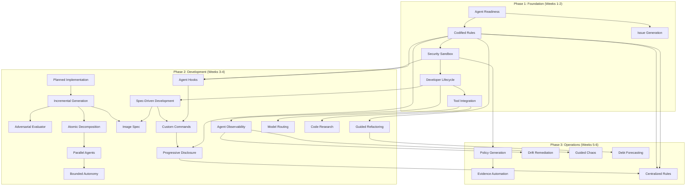
```mermaid
graph TD
    subgraph "Phase 1: Foundation (Weeks 1-2)"
        A[Agent Readiness] --> B[Codified Rules]
        B --> C[Security Sandbox]
        C --> D[Developer Lifecycle]
        A --> E[Issue Generation]
        D --> F[Tool Integration]
    end

    subgraph "Phase 2: Development (Weeks 3-4)"
        D --> G[Spec-Driven Development]
        H[Planned Implementation]
        H --> I[Incremental Generation]
        I --> J[Adversarial Evaluator]
        Q[Agent Hooks]
        R[Custom Commands]
        S[Progressive Disclosure]
        U[Image Spec]
        I --> K[Atomic Decomposition]
        K --> L[Parallel Agents]
        D --> O[Agent Observability]
        B --> GR[Guided Refactoring]
        F --> MR[Model Routing]
        F --> RS[Code Research]
        L --> BA[Bounded Autonomy]
    end

    subgraph "Phase 3: Operations (Weeks 5-6)"
        C --> M[Policy Generation]
        M --> EV[Evidence Automation]
        B --> T[Centralized Rules]
        O --> DR[Drift Remediation]
        O --> GC[Guided Chaos]
        GR --> DF[Debt Forecasting]
    end

    B --> Q
    C --> Q
    Q --> R
    G --> R
    B --> S
    R --> S
    B --> T
    S --> T
    G --> U
    I --> U
```

**Continuous Implementation Note**: Security patterns ([Security Sandbox](#security-sandbox), AI Security & Compliance) and deployment patterns should be implemented continuously throughout development, not delayed until specific phases. The dependencies shown represent learning prerequisites, not deployment gates.

## Complete Pattern Reference

| Pattern | Maturity | Category | Type | Description | Dependencies |
|---------|----------|----------|------|-------------|--------------|
| **Foundation** | | Foundation | | *Team readiness and basic AI integration infrastructure* | |
| **[Agent Readiness](#agent-readiness)** | Beginner | Foundation | Foundation | Evaluate codebase and team readiness for AI integration | None |
| **[Codified Rules](#codified-rules)** | Beginner | Foundation | Foundation | Version and maintain AI coding standards as explicit configuration files | [Agent Readiness](#agent-readiness) |
| **[Security Sandbox](#security-sandbox)** | Beginner | Foundation | Foundation | Run AI tools in isolated environments without access to secrets or sensitive data | [Codified Rules](#codified-rules) |
| **[Developer Lifecycle](#developer-lifecycle)** | Intermediate | Foundation | Workflow | Take one feature from problem to production through a staged, plan-first discipline | [Codified Rules](#codified-rules), [Security Sandbox](#security-sandbox) |
| **[Tool Integration](#tool-integration)** | Intermediate | Foundation | Foundation | Connect AI systems to external data, APIs, and tools | [Security Sandbox](#security-sandbox), [Developer Lifecycle](#developer-lifecycle) |
| **[Issue Generation](#issue-generation)** | Intermediate | Foundation | Foundation | Generate deployable work items sized under one AI-assisted hour, with acceptance criteria and dependencies | [Agent Readiness](#agent-readiness) |
| **Development** | | Development | | *Daily coding workflows and tactical controls* | |
| **[Spec-Driven Development](#spec-driven-development)** | Intermediate | Development | Development | Guide code generation with executable specifications and acceptance criteria | [Developer Lifecycle](#developer-lifecycle) |
| **[Planned Implementation](#planned-implementation)** | Beginner | Development | Development | Interview, constrain, and plan before writing code | None |
| **[Incremental Generation](#incremental-generation)** | Beginner | Development | Development | Build complex features through small, deployable iterations | [Planned Implementation](#planned-implementation) |
| **[Agent Memory](#agent-memory)** | Intermediate | Development | Development | Preserve useful context and decisions across sessions | [Codified Rules](#codified-rules) |
| **[Agent Hooks](#agent-hooks)** | Intermediate | Development | Development | Run commands and policy checks at assistant lifecycle hooks | [Codified Rules](#codified-rules), [Security Sandbox](#security-sandbox) |
| **[Custom Commands](#custom-commands)** | Intermediate | Development | Development | Encode repeatable domain workflows in assistant commands | [Agent Hooks](#agent-hooks), [Spec-Driven Development](#spec-driven-development) |
| **[Progressive Disclosure](#progressive-disclosure)** | Intermediate | Development | Development | Load only the task-specific rules needed for the current work | [Codified Rules](#codified-rules), [Agent Memory](#agent-memory) |
| **[Atomic Decomposition](#atomic-decomposition)** | Intermediate | Development | Development | Split complex work into independently implementable agent tasks | [Incremental Generation](#incremental-generation) |
| **[Guided Refactoring](#guided-refactoring)** | Intermediate | Development | Development | Improve code against measurable quality rules while preserving behavior | [Codified Rules](#codified-rules) |
| **[Agent Observability](#agent-observability)** | Intermediate | Development | Development | Capture traces, tool events, evaluations, and runtime context for diagnosis and improvement | [Developer Lifecycle](#developer-lifecycle) |
| **[Image Spec](#image-spec)** | Intermediate | Development | Development | Translate screenshots and design mockups into UI code with visual feedback | [Spec-Driven Development](#spec-driven-development), [Incremental Generation](#incremental-generation) |
| **[Adversarial Evaluator](#adversarial-evaluator)** | Intermediate | Development | Development | Separate generation from independent adversarial evaluation | [Incremental Generation](#incremental-generation) |
| **[Parallel Agents](#parallel-agents)** | Advanced | Development | Development | Run agents concurrently on isolated tasks or environments | [Atomic Decomposition](#atomic-decomposition) |
| **[Error Resolution](#error-resolution)** | Intermediate | Development | Development | Diagnose failures and apply proposed fixes only after human review and deterministic validation | [Developer Lifecycle](#developer-lifecycle), [Agent Observability](#agent-observability) |
| **[Model Routing](#model-routing)** | Advanced | Development | Development | Match task requirements to model capability, context, latency, and cost | [Tool Integration](#tool-integration) |
| **[Code Research](#code-research)** | Intermediate | Development | Workflow | Answer technical questions with isolated executable experiments | [Agent Memory](#agent-memory), [Tool Integration](#tool-integration) |
| **[Bounded Autonomy](#bounded-autonomy)** | Advanced | Development | Workflow | Bound agent loops by turns, spend, time, stalls, and verification reach | [Parallel Agents](#parallel-agents), [Agent Observability](#agent-observability) |
| **Security & Compliance** | | Operations | | *Policy, evidence, and organization-wide controls* | |
| **[Policy Generation](#policy-generation)** | Advanced | Operations | Operations | Generate validated Cedar, Rego, OPA, or Gatekeeper policy-as-code | [Security Sandbox](#security-sandbox) |
| **[Evidence Automation](#evidence-automation)** | Advanced | Operations | Operations | Continuously collect dated, audit-ready control evidence | [Policy Generation](#policy-generation), [Agent Observability](#agent-observability) |
| **[Centralized Rules](#centralized-rules)** | Advanced | Operations | Operations | Synchronize organization-wide AI instructions from a central source | [Codified Rules](#codified-rules), [Progressive Disclosure](#progressive-disclosure) |
| **Deployment Automation** | | Operations | | *Infrastructure correction and controlled change* | |
| **[Drift Remediation](#drift-remediation)** | Advanced | Operations | Operations | Detect declared-state drift and generate reviewable corrective patches | [Agent Observability](#agent-observability), [Bounded Autonomy](#bounded-autonomy) |
| **Monitoring & Maintenance** | | Operations | | *Reliability experiments and maintainability forecasting* | |
| **[Debt Forecasting](#debt-forecasting)** | Intermediate | Operations | Operations | Forecast maintenance burden from code and repository trends | [Guided Refactoring](#guided-refactoring), [Tool Integration](#tool-integration) |
| **[Guided Chaos](#guided-chaos)** | Advanced | Operations | Operations | Generate hypothesis-driven chaos experiments with explicit safety controls | [Agent Observability](#agent-observability), [Bounded Autonomy](#bounded-autonomy) |

---

## Pattern Maturity Levels

Patterns are classified by implementation complexity and prerequisite knowledge:

**Beginner**: Basic AI tool usage with minimal setup required
- Prerequisites: Basic programming skills, access to AI tools
- Complexity: Single tool usage, straightforward prompts
- Examples: Simple code generation, basic constraint setting

**Intermediate**: Multi-tool coordination and process integration  
- Prerequisites: Development workflow experience, team coordination
- Complexity: Multiple tools, orchestration patterns, quality gates
- Examples: Testing strategies, parallel workflows, choice generation

**Advanced**: Complex systems with enterprise concerns
- Prerequisites: Architecture experience, security/compliance knowledge  
- Complexity: Multi-agent systems, advanced safety, compliance automation
- Examples: Enterprise security, compliance automation, chaos engineering

## Task Sizing Framework

The patterns use different task sizing approaches based on their purpose and context:

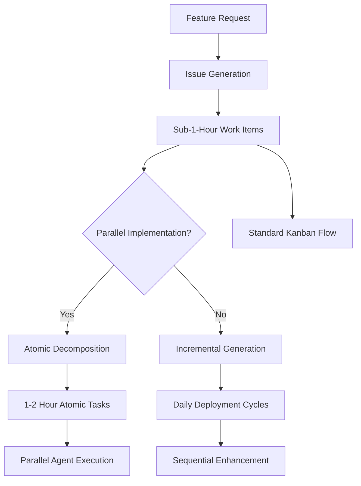
```mermaid
graph TD
    A[Feature Request] --> B[Issue Generation]
    B --> C[Sub-1-Hour Work Items]
    C --> D{Parallel Implementation?}
    D -->|Yes| E[Atomic Decomposition]
    D -->|No| F[Incremental Generation]
    E --> G[1-2 Hour Atomic Tasks]
    F --> H[Daily Deployment Cycles]

    G --> I[Parallel Agent Execution]
    H --> J[Sequential Enhancement]
    C --> K[Standard Kanban Flow]
```

**Task Sizing Hierarchy**:

- **[Issue Generation](#issue-generation)** (<1 hour with AI assistance): Small, deployable work items for continuous flow and rapid feedback
- **[Atomic Decomposition](#atomic-decomposition)** (1-2 hours): Ultra-small tasks for parallel agent execution without conflicts
- **[Incremental Generation](#incremental-generation)** (Daily cycles): Deployment-focused iterations that may contain multiple work items

**When to Use Each Approach**:
- Use **[Issue Generation](#issue-generation)** for standard team development with human developers
- Use **[Atomic Decomposition](#atomic-decomposition)** when implementing with parallel AI agents
- Use **[Incremental Generation](#incremental-generation)** when prioritizing rapid market feedback over task granularity

**Pattern Differentiation**:
- **[Issue Generation](#issue-generation)**: Creates small, deployable work items (<1 hour with AI assistance) for human team workflows
- **[Atomic Decomposition](#atomic-decomposition)**: Creates ultra-small tasks (1-2 hours) for parallel AI agents
- **[Incremental Generation](#incremental-generation)**: Creates deployment cycles (daily) focused on user feedback

## Pattern Selection Decision Framework

Choose the right patterns based on your team's context, project requirements, and AI development maturity:

### Decision Tree

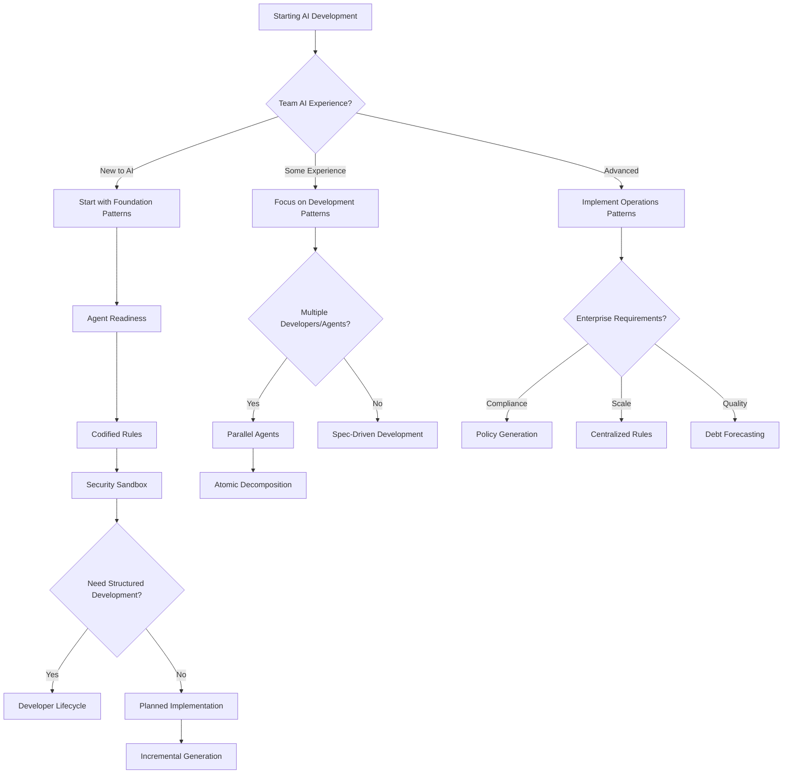
```mermaid
graph TD
    A[Starting AI Development] --> B{Team AI Experience?}
    B -->|New to AI| C[Start with Foundation Patterns]
    B -->|Some Experience| D[Focus on Development Patterns]
    B -->|Advanced| E[Implement Operations Patterns]

    C --> F[Agent Readiness]
    F --> G[Codified Rules]
    G --> H[Security Sandbox]
    H --> I{Need Structured Development?}
    I -->|Yes| J[Developer Lifecycle]
    I -->|No| K[Planned Implementation]
    K --> L[Incremental Generation]

    D --> M{Multiple Developers/Agents?}
    M -->|Yes| N[Parallel Agents]
    M -->|No| O[Spec-Driven Development]
    N --> P[Atomic Decomposition]

    E --> R{Enterprise Requirements?}
    R -->|Compliance| S[Policy Generation]
    R -->|Scale| T[Centralized Rules]
    R -->|Quality| U[Debt Forecasting]
```

### Context-Based Pattern Selection

**For New Teams (First 2 weeks)**:
1. **[Agent Readiness](#agent-readiness)** - Evaluate current state
2. **[Codified Rules](#codified-rules)** - Establish consistent standards
3. **[Security Sandbox](#security-sandbox)** - Ensure safe experimentation
4. **[Planned Implementation](#planned-implementation)** - Learn structured planning approaches
5. **[Incremental Generation](#incremental-generation)** - Start with simple iterations

**For Development Teams (Weeks 3-8)**:
1. **[Developer Lifecycle](#developer-lifecycle)** - Structured development process
2. **[Spec-Driven Development](#spec-driven-development)** - Quality-focused development
3. **[Issue Generation](#issue-generation)** - Organized work breakdown
4. **[Testing Orchestration](experiments/README.md#testing-orchestration)** - Quality assurance

**For Parallel Implementation**:
1. **[Atomic Decomposition](#atomic-decomposition)** - Ultra-small independent tasks
2. **[Workflow Orchestration](experiments/README.md#workflow-orchestration)** - Agent coordination
3. **[Review Automation](experiments/README.md#review-automation)** - Automated integration
4. **[Security Sandbox](#security-sandbox)** - Enhanced with parallel safety

**For Enterprise/Production (Month 2+)**:
1. **[Policy Generation](#policy-generation)** - Compliance automation
2. **[Evidence Automation](#evidence-automation)** - Continuous, audit-ready control evidence
3. **[Centralized Rules](#centralized-rules)** - Organization-wide AI standards
4. **[Debt Forecasting](#debt-forecasting)** - Proactive maintenance

### Project Type Recommendations

**MVP/Startup Projects**:
- **Primary**: [Incremental Generation](#incremental-generation), [Planned Implementation](#planned-implementation)
- **Secondary**: [Security Sandbox](#security-sandbox), [Adversarial Evaluator](#adversarial-evaluator)
- **Avoid**: Complex orchestration patterns until scale demands

**Enterprise Applications**:
- **Primary**: [Developer Lifecycle](#developer-lifecycle), [Policy Generation](#policy-generation)
- **Secondary**: [Spec-Driven Development](#spec-driven-development), [Evidence Automation](#evidence-automation)
- **Essential**: All foundation patterns before development patterns

**Research/Experimental Projects**:
- **Primary**: [Code Research](#code-research), [Adversarial Evaluator](#adversarial-evaluator)
- **Secondary**: [Agent Memory](#agent-memory), [Model Routing](#model-routing)
- **Focus**: Learning and exploration over production readiness

**High-Scale Production**:
- **Primary**: [Parallel Agents](#parallel-agents), [Agent Observability](#agent-observability)
- **Secondary**: [Guided Chaos](#guided-chaos), [Incident Automation](experiments/README.md#incident-automation)
- **Critical**: All security and monitoring patterns

### Team Size Considerations

**Solo Teams**:
- Focus on **[Incremental Generation](#incremental-generation)** and **[Adversarial Evaluator](#adversarial-evaluator)**
- Add **[Agent Observability](#agent-observability)** for debugging
- Skip parallel orchestration patterns

**Two-Pizza Teams** (small, autonomous teams):
- Implement **[Issue Generation](#issue-generation)** for coordination
- Use **[Spec-Driven Development](#spec-driven-development)** for quality
- Consider **[Tool Integration](#tool-integration)** for role clarity
- Full **[Developer Lifecycle](#developer-lifecycle)** implementation
- **[Parallel Agents](#parallel-agents)** for complex features
- **[Spec-Driven Development](#spec-driven-development)** for quality gates and traceability

**Multi Two-Pizza Team Organizations**:
- **[Atomic Decomposition](#atomic-decomposition)** for parallel work across teams
- **[Spec-Driven Development](#spec-driven-development)** for coordination at scale via shared specifications
- All **Operations Patterns** for organizational management

### Technology Stack Considerations

**Cloud-Native Applications**:
- Emphasize **[Policy Generation](#policy-generation)** and **[Evidence Automation](#evidence-automation)**
- Implement **[Drift Remediation](#drift-remediation)** for infrastructure
- Use **[Pipeline Synthesis](experiments/README.md#pipeline-synthesis)** for safe delivery workflows

**On-Premise Systems**:
- Focus on **[Security Sandbox](#security-sandbox)** with network isolation
- Implement **[Agent Memory](#agent-memory)** for institutional knowledge
- Use **[Debt Forecasting](#debt-forecasting)** for maintenance planning

**Microservices Architecture**:
- **[Parallel Agents](#parallel-agents)** for service coordination
- **[Agent Observability](#agent-observability)** across service boundaries
- **[Agent Hooks](#agent-hooks)** for deterministic cross-service policy checks

**Monolithic Applications**:
- **[Incremental Generation](#incremental-generation)** for gradual modernization
- **[Guided Refactoring](#guided-refactoring)** for code quality improvement
- **[Planned Implementation](#planned-implementation)** to prevent over-engineering through its constraint phase

---

# Foundation Patterns

Foundation patterns establish the essential infrastructure and team readiness required for successful AI-assisted development. These patterns must be implemented first as they enable all subsequent patterns.

<a id="readiness-assessment"></a>
## Agent Readiness

**Maturity**: Beginner<br>
**Description**: Systematic evaluation of codebase and team readiness for AI-assisted development before implementing AI patterns.

**Related Patterns**: [Codified Rules](#codified-rules), [Issue Generation](#issue-generation)

**Source**: Factory.ai, "[Agent Readiness](https://factory.ai/product/agent-readiness)"; Kodus, "[agent-readiness](https://github.com/kodustech/agent-readiness)"; Guillaume Moigneu, "[Making coding agents reliable](https://developer.upsun.com/posts/ai/making-coding-agents-reliable)", February 17, 2026

Industry tooling commonly calls this practice *agent readiness* (Factory.ai, Kodus) or an *AI readiness assessment* (Microsoft).

> 📋 **Quick start**: Use the free [AI Development Readiness Scorecard](https://www.redactedventures.com/scorecard) to score your team against this framework in about 10 minutes and get a tailored pattern adoption sequence.

**Assessment Framework**

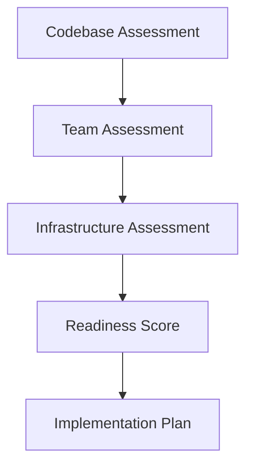
```mermaid
graph TD
    A[Codebase Assessment] --> B[Team Assessment]
    B --> C[Infrastructure Assessment]
    C --> D[Readiness Score]
    D --> E[Implementation Plan]
```

**Codebase Readiness Checklist**
```markdown
## Code Quality Prerequisites
□ Consistent code formatting and style guide
□ Comprehensive test coverage (>80% for critical paths)
□ Clear separation of concerns and modular architecture
□ Documented APIs and interfaces
□ Version-controlled configuration and secrets management

## Documentation Standards
□ README with setup and development instructions
□ API documentation (OpenAPI/Swagger)
□ Architecture decision records (ADRs)
□ Coding standards and conventions documented
□ Deployment and operational procedures
```

#### Anti-pattern: Premature Adoption
Starting AI adoption without proper assessment leads to inconsistent practices, security vulnerabilities, and team frustration.

---

## Codified Rules

**Maturity**: Beginner<br>
**Description**: Version and maintain AI coding standards as explicit configuration files that persist across sessions and team members.

**Related Patterns**: [Agent Readiness](#agent-readiness), [Agent Memory](#agent-memory), [Progressive Disclosure](#progressive-disclosure), [Agent Hooks](#agent-hooks), [Custom Commands](#custom-commands), [Centralized Rules](#centralized-rules)

**See also**: [Harness Engineering Lens](#harness-engineering-lens)

**Source**: "[AGENTS.md](https://agents.md/)" open format specification (OpenAI, Google Jules, Cursor, Factory); Cursor, "[Rules](https://cursor.com/docs/rules)" documentation

Industry tooling implements this pattern as `AGENTS.md` (open format stewarded under the Linux Foundation), *Rules* (Cursor), `CLAUDE.md` memory (Anthropic Claude Code), and *repository custom instructions* (GitHub Copilot).

**Standardized Project Structure**
```bash
project/
├── .ai/                          # AI configuration directory
│   ├── rules/                    # Modular rule sets
│   │   ├── security.md          # Security standards
│   │   ├── testing.md           # Testing requirements
│   │   ├── style.md             # Code style guide
│   │   └── architecture.md      # Architectural patterns
│   ├── prompts/                 # Reusable prompt templates
│   │   ├── implementation.md    # Implementation prompts
│   │   ├── review.md            # Code review prompts
│   │   └── testing.md           # Test generation prompts
│   └── knowledge/               # Captured patterns and gotchas
│       ├── successful.md        # Proven successful patterns
│       └── failures.md          # Known failure patterns
├── .cursorrules                 # Cursor IDE configuration
├── CLAUDE.md                    # Claude Code session context
└── .windsurf/                   # Windsurf configuration
    └── rules.md
```

Complete Example: See [examples/codified-rules/](examples/codified-rules/) for:
- Comprehensive development workflow rules and standards
- Pipeline automation and CI/CD rules
- Code quality standards and enforcement guidelines
- Claude Code configuration for rules-as-code implementation

#### Anti-pattern: Broken Context
Each developer maintains their own prompts and preferences, leading to inconsistent code across the team.

---

## Security Sandbox

**Maturity**: Beginner<br>
**Description**: Run AI tools in isolated environments without access to secrets or sensitive data to prevent credential leaks and maintain security compliance.

**Related Patterns**: [Policy Generation](#policy-generation), [Codified Rules](#codified-rules), [Agent Hooks](#agent-hooks)

**Source**: Anthropic, "[sandbox-runtime](https://github.com/anthropic-experimental/sandbox-runtime)"; Anthropic, "[Sandboxing](https://code.claude.com/docs/en/sandboxing)" (Claude Code documentation)

**Core Security Implementation**

**Claude Code Users**: Use the `/sandbox` command to instantly create isolated environments without manual Docker configuration:
```bash
/sandbox
# Creates a secure, isolated environment with:
# - No access to credentials or sensitive files
# - Restricted network access
# - Controlled file system permissions
```

**Docker-Based Implementation**: For custom isolation or multi-agent scenarios:
```yaml
# Basic AI isolation with complete network isolation
services:
  ai-development:
    network_mode: none                    # Zero network access
    cap_drop: [ALL]                       # No system privileges
    volumes:
      - ./src:/workspace/src:ro           # Read-only source code
      # DO NOT mount ~/.aws, .env, secrets/, etc.
```

Complete Example: See [examples/security-sandbox/](examples/security-sandbox/) for:
- Complete Docker isolation configurations for single and multi-agent setups
- Resource locking and emergency shutdown procedures
- Security monitoring and violation detection
- Multi-agent coordination with conflict resolution

**Production Implementations**

Modern AI development platforms provide enterprise-grade implementations of these security controls:

**Cloud-Based Sandboxes**:
- **[Claude Code for the web](https://www.claude.ai/code)**: Sandboxed AI coding with isolated execution environments
- **[Google Jules](https://jules.google/)**: Google's AI coding assistant with secure development environments
- **[OpenAI Codex](https://chatgpt.com/codex)**: Cloud-based AI coding with secure execution environments
- **[Google Vertex AI Agent Engine Code Execution](https://cloud.google.com/vertex-ai/generative-ai/docs/agent-engine/code-execution)**: Managed secure runtimes for AI agent code execution
- **[GitHub Codespaces](https://docs.github.com/en/codespaces/overview)**: Isolated cloud development VMs with configurable security policies
- **[E2B](https://e2b.dev)**: Specialized AI agent sandboxes with microVM isolation

**Cloud & Self-Hosted Options**:
- **[Daytona](https://www.daytona.io)**: microVM-based isolation for development environments (available as cloud service or self-hosted)
- **[Coder](https://coder.com)**: Cloud development environments with enterprise security controls (available as cloud service or self-hosted)

#### Anti-pattern: Unrestricted Access
Allowing AI tools full system access risks credential leaks, data breaches, and security compliance violations.

#### Anti-pattern: Conflicting Workspaces
Allowing multiple parallel agents to write to the same directories creates race conditions, file conflicts, and unpredictable behavior that can corrupt the development environment.

---

## Developer Lifecycle

**Maturity**: Intermediate<br>
**Description**: A staged, plan-first discipline for taking a single feature from problem to production with AI assistance.

**Related Patterns**: [Codified Rules](#codified-rules), [Security Sandbox](#security-sandbox), [Planned Implementation](#planned-implementation), [Spec-Driven Development](#spec-driven-development), [Atomic Decomposition](#atomic-decomposition), [Agent Observability](#agent-observability)

**See also**: [Lifecycle Lens](#lifecycle-lens)

**Source**: GitHub, "[Spec Kit](https://github.com/github/spec-kit)"; AWS DevOps & Developer Productivity Blog, "[AI-Driven Development Life Cycle: Reimagining Software Engineering](https://aws.amazon.com/blogs/devops/ai-driven-development-life-cycle/)", July 31, 2025

This pattern is the per-feature discipline: plan before you generate, and stop retrying a failing approach after a few tries instead of looping on it. For how each stage maps onto the rest of the catalog, see the [Lifecycle Lens](#lifecycle-lens).

**Workflow Interaction Sequence**

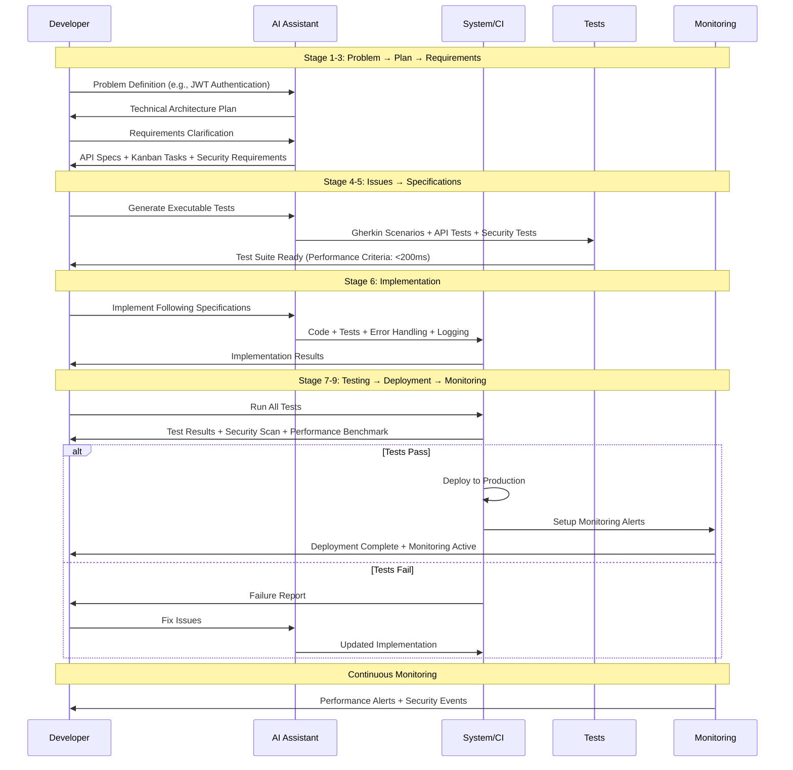
```mermaid
sequenceDiagram
    participant D as Developer
    participant AI as AI Assistant
    participant S as System/CI
    participant T as Tests
    participant M as Monitoring
    
    Note over D,M: Stage 1-3: Problem → Plan → Requirements
    D->>AI: Problem Definition (e.g., JWT Authentication)
    AI->>D: Technical Architecture Plan
    D->>AI: Requirements Clarification
    AI->>D: API Specs + Kanban Tasks + Security Requirements
    
    Note over D,M: Stage 4-5: Issues → Specifications
    D->>AI: Generate Executable Tests
    AI->>T: Gherkin Scenarios + API Tests + Security Tests
    T->>D: Test Suite Ready (Performance Criteria: <200ms)
    
    Note over D,M: Stage 6: Implementation
    D->>AI: Implement Following Specifications
    AI->>S: Code + Tests + Error Handling + Logging
    S->>D: Implementation Results
    
    Note over D,M: Stage 7-9: Testing → Deployment → Monitoring
    D->>S: Run All Tests
    S->>D: Test Results + Security Scan + Performance Benchmark
    alt Tests Pass
        S->>S: Deploy to Production
        S->>M: Setup Monitoring Alerts
        M->>D: Deployment Complete + Monitoring Active
    else Tests Fail
        S->>D: Failure Report
        D->>AI: Fix Issues
        AI->>S: Updated Implementation
    end
    
    Note over D,M: Continuous Monitoring
    M->>D: Performance Alerts + Security Events
```

Complete Example: See [examples/developer-lifecycle/](examples/developer-lifecycle/) for full 9-stage workflow scripts, detailed prompts for each stage, enhanced implementation techniques ([Five-Try Rule](https://www.linkedin.com/posts/jessicakerr_the-implementation-is-a-test-of-the-design-activity-7367649800193761281-LzCu/), markdown iteration, function decomposition), and integration with CI/CD pipelines.

#### Anti-pattern: Unplanned Development
Jumping straight to coding with AI without proper planning, requirements, or testing strategy. Also avoid continuing with the same AI approach after 3-4 failures without decomposing the problem or changing strategy.

---

## Tool Integration

**Maturity**: Intermediate<br>
**Description**: Connect AI systems to external data sources, APIs, and tools for enhanced capabilities beyond prompt-only interactions.

**Related Patterns**: [Security Sandbox](#security-sandbox), [Developer Lifecycle](#developer-lifecycle), [Agent Observability](#agent-observability)

**Source**: Anthropic, "[Introducing the Model Context Protocol](https://www.anthropic.com/news/model-context-protocol)", November 25, 2024; Model Context Protocol, "[modelcontextprotocol/servers](https://github.com/modelcontextprotocol/servers)" reference servers

The industry implements this pattern as *tool use* (Anthropic), *function calling* (OpenAI), and the *Model Context Protocol (MCP)*.

**Core Concept**

Modern AI development requires more than chat-based interactions. AI systems become significantly more capable when connected to real-world data sources and tools. This pattern demonstrates the architectural shift from isolated prompt-only AI to tool-augmented AI systems.

**Implementation Overview**

```python
# Core tool-augmented AI system with security controls
class ToolAugmentedAI:
    def __init__(self, config_path: str = ".ai/tools.json"):
        self.available_tools = {
            "database_query": self._query_database,     # Read-only SQL queries
            "file_operations": self._file_operations,   # Controlled file access
            "api_requests": self._api_requests,         # Allowlisted HTTP requests
            "system_info": self._system_info            # Safe system information
        }
    
    def execute_with_tools(self, ai_request: str, tool_calls: list) -> dict:
        """Execute AI request with secure tool access"""
        # Process tool calls with security validation
        # Return structured results with error handling
```

**Tool Categories & Security**

- **Database Access**: Read-only queries with operation whitelisting (`SELECT`, `WITH` only)
- **File Operations**: Path-restricted read/write within configured directories
- **API Integration**: HTTP requests limited to allowlisted domains with timeouts
- **System Information**: Safe environment data without sensitive details

**Configuration Example**
```json
{
  "allowed_apis": ["api.github.com", "api.openweathermap.org"],
  "file_access_paths": ["./data/", "./logs/", "./generated/"],
  "max_query_results": 100,
  "security": {
    "read_only_database": true,
    "api_rate_limits": true,
    "file_size_limits": "10MB"
  }
}
```

**Model Context Protocol (MCP) Integration**

This pattern can be implemented using [Anthropic's Model Context Protocol (MCP)](https://www.anthropic.com/news/model-context-protocol) for standardized tool integration across AI systems:

```json
{
  "mcp_servers": {
    "filesystem": {
      "command": "npx",
      "args": ["@modelcontextprotocol/server-filesystem", "./data"]
    },
    "sqlite": {
      "command": "npx",
      "args": ["@modelcontextprotocol/server-sqlite", "app_data.db"]
    }
  }
}
```

**What [Tool Integration](#tool-integration) Enables**

- **Real-time data access**: AI queries current database state, not training data
- **File system interaction**: Read logs, write generated code, manage project files
- **API integration**: Fetch live data from external services and APIs
- **System awareness**: Access to current environment state and configuration
- **Enhanced context**: AI decisions based on actual system state, not assumptions

Complete Example: See [examples/tool-integration/](examples/tool-integration/) for:
- Full Python implementation with security controls
- Configuration examples and MCP integration
- Usage patterns and deployment guidelines
- Integration with [Security Sandbox](#security-sandbox)

#### Anti-pattern: Disconnected Prompting
Attempting to solve complex data analysis, system integration, or real-time problems using only natural language prompts without providing AI access to actual data sources, APIs, or system tools. This leads to hallucinated responses, outdated information, and inability to interact with real systems.

---


## Issue Generation

**Maturity**: Intermediate<br>
**Description**: Generate small, deployable work items (<1 hour with AI assistance) from requirements using AI to ensure continuous delivery with clear acceptance criteria and dependency tracking.

**Methodology Note**: This pattern aligns well with Kanban principles (continuous flow, small batches) but works with any development methodology including Scrum, Scrumban, or ad-hoc workflows.

**Related Patterns**: [Agent Readiness](#agent-readiness), [Spec-Driven Development](#spec-driven-development)

**Source**: GitHub Docs, "[Using GitHub Copilot to create issues](https://docs.github.com/en/copilot/using-github-copilot/using-github-copilot-to-create-issues)"; Eyal Toledano, "[Task Master](https://github.com/eyaltoledano/claude-task-master)"

**[Issue Generation](#issue-generation) Framework**

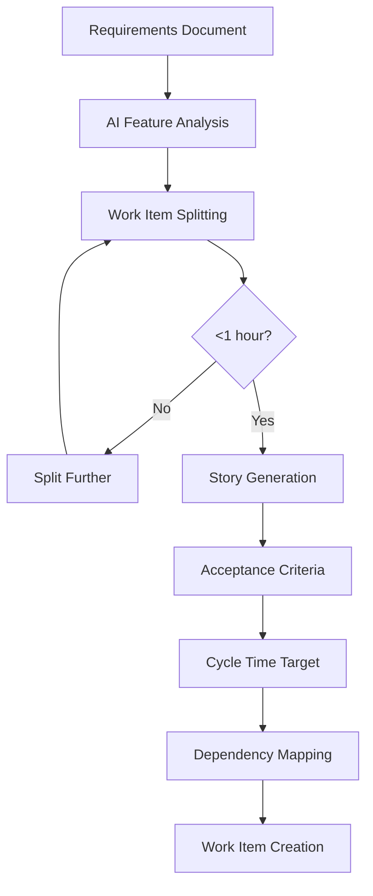
```mermaid
graph TD
    A[Requirements Document] --> B[AI Feature Analysis]
    B --> C[Work Item Splitting]
    C --> D{<1 hour?}
    D -->|No| E[Split Further]
    E --> C
    D -->|Yes| F[Story Generation]
    F --> G[Acceptance Criteria]
    G --> H[Cycle Time Target]
    H --> I[Dependency Mapping]
    I --> J[Work Item Creation]
```

**Core Principles**

- **Small Batch Sizing**: Each work item sized to complete in under an hour with AI assistance, enabling continuous delivery and rapid feedback
- **AI-Assisted Decomposition**: Use AI to break down requirements into implementable tasks
- **Traceability Integration**: Connect issues to implementation files and CI workflows
- **Dependency Mapping**: Establish clear relationships between work items and epics
- **Acceptance-Driven**: Each task includes specific, testable acceptance criteria

**Work Item Attributes**

Generated issues must include:
- **Title**: Specific, actionable description of the work
- **Cycle Time Target**: Estimated completion time (<1 hour with AI assistance)
- **Acceptance Criteria**: Testable conditions for completion
- **File Scope**: Which files will be added, updated, or removed
- **CI Requirements**: Test coverage, pipeline steps, quality gates
- **Dependencies**: Blocking and enabling relationships with other issues

**Epic Relationship Management**

- **Bidirectional Linking**: Parent-child references maintained automatically
- **Progress Tracking**: Epic completion calculated from subissue status
- **Dependency Validation**: Automated checking for circular dependencies
- **Status Propagation**: Subissue changes update epic progress

Complete Example: See [examples/issue-generation/](examples/issue-generation/) for detailed AI prompts, epic breakdown workflows, CI integration patterns, and traceability implementations. For AI-first workflows, see [Beads guide](examples/issue-generation/beads-guide.md) - a git-native issue tracker with CLI access and persistent agent memory.

> "Small, frequent deliveries expose issues early and keep teams aligned."
> – Agile Alliance

**Kanban Context**: This pattern embodies Kanban principles of continuous flow and small batch sizes. If using Kanban: "If a task takes more than one day, split it." (Kanban Guide, Lean Kanban University). However, the pattern works equally well with Scrum sprints, continuous delivery, or any methodology that values incremental progress.

#### Anti-pattern: Under-Specified Issues
Creating generic tasks without specific acceptance criteria, proper sizing, or clear dependencies leads to scope creep and estimation errors.

#### Anti-pattern: Broken Integration
Creating issues without CI workflow integration, file tracking, or traceability requirements leads to disconnected development cycles and poor visibility into implementation progress.

**Anti-pattern Examples:**
```markdown
❌ "Fix the login page"
❌ "Make the dashboard better"
❌ "Add some tests"
❌ "AUTH-002: Implement password validation" (no file tracking or CI requirements)

✅ "Add OAuth 2.0 token validation endpoint (<1 hour with AI)"
✅ "Implement dashboard metric WebSocket connection (45 minutes)"
✅ "Write unit tests for user service login method (30 minutes)"
✅ "AUTH-002: Password validation service with CI integration"
   - Files: src/auth/validators.py, tests/test_validators.py
   - Coverage: 95%, unit + integration tests
   - CI: lint, test, security-scan must pass
   - AI-assisted: Use AI for implementation and test generation
```

---

# Development Patterns

Development patterns provide tactical approaches for day-to-day AI-assisted coding workflows, focusing on quality, maintainability, and team collaboration.

## Spec-Driven Development

**Maturity**: Intermediate<br>
**Description**: Use executable specifications to guide AI code generation with clear acceptance criteria before implementation.

**Core Principle: Precision Enables Productivity**

SpecDriven AI combines three key elements:
- **Machine-readable specifications** with unique identifiers and authority levels
- **Rigorous Test-Driven Development** with coverage tracking and automated validation
- **AI-powered implementation** with persistent context through structured specifications

**Key Innovation: Authority Level System**

Specifications use authority levels to resolve conflicts and establish precedence:
- **`authority=system`**: Core business logic and security requirements (highest precedence)
- **`authority=platform`**: Infrastructure and technical architecture decisions  
- **`authority=feature`**: User interface and experience requirements (lowest precedence)

When requirements conflict, higher authority levels take precedence, enabling clear decision-making for AI implementation.

**Related Patterns**: [Developer Lifecycle](#developer-lifecycle), [Tool Integration](#tool-integration), [Custom Commands](#custom-commands), [Image Spec](#image-spec), [Testing Orchestration](experiments/README.md#testing-orchestration), [Agent Observability](#agent-observability)

**See also**: [Harness Engineering Lens](#harness-engineering-lens)

**Source**: GitHub, "[Spec Kit](https://github.com/github/spec-kit)"; Birgitta Böckeler, "[Understanding Spec-Driven-Development: Kiro, spec-kit, and Tessl](https://martinfowler.com/articles/exploring-gen-ai/sdd-3-tools.html)", October 15, 2025

**SpecDriven AI Workflow**

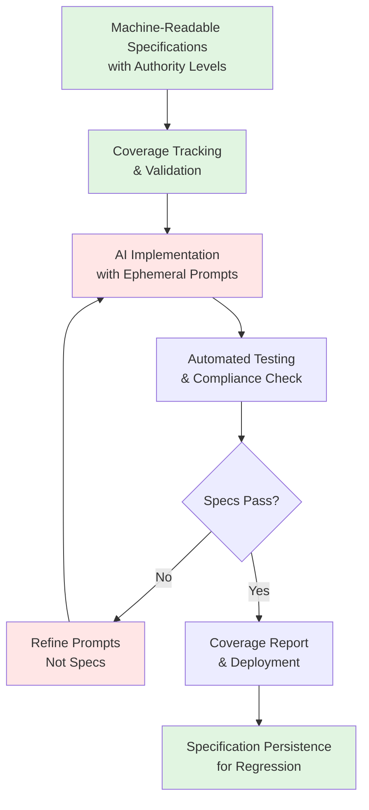
```mermaid
graph TD
    A[Machine-Readable Specifications<br/>with Authority Levels] --> B[Coverage Tracking<br/>& Validation]
    B --> C[AI Implementation<br/>with Ephemeral Prompts]
    C --> D[Automated Testing<br/>& Compliance Check]
    D --> E{Specs Pass?}
    E -->|No| F[Refine Prompts<br/>Not Specs]
    F --> C
    E -->|Yes| G[Coverage Report<br/>& Deployment]
    G --> H[Specification Persistence<br/>for Regression]
    
    style A fill:#e1f5e1
    style B fill:#e1f5e1
    style H fill:#e1f5e1
    style C fill:#ffe6e6
    style F fill:#ffe6e6
```

**Core Implementation**

**Machine-Readable Specification with Authority Levels**
```markdown
# IAM Policy Generator Specification {#iam_policy_gen}

## CLI Requirements {#cli_requirements authority=system}
The system MUST provide a command-line interface that:
- Accepts policy type via `--policy-type` flag
- Validates input parameters against AWS IAM constraints
- Generates syntactically correct IAM policy JSON [^test_iam_syntax]
- Returns exit code 0 for success, 1 for validation errors

## Input Validation {#input_validation authority=platform}  
The system MUST:
- Reject invalid AWS service names with clear error messages
- Validate resource ARN format before policy generation
- Implement rate limiting for API calls [^test_rate_limit]

[^test_iam_syntax]: tests/test_iam_policy_syntax.py
[^test_rate_limit]: tests/test_rate_limiting.py
```

**Automated Coverage Tracking**
```bash
# Run specification compliance validation
pytest --cov=src --cov-report=html --spec-coverage
python spec_validator.py --check-coverage --authority-conflicts

# Output shows specification coverage
# Specification Coverage Report:
# ✅ cli_requirements: 100% (3/3 tests linked)
# ✅ input_validation: 85% (6/7 tests linked) 
# ⚠️  Missing test: [^test_malformed_arn] in line 23
```

**Tooling Integration**

```bash
# Pre-commit hook validates specification compliance
# .pre-commit-config.yaml
repos:
  - repo: local
    hooks:
      - id: spec-coverage
        name: Specification Coverage Check
        entry: python spec_validator.py --check-coverage
        language: python
        pass_filenames: false

# Git workflow with specification traceability  
git commit -m "feat: implement rate limiting [spec:rl2c]
  
Implements rate limiting requirement from input_validation
section. Closes specification anchor #failed_auth.

Coverage: 94% (31/33 spec requirements covered)"
```

**Key Benefits**
- **Authority-based conflict resolution** prevents requirement ambiguity
- **Automated coverage tracking** ensures no specifications are missed
- **AI tool independence** through persistent, machine-readable requirements
- **Precise traceability** from specification anchors to test implementations
- **Living documentation** that evolves with the system

**Automated Traceability**

Specification anchors (`{#cli_requirements}`) and test footnotes (`[^test_iam_syntax]`) are the link layer that ties requirements to tests to code to docs. Maintain those links automatically on every change instead of in a spreadsheet:

```bash
# After each commit, validate anchor coverage and flag drift
git diff --name-only HEAD~1 | while read file; do
    ai "For $file: confirm referenced spec anchors still exist, propose new
        anchor links for any uncovered behavior, and emit an impact list of
        which downstream tests and docs need updating."
done
```

When a spec section moves or a test is renamed, the same loop surfaces the broken link before it ships. The result is a living traceability graph that stays accurate without manual upkeep — the alternative (traceability in a spreadsheet) is stale within a week.

#### Anti-pattern: Broken Traceability
Maintaining requirement-to-test links in spreadsheets or manual documentation that becomes stale and inaccurate within days of being written.

Complete Example: See [examples/spec-driven-development/](examples/spec-driven-development/) for:
- Complete IAM Policy Generator implementation
- spec_validator.py tool for automated compliance checking
- Pre-commit hooks and Git workflow integration
- Full specification examples with authority levels
- Coverage tracking and reporting tools

#### Anti-pattern: Spec-Ignored
Writing code with AI first, then trying to retrofit tests, resulting in tests that mirror implementation rather than specify behavior.

#### Anti-pattern: Over-Prompting
Saving collections of prompts as if they were specifications. Prompts are implementation details; specifications are behavioral contracts.

---

## Image Spec

**Maturity**: Intermediate<br>
**Description**: Use screenshots and design mockups as visual specifications that coding agents translate into UI code and refine through visual feedback.

**Related Patterns**: [Spec-Driven Development](#spec-driven-development), [Incremental Generation](#incremental-generation), [Model Routing](#model-routing)

Industry implementations commonly call this practice *design-to-code* or *screenshot-to-code*. The pattern is deliberately scoped to UI visuals; architecture diagrams and data-flow diagrams remain useful supporting context, but the adoption evidence does not establish them as primary executable specifications.

**Core Implementation**

Use a single screenshot or mockup as the source of truth for layout and visual intent, then supplement it with minimal behavioral and technology constraints:

```bash
# 1. Prepare one focused visual specification
# - checkout-mock.png (layout, states, and key interactions)

# 2. Attach the mockup and provide a minimal build request
cat > build-request.txt << 'EOF'
Implement the attached checkout mockup as a responsive React component.
Match its layout, spacing, colors, and empty/error states.
Use the existing design tokens and component library.
Do not invent backend behavior; stub the submit handler.
EOF

# 3. Iterate with visual feedback
# - Screenshot the running output
# - Annotate with required changes
# - Re-attach and request the next iteration
```

Complete Example: See [examples/image-spec/](examples/image-spec/) for prompt templates and a repeatable screenshot-to-code iteration loop.

#### Anti-pattern: Overwhelming Visuals

Uploading many screenshots at once without a named target state overwhelms context and creates contradictory UI requirements. Start with one screen and one state, implement it, then add the next visual increment.

---

## Planned Implementation

**Maturity**: Beginner<br>
**Description**: Interview, constrain, and plan before writing code so AI implementation matches actual requirements instead of confident-sounding assumptions.

**Related Patterns**: [Developer Lifecycle](#developer-lifecycle), [Spec-Driven Development](#spec-driven-development), [Incremental Generation](#incremental-generation), [Adversarial Evaluator](#adversarial-evaluator)

**See also**: [Harness Engineering Lens](#harness-engineering-lens)

**Source**: Cursor, "[Plan Mode](https://cursor.com/docs/agent/plan-mode)" documentation; Anthropic, "[Claude Code best practices](https://code.claude.com/docs/en/best-practices)"

Industry tooling commonly implements the planning half of this pattern as *plan mode* (Cursor, Claude Code).

**Core Principle: Think Before You Code**

The costliest bugs come from building the wrong thing, not building it wrong. This pattern front-loads three activities before any code is written:

1. **Interview** — have AI ask structured questions to surface tacit knowledge, hidden constraints, and decisions that would otherwise emerge mid-implementation.
2. **Constrain** — translate the interview answers into explicit boundaries the AI must respect (line counts, dependencies, performance budgets, prohibited approaches).
3. **Plan** — generate an explicit step-by-step implementation plan, review it, and iterate before any code is generated.

**Planning Workflow**

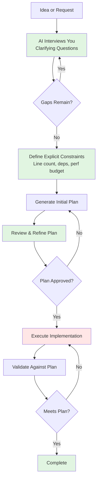
```mermaid
graph TD
    A[Idea or Request] --> B[AI Interviews You<br/>Clarifying Questions]
    B --> C{Gaps Remain?}
    C -->|Yes| B
    C -->|No| D[Define Explicit Constraints<br/>Line count, deps, perf budget]
    D --> E[Generate Initial Plan]
    E --> F[Review & Refine Plan]
    F --> G{Plan Approved?}
    G -->|No| E
    G -->|Yes| H[Execute Implementation]
    H --> I[Validate Against Plan]
    I --> J{Meets Plan?}
    J -->|No| H
    J -->|Yes| K[Complete]

    style B fill:#e1f5e1
    style D fill:#e1f5e1
    style F fill:#e1f5e1
    style H fill:#ffe6e6
    style K fill:#e1f5e1
```

**Interview Phase**

Before writing any plan, have AI act as an interviewer:

```bash
ai "I want to build a notification system for our app.

Before writing any code or plan, interview me:
1. Ask clarifying questions about requirements I haven't stated
2. Identify constraints I should decide on upfront
3. Surface assumptions that could cause rework later
4. Group your questions by category (scope, technical, users, edge cases)

Ask one category at a time. Wait for my answers before continuing."
```

Typical interview output groups questions by category — scope ("Which channels? In-app, email, SMS?"), technical ("Expected volume — 10/day vs 10,000/hour changes architecture"), users ("Can users configure preferences?"), edge cases ("What happens when delivery fails?"). After answers are collected, ask AI to consolidate them into a requirements summary, an explicit non-goals list, and remaining open questions — that document becomes the input to the planning phase.

**Constraint Phase**

Translate the interview answers into the boundaries the AI must respect. Constraints prevent over-engineering more reliably than instructions to "keep it simple":

```
Bad:  "Create user service"
Good: "Create user service: <100 lines, 3 methods max, only bcrypt dependency"

Bad:  "Add caching"
Good: "Add caching using Map, max 1000 entries, LRU eviction"

Bad:  "Improve performance"
Good: "Reduce p99 latency to <50ms without new dependencies"
```

Carry these constraints into every subsequent prompt — they're the steering, not the suggestion.

**Core Implementation**

**1. Plan Generation Phase**
```bash
# Example planning prompt structure
CONTEXT: "Building user authentication for SaaS application"
REQUIREMENTS: "JWT tokens, password reset, rate limiting"
CONSTRAINTS: "Must integrate with existing user table, 2-hour time limit"

REQUEST: "Generate step-by-step implementation plan with:
- Database changes needed
- API endpoints to create/modify
- Security considerations
- Testing approach
- Rollback strategy"
```

**2. Plan Review and Iteration**
```markdown
# Generated Plan Review Checklist

### Technical Approach
- [ ] Database schema changes are backwards compatible
- [ ] API design follows existing conventions
- [ ] Security measures address OWASP top 10
- [ ] Performance impact is minimal

### Implementation Strategy
- [ ] Tasks are broken into deployable increments
- [ ] Dependencies are clearly identified
- [ ] Rollback plan is feasible
- [ ] Testing strategy covers edge cases

### Resource Requirements
- [ ] Time estimate is realistic
- [ ] Required permissions are available
- [ ] External dependencies are identified
```

**3. Execution with Plan Validation**
```bash
# During implementation, validate against plan
echo "✓ Step 1: Created user_sessions table (matches plan)"
echo "✓ Step 2: Added JWT service (matches plan)"
echo "⚠ Step 3: Rate limiting - using Redis instead of in-memory (plan deviation documented)"
```

**Tool-Agnostic Planning Approach**

**Planning Session Structure**
```markdown
## 1. Problem Definition (2-3 sentences)
Clear statement of what needs to be built and why

## 2. Constraints & Requirements
- Technical constraints (existing systems, performance, security)
- Business requirements (timeline, user experience, compliance)
- Resource constraints (team size, expertise, budget)

## 3. Implementation Options
- Option A: [Brief description, pros/cons, time estimate]
- Option B: [Brief description, pros/cons, time estimate]
- Recommended: [Choice with justification]

## 4. Detailed Plan
- [ ] Step 1: [Concrete action with acceptance criteria]
- [ ] Step 2: [Concrete action with acceptance criteria]
- [ ] Step 3: [Concrete action with acceptance criteria]

## 5. Validation Strategy
How to verify each step works and overall solution meets requirements
```


**When to Use Plan-First Development**

- **Complex Features**: Multi-step implementations requiring coordination
- **Unknown Domains**: Working in unfamiliar technologies or business areas
- **Team Collaboration**: When multiple developers need to understand the approach
- **High-Stakes Changes**: Security, performance, or business-critical modifications
- **Learning Contexts**: When using AI to explore new implementation approaches

Complete Example: See [examples/planned-implementation/](examples/planned-implementation/) for:
- Tool-specific planning examples (Claude Code, Cursor)
- Planning templates and checklists
- Markdown iteration techniques and stakeholder review cycles
- Integration with existing development workflows
- Plan validation and iteration strategies

#### Anti-pattern: Blind Generation
Jumping straight from a vague idea to code generation without interviewing for requirements or setting constraints. AI fills the gaps with assumptions — often reasonable-sounding but wrong for your context — and you discover requirements through failed implementations instead of conversation.

#### Anti-pattern: Unconstrained Generation
Skipping the constraint phase. Telling AI to "make it good" or "add features" without explicit boundaries produces over-engineered solutions that are hard to review.

#### Anti-pattern: Over-Constrained
Stacking so many constraints ("exactly 50 lines, 2 methods, no dependencies, 100% test coverage, sub-10ms response time") that AI can't find a coherent solution. Constraints are budgets, not handcuffs — pick the ones that matter for this task.

#### Anti-pattern: Over-Analysis
Spending excessive time refining plans without moving to implementation, missing opportunities for rapid feedback and iterative improvement.

---


<a id="progressive-enhancement"></a>
## Incremental Generation

**Maturity**: Beginner<br>
**Description**: Build complex features through small, deployable iterations rather than big-bang generation.

**Related Patterns**: [Planned Implementation](#planned-implementation), [Developer Lifecycle](#developer-lifecycle), [Image Spec](#image-spec), [Adversarial Evaluator](#adversarial-evaluator)

**Source**: GitHub Docs, "[Prompt engineering for GitHub Copilot Chat](https://docs.github.com/en/copilot/concepts/prompting/prompt-engineering)"; Harper Reed, "[My LLM codegen workflow atm](https://harper.blog/2025/02/16/my-llm-codegen-workflow-atm/)", February 16, 2025

Industry sources describe this mechanism as small tasks, bite-sized steps, or incremental
development. This catalog uses *incremental generation* to avoid collision with the established
web-design meaning of *progressive enhancement*.

**Examples**
Building authentication incrementally:
```bash
# Day 1: Minimal login
"Create POST /login that returns 200 for admin/admin, 401 otherwise"
→ Deploy

# Day 2: Real password check
"Modify login to check passwords against users table. Keep existing API."
→ Deploy

# Day 3: Add security
"Add bcrypt hashing to login. Support both hashed and plain passwords temporarily."
→ Deploy

# Day 4: Modern tokens
"Replace session with JWT. Keep session endpoint for backward compatibility."
→ Deploy
```

**Developer Review Required**: Each iteration requires developer review and testing of AI-generated code before deployment.

**When to Use [Incremental Generation](#incremental-generation)**

- **MVP Development**: When you need to get to market quickly with minimal features
- **Uncertain Requirements**: When requirements are likely to change based on user feedback  
- **Risk Mitigation**: When you want to reduce the risk of large, complex implementations
- **Continuous Delivery**: When you have automated deployment and want rapid iterations
- **Learning Projects**: When the team is learning new technologies or domains

#### Anti-pattern: Monolithic Generation
Asking AI to "create a complete user management system" results in 5000 lines of coupled, untested code that takes days to review and debug.

---

<a id="cross-model-validation"></a>
## Adversarial Evaluator

**Maturity**: Intermediate<br>
**Description**: Separate the agent that generates work from an independent agent that judges it — ideally a different model — so adversarial pressure and cross-model divergence, not a model grading its own output, become the eval signal for high-stakes decisions.

**Related Patterns**: [Planned Implementation](#planned-implementation), [Incremental Generation](#incremental-generation), [Spec-Driven Development](#spec-driven-development), [Autonomous Acceptance](experiments/README.md#autonomous-acceptance)

**See also**: [Harness Engineering Lens](#harness-engineering-lens)

**Core Principle: Separate the Producer from the Judge**

Borrowed from GANs (Generative Adversarial Networks): two networks compete — one generates, one judges — and that adversarial tension forces quality up. The same dynamic applies to multi-agent systems. A model asked to grade its own output shares its own blind spots; the confident reasoning that produced a flawed answer also produces a confident review of it. The fix is to separate the generator from the evaluator completely, and to make the evaluator as *independent* as the stakes require.

Independence is a spectrum, not a switch:

| Independence level | How | Strength |
|---|---|---|
| Same model, different prompt/role | "Now critique the above as a skeptical reviewer" | Weak — shared training priors, correlated blind spots |
| Different model as judge | Claude generates, GPT-5 or Gemini judges | Strong — independent training data and failure modes |
| Different identity + signing key | Judge owned by a separate party, attestation signed | Strongest — see [Autonomous Acceptance](experiments/README.md#autonomous-acceptance) |

The pattern has two topologies. Pick the one that matches the decision: an **adversarial judge** when you have one candidate and need to know whether it holds up, or **cross-model divergence** when there is no single right answer and you want to surface the space of reasonable ones.

**Topology 1: Adversarial Judge (generate → attack)**

Sequential and asymmetric. One agent produces; a second, independent agent is told to *find fault* — not to summarize, not to agree, but to refute. Surviving that pressure is the quality signal.

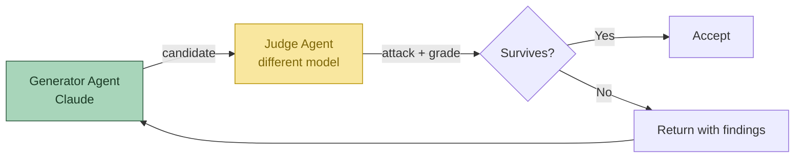
```mermaid
graph LR
    G[Generator Agent<br/>Claude] -->|candidate| J[Judge Agent<br/>different model]
    J -->|attack + grade| V{Survives?}
    V -->|Yes| A[Accept]
    V -->|No| R[Return with findings]
    R --> G
    style G fill:#a8d5ba,stroke:#2d5a3f,color:#1a3a25
    style J fill:#f9e79f,stroke:#b7950b,color:#7d6608
```

```bash
# adversarial-judge.sh — generate with one model, attack with another
GENERATOR="claude-opus-4-8"
JUDGE="gpt-5"

llm -m "$GENERATOR" < task.md > candidate.md

llm -m "$JUDGE" <<EOF
You are an adversarial reviewer. Your goal is to REFUTE the work below, not
to praise it. Find every correctness bug, security hole, unhandled edge case,
and unstated assumption. If you cannot break it, say so explicitly.

TASK: $(cat task.md)
CANDIDATE: $(cat candidate.md)
EOF
```

The judge must run on a *different* model than the generator. A Claude-generated answer reviewed by Claude inherits Claude's blind spots; the same answer attacked by GPT-5 or Gemini meets a different set of priors. That diversity of training data is what makes the adversary's findings real rather than confirmatory.

**Topology 2: Cross-Model Divergence (fan out → compare)**

Parallel and symmetric. Instead of one judge attacking one output, run the *same* task across several frontier models at once and treat their disagreement as the signal. No model is cast as the judge — the divergence between independent peers is the verdict.

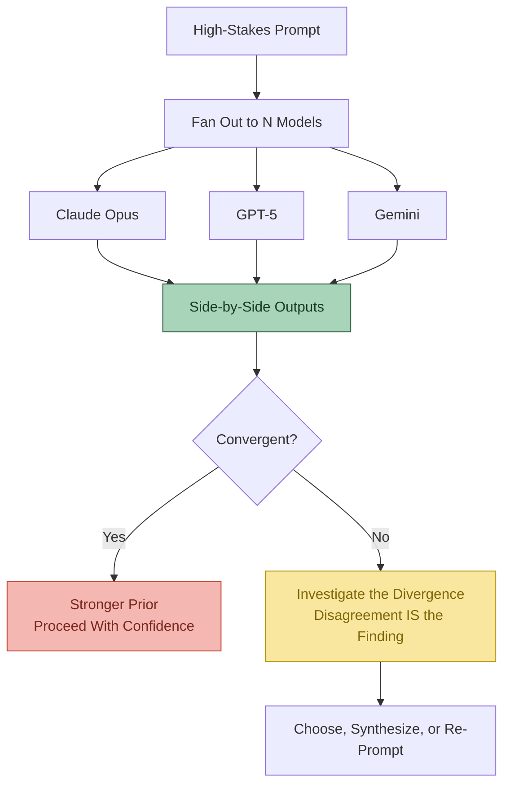
```mermaid
graph TD
    A[High-Stakes Prompt] --> B[Fan Out to N Models]
    B --> C1[Claude Opus]
    B --> C2[GPT-5]
    B --> C3[Gemini]
    C1 --> D[Side-by-Side Outputs]
    C2 --> D
    C3 --> D
    D --> E{Convergent?}
    E -->|Yes| F[Stronger Prior<br/>Proceed With Confidence]
    E -->|No| G[Investigate the Divergence<br/>Disagreement IS the Finding]
    G --> H[Choose, Synthesize, or Re-Prompt]

    style D fill:#a8d5ba,stroke:#2d5a3f,color:#1a3a25
    style G fill:#f9e79f,stroke:#b7950b,color:#7d6608
    style F fill:#f5b7b1,stroke:#c0392b,color:#78281f
```

```bash
#!/usr/bin/env bash
# fan-out.sh — run the same prompt across multiple models
PROMPT_FILE="$1"
mkdir -p .cross-model/$(date +%Y%m%d-%H%M%S)
RUN_DIR=$(ls -td .cross-model/* | head -1)

for model in \
  "claude-opus-4-8" \
  "gpt-5" \
  "gemini-2.5-pro"; do
    echo "→ $model"
    llm -m "$model" < "$PROMPT_FILE" > "$RUN_DIR/${model}.md"
done

# Diff the outputs to surface divergence quickly
diff -u "$RUN_DIR/claude-opus-4-8.md" "$RUN_DIR/gpt-5.md"     > "$RUN_DIR/claude-vs-gpt.diff"  || true
diff -u "$RUN_DIR/gpt-5.md"           "$RUN_DIR/gemini-2.5-pro.md" > "$RUN_DIR/gpt-vs-gemini.diff" || true

echo "Outputs in $RUN_DIR — review the .diff files first."
```

Reading the divergence:

| Outcome | What it means | Action |
|---|---|---|
| All models agree | Stronger prior than any single model alone | Proceed |
| 2 agree, 1 disagrees | The minority report may be catching something the majority missed | Read the dissent carefully before discarding |
| All three disagree | The prompt is underspecified, the task is genuinely ambiguous, or you're at the frontier of model capability | Re-prompt with sharper constraints, or treat as a human-judgment call |

**The disagreement IS the signal.** Don't reduce three rich outputs to a vote count — investigate *why* the models split. That investigation is the value the pattern delivers, not the "winning" answer.

**When to Use**

Independent evaluation costs more than a single pass — an extra model call per judgment, or N parallel calls — so don't apply it to every prompt. Reach for it when:

- **Irreversible decisions**: schema migrations, public API contracts, security model changes
- **High-stakes reviews**: pre-merge architecture review, threat modeling, incident post-mortems
- **Eval-style spot-checks**: validating a single canonical prompt that drives downstream automation
- **Onboarding a new model**: comparing a candidate model's output against your trusted baseline before adopting it

For routine prompts, the single-model degenerate form (below) is sufficient and cheaper.

**Single-Model Degenerate Form**

When the cost of a second model isn't justified, ask one model to generate and then critique its own work, or to produce multiple options in a single call:

```
"Generate 3 different authentication approaches. For each: performance profile,
security trade-offs, implementation complexity, and when to choose it.
Then recommend one based on a typical SaaS startup's constraints."
```

This is cheaper but provides weaker signal — the critique shares the generator's training biases. Modern IDE assistants offer this natively as "alternative completions." It's the budget-friendly cousin of the full pattern, not a substitute for genuine independence on high-stakes calls.

#### Anti-pattern: Self-Grading

Letting the model that produced the work also certify it — a satisfaction score, a "looks good to me," a self-review — and treating that as independent verification. The reviewer shares every blind spot of the author because it *is* the author: the confident reasoning that generated a subtly wrong answer generates an equally confident approval of it. Taken to its institutional extreme — a self-signed acceptance score gating a merge — this becomes the [Autonomous Acceptance](experiments/README.md#autonomous-acceptance) anti-pattern, where the rubber stamp simply moves from a human to a number.

#### Anti-pattern: Single-Model Bias

Committing irreversible decisions on a single model's output without ever checking whether another frontier model would have made the same call. The decision feels well-reasoned because the model's prose is confident — but confidence is not correctness, and one model's blind spots become the project's blind spots.

#### Anti-pattern: False Consensus

Running three models and treating majority rule as truth. Frontier models are trained on overlapping data and exhibit correlated errors; 2-of-3 agreement on a wrong answer is common when the wrong answer is the most plausible-sounding one. Use the votes as a *prompt for investigation*, never as a verdict.

---


## Parallel Agents

**Maturity**: Advanced<br>
**Description**: Run multiple AI agents concurrently on isolated tasks or environments to maximize development speed and exploration.

**Related Patterns**: [Workflow Orchestration](experiments/README.md#workflow-orchestration), [Atomic Decomposition](#atomic-decomposition), [Security Sandbox](#security-sandbox)

**Agent Coordination Lifecycle**

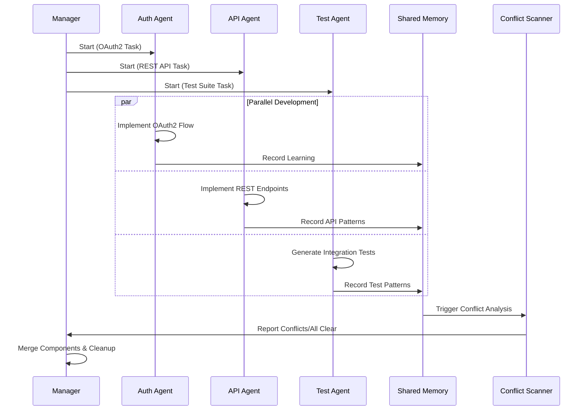
```mermaid
sequenceDiagram
    participant M as Manager
    participant A1 as Auth Agent
    participant A2 as API Agent  
    participant A3 as Test Agent
    participant SM as Shared Memory
    participant CS as Conflict Scanner
    
    M->>A1: Start (OAuth2 Task)
    M->>A2: Start (REST API Task)
    M->>A3: Start (Test Suite Task)
    
    par Parallel Development
        A1->>A1: Implement OAuth2 Flow
        A1->>SM: Record Learning
    and
        A2->>A2: Implement REST Endpoints
        A2->>SM: Record API Patterns
    and
        A3->>A3: Generate Integration Tests
        A3->>SM: Record Test Patterns
    end
    
    SM->>CS: Trigger Conflict Analysis
    CS->>M: Report Conflicts/All Clear
    M->>M: Merge Components & Cleanup
```

**Core Implementation Approaches**

```yaml
# Container-based isolation
# docker-compose.parallel-agents.yml
services:
  agent-auth:
    image: ai-dev-environment:latest
    volumes:
      - ./feature-auth:/workspace:rw
      - shared-memory:/shared:ro
    environment:
      - AGENT_ID=auth-feature
      - TASK_ID=implement-oauth2
    networks:
      - agent-network

  agent-api:
    image: ai-dev-environment:latest
    volumes:
      - ./feature-api:/workspace:rw
      - shared-memory:/shared:ro
    environment:
      - AGENT_ID=api-feature
      - TASK_ID=implement-rest-endpoints

volumes:
  shared-memory:
    driver: local
networks:
  agent-network:
    driver: bridge
    internal: true
```

**Git Worktree Parallelization**

```bash
# Create isolated branches for parallel work
git worktree add -b agent/auth ../agent-auth
git worktree add -b agent/api ../agent-api
git worktree add -b agent/tests ../agent-tests

# Launch agents in parallel
parallel --jobs 3 << EOF
cd ../agent-auth && ai-agent implement-oauth2
cd ../agent-api && ai-agent implement-rest-endpoints
cd ../agent-tests && ai-agent generate-integration-tests
EOF

# Automated conflict detection and merge
for branch in $(git branch -r | grep 'agent/'); do
  git checkout -b temp-merge main
  if git merge --no-commit --no-ff $branch; then
    echo "✓ No conflicts in $branch"
    git merge --abort
  else
    echo "⚠ Conflicts detected - using AI resolution"
    ai-agent resolve-conflicts --branch $branch
  fi
  git checkout main && git branch -D temp-merge
done

# Cleanup
git worktree remove ../agent-auth
git worktree remove ../agent-api
git worktree remove ../agent-tests
```

**Shared Memory & Coordination**

```python
import fcntl

# Agent coordination with shared knowledge
class AgentMemory:
    def record_learning(self, agent_id, key, value):
        """Thread-safe learning capture with file locking"""
        with fcntl.flock(self.lock_file, fcntl.LOCK_EX):
            self.memory[agent_id][key] = value
        
    def get_shared_knowledge(self):
        """Consolidated knowledge from all agents"""
        return self.consolidated_memory

# Task definition
tasks = {
    "auth-service": {
        "agent_count": 1,
        "isolation": "container", 
        "dependencies": [],
        "instructions": "Implement OAuth2 with JWT tokens"
    },
    "api-endpoints": {
        "agent_count": 2,
        "isolation": "worktree",
        "dependencies": ["auth-service"],
        "instructions": "REST endpoints: user mgmt + CRUD"
    }
}
```

Complete Example: See [examples/parallel-agents/](examples/parallel-agents/) for:
- Full Docker isolation and coordination setup
- Git worktree management and conflict resolution
- Shared memory system with file locking
- Emergency shutdown and safety monitoring
- Task distribution and dependency management

**When to Use [Parallel Agents](#parallel-agents)**
- **Complex features** requiring multiple specialized implementations
- **Time-critical projects** where speed trumps coordination overhead
- **Exploration phases** testing multiple approaches simultaneously
- **Large teams** with strong DevOps and coordination processes

**Source**: [AI Native Dev - How to Parallelize AI Coding Agents](https://ainativedev.io/news/how-to-parallelize-ai-coding-agents)

#### Anti-pattern: Uncoordinated Agents
Running multiple agents without isolation, shared memory, or conflict resolution leads to race conditions, lost work, and system instability.

---


<a id="context-persistence"></a>
## Agent Memory

**Maturity**: Intermediate<br>
**Description**: Manage AI context as a finite resource through structured memory schemas, prompt pattern capture, and session continuity protocols for efficient multi-session development.

**Related Patterns**: [Codified Rules](#codified-rules), [Progressive Disclosure](#progressive-disclosure), [Spec-Driven Development](#spec-driven-development), [Parallel Agents](#parallel-agents)

**Source**: Anthropic, "[Memory tool](https://platform.claude.com/docs/en/agents-and-tools/tool-use/memory-tool)" (Claude API documentation); Packer et al., "[MemGPT: Towards LLMs as Operating Systems](https://arxiv.org/abs/2310.08560)", October 12, 2023

Industry tooling commonly calls this practice *memory*, *agent memory*, a *memory bank*, or a
*memory tool*.

**Core Principles**

AI context is a finite resource with diminishing returns. Effective context engineering requires:
- **Minimal High-Signal Tokens**: Find the smallest set of information that maximizes outcomes
- **Just-in-Time Retrieval**: Load context dynamically rather than pre-loading everything
- **[Progressive Disclosure](#progressive-disclosure)**: Explore and discover information as needed, not upfront

**Structured Memory Schemas**

Persist information outside the context window using standardized memory formats:

```markdown
# TODO.md - Task tracking across sessions
- [ ] Implement JWT middleware (blocked: key rotation design)
- [x] Add bcrypt password hashing (2024-01-15)
- [ ] Rate limiting (next: research token bucket vs sliding window)

# DECISIONS.log - Architectural decisions with timestamp
2024-01-15 10:30: Use RS256 for JWT (not HS256)
Rationale: Asymmetric keys enable better key rotation
Alternatives: HS256 (simpler but less flexible)
Impact: auth-service, api-gateway

# NOTES.md - Session continuity and discoveries
Session 2024-01-15:
  Context: Implementing authentication system
  Discoveries: bcrypt has performance issues >100 req/s
  Blockers: Need to decide on refresh token storage
  Next: Benchmark argon2 as bcrypt alternative

# scratchpad.md - Working memory (cleared after task)
Exploring JWT refresh token flow...
- httpOnly cookies prevent XSS
- Need CSRF protection for cookie-based auth
```

**Prompt Pattern Library**

Capture successful prompts and failures with success rates for reuse:

```bash
# Initialize knowledge structure
./knowledge-capture.sh --init

# Capture successful pattern
./knowledge-capture.sh --success \
  --domain "auth" \
  --pattern "JWT Auth" \
  --prompt "JWT with RS256, 15min access, httpOnly cookie" \
  --success-rate "95%"

# Document failure to avoid repeating
./knowledge-capture.sh --failure \
  --domain "auth" \
  --bad-prompt "Make auth secure" \
  --problem "Too vague → AI over-engineers" \
  --solution "Specify exact JWT requirements"
```

**Context Window Management**

**Compaction Strategy** - When context approaches limits:
1. Distill critical decisions to `DECISIONS.log`
2. Summarize key discoveries in `NOTES.md`
3. Update `TODO.md` with current state and blockers
4. Create "Previously on..." recap for session continuity

**Session Continuity Protocol** - Resume work across sessions:
1. Read `NOTES.md` for previous session context
2. Review `TODO.md` for current tasks and blockers
3. Check `DECISIONS.log` for recent architectural choices
4. Scan `scratchpad.md` for active explorations

```bash
# Compact context when nearing limits
./context-compact.sh --summarize

# Resume from previous session
./session-resume.sh  # Displays TODO + recent decisions + notes recap
```

Complete Example: See [examples/agent-memory/](examples/agent-memory/) for:
- Memory schema templates (TODO.md, DECISIONS.log, NOTES.md, scratchpad.md)
- Context compaction and session resume automation scripts
- Prompt pattern capture and maintenance tools
- Working examples of memory schemas in use

#### Anti-pattern: Over-Documentation

Creating extensive knowledge bases that become maintenance burdens instead of accelerating development through selective, actionable knowledge capture.

**Why it's problematic:**
- Knowledge bases become outdated and misleading
- Developers spend more time documenting than developing
- Overly detailed entries are ignored in favor of quick experimentation
- Knowledge becomes siloed and not easily discoverable

**Instead, focus on:**
- Capture only high-impact patterns (>80% success rate)
- Document failures that wasted significant time (>30 minutes)
- Keep entries concise and immediately actionable
- Review and prune knowledge quarterly

#### Anti-pattern: Bloated Context

Loading entire codebases, documentation, or conversation history into context rather than using structured memory and just-in-time retrieval.

**Why it's problematic:**
- Wastes tokens on low-signal information
- Degrades AI performance due to information overload
- Slows interaction latency and increases costs
- Misses the forest for the trees

**Instead:**
- Use lightweight identifiers (file paths, links) rather than full content
- Load context progressively as needed
- Externalize detailed information to memory schemas
- Prefer 3-5 high-quality examples over exhaustive documentation

---

<a id="event-automation"></a>
## Agent Hooks

**Maturity**: Intermediate<br>
**Description**: Attach commands and policy checks to assistant lifecycle hooks so validation and workflow controls run automatically.

**Related Patterns**: [Codified Rules](#codified-rules), [Security Sandbox](#security-sandbox), [Custom Commands](#custom-commands), [Bounded Autonomy](#bounded-autonomy)

Industry implementations call these controls *hooks*, *lifecycle hooks*, *agent hooks*, or event plugins. The compatibility anchor above preserves inbound links to the former catalog entry.

**Core Concept**

Attach shell commands to AI assistant lifecycle events. Commands receive context via environment variables (file paths, tool names, user prompts) and return exit codes to allow/block/warn.

**Event Flow Example**

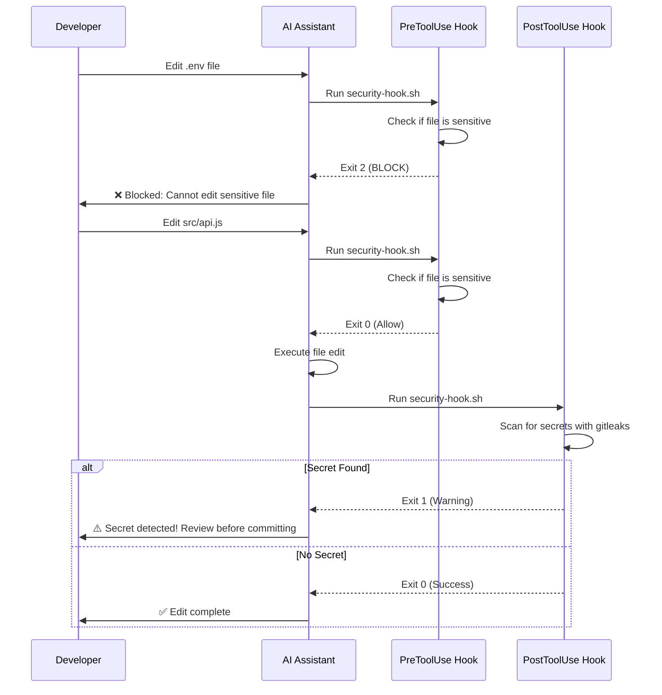
```mermaid
sequenceDiagram
    participant Dev as Developer
    participant AI as AI Assistant
    participant Pre as PreToolUse Hook
    participant Post as PostToolUse Hook

    Dev->>AI: Edit .env file
    AI->>Pre: Run security-hook.sh
    Pre->>Pre: Check if file is sensitive
    Pre-->>AI: Exit 2 (BLOCK)
    AI->>Dev: ❌ Blocked: Cannot edit sensitive file

    Dev->>AI: Edit src/api.js
    AI->>Pre: Run security-hook.sh
    Pre->>Pre: Check if file is sensitive
    Pre-->>AI: Exit 0 (Allow)
    AI->>AI: Execute file edit
    AI->>Post: Run security-hook.sh
    Post->>Post: Scan for secrets with gitleaks
    alt Secret Found
        Post-->>AI: Exit 1 (Warning)
        AI->>Dev: ⚠️ Secret detected! Review before committing
    else No Secret
        Post-->>AI: Exit 0 (Success)
        AI->>Dev: ✅ Edit complete
    end
```

**Simple Security Example**

Prevent editing sensitive files and scan for secrets:

```bash
#!/bin/bash
# security-hook.sh

FILE="$TOOL_INPUT_FILE_PATH"

# Block .env and credentials files
if echo "$FILE" | grep -E "(\\.env|secrets\\.json|credentials)" > /dev/null; then
  echo "❌ Blocked: Cannot edit sensitive file"
  exit 2
fi

# Scan for hardcoded secrets (requires gitleaks)
if command -v gitleaks > /dev/null; then
  if gitleaks detect --no-git --source="$FILE" 2>&1 | grep -q "leaks found"; then
    echo "⚠️ Secret detected! Review before committing."
    exit 1
  fi
fi

exit 0
```

**Configuration Example (Claude Code)**

```json
{
  "hooks": {
    "PreToolUse": [{
      "matcher": "Edit",
      "hooks": [{"type": "command", "command": "./security-hook.sh"}]
    }],
    "PostToolUse": [{
      "matcher": "Edit",
      "hooks": [{"type": "command", "command": "./security-hook.sh"}]
    }]
  }
}
```

**Common Use Cases**
- Auto-format code after edits (`prettier`, `black`, `gofmt`)
- Block sensitive file modifications
- Log AI interactions for compliance
- Run linters before commits

**Security Warning**

Event commands run with full system access. Always review scripts before enabling. Test in isolated environments first.

Complete Example: See [examples/agent-hooks/](examples/agent-hooks/) for a working implementation with security scanning and hooks.

#### Anti-pattern: Unchecked Events

Running automation from untrusted sources without review exposes your system to malicious code execution and credential theft. Always audit event scripts before installation.

---

## Custom Commands

**Maturity**: Intermediate<br>
**Description**: Discover and use built-in command vocabularies, then extend them with custom commands that encode domain expertise and sophisticated workflows.

**Related Patterns**: [Agent Hooks](#agent-hooks), [Spec-Driven Development](#spec-driven-development), [Codified Rules](#codified-rules), [Progressive Disclosure](#progressive-disclosure)

**See also**: [Harness Engineering Lens](#harness-engineering-lens)

**Core Concept**

AI coding tools provide built-in commands for common operations and support custom commands (markdown files with AI instructions) for project-specific workflows. Commands are manual/on-demand (invoked like `/refactor`), while events fire automatically (see [Agent Hooks](#agent-hooks)).

**Command Discovery**

Discover built-in commands first:

```bash
# Claude Code
/help /model /clear /review

# Cursor IDE
Cmd+K /edit /chat

# Gemini CLI
/stats /memory /tools /clear
```

| Use Built-in Commands | Create [Custom Commands](#custom-commands) |
|-----------------------|------------------------|
| Generic operations (clear, help, model) | Domain expertise (refactoring, security analysis) |
| Tool features (review, edit) | Project workflows (deploy, implement-spec) |
| Universal commands | Team standards and conventions |

**Example: Refactoring Assistant**

Encode Martin Fowler's refactoring catalog for systematic code improvement:

```markdown
---
description: Interactive refactoring assistant based on Martin Fowler's refactoring catalog
argument-hint: Optional flags (--smell, --duplicates, --suggest)
---

# Refactoring Assistant

You are helping a developer improve code maintainability by identifying code smells and recommending specific refactoring techniques from Martin Fowler's catalog.

# Usage
/refactor              # Full analysis
/refactor --smell      # Code smells only

# Implementation

### 1. Code Smell Detection
- Long methods (>20 lines), duplicate code, complex conditionals
- For each: location (file:line), severity, specific refactoring, effort estimate

### 2. Bloater Detection
- Excessive parameters (>4), data clumps, primitive obsession

### 3. Refactoring Strategy
1. Name the code smell
2. Recommend technique from Fowler's catalog
3. Show before/after example
4. Estimate maintainability improvement

Generate step-by-step refactoring plan prioritized by impact.
```

**More Examples**

Additional command examples with detailed implementations:

- **[Implement-Spec](examples/custom-commands/implement-spec-example.md)** - Spec-driven implementation with TDD and traceability
- **[Security Review](examples/custom-commands/security-review-example.md)** - Multi-layer security analysis (secrets, vulnerabilities, config)
- **[Safe-Refactor](examples/custom-commands/safe-refactor-example.md)** - Safe refactoring with automated testing and rollback
- **[Test Runner](examples/custom-commands/test-example.md)** - Smart test selection with coverage and health monitoring

**Tool Support**

```bash
# Claude Code: .claude/commands/*.md
mkdir -p .claude/commands
cp examples/custom-commands/commands/*.md .claude/commands/

# Cursor IDE: .cursorrules
cat examples/custom-commands/commands/refactor.md >> .cursorrules

# Generic: .ai/commands/ (tool-agnostic)
mkdir -p .ai/commands
cp examples/custom-commands/commands/*.md .ai/commands/
```

Complete Example: See [examples/custom-commands/](examples/custom-commands/) for ready-to-use commands, configuration files, and setup guide.

#### Anti-pattern: Redundant Commands

Creating `/clear` when the tool already provides it. Always discover built-in commands first.

#### Anti-pattern: Shallow Commands

```markdown
# Bad: Just wraps shell command
Run: npm run deploy:staging

# Good: Encodes expertise
1. Verify staging environment health
2. Check for active incidents
3. Review recent commits for risk
4. Run deployment with rollback plan
```

#### Anti-pattern: Hardcoded Context

```markdown
# Bad: Hardcoded values
Deploy to prod-db-instance-1.us-east-1.rds.amazonaws.com

# Good: Parameterized
Deploy to database: $1 (default: $STAGING_DB)
```

---

## Progressive Disclosure

**Maturity**: Intermediate<br>
**Description**: Load AI assistant rules incrementally based on task context rather than bundling all instructions upfront, preventing context bloat and improving instruction-following consistency.

**Related Patterns**: [Codified Rules](#codified-rules), [Agent Memory](#agent-memory), [Custom Commands](#custom-commands), [Agent Hooks](#agent-hooks), [Centralized Rules](#centralized-rules), [Model Routing](#model-routing)

**Core Problem**

AI coding assistants already consume part of their context window with built-in system instructions. When a project loads a single, monolithic rules file (hundreds of lines) for every task, instruction-following accuracy drops and irrelevant guidance crowds out what the model needs right now.

**Implementation Strategy: Three-Tier Rule Architecture**

Keep a small universal rules file, and load specialized rules only when the task touches the relevant area:

```
.ai/
├── CLAUDE.md                    # Universal rules only (<60 lines)
├── rules/                       # Specialized rules loaded on-demand
│   ├── security/                # secrets, auth, dependencies
│   ├── development/             # api-design, database, testing
│   ├── operations/              # deployment, monitoring, cicd
│   └── architecture/            # patterns, performance
└── prompts/                     # Reusable task templates
```

**Main Rules File = Router**

The main file should explicitly tell the assistant what to load based on context:

```markdown
# AI Development Rules

# Universal Principles (Always Apply)
- Follow existing patterns in the codebase
- Never commit secrets or credentials
- Run tests after code changes

# Progressive Disclosure (Context Loading)
- **Security work** (auth/, .env, credentials): Read `.ai/rules/security/`
- **API development** (api/, routes/): Read `.ai/rules/development/api-design.md`
- **Database changes** (migrations/, models/): Read `.ai/rules/development/database.md`
- **Testing** (tests/, specs/): Read `.ai/rules/development/testing.md`
- **CI/CD** (.github/workflows/): Read `.ai/rules/operations/cicd.md`
```

**Automatic Loading with Hooks**

Combine with [Agent Hooks](#agent-hooks) to auto-load the right rules before tool use:

```bash
#!/bin/bash
# .ai/hooks/auto-load-context.sh

FILE_PATH="$TOOL_INPUT_FILE_PATH"
LOADED_RULES=""

if echo "$FILE_PATH" | grep -Eq "(\\.env|credentials|secrets|auth/)"; then
  LOADED_RULES="$LOADED_RULES .ai/rules/security/"
fi

if echo "$FILE_PATH" | grep -Eq "(api/|routes/|controllers/)"; then
  LOADED_RULES="$LOADED_RULES .ai/rules/development/api-design.md"
fi

if echo "$FILE_PATH" | grep -Eq "(tests?/|spec/|\\.test\\.|\\.spec\\.)"; then
  LOADED_RULES="$LOADED_RULES .ai/rules/development/testing.md"
fi

if [ -n "$LOADED_RULES" ]; then
  echo "AI: Before proceeding, read these files: $LOADED_RULES"
fi
```

Complete Example: See [examples/progressive-disclosure/](examples/progressive-disclosure/) for templates and a ready-to-adapt rules router + directory layout.

#### Anti-pattern: Bloated Configuration

Loading a single, massive rules file for every task wastes context and reduces instruction-following accuracy—especially for small edits that need only a handful of universal rules.

#### Anti-pattern: Missing Guidance

Creating specialized rule files but never documenting when/how to load them forces humans to remember the routing and prevents consistent, automated context loading.

---

## Atomic Decomposition

**Maturity**: Intermediate<br>
**Description**: Break complex features into atomic, independently implementable tasks for parallel AI agent execution.

**Related Patterns**: [Developer Lifecycle](#developer-lifecycle), [Workflow Orchestration](experiments/README.md#workflow-orchestration), [Incremental Generation](#incremental-generation), [Issue Generation](#issue-generation), [Parallel Agents](#parallel-agents)

**Atomic Task Criteria**

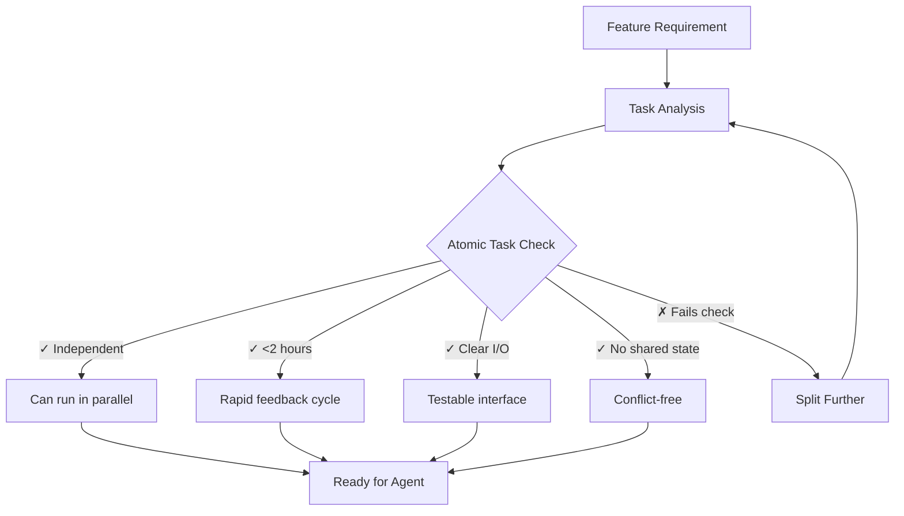
```mermaid
graph TD
    A[Feature Requirement] --> B[Task Analysis]
    B --> C{Atomic Task Check}
    C -->|✓ Independent| D[Can run in parallel]
    C -->|✓ <2 hours| E[Rapid feedback cycle]
    C -->|✓ Clear I/O| F[Testable interface]
    C -->|✓ No shared state| G[Conflict-free]
    C -->|✗ Fails check| H[Split Further]
    H --> B
    
    D --> I[Ready for Agent]
    E --> I
    F --> I
    G --> I
```

**Core Decomposition Process**

```bash
# Feature: User Authentication System
# Bad: Monolithic task
❌ "Implement complete user authentication with JWT, password hashing, rate limiting, and email verification"

# Good: Atomic breakdown with AI validation
ai_decompose "Break down user authentication into atomic tasks:

Task 1: Password validation service (1.5h)
- Input: plain text password, validation rules
- Output: validation result object
- Dependencies: None (pure function)

Task 2: JWT token generation service (1h)  
- Input: user ID, role, expiration config
- Output: signed JWT token
- Dependencies: None (crypto operations only)

Task 3: Rate limiting middleware (2h)
- Input: request metadata, rate limit config
- Output: allow/deny decision
- Dependencies: None (stateless logic)

Task 4: Login endpoint integration (1h)
- Input: credentials, services from tasks 1-3
- Output: HTTP response with token/error
- Dependencies: Tasks 1-3 (integration only)"

# Validate atomicity
ai_task_validator "Check each task for:
1. <2 hour completion time
2. No shared mutable state
3. Clear input/output contracts
4. Testable in isolation
5. No circular dependencies"
```


**Agent Assignment & Coordination**

```yaml
# .ai/task-assignment.yml
authentication_feature:
  parallel_tasks:
    - id: "auth-001" # Password validation
      agent: "backend-specialist-1"
      estimated_hours: 1.5
      dependencies: []
      
    - id: "auth-002" # JWT generation
      agent: "security-specialist"
      estimated_hours: 1
      dependencies: []
      
    - id: "auth-003" # Rate limiting
      agent: "backend-specialist-2"
      estimated_hours: 2
      dependencies: []
      
  integration_tasks:
    - id: "auth-004" # Login endpoint
      agent: "integration-specialist"
      estimated_hours: 1
      dependencies: ["auth-001", "auth-002", "auth-003"]
```

**Task Contract Validation**

```python
# Ensure tasks meet atomic criteria
class TaskContract:
    def validate_atomic(self) -> bool:
        return all([
            len(self.side_effects) == 0,    # No side effects
            self.estimated_hours <= 2,      # Rapid completion
            self.has_clear_io_contract()    # Testable interface
        ])

# Example validation
task = TaskContract("auth-001")
task.inputs = {"password": str, "rules": PasswordRules}  
task.outputs = {"is_valid": bool, "errors": List[str]}
assert task.validate_atomic()  # ✓ Passes atomic criteria
```

Complete Example: See [examples/atomic-decomposition/](examples/atomic-decomposition/) for:
- Contract validation system with automated checking
- Function-level decomposition techniques and trigger indicators
- Task dependency resolution and scheduling
- Parallel execution coordination and monitoring
- Agent assignment and resource management

**When to Use [Atomic Decomposition](#atomic-decomposition)**
- **Parallel Agent Implementation**: Multiple AI agents working simultaneously
- **Complex Feature Development**: Large features benefiting from parallel work
- **Time-Critical Projects**: Speed through parallelization essential
- **Risk Mitigation**: Reduce blast radius of individual task failures

#### Anti-pattern: False Atomicity
Creating tasks that appear independent but secretly share state, require specific execution order, or have hidden dependencies on other concurrent work.

#### Anti-pattern: Over-Decomposition
Breaking tasks so small that coordination overhead exceeds the benefits of parallelization, leading to more complexity than value.

---

## Guided Refactoring

**Maturity**: Intermediate<br>
**Description**: Systematic code improvement using AI to detect and resolve code smells with measurable quality metrics, following established refactoring rules and maintaining test coverage throughout the process.

**Related Patterns**: [Codified Rules](#codified-rules), [Agent Hooks](#agent-hooks), [Testing Orchestration](experiments/README.md#testing-orchestration), [Debt Forecasting](#debt-forecasting)

**See also**: [Harness Engineering Lens](#harness-engineering-lens)

**Code Smell Detection Framework**

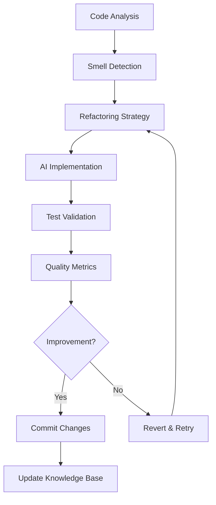
```mermaid
graph TD
    A[Code Analysis] --> B[Smell Detection]
    B --> C[Refactoring Strategy]
    C --> D[AI Implementation]
    D --> E[Test Validation]
    E --> F[Quality Metrics]
    F --> G{Improvement?}
    G -->|Yes| H[Commit Changes]
    G -->|No| I[Revert & Retry]
    H --> J[Update Knowledge Base]
    I --> C
```

**Core Workflow**

```bash
# 1. Define refactoring rules
cat > .ai/rules/refactoring.md << 'EOF'
## Long Method Smell
- Max lines: 20 (excluding docstrings)
- Max cyclomatic complexity: 10
- Detection: flake8 C901, pylint R0915

## Large Class Smell  
- Max class lines: 250, Max methods: 20
- Detection: pylint R0902, R0904
EOF

# 2. Detect code smells with AI
flake8 --select=C901 src/ > smells.txt
pylint src/ --disable=all --enable=R0915,R0902,R0904 >> smells.txt

ai "Analyze smells.txt using .ai/rules/refactoring.md:
1. Prioritize by impact and complexity
2. Suggest specific refactoring strategy for each smell
3. Generate implementation plan with risk assessment"

# 3. Apply refactoring with test preservation
pytest --cov=src tests/  # Baseline coverage

ai "Refactor process_user_data() method (35 lines, exceeds threshold):
- Apply Extract Method pattern for validation, database, notifications
- Maintain test coverage >90% and API contract
- Create atomic commits for each extracted method"

# 4. Validate and track improvements
pytest --cov=src tests/
flake8 src/ && pylint src/

ai "Generate refactoring impact report:
Before: complexity=12, length=35 lines, coverage=85%
After: complexity=4+2+2, length=8+6+7 lines, coverage=92%
Document lessons learned in .ai/knowledge/refactoring.md"
```

**Common Refactoring Patterns**

- **Extract Method**: Break down long methods (>20 lines)
- **Extract Class**: Split large classes (>250 lines, >20 methods)  
- **Replace Primitive**: Convert strings/dicts to value objects
- **Consolidate Duplicates**: Merge similar code patterns

Complete Example: See [examples/guided-refactoring/](examples/guided-refactoring/) for:
- Automated refactoring pipeline with CI integration
- Quality metrics tracking and reporting
- Risk assessment guidelines and rollback procedures
- Knowledge base templates for refactoring outcomes

#### Anti-pattern: Scattered Refactoring
Making widespread changes without systematic analysis leads to introduced bugs and degraded code quality.

#### Anti-pattern: Premature Refactoring
Refactoring code for hypothetical future requirements rather than addressing current code smells and quality issues.

----

<a id="observable-development"></a>
## Agent Observability

**Maturity**: Intermediate<br>
**Description**: Capture structured traces, model and tool events, handoffs, evaluations, cost, latency, and failure context so agent behavior can be diagnosed and improved.

**Related Patterns**: [Developer Lifecycle](#developer-lifecycle), [Error Resolution](#error-resolution), [Bounded Autonomy](#bounded-autonomy)

Industry sources use *agent observability*, *AI observability*, and *tracing*. The compatibility anchor above preserves inbound links to the former catalog entry.

**Agent Run Trace**

Treat an agent invocation as a correlated trace rather than an unstructured transcript:

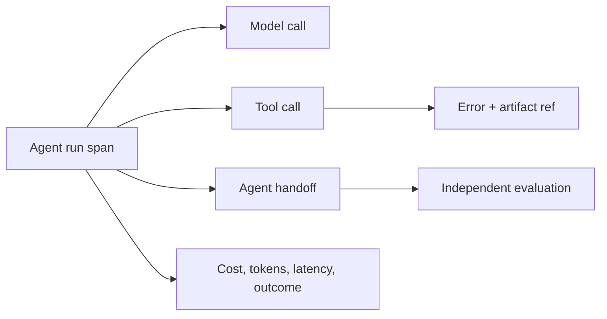
```mermaid
graph LR
    R[Agent run span] --> M[Model call]
    R --> T[Tool call]
    T --> E[Error + artifact ref]
    R --> H[Agent handoff]
    H --> V[Independent evaluation]
    R --> S[Cost, tokens, latency, outcome]
```

Every event carries a `trace_id`, unique `span_id`, `parent_span_id`, `run_id`, and `session_id`. Event-specific fields make the control flow reviewable:

| Event | Required diagnostic fields |
|-------|----------------------------|
| Agent run | producer, repository, base/final commit, goal, status, duration |
| Model call | model, input/output tokens, cost, latency, status, prompt/response artifact refs |
| Tool call | tool name, input/output refs, exit code, latency, status |
| Handoff | source actor, target actor, reason, artifact ref |
| Evaluation | evaluator and producer identities, verdict, score, check ref |
| Error | failed parent span, error type/message, immutable evidence ref |

```json
{
  "trace_id": "trace_4c2d...",
  "span_id": "span_a8e1...",
  "parent_span_id": "span_root...",
  "run_id": "run_f391...",
  "session_id": "session_42",
  "event_type": "tool.call",
  "tool_name": "pytest",
  "status": "error",
  "duration_ms": 430,
  "exit_code": 1,
  "attributes": {
    "input_ref": "tests/test_retry.py",
    "output_ref": "artifacts/pytest.txt"
  }
}
```

**Collect, Validate, and Budget**

Instrument the agent runner or orchestrator, outside the model process. The recorder redacts before writing and stores references instead of raw prompts, responses, tool payloads, source files, or environment values:

```python
# Run from examples/agent-observability/.
from agent_tracing import TraceRecorder
from trace_fitness import validate_trace
from trace_metrics import budget_alerts, summarize_trace

trace = TraceRecorder(session_id="session_42", output_path="artifacts/trace.jsonl")
root = trace.start_run(
    goal="Fix retry behavior", producer="implementation-agent",
    repository="acme/payments", base_commit="9a17d2c",
)
trace.model_call(
    parent_span_id=root, model="reasoning-model",
    input_tokens=1200, output_tokens=280, cost_usd=0.018, duration_ms=610,
    request_ref="sha256:request", response_ref="sha256:response",
)
trace.tool_call(
    parent_span_id=root, tool_name="pytest", duration_ms=430, status="ok",
    input_ref="tests/test_retry.py", output_ref="artifacts/pytest.txt", exit_code=0,
)
trace.finish_run(
    status="ok", head_commit="b82c119", duration_ms=1600,
    summary_ref="artifacts/run-summary.json",
)

assert validate_trace(trace.events) == []
summary = summarize_trace(trace.events)
assert not budget_alerts(
    summary, max_cost_usd=0.10, max_duration_ms=5000, max_output_tokens=1000
)
```

Deterministic checks validate schema, span relationships, redaction, required cost/latency fields, and evaluator independence. A fresh reviewer may assess whether the valid trace is semantically useful, but must not reconstruct missing telemetry or share the producer identity.

**Privacy and Retention**

- Redact credentials, authorization headers, cookies, tokens, and sensitive tool arguments before persistence.
- Prefer commit SHAs, content hashes, and access-controlled artifact references to raw content.
- Apply explicit retention and access policies to traces; observability is not permission to archive every prompt.
- Preserve missing fields as gaps. Never ask a model to invent an event that was not captured.

**Failure Diagnosis**

Build a redacted bundle containing the ordered model/tool/error/evaluation timeline, failed span IDs, cost and latency summary, and immutable artifact references. Pass that evidence into human-gated [Error Resolution](#error-resolution), where a proposed application or repository fix is reviewed and deterministically validated.

Complete Example: See [examples/agent-observability/](examples/agent-observability/) for a provider-neutral trace recorder, metrics, redaction, schema fitness checks, independent quality interface, diagnostic-bundle builder, and executable tests.

#### Anti-pattern: Opaque Runs

A transcript without trace/span relationships, model and tool metadata, costs, handoffs, evaluation identity, and source-linked failures cannot show what acted, what it touched, why it stopped, or whether the producer certified itself.

---

## Error Resolution

**Maturity**: Intermediate<br>
**Description**: Collect failure context, reproduce and diagnose the cause with AI, then apply a proposed fix only after human review and deterministic validation.

**Related Patterns**: [Developer Lifecycle](#developer-lifecycle), [Agent Observability](#agent-observability), [Tool Integration](#tool-integration), [Testing Orchestration](experiments/README.md#testing-orchestration)

**See also**: [Harness Engineering Lens](#harness-engineering-lens)

The human approval node is part of the pattern, not an optional safeguard. Diagnosis and proposal generation may be automated; applying the patch remains human-gated and the deterministic checks arbitrate success.

**[Error Resolution](#error-resolution) Workflow**

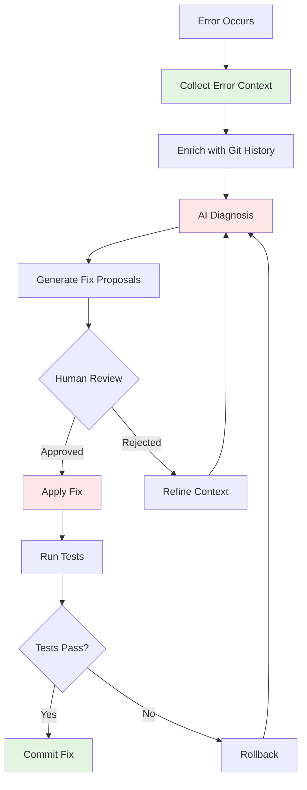
```mermaid
graph TD
    A[Error Occurs] --> B[Collect Error Context]
    B --> C[Enrich with Git History]
    C --> D[AI Diagnosis]
    D --> E[Generate Fix Proposals]
    E --> F{Human Review}
    F -->|Approved| G[Apply Fix]
    F -->|Rejected| H[Refine Context]
    G --> I[Run Tests]
    I --> J{Tests Pass?}
    J -->|Yes| K[Commit Fix]
    J -->|No| L[Rollback]
    H --> D
    L --> D

    style B fill:#e1f5e1
    style D fill:#ffe6e6
    style G fill:#ffe6e6
    style K fill:#e1f5e1
```

**Core Implementation**

**Step 1: Collect Error Context**

```bash
# Create comprehensive error context file
cat > .error-context.md << EOF
# Error Analysis

**Error Output:**
[Complete error message, stack trace, and exit codes]

**Recent Changes:**
$(git log --oneline -5)

**Affected Files:**
$(git diff --name-only HEAD~1)

**File Contents:**
$(cat path/to/affected/file.ext)

**Environment:**
- OS: $(uname -s)
- Shell: $SHELL
- Working Directory: $(pwd)
EOF
```

**Application Failure Context**

Instrument application operations for diagnosis, but keep that telemetry distinct from the agent-run trace described by [Agent Observability](#agent-observability). A useful failure artifact records the operation, correlation ID, exact error type/message, safe reproduction inputs, source commit, and immutable log or trace references:

```json
{
  "operation": "process_payment",
  "correlation_id": "req_42",
  "agent_trace_id": "trace_4c2d...",
  "error_type": "PaymentError",
  "error_message": "provider timeout",
  "safe_inputs": {"order_id": "order_42"},
  "source_commit": "9a17d2c",
  "evidence_refs": ["logs/payment-order_42.jsonl", "traces/request-order_42.json"]
}
```

Redact credentials and sensitive payloads before persistence. Use correlation IDs to join application logs and request traces, and use `agent_trace_id` only when an agent-run trace contributed to the diagnosis. Neither artifact authorizes applying a fix; the human review node below remains mandatory.

**Step 2: AI-Powered Diagnosis**

```bash
# Send structured context to AI for analysis
ai "Analyze this error and provide actionable fixes:

CONTEXT:
$(cat .error-context.md)

REQUIRED OUTPUT:
1. Root cause analysis
2. Specific fix commands (copy-pasteable)
3. Prevention strategy (pre-commit hooks, tests, etc.)

Format fixes as executable bash commands."
```

**Step 3: Validate and Apply Fixes**

```bash
# Create checkpoint before applying fixes
git stash push -m "Pre-fix checkpoint"

# Review AI suggestions
cat ai-suggestions.md

# Apply fixes with validation
bash fix-commands.sh

# Verify with tests
./run-tests.sh

# Commit if successful, rollback if not
if [ $? -eq 0 ]; then
    git add .
    git commit -m "fix: [description based on AI analysis]"
    git stash drop
else
    git stash pop
    echo "Fix failed validation, rolled back"
fi
```

**Practical Workflow Example**

```bash
# 1. Capture error from any source (CI, terminal, logs)
ERROR_LOG="path/to/error.log"

# 2. Enrich with context
cat > error-analysis.md << EOF
**Error:**
$(cat $ERROR_LOG)

**Recent Commits:**
$(git log --oneline -3)

**Changed Files:**
$(git diff --name-only HEAD~1)

**File Contents:**
$(for file in $(git diff --name-only HEAD~1); do
    echo "**$file:**"
    cat $file
done)
EOF

# 3. AI diagnosis
ai "Diagnose and fix:
$(cat error-analysis.md)

Provide:
1. Root cause
2. Exact fix commands
3. How to prevent recurrence"

# 4. Apply and validate
# [Review AI output]
# [Execute suggested fixes]
# [Run tests]
# [Commit]
```

**When to Use [Error Resolution](#error-resolution)**

- **CI/CD Failures**: Diagnose build, test, or deployment failures
- **Local Development Errors**: Debug unexpected errors during development
- **Configuration Issues**: Resolve environment or configuration problems
- **Dependency Conflicts**: Analyze and resolve version conflicts
- **Integration Failures**: Debug issues with external services or APIs

Complete Example: See [examples/error-resolution/](examples/error-resolution/) for:
- Reusable templates for error context collection and AI prompts
- A redacted, source-linked application failure-context recorder
- Optional correlation from application failures to separate agent-run traces
- Executable redaction and persistence checks

#### Anti-pattern: Blind Diagnosis

Sending only the error message to AI without surrounding context.

```bash
# ❌ Bad: No context
ai "Fix error: Process completed with exit code 1"
```

**Why it's problematic**: AI cannot diagnose the issue without seeing:
- What command failed
- Recent changes that might have caused it
- File contents or configuration
- System environment

**Instead, provide full context:**

```bash
# ✅ Good: Comprehensive context
ai "Fix this error:

Error: Process completed with exit code 1

Command that failed: terraform fmt -check -recursive
Files affected: main.tf, outputs.tf

Recent change:
$(git log -1 --oneline)

File content:
$(cat terraform/main.tf)

Environment: Terraform v1.6.0"
```

#### Anti-pattern: Brittle Fixes

Applying AI-suggested fixes without validation or rollback strategy.

```bash
# ❌ Bad: Apply without review or rollback
ai "Fix this error" | bash
```

**Why it's problematic**:
- AI suggestions may introduce new bugs
- May break existing functionality
- Could make security or data loss mistakes
- No rollback strategy if fix fails

**Instead, validate fixes before applying:**

```bash
# ✅ Good: Validate before applying with rollback
git stash push -m "Pre-fix checkpoint"

# Generate fix
ai "Fix this error" > proposed-fix.sh

# Review the proposed changes
cat proposed-fix.sh

# Apply fix
bash proposed-fix.sh

# Verify changes
git diff

# Run tests to validate
./run-tests.sh

# Commit or rollback
if [ $? -eq 0 ]; then
    git add .
    git commit -m "fix: [description]"
    git stash drop
else
    git stash pop
    echo "Fix failed validation, rolled back"
fi
```

---

<a id="context-optimization"></a>
## Model Routing

**Maturity**: Advanced<br>
**Description**: Route each task to a model whose capability, context, latency, and cost profile matches the work.

**Related Patterns**: [Tool Integration](#tool-integration), [Incremental Generation](#incremental-generation), [Adversarial Evaluator](#adversarial-evaluator)

The compatibility anchor above preserves inbound links to the former catalog entry. The revised name describes the decision being automated: choose a model route from explicit task requirements instead of filling the largest available context window.

**Routing Policy**

Keep model identifiers in configuration and route on durable capabilities:

```yaml
# .ai/model-routing.yml
routes:
  - when: {risk: low, context_tokens: "<8000", modality: text}
    profile: fast-low-cost
  - when: {risk: medium, context_tokens: "<64000", requires_tools: true}
    profile: balanced-agent
  - when: {risk: high, requires_independent_judge: true}
    profile: strongest-reasoner

profiles:
  fast-low-cost: {model_env: FAST_MODEL, max_turns: 4}
  balanced-agent: {model_env: AGENT_MODEL, max_turns: 20}
  strongest-reasoner: {model_env: REVIEW_MODEL, max_turns: 8}
```

Record the route and rationale with the task so a reviewer can reproduce the choice. Route high-risk output through an independent [Adversarial Evaluator](#adversarial-evaluator); model routing chooses a producer, not its own judge.

#### Anti-pattern: Maximal Routing

Sending every task to the largest, most expensive model increases cost and latency without improving routine edits. Route by measured requirements and fall back only when deterministic checks show the cheaper profile cannot complete the task.

---

<a id="asynchronous-research"></a>
## Code Research

**Maturity**: Intermediate<br>
**Description**: Answer technical questions with isolated agent-run experiments that produce executable, reviewable evidence.

**Related Patterns**: [Parallel Agents](#parallel-agents), [Agent Memory](#agent-memory), [Tool Integration](#tool-integration), [Adversarial Evaluator](#adversarial-evaluator)

**Source**: Simon Willison, "[Code research projects with async coding agents](https://simonwillison.net/2025/Nov/6/async-code-research/)," November 6, 2025

The compatibility anchor above preserves inbound links to the former catalog entry. Asynchrony is an execution option; executable evidence is the defining mechanism.

**Research Contract**

Put each question in a disposable repository or worktree, require a runnable proof, and keep production secrets out of the environment:

```markdown
# research-question.md
Question: Can Redis Streams sustain 10,000 concurrent notification subscribers?

Deliverables:
1. Minimal reproducible benchmark
2. Pinned dependencies and exact run command
3. Raw measurements plus machine/environment metadata
4. Conclusion that names limits and failed approaches

Done check: ./run-benchmark.sh && ./verify-results.sh
```

Run independent investigations in parallel when useful, then have a fresh reviewer execute the artifacts rather than accepting the research agent's narrative. A result that cannot be rerun is a hypothesis, not evidence.

Complete Example: See [examples/code-research/](examples/code-research/) for repository setup, research prompt templates, result parsing, and executable investigation examples.

#### Anti-pattern: Narrative Research

Accepting a confident prose answer without runnable artifacts preserves the model's hallucinations. Require code, pinned inputs, raw results, and a deterministic reproduction command.

---

## Bounded Autonomy

**Maturity**: Advanced<br>
**Description**: Cap autonomous loops by turns, spend, and wall-clock time, detect stalls and divergence, and emit a machine-readable evidence trail.

**Related Patterns**: [Parallel Agents](#parallel-agents), [Agent Observability](#agent-observability), [Agent Memory](#agent-memory)

Autonomy must not exceed verification reach. Set limits before the loop starts, keep each writer in an isolated worktree, and let deterministic checks—not the agent—decide whether the goal converged.

**Bounded Loop Contract**

```yaml
# bounded-loop.yml
caps:
  max_turns: 40
  max_budget_usd: 5.00
  max_wall_secs: 3600
stop_conditions:
  stall_window: 3
  done_check: make verify
  recoverable_exit_codes: [2, 124]
state:
  per_agent_worktree: true
  commit_on_phase_boundary: true
evidence:
  run_summary: run-summary.json
  failure_trail: logs/
edges:
  human_escape_hatch: true
  downstream_merge: ci_gate_then_human
```

The wrapper enforces caps outside the model process. It aborts on the first exhausted cap, repeated no-progress turn, unrecoverable error, or divergence signal; it never raises its own budget. Humans own the upstream allow/deny policy and downstream merge.

Complete Example: See [examples/bounded-autonomy/](examples/bounded-autonomy/) for a runnable loop wrapper, done check, stop hook, and settings template.

#### Anti-pattern: Unbounded Autonomy

A loop without turn, spend, time, and stall limits can consume resources while drifting from its goal. Allowing the same agent to write, declare completion, and merge also removes the independent control needed to contain that drift.

---

# Operations Patterns

Operations patterns apply AI assistance to compliance, infrastructure, reliability, and ongoing maintenance while preserving deterministic validation and human-owned production boundaries.

## Security & Compliance Patterns

### Policy Generation

**Maturity**: Advanced<br>
**Description**: Convert natural-language policy intent or runtime context into validated policy-as-code such as Cedar, Rego, OPA, and Gatekeeper.

**Related Patterns**: [Security Sandbox](#security-sandbox), [Evidence Automation](#evidence-automation), [Centralized Rules](#centralized-rules)

**Generation and Validation Workflow**

Generate policy and its validation inputs together. Treat model output as a candidate artifact until the policy engine parses it and positive, negative, and boundary tests pass.

```bash
ai "Convert this requirement into Cedar policy plus allow/deny boundary tests:
Only production deployers may update production services." > candidate-policy.txt

# Extract the reviewed policy, then let Cedar arbitrate validity.
cedar validate --schema schema.cedarschema production.cedar
cedar authorize --policies production.cedar --entities entities.json --request request.json
```

Industry implementations also describe the mechanism as *NL2Cedar*, an *OPA AI assistant*, or a dynamic policy generator. The canonical name stays vendor-neutral and the output stays policy-as-code.

Complete Example: See [examples/policy-generation/](examples/policy-generation/) for Cedar and Rego templates, compliance mapping, generation scripts, and validation examples.

#### Anti-pattern: Untested Policies

Deploying generated policy without parser validation and adversarial allow/deny tests can silently grant access or block legitimate operations. A plausible policy explanation is not executable proof.

---

### Evidence Automation

**Maturity**: Advanced<br>
**Description**: Continuously collect control evidence from logs and configuration changes into dated, audit-ready records.

**Related Patterns**: [Policy Generation](#policy-generation), [Agent Observability](#agent-observability), [Centralized Rules](#centralized-rules)

**Evidence Contract**

Define each control's deterministic collector, immutable source, evaluation command, and retention policy before asking AI to summarize it. The model may classify and explain evidence; it must not invent missing artifacts or author its own compliance verdict.

```yaml
# controls/evidence.yml
controls:
  - id: access-review
    source: s3://audit-evidence/iam/
    collector: ./collect-iam-changes.sh
    verify: ./verify-iam-evidence.py
    cadence: daily
    required_fields: [commit, captured_at, actor, change, source_hash]
```

Run collectors on a schedule, hash normalized artifacts, and record explicit gaps. Generate the audit matrix from those records so every claim traces to a dated source and a reproducible check.

#### Anti-pattern: Synthetic Evidence

Asking a model to write an audit narrative when source records are missing creates assurance theater. Missing evidence must remain a visible failure or gap, never a model-filled placeholder.

---

### Centralized Rules

**Maturity**: Advanced<br>
**Description**: Enforce organization-wide AI instructions from a central source that synchronizes standard assistant configuration files.

**Related Patterns**: [Codified Rules](#codified-rules), [Progressive Disclosure](#progressive-disclosure), [Evidence Automation](#evidence-automation)

**Sync Architecture**

Use one versioned rules repository as the source of truth and generate tool-specific compatibility files from it:

```text
Central Rules Repository
  ├── base/universal-rules.md
  ├── languages/python.md
  └── frameworks/react.md
           ↓ sync-ai-rules.sh
Project Repository
  ├── AGENTS.md
  ├── CLAUDE.md
  └── .cursorrules
```

Validate generated files in CI and record the source rules revision in each output. Products may call these *AI rules*, *AI instructions*, or an `AGENTS.md` source of truth; central synchronization is the stable mechanism.

Complete Example: See the [sync strategy](examples/centralized-rules/sync-strategy/) for a Git-based implementation and the [gateway strategy](examples/centralized-rules/gateway-strategy/README-GATEWAY.md) for centralized filtering and logging.

#### Anti-pattern: Scattered Configuration

Copying assistant instructions independently into every repository causes silent drift and inconsistent enforcement. Generate compatibility files from one reviewed source and fail validation when local copies diverge.

---

## Deployment Automation Patterns

### Drift Remediation

**Maturity**: Advanced<br>
**Description**: Detect infrastructure drift against declared state and generate reviewable corrective patches with explicit approval gates.

**Related Patterns**: [Agent Observability](#agent-observability), [Error Resolution](#error-resolution), [Bounded Autonomy](#bounded-autonomy)

**Detection and Remediation Flow**

Keep detection deterministic and remediation reviewable. Capture the declared state, observed state, provider plan, and risk classification before generating a candidate correction:

```bash
terraform plan -detailed-exitcode -out=drift.tfplan || rc=$?
[ "${rc:-0}" -eq 2 ] || exit "${rc:-0}"
terraform show -json drift.tfplan > drift.json

ai "Propose the smallest Terraform patch for drift.json.
Do not apply it. Identify destructive changes and required approvals." > remediation.md

terraform plan -out=candidate.tfplan  # deterministic re-check after review
```

Only a human-approved pipeline applies the resulting plan. The agent that proposes a patch cannot approve or apply it.

Complete Example: See [examples/drift-remediation/](examples/drift-remediation/) for drift detection, risk classification, corrective plans, and approval controls.

#### Anti-pattern: Blind Reconciliation

Automatically applying a generated correction can destroy intentionally changed resources or propagate a compromised desired state. Preserve the diff, classify destructive actions, and require approval before apply.

---

## Monitoring & Maintenance Patterns

### Debt Forecasting

**Maturity**: Intermediate<br>
**Description**: Forecast maintenance burden from code, dependency, coverage, and documentation trends so teams can prioritize technical debt.

**Related Patterns**: [Guided Refactoring](#guided-refactoring), [Tool Integration](#tool-integration), [Model Routing](#model-routing)

**Trend Collection**

Combine deterministic trend data with an AI-assisted explanation instead of asking a model to guess debt from a snapshot:

```bash
python -m radon cc src --json > metrics/complexity.json
python -m pytest --cov=src --cov-report=json:metrics/coverage.json
git log --since='90 days ago' --numstat > metrics/churn.txt

ai "Rank maintenance risks using the attached complexity, coverage, churn,
dependency, and documentation-drift trends. Cite the metric behind every rank." \
  > debt-forecast.md
```

Review forecast accuracy against later incidents and maintenance work, then adjust weights rather than treating model rankings as objective measurements.

Complete Example: See [examples/debt-forecasting/](examples/debt-forecasting/) for a technical-debt analysis and prioritized maintenance report.

#### Anti-pattern: Reactive Debt

Waiting for debt to cause outages or block delivery loses the lead time a trend forecast provides. A one-time subjective code review is also not a forecast; retain comparable measurements over time.

---

<a id="chaos-engineering"></a>
### Guided Chaos

**Maturity**: Advanced<br>
**Description**: Generate hypothesis-driven chaos experiments from architecture and dependency evidence with explicit blast-radius and recovery controls.

**Related Patterns**: [Agent Observability](#agent-observability), [Bounded Autonomy](#bounded-autonomy), [Error Resolution](#error-resolution)

**Experiment Contract**

The compatibility anchor above preserves inbound links to the former catalog entry. The name emphasizes that AI proposes a bounded experiment; it does not receive open-ended authority to inject faults.

```yaml
# chaos-experiment.yml
hypothesis: Checkout remains available when one payment worker is terminated.
steady_state_check: ./checks/checkout-slo.sh
fault: terminate_one_payment_worker
blast_radius: {environment: staging, max_instances: 1}
abort_when: {error_rate_percent: 2, latency_p95_ms: 800}
recovery: ./recovery/restore-payment-worker.sh
approval_required: true
```

Execute the steady-state check before and after injection, stream telemetry through [Agent Observability](#agent-observability), and abort deterministically when a guardrail trips.

Complete Example: See [examples/guided-chaos/](examples/guided-chaos/) for hypothesis and recovery templates.

#### Anti-pattern: Random Chaos

Injecting faults without a falsifiable hypothesis, bounded target, abort condition, and tested recovery path creates an outage rather than an experiment.

---

# Anti-Patterns Reference

## Common AI Development Anti-Patterns

### Foundation Anti-Patterns
- **Rushing Into AI**: Starting AI adoption without proper assessment
- **Context Drift**: Inconsistent AI rules across team members
- **Unrestricted Access**: Allowing AI tools access to sensitive data
- **Ad-Hoc Development**: Skipping structured development lifecycle

### Development Anti-Patterns
- **Implementation-First AI**: Writing code before defining acceptance criteria
- **Test Generation Without Strategy**: Creating tests without coherent quality goals
- **Big Bang Generation**: Attempting complex features in single AI interaction
- **Uncoordinated Multi-Tool Usage**: Using multiple AI tools without orchestration
- **Black Box Systems**: Insufficient logging for AI debugging
- **Unclear Boundaries**: Ambiguous human-AI handoff points

### Operations Anti-Patterns
- **Fragmented Security**: Isolated security tools without unified framework
- **Alert Fatigue**: Overwhelming developers with low-priority findings
- **Static Deployment**: Fixed scripts without AI adaptation
- **Trusting AI Blue-Green Generation**: Accepting AI output without validation for deployment patterns
- **Reactive Maintenance**: Firefighting instead of proactive AI-assisted management
- **Blind Chaos Testing**: Random fault injection without understanding dependencies

---

# Implementation Guide

## Getting Started

### Phase 1: Foundation (Weeks 1-2)
1. **[Agent Readiness](#agent-readiness)** - Evaluate team and codebase readiness
2. **[Codified Rules](#codified-rules)** - Establish consistent AI coding standards
3. **[Security Sandbox](#security-sandbox)** - Implement secure AI tool isolation
4. **[Developer Lifecycle](#developer-lifecycle)** - Define structured development process
5. **[Issue Generation](#issue-generation)** - Generate structured work items from requirements

### Phase 2: Development (Weeks 3-4)
1. **[Spec-Driven Development](#spec-driven-development)** - Implement specification-first approach
2. **[Incremental Generation](#incremental-generation)** - Practice iterative development
3. **[Adversarial Evaluator](#adversarial-evaluator)** - Stress-test high-stakes decisions with an independent judge or across multiple frontier models
4. **[Atomic Decomposition](#atomic-decomposition)** - Break down complex features

### Phase 3: Operations (Weeks 5-6)
1. **[Policy Generation](#policy-generation)** - Codify compliance into executable policy files
2. **[Evidence Automation](#evidence-automation)** - Continuously collect dated control evidence
3. **[Centralized Rules](#centralized-rules)** - Sync organization-wide AI standards from a central Git repo
4. **[Drift Remediation](#drift-remediation)** - Detect and correct infrastructure drift through approval gates

**Note**: For teams practicing continuous delivery, implement [Security Sandbox](#security-sandbox), [Policy Generation](#policy-generation), and [Evidence Automation](#evidence-automation) from week 1 alongside foundation patterns. The phases represent learning dependencies, not deployment sequences.

## Success Metrics

### Foundation Metrics
- Team readiness score improvement
- Consistent AI rule adherence across projects
- Zero credential leaks in AI-generated code
- Reduced onboarding time for new developers

### Development Metrics
- Test coverage maintenance (>90% for AI-generated code)
- Reduced code review cycles
- Faster feature delivery with maintained quality
- Decreased debugging time for AI-generated issues

### Operations Metrics
- Automated policy compliance verification
- Reduced deployment failures
- Faster incident response with AI-generated runbooks
- Proactive technical debt management

## Contributing

Have a pattern that's working well for your team? Open an issue or PR to share your experience. The AI development landscape is evolving rapidly, and we're all learning together.

### Pattern Contribution Guidelines
1. Follow the established pattern template (Maturity, Description, Related Patterns, Examples, Anti-patterns)
2. Include practical, runnable examples
3. Specify clear success criteria and anti-patterns
4. Reference related patterns appropriately
5. Test patterns with multiple AI tools when applicable

## License

MIT License - See LICENSE file for details.
