# AI Development Patterns

[](https://github.com/PaulDuvall/ai-development-patterns/actions/workflows/pattern-validation.yml)
[](https://opensource.org/licenses/MIT)
[](https://github.com/PaulDuvall/ai-development-patterns#ai-development-patterns)
[](#complete-pattern-reference)
[](https://github.com/PaulDuvall/ai-development-patterns/tree/main/tests)
[](https://github.com/PaulDuvall/ai-development-patterns/actions/workflows/pattern-validation.yml)

A comprehensive collection of patterns based on my experience for building software with AI assistance, organized by implementation maturity and development lifecycle phases. These patterns are subject to change as the field evolves.


**Legend**: 🟢 Foundation | 🟡 Development | 🔴 Operations

## Pattern Organization

This repository provides a structured approach to AI-assisted development through three pattern categories:

- **[Foundation Patterns](#foundation-patterns)** - Essential patterns for team readiness and basic AI integration
- **[Development Patterns](#development-patterns)** - Daily practice patterns for AI-assisted coding workflows  
- **[Operations Patterns](#operations-patterns)** - CI/CD, security, and production management with AI
- **[Experimental Patterns](experiments/)** - Advanced and experimental patterns under active development and/or consideration.

## Pattern Dependencies & Implementation Order

**Important**: These phases represent a **learning progression** for teams new to AI development, not a waterfall approach. Teams with existing DevOps/security expertise should implement patterns continuously across all phases from day one, following a "continuous everything" model.


**Continuous Implementation Note**: Security patterns ([Security Sandbox](#security-sandbox), AI Security & Compliance) and deployment patterns should be implemented continuously throughout development, not delayed until specific phases. The dependencies shown represent learning prerequisites, not deployment gates.

## Complete Pattern Reference

| Pattern | Maturity | Type | Description | Dependencies |
|---------|----------|------|-------------|--------------|
| **[Readiness Assessment](#readiness-assessment)** | Beginner | Foundation | Systematic evaluation of codebase and team readiness for AI integration | None |
| **[Codified Rules](#codified-rules)** | Beginner | Foundation | Version and maintain AI coding standards as explicit configuration files | Readiness Assessment |
| **[Security Sandbox](#security-sandbox)** | Beginner | Foundation | Run AI tools in isolated environments without access to secrets or sensitive data | Codified Rules |
| **[Developer Lifecycle](#developer-lifecycle)** | Intermediate | Workflow | Structured 9-stage process from problem definition through deployment with AI assistance | Codified Rules, Security Sandbox |
| **[Tool Integration](#tool-integration)** | Intermediate | Foundation | Connect AI systems to external data sources, APIs, and tools for enhanced capabilities beyond prompt-only interactions | Security Sandbox, Developer Lifecycle |
| **[Issue Generation](#issue-generation)** | Intermediate | Foundation | Generate Kanban-optimized work items (4-8 hours max) from requirements using AI to ensure continuous flow with clear acceptance criteria and dependencies | Readiness Assessment |
| **[Spec-Driven Development](#spec-driven-development)** | Intermediate | Development | Use executable specifications to guide AI code generation with clear acceptance criteria before implementation | Developer Lifecycle |
| **[Image Spec](#image-spec)** | Intermediate | Development | Upload images (diagrams, mockups, flows) as primary specifications for AI coding tools to build accurate implementations from visual context | Spec-Driven Development, Progressive Enhancement |
| **[Planned Implementation](#planned-implementation)** | Beginner | Development | Generate explicit implementation plans before writing code to improve quality, reduce iterations, and enable better collaboration | None |
| **[Progressive Enhancement](#progressive-enhancement)** | Beginner | Development | Build complex features through small, deployable iterations rather than big-bang generation | None |
| **[Choice Generation](#choice-generation)** | Intermediate | Development | Generate multiple implementation options for exploration and comparison rather than accepting first AI solution | Progressive Enhancement |
| **[Atomic Decomposition](#atomic-decomposition)** | Intermediate | Development | Break complex features into atomic, independently implementable tasks for parallel AI agent execution | Progressive Enhancement |
| **[Parallel Agents](#parallel-agents)** | Advanced | Development | Run multiple AI agents concurrently on isolated tasks or environments to maximize development speed and exploration | Atomic Decomposition |
| **[Context Persistence](#context-persistence)** | Intermediate | Development | Manage AI context as a finite resource through structured memory schemas, prompt pattern capture, and session continuity protocols | Codified Rules |
| **[Constrained Generation](#constrained-generation)** | Beginner | Development | Give AI specific constraints to prevent over-engineering and ensure focused solutions | None |
| **[Event Automation](#event-automation)** | Intermediate | Development | Execute custom commands automatically at assistant lifecycle events to enforce policies and automate workflows | Codified Rules, Security Sandbox |
| **[Custom Commands](#custom-commands)** | Intermediate | Development | Discover and use built-in command vocabularies, then extend them with custom commands that encode domain expertise and sophisticated workflows | Event Automation, Spec-Driven Development, Codified Rules |
| **[Progressive Disclosure](#progressive-disclosure)** | Intermediate | Development | Load AI assistant rules incrementally based on task context to prevent instruction saturation and context bloat | Codified Rules, Context Persistence |
| **[Observable Development](#observable-development)** | Intermediate | Development | Strategic logging and debugging that makes system behavior visible to AI | Developer Lifecycle |
| **[Guided Refactoring](#guided-refactoring)** | Intermediate | Development | Systematic code improvement using AI to detect and resolve code smells with measurable quality metrics | Codified Rules |
| **[Guided Architecture](#guided-architecture)** | Intermediate | Development | Apply architectural frameworks (DDD, Well-Architected, 12-Factor) using AI to ensure sound system design | Developer Lifecycle, Codified Rules |
| **[Automated Traceability](#automated-traceability)** | Intermediate | Development | Maintain automated links between requirements, specifications, tests, implementation, and documentation using AI | Developer Lifecycle |
| **[Error Resolution](#error-resolution)** | Intermediate | Development | Automatically collect error context from logs, system state, and git history, then use AI to diagnose root causes and generate validated fixes | Developer Lifecycle, Observable Development, Tool Integration |
| **Security & Compliance** | | Operations | *Category containing security and compliance patterns* | |
| **[Policy Generation](#policy-generation)** | Advanced | Operations | Transform compliance requirements into executable Cedar/OPA policy files with AI assistance | Security Sandbox |
| **[Security Orchestration](#security-orchestration)** | Intermediate | Workflow | Aggregate multiple security tools and use AI to summarize findings for actionable insights | Security Sandbox |
| **[Centralized Rules](#centralized-rules)** | Advanced | Operations | Enforce organization-wide AI rules through a central Git repository that syncs to standard AI assistant configuration files with automatic language and framework detection | Codified Rules, Progressive Disclosure, Security Orchestration |
| **Deployment Automation** | | Operations | *Category containing deployment and pipeline patterns* | |
| **Monitoring & Maintenance** | | Operations | *Category containing monitoring and maintenance patterns* | |
| **[Baseline Management](#baseline-management)** | Advanced | Operations | Establish intelligent performance baselines and configure monitoring thresholds automatically | Tool Integration |

---

## Pattern Maturity Levels

Patterns are classified by implementation complexity and prerequisite knowledge:

**Beginner**: Basic AI tool usage with minimal setup required
- Prerequisites: Basic programming skills, access to AI tools
- Complexity: Single tool usage, straightforward prompts
- Examples: Simple code generation, basic constraint setting

**Intermediate**: Multi-tool coordination and process integration  
- Prerequisites: Development workflow experience, team coordination
- Complexity: Multiple tools, orchestration patterns, quality gates
- Examples: Testing strategies, parallel workflows, choice generation

**Advanced**: Complex systems with enterprise concerns
- Prerequisites: Architecture experience, security/compliance knowledge  
- Complexity: Multi-agent systems, advanced safety, compliance automation
- Examples: Enterprise security, compliance automation, chaos engineering

## Task Sizing Framework

The patterns use different task sizing approaches based on their purpose and context:


**Task Sizing Hierarchy**:

- **[Issue Generation](#issue-generation)** (4-8 hours): Standard Kanban work items for continuous flow and rapid feedback
- **[Atomic Decomposition](#atomic-decomposition)** (1-2 hours): Ultra-small tasks for parallel agent execution without conflicts
- **[Progressive Enhancement](#progressive-enhancement)** (Daily cycles): Deployment-focused iterations that may contain multiple work items

**When to Use Each Approach**:
- Use **[Issue Generation](#issue-generation)** for standard team development with human developers
- Use **[Atomic Decomposition](#atomic-decomposition)** when implementing with parallel AI agents
- Use **[Progressive Enhancement](#progressive-enhancement)** when prioritizing rapid market feedback over task granularity

**Pattern Differentiation**:
- **[Issue Generation](#issue-generation)**: Creates Kanban work items (4-8 hours) for human team workflows
- **[Atomic Decomposition](#atomic-decomposition)**: Creates ultra-small tasks (1-2 hours) for parallel AI agents
- **[Progressive Enhancement](#progressive-enhancement)**: Creates deployment cycles (daily) focused on user feedback

## Pattern Selection Decision Framework

Choose the right patterns based on your team's context, project requirements, and AI development maturity:

### Decision Tree


### Context-Based Pattern Selection

**For New Teams (First 2 weeks)**:
1. **[Readiness Assessment](#readiness-assessment)** - Evaluate current state
2. **[Codified Rules](#codified-rules)** - Establish consistent standards
3. **[Security Sandbox](#security-sandbox)** - Ensure safe experimentation
4. **[Planned Implementation](#planned-implementation)** - Learn structured planning approaches
5. **[Progressive Enhancement](#progressive-enhancement)** - Start with simple iterations

**For Development Teams (Weeks 3-8)**:
1. **[Developer Lifecycle](#developer-lifecycle)** - Structured development process
2. **[Spec-Driven Development](#spec-driven-development)** - Quality-focused development
3. **[Issue Generation](#issue-generation)** - Organized work breakdown
4. **[Testing Orchestration](experiments/README.md#testing-orchestration)** - Quality assurance

**For Parallel Implementation**:
1. **[Atomic Decomposition](#atomic-decomposition)** - Ultra-small independent tasks
2. **[Workflow Orchestration](experiments/README.md#workflow-orchestration)** - Agent coordination
3. **[Review Automation](experiments/README.md#review-automation)** - Automated integration
4. **[Security Sandbox](#security-sandbox)** - Enhanced with parallel safety

**For Enterprise/Production (Month 2+)**:
1. **[Policy Generation](#policy-generation)** - Compliance automation
2. **[Security Orchestration](#security-orchestration)** - Integrated security
3. **[Baseline Management](#baseline-management)** - Production monitoring
4. **[Debt Forecasting](experiments/README.md#debt-forecasting)** - Proactive maintenance

### Project Type Recommendations

**MVP/Startup Projects**:
- **Primary**: [Progressive Enhancement](#progressive-enhancement), [Choice Generation](#choice-generation)
- **Secondary**: [Security Sandbox](#security-sandbox), [Constrained Generation](#constrained-generation)  
- **Avoid**: Complex orchestration patterns until scale demands

**Enterprise Applications**:
- **Primary**: [Developer Lifecycle](#developer-lifecycle), [Policy Generation](#policy-generation)
- **Secondary**: [Automated Traceability](#automated-traceability), [Security Orchestration](#security-orchestration)
- **Essential**: All foundation patterns before development patterns

**Research/Experimental Projects**:
- **Primary**: [Choice Generation](#choice-generation), [Observable Development](#observable-development)
- **Secondary**: [Context Persistence](#context-persistence), [Context Optimization](experiments/README.md#context-optimization)
- **Focus**: Learning and exploration over production readiness

**High-Scale Production**:
- **Primary**: [Parallel Agents](#parallel-agents), [Baseline Management](#baseline-management)
- **Secondary**: Chaos Engineering, Incident Automation
- **Critical**: All security and monitoring patterns

### Team Size Considerations

**Solo Teams**:
- Focus on **[Progressive Enhancement](#progressive-enhancement)** and **[Choice Generation](#choice-generation)**
- Add **[Observable Development](#observable-development)** for debugging
- Skip parallel orchestration patterns

**Two-Pizza Teams** (small, autonomous teams):
- Implement **[Issue Generation](#issue-generation)** for coordination
- Use **[Spec-Driven Development](#spec-driven-development)** for quality
- Consider **[Tool Integration](#tool-integration)** for role clarity
- Full **[Developer Lifecycle](#developer-lifecycle)** implementation
- **[Parallel Agents](#parallel-agents)** for complex features
- **[Automated Traceability](#automated-traceability)** for quality gates

**Multi Two-Pizza Team Organizations**:
- **[Atomic Decomposition](#atomic-decomposition)** for parallel work across teams
- **[Automated Traceability](#automated-traceability)** for coordination at scale
- All **Operations Patterns** for organizational management

### Technology Stack Considerations

**Cloud-Native Applications**:
- Emphasize **[Policy Generation](#policy-generation)** and **Evidence Automation**
- Implement **Drift Remediation** for infrastructure
- Use **Deployment Synthesis** for safe releases

**On-Premise Systems**:
- Focus on **[Security Sandbox](#security-sandbox)** with network isolation
- Implement **[Context Persistence](#context-persistence)** for institutional knowledge
- Use **Debt Forecasting** for maintenance planning

**Microservices Architecture**:
- **[Parallel Agents](#parallel-agents)** for service coordination
- **[Observable Development](#observable-development)** across service boundaries
- **[Baseline Management](#baseline-management)** for distributed monitoring

**Monolithic Applications**:
- **[Progressive Enhancement](#progressive-enhancement)** for gradual modernization
- **[Guided Refactoring](#guided-refactoring)** for code quality improvement
- **[Constrained Generation](#constrained-generation)** to prevent over-engineering

---

# Foundation Patterns

Foundation patterns establish the essential infrastructure and team readiness required for successful AI-assisted development. These patterns must be implemented first as they enable all subsequent patterns.

## Readiness Assessment

**Maturity**: Beginner
**Description**: Systematic evaluation of codebase and team readiness for AI-assisted development before implementing AI patterns.

**Related Patterns**: [Codified Rules](#codified-rules), [Issue Generation](#issue-generation)

**Assessment Framework**


**Codebase Readiness Checklist**
```markdown
## Code Quality Prerequisites
□ Consistent code formatting and style guide
□ Comprehensive test coverage (>80% for critical paths)
□ Clear separation of concerns and modular architecture
□ Documented APIs and interfaces
□ Version-controlled configuration and secrets management

## Documentation Standards
□ README with setup and development instructions
□ API documentation (OpenAPI/Swagger)
□ Architecture decision records (ADRs)
□ Coding standards and conventions documented
□ Deployment and operational procedures
```

**Anti-pattern: Premature Adoption**
Starting AI adoption without proper assessment leads to inconsistent practices, security vulnerabilities, and team frustration.

---

## Codified Rules

**Maturity**: Beginner
**Description**: Version and maintain AI coding standards as explicit configuration files that persist across sessions and team members.

**Related Patterns**: [Developer Lifecycle](#developer-lifecycle), [Context Persistence](#context-persistence), [Progressive Disclosure](#progressive-disclosure), [Event Automation](#event-automation), [Custom Commands](#custom-commands), [Centralized Rules](#centralized-rules)

**Standardized Project Structure**
```bash
project/
├── .ai/                          # AI configuration directory
│   ├── rules/                    # Modular rule sets
│   │   ├── security.md          # Security standards
│   │   ├── testing.md           # Testing requirements
│   │   ├── style.md             # Code style guide
│   │   └── architecture.md      # Architectural patterns
│   ├── prompts/                 # Reusable prompt templates
│   │   ├── implementation.md    # Implementation prompts
│   │   ├── review.md            # Code review prompts
│   │   └── testing.md           # Test generation prompts
│   └── knowledge/               # Captured patterns and gotchas
│       ├── successful.md        # Proven successful patterns
│       └── failures.md          # Known failure patterns
├── .cursorrules                 # Cursor IDE configuration
├── CLAUDE.md                    # Claude Code session context
└── .windsurf/                   # Windsurf configuration
    └── rules.md
```

**Complete Example**: See [examples/codified-rules/](examples/codified-rules/) for:
- Comprehensive development workflow rules and standards
- Pipeline automation and CI/CD rules
- Code quality standards and enforcement guidelines
- Claude Code configuration for rules-as-code implementation

**Anti-pattern: Broken Context**
Each developer maintains their own prompts and preferences, leading to inconsistent code across the team.

---

## Security Sandbox

**Maturity**: Beginner
**Description**: Run AI tools in isolated environments without access to secrets or sensitive data to prevent credential leaks and maintain security compliance.

**Related Patterns**: [Security & Compliance Patterns](#security-compliance-patterns), [Codified Rules](#codified-rules), [Event Automation](#event-automation)

**Core Security Implementation**

**Claude Code Users**: Use the `/sandbox` command to instantly create isolated environments without manual Docker configuration:
```bash
/sandbox
# Creates a secure, isolated environment with:
# - No access to credentials or sensitive files
# - Restricted network access
# - Controlled file system permissions
```

**Docker-Based Implementation**: For custom isolation or multi-agent scenarios:
```yaml
# Basic AI isolation with complete network isolation
services:
  ai-development:
    network_mode: none                    # Zero network access
    cap_drop: [ALL]                       # No system privileges
    volumes:
      - ./src:/workspace/src:ro           # Read-only source code
      # DO NOT mount ~/.aws, .env, secrets/, etc.
```

**Complete Example**: See [examples/security-sandbox/](examples/security-sandbox/) for:
- Complete Docker isolation configurations for single and multi-agent setups
- Resource locking and emergency shutdown procedures
- Security monitoring and violation detection
- Multi-agent coordination with conflict resolution

**Production Implementations**

Modern AI development platforms provide enterprise-grade implementations of these security controls:

**Cloud-Based Sandboxes**:
- **[Claude Code for the web](https://www.claude.ai/code)**: Sandboxed AI coding with isolated execution environments
- **[Google Jules](https://jules.google/)**: Google's AI coding assistant with secure development environments
- **[OpenAI Codex](https://chatgpt.com/codex)**: Cloud-based AI coding with secure execution environments
- **[Google Vertex AI Agent Engine Code Execution](https://cloud.google.com/vertex-ai/agent-builder/docs/code-execution)**: Managed secure runtimes for AI agent code execution
- **[GitHub Codespaces](https://docs.github.com/en/codespaces/overview)**: Isolated cloud development VMs with configurable security policies
- **[E2B](https://e2b.dev)**: Specialized AI agent sandboxes with microVM isolation

**Cloud & Self-Hosted Options**:
- **[Daytona](https://www.daytona.io)**: microVM-based isolation for development environments (available as cloud service or self-hosted)
- **[Coder](https://coder.com)**: Cloud development environments with enterprise security controls (available as cloud service or self-hosted)

**Anti-pattern: Unrestricted Access**
Allowing AI tools full system access risks credential leaks, data breaches, and security compliance violations.

**Anti-pattern: Conflicting Workspaces**
Allowing multiple parallel agents to write to the same directories creates race conditions, file conflicts, and unpredictable behavior that can corrupt the development environment.

---

## Developer Lifecycle

**Maturity**: Intermediate
**Description**: Structured 9-stage process from problem definition through deployment with AI assistance.

**Related Patterns**: [Codified Rules](#codified-rules), [Spec-Driven Development](#spec-driven-development), [Planned Implementation](#planned-implementation), [Atomic Decomposition](#atomic-decomposition), [Observable Development](#observable-development)

**Workflow Interaction Sequence**

```mermaid
sequenceDiagram
    participant D as Developer
    participant AI as AI Assistant
    participant S as System/CI
    participant T as Tests
    participant M as Monitoring
    
    Note over D,M: Stage 1-3: Problem → Plan → Requirements
    D->>AI: Problem Definition (e.g., JWT Authentication)
    AI->>D: Technical Architecture Plan
    D->>AI: Requirements Clarification
    AI->>D: API Specs + Kanban Tasks + Security Requirements
    
    Note over D,M: Stage 4-5: Issues → Specifications
    D->>AI: Generate Executable Tests
    AI->>T: Gherkin Scenarios + API Tests + Security Tests
    T->>D: Test Suite Ready (Performance Criteria: <200ms)
    
    Note over D,M: Stage 6: Implementation
    D->>AI: Implement Following Specifications
    AI->>S: Code + Tests + Error Handling + Logging
    S->>D: Implementation Results
    
    Note over D,M: Stage 7-9: Testing → Deployment → Monitoring
    D->>S: Run All Tests
    S->>D: Test Results + Security Scan + Performance Benchmark
    alt Tests Pass
        S->>S: Deploy to Production
        S->>M: Setup Monitoring Alerts
        M->>D: Deployment Complete + Monitoring Active
    else Tests Fail
        S->>D: Failure Report
        D->>AI: Fix Issues
        AI->>S: Updated Implementation
    end
    
    Note over D,M: Continuous Monitoring
    M->>D: Performance Alerts + Security Events
```



**Core Workflow Implementation**

```bash
# Stage 1-3: Problem → Plan → Requirements
ai "Analyze request → Generate architecture, tasks, API specs"

# Stage 4-5: Issues → Specifications  
ai "Generate executable tests → Gherkin scenarios, API tests, security tests"

# Stage 6: Implementation
ai "Implement following specifications → Use tests as guide, security best practices"

# Stage 7-9: Testing → Deployment → Monitoring  
ai "Complete QA → Run tests, security scan, deploy, monitor"
```

**Complete Implementation**: See [examples/developer-lifecycle/](examples/developer-lifecycle/) for full 9-stage workflow scripts, detailed prompts for each stage, enhanced implementation techniques ([Five-Try Rule](https://www.linkedin.com/posts/jessicakerr_the-implementation-is-a-test-of-the-design-activity-7367649800193761281-LzCu/), markdown iteration, function decomposition), and integration with CI/CD pipelines.

**Anti-pattern: Unplanned Development**
Jumping straight to coding with AI without proper planning, requirements, or testing strategy. Also avoid continuing with the same AI approach after 3-4 failures without decomposing the problem or changing strategy.

---

## Tool Integration

**Maturity**: Intermediate  
**Description**: Connect AI systems to external data sources, APIs, and tools for enhanced capabilities beyond prompt-only interactions.

**Related Patterns**: [Security Sandbox](#security-sandbox), [Developer Lifecycle](#developer-lifecycle), [Observable Development](#observable-development)

**Core Concept**

Modern AI development requires more than chat-based interactions. AI systems become significantly more capable when connected to real-world data sources and tools. This pattern demonstrates the architectural shift from isolated prompt-only AI to tool-augmented AI systems.

**Implementation Overview**

```python
# Core tool-augmented AI system with security controls
class ToolAugmentedAI:
    def __init__(self, config_path: str = ".ai/tools.json"):
        self.available_tools = {
            "database_query": self._query_database,     # Read-only SQL queries
            "file_operations": self._file_operations,   # Controlled file access
            "api_requests": self._api_requests,         # Allowlisted HTTP requests
            "system_info": self._system_info            # Safe system information
        }
    
    def execute_with_tools(self, ai_request: str, tool_calls: list) -> dict:
        """Execute AI request with secure tool access"""
        # Process tool calls with security validation
        # Return structured results with error handling
```

**Tool Categories & Security**

- **Database Access**: Read-only queries with operation whitelisting (`SELECT`, `WITH` only)
- **File Operations**: Path-restricted read/write within configured directories
- **API Integration**: HTTP requests limited to allowlisted domains with timeouts
- **System Information**: Safe environment data without sensitive details

**Configuration Example**
```json
{
  "allowed_apis": ["api.github.com", "api.openweathermap.org"],
  "file_access_paths": ["./data/", "./logs/", "./generated/"],
  "max_query_results": 100,
  "security": {
    "read_only_database": true,
    "api_rate_limits": true,
    "file_size_limits": "10MB"
  }
}
```

**Model Context Protocol (MCP) Integration**

This pattern can be implemented using [Anthropic's Model Context Protocol (MCP)](https://www.anthropic.com/news/model-context-protocol) for standardized tool integration across AI systems:

```json
{
  "mcp_servers": {
    "filesystem": {
      "command": "npx",
      "args": ["@modelcontextprotocol/server-filesystem", "./data"]
    },
    "sqlite": {
      "command": "npx",
      "args": ["@modelcontextprotocol/server-sqlite", "app_data.db"]
    }
  }
}
```

**What [Tool Integration](#tool-integration) Enables**

- **Real-time data access**: AI queries current database state, not training data
- **File system interaction**: Read logs, write generated code, manage project files
- **API integration**: Fetch live data from external services and APIs
- **System awareness**: Access to current environment state and configuration
- **Enhanced context**: AI decisions based on actual system state, not assumptions

**Complete Implementation**

See [examples/tool-integration/](examples/tool-integration/) for:
- Full Python implementation with security controls
- Configuration examples and MCP integration
- Usage patterns and deployment guidelines
- Integration with [Security Sandbox](#security-sandbox)

**Anti-pattern: Disconnected Prompting**
Attempting to solve complex data analysis, system integration, or real-time problems using only natural language prompts without providing AI access to actual data sources, APIs, or system tools. This leads to hallucinated responses, outdated information, and inability to interact with real systems.

---


## Issue Generation

**Maturity**: Intermediate
**Description**: Generate small, deployable work items (<1 hour with AI assistance) from requirements using AI to ensure continuous delivery with clear acceptance criteria and dependency tracking.

**Methodology Note**: This pattern aligns well with Kanban principles (continuous flow, small batches) but works with any development methodology including Scrum, Scrumban, or ad-hoc workflows.

**Related Patterns**: [Readiness Assessment](#readiness-assessment), [Spec-Driven Development](#spec-driven-development)

**[Issue Generation](#issue-generation) Framework**


**Core Principles**

- **Small Batch Sizing**: Each work item sized for <1 hour (AI-assisted development velocity) to enable continuous delivery and rapid feedback
- **AI-Assisted Decomposition**: Use AI to break down requirements into implementable tasks
- **Traceability Integration**: Connect issues to implementation files and CI workflows
- **Dependency Mapping**: Establish clear relationships between work items and epics
- **Acceptance-Driven**: Each task includes specific, testable acceptance criteria

**Work Item Attributes**

Generated issues must include:
- **Title**: Specific, actionable description of the work
- **Cycle Time Target**: Estimated completion time (<1 hour with AI assistance)
- **Acceptance Criteria**: Testable conditions for completion
- **File Scope**: Which files will be added, updated, or removed
- **CI Requirements**: Test coverage, pipeline steps, quality gates
- **Dependencies**: Blocking and enabling relationships with other issues

**Epic Relationship Management**

- **Bidirectional Linking**: Parent-child references maintained automatically
- **Progress Tracking**: Epic completion calculated from subissue status
- **Dependency Validation**: Automated checking for circular dependencies
- **Status Propagation**: Subissue changes update epic progress

**Implementation Examples**: See [examples/issue-generation/](examples/issue-generation/) for detailed AI prompts, epic breakdown workflows, CI integration patterns, and traceability implementations. For AI-first workflows, see [Beads guide](examples/issue-generation/beads-guide.md) - a git-native issue tracker with CLI access and persistent agent memory.

> "Small, frequent deliveries expose issues early and keep teams aligned."
> – Agile Alliance

**Kanban Context**: This pattern embodies Kanban principles of continuous flow and small batch sizes. If using Kanban: "If a task takes more than one day, split it." (Kanban Guide, Lean Kanban University). However, the pattern works equally well with Scrum sprints, continuous delivery, or any methodology that values incremental progress.

**Anti-pattern: Under-Specified Issues**
Creating generic tasks without specific acceptance criteria, proper sizing, or clear dependencies leads to scope creep and estimation errors.

**Anti-pattern: Broken Integration**
Creating issues without CI workflow integration, file tracking, or traceability requirements leads to disconnected development cycles and poor visibility into implementation progress.

**Anti-pattern Examples:**
```markdown
❌ "Fix the login page"
❌ "Make the dashboard better"
❌ "Add some tests"
❌ "AUTH-002: Implement password validation" (no file tracking or CI requirements)

✅ "Add OAuth 2.0 token validation endpoint (<1 hour with AI)"
✅ "Implement dashboard metric WebSocket connection (45 minutes)"
✅ "Write unit tests for user service login method (30 minutes)"
✅ "AUTH-002: Password validation service with CI integration"
   - Files: src/auth/validators.py, tests/test_validators.py
   - Coverage: 95%, unit + integration tests
   - CI: lint, test, security-scan must pass
   - AI-assisted: Use AI for implementation and test generation
```

---

# Development Patterns

Development patterns provide tactical approaches for day-to-day AI-assisted coding workflows, focusing on quality, maintainability, and team collaboration.

## Spec-Driven Development

**Maturity**: Intermediate
**Description**: Use executable specifications to guide AI code generation with clear acceptance criteria before implementation.

**Core Principle: Precision Enables Productivity**

SpecDriven AI combines three key elements:
- **Machine-readable specifications** with unique identifiers and authority levels
- **Rigorous Test-Driven Development** with coverage tracking and automated validation
- **AI-powered implementation** with persistent context through structured specifications

**Key Innovation: Authority Level System**

Specifications use authority levels to resolve conflicts and establish precedence:
- **`authority=system`**: Core business logic and security requirements (highest precedence)
- **`authority=platform`**: Infrastructure and technical architecture decisions  
- **`authority=feature`**: User interface and experience requirements (lowest precedence)

When requirements conflict, higher authority levels take precedence, enabling clear decision-making for AI implementation.

**Related Patterns**: [Developer Lifecycle](#developer-lifecycle), [Tool Integration](#tool-integration), [Custom Commands](#custom-commands), [Image Spec](#image-spec), [Testing Orchestration](experiments/README.md#testing-orchestration), [Observable Development](#observable-development)

**SpecDriven AI Workflow**


**Core Implementation**

**Machine-Readable Specification with Authority Levels**
```markdown
# IAM Policy Generator Specification {#iam_policy_gen}

## CLI Requirements {#cli_requirements authority=system}
The system MUST provide a command-line interface that:
- Accepts policy type via `--policy-type` flag
- Validates input parameters against AWS IAM constraints
- Generates syntactically correct IAM policy JSON [^test_iam_syntax]
- Returns exit code 0 for success, 1 for validation errors

## Input Validation {#input_validation authority=platform}  
The system MUST:
- Reject invalid AWS service names with clear error messages
- Validate resource ARN format before policy generation
- Implement rate limiting for API calls [^test_rate_limit]

[^test_iam_syntax]: tests/test_iam_policy_syntax.py
[^test_rate_limit]: tests/test_rate_limiting.py
```

**Automated Coverage Tracking**
```bash
# Run specification compliance validation
pytest --cov=src --cov-report=html --spec-coverage
python spec_validator.py --check-coverage --authority-conflicts

# Output shows specification coverage
# Specification Coverage Report:
# ✅ cli_requirements: 100% (3/3 tests linked)
# ✅ input_validation: 85% (6/7 tests linked) 
# ⚠️  Missing test: [^test_malformed_arn] in line 23
```

**Tooling Integration**

```bash
# Pre-commit hook validates specification compliance
# .pre-commit-config.yaml
repos:
  - repo: local
    hooks:
      - id: spec-coverage
        name: Specification Coverage Check
        entry: python spec_validator.py --check-coverage
        language: python
        pass_filenames: false

# Git workflow with specification traceability  
git commit -m "feat: implement rate limiting [spec:rl2c]
  
Implements rate limiting requirement from input_validation
section. Closes specification anchor #failed_auth.

Coverage: 94% (31/33 spec requirements covered)"
```

**Key Benefits**
- **Authority-based conflict resolution** prevents requirement ambiguity
- **Automated coverage tracking** ensures no specifications are missed
- **AI tool independence** through persistent, machine-readable requirements
- **Precise traceability** from specification anchors to test implementations
- **Living documentation** that evolves with the system

**Complete Implementation**

See [examples/spec-driven-development/](examples/spec-driven-development/) for:
- Complete IAM Policy Generator implementation
- spec_validator.py tool for automated compliance checking
- Pre-commit hooks and Git workflow integration
- Full specification examples with authority levels
- Coverage tracking and reporting tools

**Anti-pattern: Spec-Ignored**
Writing code with AI first, then trying to retrofit tests, resulting in tests that mirror implementation rather than specify behavior.

**Anti-pattern: Over-Prompting**
Saving collections of prompts as if they were specifications. Prompts are implementation details; specifications are behavioral contracts.

---

## Image Spec

**Maturity**: Intermediate
**Description**: Upload images (diagrams, mockups, flows) as primary specifications for AI coding tools to build accurate implementations from visual context.

**Related Patterns**: [Spec-Driven Development](#spec-driven-development), [Progressive Enhancement](#progressive-enhancement), [Context Optimization](experiments/README.md#context-optimization)

**Core Implementation**

Use images as the source of truth for structure and intent, then supplement with minimal text constraints:

```bash
# 1. Prepare visual specifications
# - architecture.png (components + labeled ports)
# - data-model.png (fields + relationships)
# - ui-mock.png (layout + key interactions)

# 2. Attach images and provide a minimal build request
cat > build-request.txt << 'EOF'
Build the system from the attached diagrams.
Tech stack: Node.js + Express + PostgreSQL
Start with the User Service exactly as shown.
Include /health endpoints for every service.
EOF

# 3. Iterate with visual feedback
# - Screenshot the running output
# - Annotate with required changes
# - Re-attach and request the next iteration
```

**Complete Implementation**

See [examples/image-spec/](examples/image-spec/) for prompt templates, diagram checklists, and a repeatable image-first iteration loop.

**Anti-pattern: Overwhelming Visuals**

Uploading many diagrams at once without hierarchy or a clear starting point overwhelms context, increases contradictions, and reduces accuracy. Start with one high-level diagram, implement one slice, then add more visuals progressively.

---

## Planned Implementation

**Maturity**: Beginner
**Description**: Generate explicit implementation plans before writing code to improve quality, reduce iterations, and enable better collaboration.

**Related Patterns**: [Developer Lifecycle](#developer-lifecycle), [Spec-Driven Development](#spec-driven-development), [Progressive Enhancement](#progressive-enhancement), [Choice Generation](#choice-generation)

**Core Principle: Think Before You Code**

Modern AI coding tools provide planning capabilities that allow developers to iterate on implementation approaches before writing any code. This pattern leverages these planning features to:
- **Reduce implementation iterations** by validating approach upfront
- **Improve code quality** through structured thinking
- **Enable better collaboration** via shareable plans
- **Minimize context switching** between planning and execution

**Planning Workflow**


**Core Implementation**

**1. Plan Generation Phase**
```bash
# Example planning prompt structure
CONTEXT: "Building user authentication for SaaS application"
REQUIREMENTS: "JWT tokens, password reset, rate limiting"
CONSTRAINTS: "Must integrate with existing user table, 2-hour time limit"

REQUEST: "Generate step-by-step implementation plan with:
- Database changes needed
- API endpoints to create/modify
- Security considerations
- Testing approach
- Rollback strategy"
```

**2. Plan Review and Iteration**
```markdown
# Generated Plan Review Checklist

### Technical Approach
- [ ] Database schema changes are backwards compatible
- [ ] API design follows existing conventions
- [ ] Security measures address OWASP top 10
- [ ] Performance impact is minimal

### Implementation Strategy
- [ ] Tasks are broken into deployable increments
- [ ] Dependencies are clearly identified
- [ ] Rollback plan is feasible
- [ ] Testing strategy covers edge cases

### Resource Requirements
- [ ] Time estimate is realistic
- [ ] Required permissions are available
- [ ] External dependencies are identified
```

**3. Execution with Plan Validation**
```bash
# During implementation, validate against plan
echo "✓ Step 1: Created user_sessions table (matches plan)"
echo "✓ Step 2: Added JWT service (matches plan)"
echo "⚠ Step 3: Rate limiting - using Redis instead of in-memory (plan deviation documented)"
```

**Tool-Agnostic Planning Approach**

**Planning Session Structure**
```markdown
## 1. Problem Definition (2-3 sentences)
Clear statement of what needs to be built and why

## 2. Constraints & Requirements
- Technical constraints (existing systems, performance, security)
- Business requirements (timeline, user experience, compliance)
- Resource constraints (team size, expertise, budget)

## 3. Implementation Options
- Option A: [Brief description, pros/cons, time estimate]
- Option B: [Brief description, pros/cons, time estimate]
- Recommended: [Choice with justification]

## 4. Detailed Plan
- [ ] Step 1: [Concrete action with acceptance criteria]
- [ ] Step 2: [Concrete action with acceptance criteria]
- [ ] Step 3: [Concrete action with acceptance criteria]

## 5. Validation Strategy
How to verify each step works and overall solution meets requirements
```


**When to Use Plan-First Development**

- **Complex Features**: Multi-step implementations requiring coordination
- **Unknown Domains**: Working in unfamiliar technologies or business areas
- **Team Collaboration**: When multiple developers need to understand the approach
- **High-Stakes Changes**: Security, performance, or business-critical modifications
- **Learning Contexts**: When using AI to explore new implementation approaches

**Complete Implementation**

See [examples/planned-implementation/](examples/planned-implementation/) for:
- Tool-specific planning examples (Claude Code, Cursor)
- Planning templates and checklists
- Markdown iteration techniques and stakeholder review cycles
- Integration with existing development workflows
- Plan validation and iteration strategies

**Anti-pattern: Blind Generation**
Immediately jumping to code generation without understanding the problem scope, constraints, or implementation options, leading to over-engineered or incorrect solutions.

**Anti-pattern: Over-Analysis**
Spending excessive time refining plans without moving to implementation, missing opportunities for rapid feedback and iterative improvement.

---


## Progressive Enhancement

**Maturity**: Beginner  
**Description**: Build complex features through small, deployable iterations rather than big-bang generation.

**Related Patterns**: [Planned Implementation](#planned-implementation), [Developer Lifecycle](#developer-lifecycle), [Image Spec](#image-spec), [Constrained Generation](#constrained-generation), [Choice Generation](#choice-generation), [Guided Architecture](#guided-architecture)

**Examples**
Building authentication progressively:
```bash
# Day 1: Minimal login
"Create POST /login that returns 200 for admin/admin, 401 otherwise"
→ Deploy

# Day 2: Real password check
"Modify login to check passwords against users table. Keep existing API."
→ Deploy

# Day 3: Add security
"Add bcrypt hashing to login. Support both hashed and plain passwords temporarily."
→ Deploy

# Day 4: Modern tokens
"Replace session with JWT. Keep session endpoint for backward compatibility."
→ Deploy
```

**Developer Review Required**: Each iteration requires developer review and testing of AI-generated code before deployment.

**When to Use [Progressive Enhancement](#progressive-enhancement)**

- **MVP Development**: When you need to get to market quickly with minimal features
- **Uncertain Requirements**: When requirements are likely to change based on user feedback  
- **Risk Mitigation**: When you want to reduce the risk of large, complex implementations
- **Continuous Delivery**: When you have automated deployment and want rapid iterations
- **Learning Projects**: When the team is learning new technologies or domains

**Anti-pattern: Monolithic Generation**
Asking AI to "create a complete user management system" results in 5000 lines of coupled, untested code that takes days to review and debug.

---

## Choice Generation

**Maturity**: Intermediate  
**Description**: Generate multiple implementation options for exploration and comparison rather than accepting the first AI solution.

**Related Patterns**: [Planned Implementation](#planned-implementation), [Progressive Enhancement](#progressive-enhancement), [Context Optimization](experiments/README.md#context-optimization)

**Multi-Option Implementation Comparison**

```bash
# Generate and compare multiple implementation approaches
ai "Generate 3 different authentication approaches for user management:

Option 1 (Performance-focused):
- In-memory JWT with Redis caching
- Sub-10ms token validation, horizontal scaling ready
- Trade-off: Memory intensive, Redis dependency
- Best for: High-traffic APIs (>10k req/sec)

Option 2 (Security-focused):
- Database-backed sessions with audit trail
- Immediate revocation, multi-factor authentication
- Trade-off: Higher latency, complex session management
- Best for: Banking, healthcare, government

Option 3 (Simplicity-focused):
- Standard JWT with established libraries
- Well-documented patterns, minimal custom code
- Trade-off: Less optimization opportunities
- Best for: Startups, MVPs, small teams

For each option provide:
- 30-minute working prototype
- Performance benchmarks (response time, memory usage)
- Implementation complexity assessment (LOC, dependencies)
- Specific trade-offs and when to choose this approach

Recommend best option based on project constraints and team experience."
```

**Anti-pattern: Over-Analysis**
Generating too many choices or spending more time evaluating options than implementing them.

---


## Parallel Agents

**Maturity**: Advanced  
**Description**: Run multiple AI agents concurrently on isolated tasks or environments to maximize development speed and exploration.

**Related Patterns**: [Workflow Orchestration](experiments/README.md#workflow-orchestration), [Atomic Decomposition](#atomic-decomposition), [Security Sandbox](#security-sandbox)

**Agent Coordination Lifecycle**


**Core Implementation Approaches**

```yaml
# Container-based isolation
# docker-compose.parallel-agents.yml
services:
  agent-auth:
    image: ai-dev-environment:latest
    volumes:
      - ./feature-auth:/workspace:rw
      - shared-memory:/shared:ro
    environment:
      - AGENT_ID=auth-feature
      - TASK_ID=implement-oauth2
    networks:
      - agent-network

  agent-api:
    image: ai-dev-environment:latest
    volumes:
      - ./feature-api:/workspace:rw
      - shared-memory:/shared:ro
    environment:
      - AGENT_ID=api-feature
      - TASK_ID=implement-rest-endpoints

volumes:
  shared-memory:
    driver: local
networks:
  agent-network:
    driver: bridge
    internal: true
```

**Git Worktree Parallelization**

```bash
# Create isolated branches for parallel work
git worktree add -b agent/auth ../agent-auth
git worktree add -b agent/api ../agent-api
git worktree add -b agent/tests ../agent-tests

# Launch agents in parallel
parallel --jobs 3 << EOF
cd ../agent-auth && ai-agent implement-oauth2
cd ../agent-api && ai-agent implement-rest-endpoints
cd ../agent-tests && ai-agent generate-integration-tests
EOF

# Automated conflict detection and merge
for branch in $(git branch -r | grep 'agent/'); do
  git checkout -b temp-merge main
  if git merge --no-commit --no-ff $branch; then
    echo "✓ No conflicts in $branch"
    git merge --abort
  else
    echo "⚠ Conflicts detected - using AI resolution"
    ai-agent resolve-conflicts --branch $branch
  fi
  git checkout main && git branch -D temp-merge
done

# Cleanup
git worktree remove ../agent-auth ../agent-api ../agent-tests
```

**Shared Memory & Coordination**

```python
# Agent coordination with shared knowledge
class AgentMemory:
    def record_learning(self, agent_id, key, value):
        """Thread-safe learning capture with file locking"""
        with fcntl.flock(self.lock_file, fcntl.LOCK_EX):
            self.memory[agent_id][key] = value
        
    def get_shared_knowledge(self):
        """Consolidated knowledge from all agents"""
        return self.consolidated_memory

# Task definition
tasks = {
    "auth-service": {
        "agent_count": 1,
        "isolation": "container", 
        "dependencies": [],
        "instructions": "Implement OAuth2 with JWT tokens"
    },
    "api-endpoints": {
        "agent_count": 2,
        "isolation": "worktree",
        "dependencies": ["auth-service"],
        "instructions": "REST endpoints: user mgmt + CRUD"
    }
}
```

**Complete Implementation**: See [examples/parallel-agents/](examples/parallel-agents/) for:
- Full Docker isolation and coordination setup
- Git worktree management and conflict resolution
- Shared memory system with file locking
- Emergency shutdown and safety monitoring
- Task distribution and dependency management

**When to Use [Parallel Agents](#parallel-agents)**
- **Complex features** requiring multiple specialized implementations
- **Time-critical projects** where speed trumps coordination overhead
- **Exploration phases** testing multiple approaches simultaneously
- **Large teams** with strong DevOps and coordination processes

**Source**: [AI Native Dev - How to Parallelize AI Coding Agents](https://ainativedev.io/news/how-to-parallelize-ai-coding-agents)

**Anti-pattern: Uncoordinated Agents**
Running multiple agents without isolation, shared memory, or conflict resolution leads to race conditions, lost work, and system instability.

---


## Context Persistence

**Maturity**: Intermediate
**Description**: Manage AI context as a finite resource through structured memory schemas, prompt pattern capture, and session continuity protocols for efficient multi-session development.

**Related Patterns**: [Codified Rules](#codified-rules), [Progressive Disclosure](#progressive-disclosure), [Automated Traceability](#automated-traceability), [Parallel Agents](#parallel-agents)

**Core Principles**

AI context is a finite resource with diminishing returns. Effective context engineering requires:
- **Minimal High-Signal Tokens**: Find the smallest set of information that maximizes outcomes
- **Just-in-Time Retrieval**: Load context dynamically rather than pre-loading everything
- **[Progressive Disclosure](#progressive-disclosure)**: Explore and discover information as needed, not upfront

**Structured Memory Schemas**

Persist information outside the context window using standardized memory formats:

```markdown
# TODO.md - Task tracking across sessions
- [ ] Implement JWT middleware (blocked: key rotation design)
- [x] Add bcrypt password hashing (2024-01-15)
- [ ] Rate limiting (next: research token bucket vs sliding window)

# DECISIONS.log - Architectural decisions with timestamp
2024-01-15 10:30: Use RS256 for JWT (not HS256)
Rationale: Asymmetric keys enable better key rotation
Alternatives: HS256 (simpler but less flexible)
Impact: auth-service, api-gateway

# NOTES.md - Session continuity and discoveries
Session 2024-01-15:
  Context: Implementing authentication system
  Discoveries: bcrypt has performance issues >100 req/s
  Blockers: Need to decide on refresh token storage
  Next: Benchmark argon2 as bcrypt alternative

# scratchpad.md - Working memory (cleared after task)
Exploring JWT refresh token flow...
- httpOnly cookies prevent XSS
- Need CSRF protection for cookie-based auth
```

**Prompt Pattern Library**

Capture successful prompts and failures with success rates for reuse:

```bash
# Initialize knowledge structure
./knowledge-capture.sh --init

# Capture successful pattern
./knowledge-capture.sh --success \
  --domain "auth" \
  --pattern "JWT Auth" \
  --prompt "JWT with RS256, 15min access, httpOnly cookie" \
  --success-rate "95%"

# Document failure to avoid repeating
./knowledge-capture.sh --failure \
  --domain "auth" \
  --bad-prompt "Make auth secure" \
  --problem "Too vague → AI over-engineers" \
  --solution "Specify exact JWT requirements"
```

**Context Window Management**

**Compaction Strategy** - When context approaches limits:
1. Distill critical decisions to `DECISIONS.log`
2. Summarize key discoveries in `NOTES.md`
3. Update `TODO.md` with current state and blockers
4. Create "Previously on..." recap for session continuity

**Session Continuity Protocol** - Resume work across sessions:
1. Read `NOTES.md` for previous session context
2. Review `TODO.md` for current tasks and blockers
3. Check `DECISIONS.log` for recent architectural choices
4. Scan `scratchpad.md` for active explorations

```bash
# Compact context when nearing limits
./context-compact.sh --summarize

# Resume from previous session
./session-resume.sh  # Displays TODO + recent decisions + notes recap
```

**Complete Implementation**: See [examples/context-persistence/](examples/context-persistence/) for:
- Memory schema templates (TODO.md, DECISIONS.log, NOTES.md, scratchpad.md)
- Context compaction and session resume automation scripts
- Prompt pattern capture and maintenance tools
- Working examples of memory schemas in use

**Anti-pattern: Over-Documentation**

Creating extensive knowledge bases that become maintenance burdens instead of accelerating development through selective, actionable knowledge capture.

**Why it's problematic:**
- Knowledge bases become outdated and misleading
- Developers spend more time documenting than developing
- Overly detailed entries are ignored in favor of quick experimentation
- Knowledge becomes siloed and not easily discoverable

**Instead, focus on:**
- Capture only high-impact patterns (>80% success rate)
- Document failures that wasted significant time (>30 minutes)
- Keep entries concise and immediately actionable
- Review and prune knowledge quarterly

**Anti-pattern: Bloated Context**

Loading entire codebases, documentation, or conversation history into context rather than using structured memory and just-in-time retrieval.

**Why it's problematic:**
- Wastes tokens on low-signal information
- Degrades AI performance due to information overload
- Slows interaction latency and increases costs
- Misses the forest for the trees

**Instead:**
- Use lightweight identifiers (file paths, links) rather than full content
- Load context progressively as needed
- Externalize detailed information to memory schemas
- Prefer 3-5 high-quality examples over exhaustive documentation

---

## Constrained Generation

**Maturity**: Beginner  
**Description**: Give AI specific constraints to prevent over-engineering and ensure focused solutions.

**Related Patterns**: [Progressive Enhancement](#progressive-enhancement), [Handoff Protocols](experiments/README.md#handoff-protocols), [Choice Generation](#choice-generation)

**Examples**
```
Bad: "Create user service"
Good: "Create user service: <100 lines, 3 methods max, only bcrypt dependency"

Bad: "Add caching"
Good: "Add caching using Map, max 1000 entries, LRU eviction"

Bad: "Improve performance"
Good: "Reduce p99 latency to <50ms without new dependencies"
```

**Anti-pattern: Unconstrained Generation**
Giving AI vague instructions like "make it better" or "add features" leads to over-engineered solutions that are hard to maintain and review.

**Anti-pattern: Over-Constrained**
Adding too many constraints ("use exactly 50 lines, 2 methods, no dependencies, 100% test coverage, sub-10ms response time") paralyzes AI decision-making and produces suboptimal solutions.

---

## Event Automation

**Maturity**: Intermediate
**Description**: Execute custom commands automatically at assistant lifecycle events (pre/post tool use, session start, prompt submission) for workflow automation, validation, and policy enforcement.

**Related Patterns**: [Codified Rules](#codified-rules), [Security Sandbox](#security-sandbox), [Custom Commands](#custom-commands)

**Core Concept**

Attach shell commands to AI assistant lifecycle events. Commands receive context via environment variables (file paths, tool names, user prompts) and return exit codes to allow/block/warn.

**Event Flow Example**

```mermaid
sequenceDiagram
    participant Dev as Developer
    participant AI as AI Assistant
    participant Pre as PreToolUse Hook
    participant Post as PostToolUse Hook

    Dev->>AI: Edit .env file
    AI->>Pre: Run security-hook.sh
    Pre->>Pre: Check if file is sensitive
    Pre-->>AI: Exit 2 (BLOCK)
    AI->>Dev: ❌ Blocked: Cannot edit sensitive file

    Dev->>AI: Edit src/api.js
    AI->>Pre: Run security-hook.sh
    Pre->>Pre: Check if file is sensitive
    Pre-->>AI: Exit 0 (Allow)
    AI->>AI: Execute file edit
    AI->>Post: Run security-hook.sh
    Post->>Post: Scan for secrets with gitleaks
    alt Secret Found
        Post-->>AI: Exit 1 (Warning)
        AI->>Dev: ⚠️ Secret detected! Review before committing
    else No Secret
        Post-->>AI: Exit 0 (Success)
        AI->>Dev: ✅ Edit complete
    end
```



**Simple Security Example**

Prevent editing sensitive files and scan for secrets:

```bash
#!/bin/bash
# security-hook.sh

FILE="$TOOL_INPUT_FILE_PATH"

# Block .env and credentials files
if echo "$FILE" | grep -E "(\\.env|secrets\\.json|credentials)" > /dev/null; then
  echo "❌ Blocked: Cannot edit sensitive file"
  exit 2
fi

# Scan for hardcoded secrets (requires gitleaks)
if command -v gitleaks > /dev/null; then
  if gitleaks detect --no-git --source="$FILE" 2>&1 | grep -q "leaks found"; then
    echo "⚠️ Secret detected! Review before committing."
    exit 1
  fi
fi

exit 0
```

**Configuration Example (Claude Code)**

```json
{
  "hooks": {
    "PreToolUse": [{
      "matcher": "Edit",
      "hooks": [{"type": "command", "command": "./security-hook.sh"}]
    }],
    "PostToolUse": [{
      "matcher": "Edit",
      "hooks": [{"type": "command", "command": "./security-hook.sh"}]
    }]
  }
}
```

**Common Use Cases**
- Auto-format code after edits (`prettier`, `black`, `gofmt`)
- Block sensitive file modifications
- Log AI interactions for compliance
- Run linters before commits

**Security Warning**

Event commands run with full system access. Always review scripts before enabling. Test in isolated environments first.

**Complete Implementation**

See [examples/event-automation/](examples/event-automation/) for a working implementation with security scanning and hooks.

**Anti-pattern: Unchecked Events**

Running automation from untrusted sources without review exposes your system to malicious code execution and credential theft. Always audit event scripts before installation.

---

## Custom Commands

**Maturity**: Intermediate
**Description**: Discover and use built-in command vocabularies, then extend them with custom commands that encode domain expertise and sophisticated workflows.

**Related Patterns**: [Event Automation](#event-automation), [Spec-Driven Development](#spec-driven-development), [Codified Rules](#codified-rules), [Progressive Disclosure](#progressive-disclosure)

**Core Concept**

AI coding tools provide built-in commands for common operations and support custom commands (markdown files with AI instructions) for project-specific workflows. Commands are manual/on-demand (invoked like `/refactor`), while events fire automatically (see [Event Automation](#event-automation)).

**Command Discovery**

Discover built-in commands first:

```bash
# Claude Code
/help /model /clear /review

# Cursor IDE
Cmd+K /edit /chat

# Gemini CLI
/stats /memory /tools /clear
```

| Use Built-in Commands | Create [Custom Commands](#custom-commands) |
|-----------------------|------------------------|
| Generic operations (clear, help, model) | Domain expertise (refactoring, security analysis) |
| Tool features (review, edit) | Project workflows (deploy, implement-spec) |
| Universal commands | Team standards and conventions |

**Example: Refactoring Assistant**

Encode Martin Fowler's refactoring catalog for systematic code improvement:

```markdown
---
description: Interactive refactoring assistant based on Martin Fowler's refactoring catalog
argument-hint: Optional flags (--smell, --duplicates, --suggest)
---

# Refactoring Assistant

You are helping a developer improve code maintainability by identifying code smells and recommending specific refactoring techniques from Martin Fowler's catalog.

# Usage
/refactor              # Full analysis
/refactor --smell      # Code smells only

# Implementation

### 1. Code Smell Detection
- Long methods (>20 lines), duplicate code, complex conditionals
- For each: location (file:line), severity, specific refactoring, effort estimate

### 2. Bloater Detection
- Excessive parameters (>4), data clumps, primitive obsession

### 3. Refactoring Strategy
1. Name the code smell
2. Recommend technique from Fowler's catalog
3. Show before/after example
4. Estimate maintainability improvement

Generate step-by-step refactoring plan prioritized by impact.
```

**More Examples**

Additional command examples with detailed implementations:

- **[Implement-Spec](examples/custom-commands/implement-spec-example.md)** - Spec-driven implementation with TDD and traceability
- **[Security Review](examples/custom-commands/security-review-example.md)** - Multi-layer security analysis (secrets, vulnerabilities, config)
- **[Safe-Refactor](examples/custom-commands/safe-refactor-example.md)** - Safe refactoring with automated testing and rollback
- **[Test Runner](examples/custom-commands/test-example.md)** - Smart test selection with coverage and health monitoring

**Tool Support**

```bash
# Claude Code: .claude/commands/*.md
mkdir -p .claude/commands
cp examples/custom-commands/commands/*.md .claude/commands/

# Cursor IDE: .cursorrules
cat examples/custom-commands/commands/refactor.md >> .cursorrules

# Generic: .ai/commands/ (tool-agnostic)
mkdir -p .ai/commands
cp examples/custom-commands/commands/*.md .ai/commands/
```

**Complete Implementation**

See [examples/custom-commands/](examples/custom-commands/) for ready-to-use commands, configuration files, and setup guide.

**Anti-pattern: Redundant Commands**

Creating `/clear` when the tool already provides it. Always discover built-in commands first.

**Anti-pattern: Shallow Commands**

```markdown
# Bad: Just wraps shell command
Run: npm run deploy:staging

# Good: Encodes expertise
1. Verify staging environment health
2. Check for active incidents
3. Review recent commits for risk
4. Run deployment with rollback plan
```

**Anti-pattern: Hardcoded Context**

```markdown
# Bad: Hardcoded values
Deploy to prod-db-instance-1.us-east-1.rds.amazonaws.com

# Good: Parameterized
Deploy to database: $1 (default: $STAGING_DB)
```

---

## Progressive Disclosure

**Maturity**: Intermediate
**Description**: Load AI assistant rules incrementally based on task context rather than bundling all instructions upfront, preventing context bloat and improving instruction-following consistency.

**Related Patterns**: [Codified Rules](#codified-rules), [Context Persistence](#context-persistence), [Custom Commands](#custom-commands), [Event Automation](#event-automation), [Centralized Rules](#centralized-rules), [Context Optimization](experiments/README.md#context-optimization)

**Core Problem**

AI coding assistants already consume part of their context window with built-in system instructions. When a project loads a single, monolithic rules file (hundreds of lines) for every task, instruction-following accuracy drops and irrelevant guidance crowds out what the model needs right now.

**Implementation Strategy: Three-Tier Rule Architecture**

Keep a small universal rules file, and load specialized rules only when the task touches the relevant area:

```
.ai/
├── CLAUDE.md                    # Universal rules only (<60 lines)
├── rules/                       # Specialized rules loaded on-demand
│   ├── security/                # secrets, auth, dependencies
│   ├── development/             # api-design, database, testing
│   ├── operations/              # deployment, monitoring, cicd
│   └── architecture/            # patterns, performance
└── prompts/                     # Reusable task templates
```

**Main Rules File = Router**

The main file should explicitly tell the assistant what to load based on context:

```markdown
# AI Development Rules

# Universal Principles (Always Apply)
- Follow existing patterns in the codebase
- Never commit secrets or credentials
- Run tests after code changes

# Progressive Disclosure (Context Loading)
- **Security work** (auth/, .env, credentials): Read `.ai/rules/security/`
- **API development** (api/, routes/): Read `.ai/rules/development/api-design.md`
- **Database changes** (migrations/, models/): Read `.ai/rules/development/database.md`
- **Testing** (tests/, specs/): Read `.ai/rules/development/testing.md`
- **CI/CD** (.github/workflows/): Read `.ai/rules/operations/cicd.md`
```

**Automatic Loading with Hooks**

Combine with [Event Automation](#event-automation) to auto-load the right rules before tool use:

```bash
#!/bin/bash
# .ai/hooks/auto-load-context.sh

FILE_PATH="$TOOL_INPUT_FILE_PATH"
LOADED_RULES=""

if echo "$FILE_PATH" | rg -q "(\\.env|credentials|secrets|auth/)"; then
  LOADED_RULES="$LOADED_RULES .ai/rules/security/"
fi

if echo "$FILE_PATH" | rg -q "(api/|routes/|controllers/)"; then
  LOADED_RULES="$LOADED_RULES .ai/rules/development/api-design.md"
fi

if echo "$FILE_PATH" | rg -q "(tests?/|spec/|\\.test\\.|\\.spec\\.)"; then
  LOADED_RULES="$LOADED_RULES .ai/rules/development/testing.md"
fi

if [ -n "$LOADED_RULES" ]; then
  echo "AI: Before proceeding, read these files: $LOADED_RULES"
fi
```

**Complete Implementation**

See [examples/progressive-disclosure/](examples/progressive-disclosure/) for templates and a ready-to-adapt rules router + directory layout.

**Anti-pattern: Bloated Configuration**

Loading a single, massive rules file for every task wastes context and reduces instruction-following accuracy—especially for small edits that need only a handful of universal rules.

**Anti-pattern: Missing Guidance**

Creating specialized rule files but never documenting when/how to load them forces humans to remember the routing and prevents consistent, automated context loading.

---

## Atomic Decomposition

**Maturity**: Intermediate  
**Description**: Break complex features into atomic, independently implementable tasks for parallel AI agent execution.

**Related Patterns**: [Developer Lifecycle](#developer-lifecycle), [Workflow Orchestration](experiments/README.md#workflow-orchestration), [Progressive Enhancement](#progressive-enhancement), [Issue Generation](#issue-generation), [Parallel Agents](#parallel-agents)

**Atomic Task Criteria**

```mermaid
graph TD
    A[Feature Requirement] --> B[Task Analysis]
    B --> C{Atomic Task Check}
    C -->|✓ Independent| D[Can run in parallel]
    C -->|✓ <2 hours| E[Rapid feedback cycle]
    C -->|✓ Clear I/O| F[Testable interface]
    C -->|✓ No shared state| G[Conflict-free]
    C -->|✗ Fails check| H[Split Further]
    H --> B
    
    D --> I[Ready for Agent]
    E --> I
    F --> I
    G --> I
```



**Core Decomposition Process**

```bash
# Feature: User Authentication System
# Bad: Monolithic task
❌ "Implement complete user authentication with JWT, password hashing, rate limiting, and email verification"

# Good: Atomic breakdown with AI validation
ai_decompose "Break down user authentication into atomic tasks:

Task 1: Password validation service (1.5h)
- Input: plain text password, validation rules
- Output: validation result object
- Dependencies: None (pure function)

Task 2: JWT token generation service (1h)  
- Input: user ID, role, expiration config
- Output: signed JWT token
- Dependencies: None (crypto operations only)

Task 3: Rate limiting middleware (2h)
- Input: request metadata, rate limit config
- Output: allow/deny decision
- Dependencies: None (stateless logic)

Task 4: Login endpoint integration (1h)
- Input: credentials, services from tasks 1-3
- Output: HTTP response with token/error
- Dependencies: Tasks 1-3 (integration only)"

# Validate atomicity
ai_task_validator "Check each task for:
1. <2 hour completion time
2. No shared mutable state
3. Clear input/output contracts
4. Testable in isolation
5. No circular dependencies"
```


**Agent Assignment & Coordination**

```yaml
# .ai/task-assignment.yml
authentication_feature:
  parallel_tasks:
    - id: "auth-001" # Password validation
      agent: "backend-specialist-1"
      estimated_hours: 1.5
      dependencies: []
      
    - id: "auth-002" # JWT generation
      agent: "security-specialist"
      estimated_hours: 1
      dependencies: []
      
    - id: "auth-003" # Rate limiting
      agent: "backend-specialist-2"
      estimated_hours: 2
      dependencies: []
      
  integration_tasks:
    - id: "auth-004" # Login endpoint
      agent: "integration-specialist"
      estimated_hours: 1
      dependencies: ["auth-001", "auth-002", "auth-003"]
```

**Task Contract Validation**

```python
# Ensure tasks meet atomic criteria
class TaskContract:
    def validate_atomic(self) -> bool:
        return all([
            len(self.side_effects) == 0,    # No side effects
            self.estimated_hours <= 2,      # Rapid completion
            self.has_clear_io_contract()    # Testable interface
        ])

# Example validation
task = TaskContract("auth-001")
task.inputs = {"password": str, "rules": PasswordRules}  
task.outputs = {"is_valid": bool, "errors": List[str]}
assert task.validate_atomic()  # ✓ Passes atomic criteria
```

**Complete Implementation**: See [examples/atomic-decomposition/](examples/atomic-decomposition/) for:
- Contract validation system with automated checking
- Function-level decomposition techniques and trigger indicators
- Task dependency resolution and scheduling
- Parallel execution coordination and monitoring
- Agent assignment and resource management

**When to Use [Atomic Decomposition](#atomic-decomposition)**
- **Parallel Agent Implementation**: Multiple AI agents working simultaneously
- **Complex Feature Development**: Large features benefiting from parallel work
- **Time-Critical Projects**: Speed through parallelization essential
- **Risk Mitigation**: Reduce blast radius of individual task failures

**Anti-pattern: False Atomicity**
Creating tasks that appear independent but secretly share state, require specific execution order, or have hidden dependencies on other concurrent work.

**Anti-pattern: Over-Decomposition**  
Breaking tasks so small that coordination overhead exceeds the benefits of parallelization, leading to more complexity than value.

---

## Observable Development

**Maturity**: Intermediate  
**Description**: Design systems with comprehensive logging, tracing, and debugging capabilities that enable AI to understand system behavior and diagnose issues effectively.

**Related Patterns**: [Developer Lifecycle](#developer-lifecycle), [Tool Integration](#tool-integration), [Testing Orchestration](experiments/README.md#testing-orchestration), [Automated Traceability](#automated-traceability)

**Core Implementation**

```python
# AI-friendly structured logging
def log_operation(operation, **context):
    logging.info(json.dumps({
        "timestamp": datetime.utcnow().isoformat(),
        "operation": operation,
        "context": context
    }))

# Observable business logic with comprehensive context
def process_order(order):
    log_operation("order_start", order_id=order.id, total=order.total)
    try:
        validate_order(order)
        log_operation("validation_success")
        result = charge_payment(order)
        log_operation("payment_success", transaction_id=result.id)
        return result
    except PaymentError as e:
        log_operation("payment_error", error=str(e), code=e.code)
        raise
```

**Complete Implementation**: See [examples/observable-development/](examples/observable-development/) for:
- Full structured logging framework with correlation IDs
- Performance monitoring decorators and utilities  
- AI-friendly debug tools and log analysis scripts
- Integration examples for e-commerce and authentication systems

**Anti-pattern: Blind Development**

Building systems with minimal observability that provide insufficient context for AI to understand system behavior, diagnose issues, or suggest improvements.

**Why it's problematic:** AI cannot debug systems with generic logs like "Payment failed" or "Something went wrong" - it needs specific context, timing, and error details.

```python
# Bad: Black box logging
def process_payment(amount):
    try:
        result = payment_service.charge(amount)
        logger.info("Payment processed")
        return result
    except Exception:
        logger.error("Payment failed")
        raise

# Good: Observable implementation  
def process_payment(amount):
    log_operation("payment_start", amount=amount)
    try:
        result = payment_service.charge(amount)
        log_operation("payment_success", transaction_id=result.id)
        return result
    except Exception as e:
        log_operation("payment_error", error=str(e), amount=amount)
        raise
```

---

## Guided Refactoring

**Maturity**: Intermediate  
**Description**: Systematic code improvement using AI to detect and resolve code smells with measurable quality metrics, following established refactoring rules and maintaining test coverage throughout the process.

**Related Patterns**: [Codified Rules](#codified-rules), [Testing Orchestration](experiments/README.md#testing-orchestration), [Debt Forecasting](experiments/README.md#debt-forecasting)

**Code Smell Detection Framework**


**Core Workflow**

```bash
# 1. Define refactoring rules
cat > .ai/rules/refactoring.md << 'EOF'
## Long Method Smell
- Max lines: 20 (excluding docstrings)
- Max cyclomatic complexity: 10
- Detection: flake8 C901, pylint R0915

## Large Class Smell  
- Max class lines: 250, Max methods: 20
- Detection: pylint R0902, R0904
EOF

# 2. Detect code smells with AI
flake8 --select=C901 src/ > smells.txt
pylint src/ --disable=all --enable=R0915,R0902,R0904 >> smells.txt

ai "Analyze smells.txt using .ai/rules/refactoring.md:
1. Prioritize by impact and complexity
2. Suggest specific refactoring strategy for each smell
3. Generate implementation plan with risk assessment"

# 3. Apply refactoring with test preservation
pytest --cov=src tests/  # Baseline coverage

ai "Refactor process_user_data() method (35 lines, exceeds threshold):
- Apply Extract Method pattern for validation, database, notifications
- Maintain test coverage >90% and API contract
- Create atomic commits for each extracted method"

# 4. Validate and track improvements
pytest --cov=src tests/
flake8 src/ && pylint src/

ai "Generate refactoring impact report:
Before: complexity=12, length=35 lines, coverage=85%
After: complexity=4+2+2, length=8+6+7 lines, coverage=92%
Document lessons learned in .ai/knowledge/refactoring.md"
```

**Common Refactoring Patterns**

- **Extract Method**: Break down long methods (>20 lines)
- **Extract Class**: Split large classes (>250 lines, >20 methods)  
- **Replace Primitive**: Convert strings/dicts to value objects
- **Consolidate Duplicates**: Merge similar code patterns

**Complete Implementation**: See [examples/guided-refactoring/](examples/guided-refactoring/) for:
- Automated refactoring pipeline with CI integration
- Quality metrics tracking and reporting
- Risk assessment guidelines and rollback procedures
- Knowledge base templates for refactoring outcomes

**Anti-pattern: Scattered Refactoring**
Making widespread changes without systematic analysis leads to introduced bugs and degraded code quality.

**Anti-pattern: Premature Refactoring**
Refactoring code for hypothetical future requirements rather than addressing current code smells and quality issues.

----

## Guided Architecture

**Maturity**: Intermediate  
**Description**: Apply architectural frameworks (DDD, Well-Architected, 12-Factor) using AI to ensure sound system design and maintainable code structure.

**Related Patterns**: [Developer Lifecycle](#developer-lifecycle), [Codified Rules](#codified-rules), [Guided Refactoring](#guided-refactoring)

**Example Frameworks**
- **Domain-Driven Design (DDD)**: Bounded contexts, entities, value objects
- **AWS Well-Architected**: 6 pillars compliance assessment  
- **12-Factor App**: Cloud-native application principles
- **Event-Driven Architecture**: Event sourcing and saga patterns
- **ADRs**: Architecture Decision Records generation

**Core Implementation: Domain-Driven Design Analysis**

```bash
# Create DDD analysis prompt
cat > .ai/prompts/ddd-analysis.md << 'EOF'
# Domain-Driven Design Analysis

Analyze user stories and generate:
1. Bounded context boundaries
2. Core entities and value objects  
3. Domain services and repositories
4. Integration patterns between contexts

Return bounded context map and suggested code structure.
EOF

# Run domain analysis
ai-assistant analyze-domain \
  --input requirements/user-stories.md \
  --framework ddd \
  --output architecture/domain-model.md
```

**Example Output: E-commerce Domain Model**
```
Bounded Contexts:
- Order Management: Order, OrderItem, OrderStatus
- Payment: Payment, PaymentMethod, Transaction  
- Inventory: Product, Stock, Warehouse
- Customer: Customer, Address, Preferences

Integration:
- Order → Payment (via PaymentRequested event)
- Order → Inventory (via StockReservation command)
```

**Anti-pattern: Over-Architecting**

Letting AI generate over-engineered solutions with complex patterns and frameworks without considering business constraints, team capabilities, or actual requirements.

**Why it's problematic:** AI creates over-complex solutions (microservices + CQRS + event sourcing) when simple CRUD would suffice.

```bash
# Good: Constrained architecture
ai-assistant design-architecture \
  --requirements requirements/user-stories.md \
  --constraints "team_size=5,experience=intermediate,timeline=3months"

# Bad: Unconstrained  
ai-assistant design-architecture \
  --requirements requirements/user-stories.md \
  --generate "enterprise_patterns,microservices,event_sourcing,cqrs"
```

----

## Automated Traceability

**Maturity**: Intermediate  
**Description**: Maintain automated links between requirements, specifications, tests, implementation, and documentation using AI.

**Related Patterns**: [Developer Lifecycle](#developer-lifecycle), [Spec-Driven Development](#spec-driven-development), [Testing Orchestration](experiments/README.md#testing-orchestration)

**Core Implementation**

```bash
# Automated traceability maintenance
./maintain_traceability.sh

# Check new code for requirement links and validate existing ones
git diff --name-only HEAD~1 | while read file; do
    ai "Analyze $file and suggest requirement traceability links"
done

# Generate impact analysis for recent changes
ai "Map recent changes to affected requirements and tests"
```

**Complete Implementation**: See [examples/automated-traceability/](examples/automated-traceability/) for:
- Complete traceability maintenance automation system
- Link validation and gap analysis tools
- Impact analysis and reporting scripts
- Integration with project management tools (GitHub, JIRA)

**Anti-pattern: Broken Traceability**
Maintaining requirement links in spreadsheets or manual documentation that becomes stale and inaccurate over time.

---

## Error Resolution

**Maturity**: Intermediate
**Description**: Automatically collect comprehensive error context from logs, system state, and git history, then use AI to diagnose root causes and generate validated fixes.

**Related Patterns**: [Developer Lifecycle](#developer-lifecycle), [Observable Development](#observable-development), [Tool Integration](#tool-integration), [Testing Orchestration](experiments/README.md#testing-orchestration)

**[Error Resolution](#error-resolution) Workflow**


**Core Implementation**

**Step 1: Collect Error Context**

```bash
# Create comprehensive error context file
cat > .error-context.md << 'EOF'
# Error Analysis

**Error Output:**
[Complete error message, stack trace, and exit codes]

**Recent Changes:**
$(git log --oneline -5)

**Affected Files:**
$(git diff --name-only HEAD~1)

**File Contents:**
$(cat path/to/affected/file.ext)

**Environment:**
- OS: $(uname -s)
- Shell: $SHELL
- Working Directory: $(pwd)
EOF
```

**Step 2: AI-Powered Diagnosis**

```bash
# Send structured context to AI for analysis
ai "Analyze this error and provide actionable fixes:

CONTEXT:
$(cat .error-context.md)

REQUIRED OUTPUT:
1. Root cause analysis
2. Specific fix commands (copy-pasteable)
3. Prevention strategy (pre-commit hooks, tests, etc.)

Format fixes as executable bash commands."
```

**Step 3: Validate and Apply Fixes**

```bash
# Create checkpoint before applying fixes
git stash push -m "Pre-fix checkpoint"

# Review AI suggestions
cat ai-suggestions.md

# Apply fixes with validation
bash fix-commands.sh

# Verify with tests
./run-tests.sh

# Commit if successful, rollback if not
if [ $? -eq 0 ]; then
    git add .
    git commit -m "fix: [description based on AI analysis]"
    git stash drop
else
    git stash pop
    echo "Fix failed validation, rolled back"
fi
```

**Practical Workflow Example**

```bash
# 1. Capture error from any source (CI, terminal, logs)
ERROR_LOG="path/to/error.log"

# 2. Enrich with context
cat > error-analysis.md << EOF
**Error:**
$(cat $ERROR_LOG)

**Recent Commits:**
$(git log --oneline -3)

**Changed Files:**
$(git diff --name-only HEAD~1)

**File Contents:**
$(for file in $(git diff --name-only HEAD~1); do
    echo "**$file:**"
    cat $file
done)
EOF

# 3. AI diagnosis
ai "Diagnose and fix:
$(cat error-analysis.md)

Provide:
1. Root cause
2. Exact fix commands
3. How to prevent recurrence"

# 4. Apply and validate
# [Review AI output]
# [Execute suggested fixes]
# [Run tests]
# [Commit]
```

**When to Use [Error Resolution](#error-resolution)**

- **CI/CD Failures**: Diagnose build, test, or deployment failures
- **Local Development Errors**: Debug unexpected errors during development
- **Configuration Issues**: Resolve environment or configuration problems
- **Dependency Conflicts**: Analyze and resolve version conflicts
- **Integration Failures**: Debug issues with external services or APIs

**Complete Implementation**: See [examples/error-resolution/](examples/error-resolution/) for:
- Reusable templates for error context collection and AI prompts
- Common error scenarios (test failures, dependency conflicts, configuration errors)
- GitHub Actions integration for CI/CD error diagnosis
- Automated context extraction and diagnosis workflows

**Anti-pattern: Blind Diagnosis**

Sending only the error message to AI without surrounding context.

```bash
# ❌ Bad: No context
ai "Fix error: Process completed with exit code 1"
```

**Why it's problematic**: AI cannot diagnose the issue without seeing:
- What command failed
- Recent changes that might have caused it
- File contents or configuration
- System environment

**Instead, provide full context:**

```bash
# ✅ Good: Comprehensive context
ai "Fix this error:

Error: Process completed with exit code 1

Command that failed: terraform fmt -check -recursive
Files affected: main.tf, outputs.tf

Recent change:
$(git log -1 --oneline)

File content:
$(cat terraform/main.tf)

Environment: Terraform v1.6.0"
```

**Anti-pattern: Brittle Fixes**

Applying AI-suggested fixes without validation or rollback strategy.

```bash
# ❌ Bad: Apply without review or rollback
ai "Fix this error" | bash
```

**Why it's problematic**:
- AI suggestions may introduce new bugs
- May break existing functionality
- Could make security or data loss mistakes
- No rollback strategy if fix fails

**Instead, validate fixes before applying:**

```bash
# ✅ Good: Validate before applying with rollback
git stash push -m "Pre-fix checkpoint"

# Generate fix
ai "Fix this error" > proposed-fix.sh

# Review the proposed changes
cat proposed-fix.sh

# Apply fix
bash proposed-fix.sh

# Verify changes
git diff

# Run tests to validate
./run-tests.sh

# Commit or rollback
if [ $? -eq 0 ]; then
    git add .
    git commit -m "fix: [description]"
    git stash drop
else
    git stash pop
    echo "Fix failed validation, rolled back"
fi
```

---

---

# Operations Patterns

Operations patterns focus on CI/CD, security, compliance, and production management with AI assistance, building on the foundation and development patterns.

## Security & Compliance Patterns

### Policy Generation

**Maturity**: Advanced
**Description**: Transform compliance requirements into executable policy files with AI assistance, ensuring regulatory requirements become testable code.

**Related Patterns**: [Security Sandbox](#security-sandbox), [Codified Rules](#codified-rules), [Centralized Rules](#centralized-rules)

```bash
# Transform compliance requirements into executable policies
ai "Convert compliance requirements into Cedar policy code:
SOC 2: Data at rest must be AES-256 encrypted" > encryption.cedar

# Test generated policies
opa test encryption.cedar
```

**Complete Implementation**: See [examples/policy-generation/](examples/policy-generation/) for:
- Complete policy generation pipeline with AI assistance
- Cedar/OPA policy templates and compliance mapping
- Policy testing and validation frameworks
- CI/CD integration examples

**Anti-pattern: Untested Policies**
Hand-coding policies from written requirements introduces inconsistencies and interpretation errors.

---

### Security Orchestration

**Maturity**: Intermediate  
**Description**: Aggregate multiple security tools and use AI to summarize findings for actionable insights, reducing alert fatigue while maintaining security rigor.

**Related Patterns**: [Policy Generation](#policy-generation), [Centralized Rules](#centralized-rules)

```bash
# Orchestrate multiple security tools
snyk test --json > snyk.json
bandit -r src -f json > bandit.json
trivy fs --format json . > trivy.json

# AI-powered summarization for actionable insights
ai "Summarize security findings; focus on CRITICAL issues" > pr-comment.txt
gh pr comment --body-file pr-comment.txt
```

**Complete Implementation**: See [examples/security-orchestration/](examples/security-orchestration/) for:
- Complete security scanning pipeline with tool orchestration
- AI-powered report summarization and prioritization
- CI/CD integration and automated PR commenting
- Custom security tool configurations and reporting

**Anti-pattern: Over-Alerting**
Posting every low-severity finding buries real issues and frustrates developers.

---

### Centralized Rules

**Maturity**: Advanced
**Description**: Enforce organization-wide AI rules through a central Git repository that syncs language- and framework-specific guidance into standard assistant configuration files.

**Related Patterns**: [Codified Rules](#codified-rules), [Progressive Disclosure](#progressive-disclosure), [Security Orchestration](#security-orchestration)

**Core Implementation**

**Sync-based Architecture** (Recommended):

```
Central Rules Repository (Git)
  ├── base/universal-rules.md
  ├── languages/ (python.md, typescript.md, go.md)
  └── frameworks/ (react.md, django.md, fastapi.md)
           ↓
    [sync-ai-rules.sh]
           ↓
  Project Repository
    ├── CLAUDE.md (auto-generated)
    ├── AGENTS.md (auto-generated)
    └── .cursorrules (auto-generated)
```

**How it works**:
1. A central repository stores organization rules organized by language/framework.
2. A sync script detects the project language/framework (from files and dependencies).
3. The script generates standard configuration files that common assistants read automatically.

**Key benefits**:
- ✅ Works with existing AI tools (no gateway required)
- ✅ Offline-friendly after initial sync
- ✅ Version-controlled and auditable in Git
- ✅ Language-aware via auto-detection

**Alternative: Gateway Strategy** (advanced use cases)

For organizations needing request/response filtering, policy enforcement, or usage logging, use the gateway approach:
- [Gateway Strategy](examples/centralized-rules/gateway-strategy/README-GATEWAY.md)

**Complete Implementation**

- [Sync Strategy](examples/centralized-rules/sync-strategy/) - Simple Git-based sync (recommended)
- [Gateway Strategy](examples/centralized-rules/gateway-strategy/README-GATEWAY.md) - Central policy + logging + filters

**Anti-pattern: Scattered Configuration**

Copying AI rules into every repository without a central source causes drift, inconsistent enforcement, and manual update toil across teams.

---


## Deployment Automation Patterns


## Monitoring & Maintenance Patterns

### Baseline Management

**Maturity**: Advanced  
**Description**: Establish intelligent performance baselines and configure monitoring thresholds automatically, minimizing false positives while catching real performance issues.

**Related Patterns**: [Observable Development](#observable-development)

```bash
# Collect performance metrics and generate intelligent baselines
aws cloudwatch get-metric-statistics --period 86400 > perf.csv
ai "From perf.csv, recommend latency thresholds and autoscale policies" > perf-policy.json
deploy-tool apply perf-policy.json
```

**Complete Implementation**: See [examples/baseline-management/](examples/baseline-management/) for:
- Complete performance monitoring setup with baseline establishment
- AI-powered threshold calculation and alert configuration
- Autoscaling policy generation and deployment automation
- Integration with multiple monitoring platforms (CloudWatch, Prometheus, etc.)

**Anti-pattern: Static Thresholds**
Manual thresholds quickly become stale, causing alert storms or blind spots.

---


# Anti-Patterns Reference

## Common AI Development Anti-Patterns

### Foundation Anti-Patterns
- **Rushing Into AI**: Starting AI adoption without proper assessment
- **Context Drift**: Inconsistent AI rules across team members
- **Unrestricted Access**: Allowing AI tools access to sensitive data
- **Ad-Hoc Development**: Skipping structured development lifecycle

### Development Anti-Patterns
- **Implementation-First AI**: Writing code before defining acceptance criteria
- **Test Generation Without Strategy**: Creating tests without coherent quality goals
- **Big Bang Generation**: Attempting complex features in single AI interaction
- **Uncoordinated Multi-Tool Usage**: Using multiple AI tools without orchestration
- **Black Box Systems**: Insufficient logging for AI debugging
- **Unclear Boundaries**: Ambiguous human-AI handoff points

### Operations Anti-Patterns
- **Fragmented Security**: Isolated security tools without unified framework
- **Alert Fatigue**: Overwhelming developers with low-priority findings
- **Static Deployment**: Fixed scripts without AI adaptation
- **Trusting AI Blue-Green Generation**: Accepting AI output without validation for deployment patterns
- **Reactive Maintenance**: Firefighting instead of proactive AI-assisted management
- **Blind Chaos Testing**: Random fault injection without understanding dependencies

---

# Implementation Guide

## Getting Started

### Phase 1: Foundation (Weeks 1-2)
1. **[Readiness Assessment](#readiness-assessment)** - Evaluate team and codebase readiness
2. **[Codified Rules](#codified-rules)** - Establish consistent AI coding standards
3. **[Security Sandbox](#security-sandbox)** - Implement secure AI tool isolation
4. **[Developer Lifecycle](#developer-lifecycle)** - Define structured development process
5. **[Issue Generation](#issue-generation)** - Generate structured work items from requirements

### Phase 2: Development (Weeks 3-4)
1. **[Spec-Driven Development](#spec-driven-development)** - Implement specification-first approach
2. **[Progressive Enhancement](#progressive-enhancement)** - Practice iterative development
3. **[Choice Generation](#choice-generation)** - Generate multiple implementation options
4. **[Atomic Decomposition](#atomic-decomposition)** - Break down complex features

### Phase 3: Operations (Weeks 5-6)
1. **[Security & Compliance Patterns](#security-compliance-patterns)** - Implement unified security framework
2. **[Deployment Automation Patterns](#deployment-automation-patterns)** - Establish AI-powered CI/CD
3. **[Monitoring & Maintenance Patterns](#monitoring-maintenance-patterns)** - Deploy proactive system management

**Note**: For teams practicing continuous delivery, implement security ([Security Sandbox](#security-sandbox), AI Security & Compliance) and deployment patterns (Deployment Automation) from week 1 alongside foundation patterns. The phases represent learning dependencies, not deployment sequences.

## Success Metrics

### Foundation Metrics
- Team readiness score improvement
- Consistent AI rule adherence across projects
- Zero credential leaks in AI-generated code
- Reduced onboarding time for new developers

### Development Metrics
- Test coverage maintenance (>90% for AI-generated code)
- Reduced code review cycles
- Faster feature delivery with maintained quality
- Decreased debugging time for AI-generated issues

### Operations Metrics
- Automated policy compliance verification
- Reduced deployment failures
- Faster incident response with AI-generated runbooks
- Proactive technical debt management

## Contributing

Have a pattern that's working well for your team? Open an issue or PR to share your experience. The AI development landscape is evolving rapidly, and we're all learning together.

### Pattern Contribution Guidelines
1. Follow the established pattern template (Maturity, Description, Related Patterns, Examples, Anti-patterns)
2. Include practical, runnable examples
3. Specify clear success criteria and anti-patterns
4. Reference related patterns appropriately
5. Test patterns with multiple AI tools when applicable

## License

MIT License - See LICENSE file for details.
