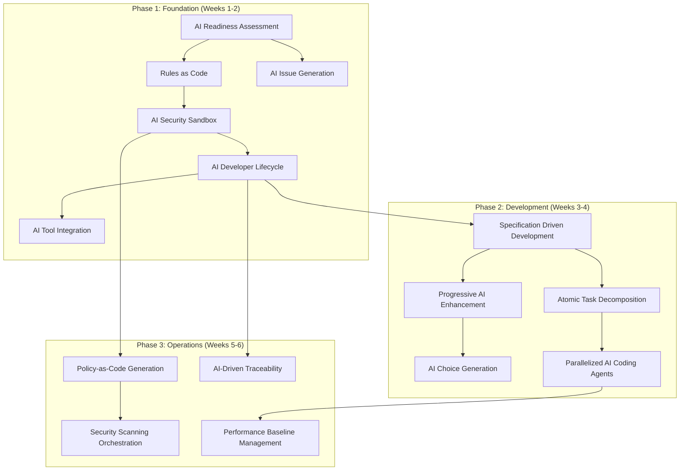
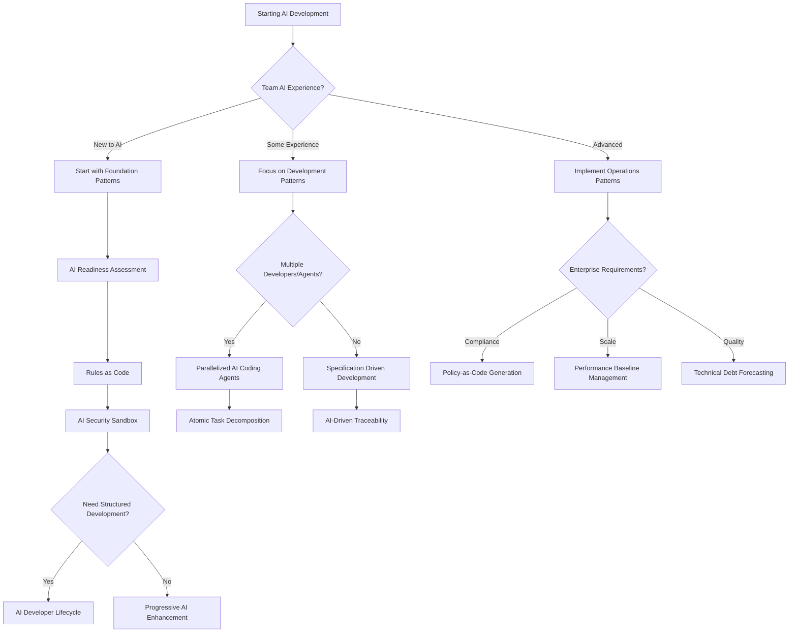

# AI Development Patterns

A comprehensive collection of patterns based on my experience for building software with AI assistance, organized by implementation maturity and development lifecycle phases. These patterns are subject to change as the field evolves.

## Pattern Organization

This repository provides a structured approach to AI-assisted development through three pattern categories:

- **[Foundation Patterns](#foundation-patterns)** - Essential patterns for team readiness and basic AI integration
- **[Development Patterns](#development-patterns)** - Daily practice patterns for AI-assisted coding workflows  
- **[Operations Patterns](#operations-patterns)** - CI/CD, security, and production management with AI
- **[Experimental Patterns](experimental-patterns.md)** - Advanced and experimental patterns under active development

## Pattern Dependencies & Implementation Order

**Important**: These phases represent a **learning progression** for teams new to AI development, not a waterfall approach. Teams with existing DevOps/security expertise should implement patterns continuously across all phases from day one, following a "continuous everything" model.



**Continuous Implementation Note**: Security patterns (AI Security Sandbox, AI Security & Compliance) and deployment patterns should be implemented continuously throughout development, not delayed until specific phases. The dependencies shown represent learning prerequisites, not deployment gates.

## Complete Pattern Reference

| Pattern | Maturity | Type | Description | Dependencies |
|---------|----------|------|-------------|--------------|
| **[AI Readiness Assessment](#ai-readiness-assessment)** | Beginner | Foundation | Systematic evaluation of codebase and team readiness for AI integration | None |
| **[Rules as Code](#rules-as-code)** | Beginner | Foundation | Version and maintain AI coding standards as explicit configuration files | AI Readiness Assessment |
| **[AI Security Sandbox](#ai-security-sandbox)** | Beginner | Foundation | Run AI tools in isolated environments without access to secrets or sensitive data | Rules as Code |
| **[AI Developer Lifecycle](#ai-developer-lifecycle)** | Intermediate | Workflow | Structured 9-stage process from problem definition through deployment with AI assistance | Rules as Code, AI Security Sandbox |
| **[AI Tool Integration](#ai-tool-integration)** | Intermediate | Foundation | Connect AI systems to external data sources, APIs, and tools for enhanced capabilities beyond prompt-only interactions | AI Security Sandbox, AI Developer Lifecycle |
| **[AI Issue Generation](#ai-issue-generation)** | Intermediate | Foundation | Generate Kanban-optimized work items (4-8 hours max) from requirements using AI to ensure continuous flow with clear acceptance criteria and dependencies | AI Readiness Assessment |
| **[Specification Driven Development](#specification-driven-development)** | Intermediate | Development | Use executable specifications to guide AI code generation with clear acceptance criteria before implementation | AI Developer Lifecycle, AI Tool Integration |
| **[Progressive AI Enhancement](#progressive-ai-enhancement)** | Beginner | Development | Build complex features through small, deployable iterations rather than big-bang generation | AI Developer Lifecycle |
| **[AI Choice Generation](#ai-choice-generation)** | Intermediate | Development | Generate multiple implementation options for exploration and comparison rather than accepting first AI solution | Progressive AI Enhancement |
| **[Atomic Task Decomposition](#atomic-task-decomposition)** | Intermediate | Development | Break complex features into atomic, independently implementable tasks for parallel AI agent execution | Progressive AI Enhancement |
| **[Parallelized AI Coding Agents](#parallelized-ai-coding-agents)** | Advanced | Development | Run multiple AI agents concurrently on isolated tasks or environments to maximize development speed and exploration | Atomic Task Decomposition |
| **[AI Knowledge Persistence](#ai-knowledge-persistence)** | Intermediate | Development | Capture successful patterns and failed attempts as versioned knowledge for future sessions | Rules as Code |
| **[Constraint-Based AI Development](#constraint-based-ai-development)** | Beginner | Development | Give AI specific constraints to prevent over-engineering and ensure focused solutions | Progressive AI Enhancement |
| **[Observable AI Development](#observable-ai-development)** | Intermediate | Development | Strategic logging and debugging that makes system behavior visible to AI | AI Developer Lifecycle, AI Tool Integration |
| **[AI-Driven Refactoring](#ai-driven-refactoring)** | Intermediate | Development | Systematic code improvement using AI to detect and resolve code smells with measurable quality metrics | Rules as Code |
| **[AI-Driven Architecture Design](#ai-driven-architecture-design)** | Intermediate | Development | Apply architectural frameworks (DDD, Well-Architected, 12-Factor) using AI to ensure sound system design | AI Developer Lifecycle, Rules as Code |
| **[AI-Driven Traceability](#ai-driven-traceability)** | Intermediate | Development | Maintain automated links between requirements, specifications, tests, implementation, and documentation using AI | AI Developer Lifecycle |
| **Security & Compliance** | | Operations | *Category containing security and compliance patterns* | |
| **[Policy-as-Code Generation](#policy-as-code-generation)** | Advanced | Operations | Transform compliance requirements into executable Cedar/OPA policy files with AI assistance | AI Security Sandbox |
| **[Security Scanning Orchestration](#security-scanning-orchestration)** | Intermediate | Workflow | Aggregate multiple security tools and use AI to summarize findings for actionable insights | Policy-as-Code Generation |
| **Deployment Automation** | | Operations | *Category containing deployment and pipeline patterns* | |
| **Monitoring & Maintenance** | | Operations | *Category containing monitoring and maintenance patterns* | |
| **[Performance Baseline Management](#performance-baseline-management)** | Advanced | Operations | Establish intelligent performance baselines and configure monitoring thresholds automatically | Observable AI Development, AI Tool Integration |

---

## Pattern Maturity Levels

Patterns are classified by implementation complexity and prerequisite knowledge:

**Beginner**: Basic AI tool usage with minimal setup required
- Prerequisites: Basic programming skills, access to AI tools
- Complexity: Single tool usage, straightforward prompts
- Examples: Simple code generation, basic constraint setting

**Intermediate**: Multi-tool coordination and process integration  
- Prerequisites: Development workflow experience, team coordination
- Complexity: Multiple tools, orchestration patterns, quality gates
- Examples: Testing strategies, parallel workflows, choice generation

**Advanced**: Complex systems with enterprise concerns
- Prerequisites: Architecture experience, security/compliance knowledge  
- Complexity: Multi-agent systems, advanced safety, compliance automation
- Examples: Enterprise security, compliance automation, chaos engineering

## Task Sizing Framework

The patterns use different task sizing approaches based on their purpose and context:


**Task Sizing Hierarchy**:

- **AI Issue Generation** (4-8 hours): Standard Kanban work items for continuous flow and rapid feedback
- **Atomic Task Decomposition** (1-2 hours): Ultra-small tasks for parallel agent execution without conflicts
- **Progressive AI Enhancement** (Daily cycles): Deployment-focused iterations that may contain multiple work items

**When to Use Each Approach**:
- Use **AI Issue Generation** for standard team development with human developers
- Use **Atomic Task Decomposition** when implementing with parallel AI agents
- Use **Progressive Enhancement** when prioritizing rapid market feedback over task granularity

**Pattern Differentiation**:
- **AI Issue Generation**: Creates Kanban work items (4-8 hours) for human team workflows
- **Atomic Task Decomposition**: Creates ultra-small tasks (1-2 hours) for parallel AI agents
- **Progressive AI Enhancement**: Creates deployment cycles (daily) focused on user feedback

## Pattern Selection Decision Framework

Choose the right patterns based on your team's context, project requirements, and AI development maturity:

### Decision Tree



### Context-Based Pattern Selection

**For New Teams (First 2 weeks)**:
1. **[AI Readiness Assessment](#ai-readiness-assessment)** - Evaluate current state
2. **[Rules as Code](#rules-as-code)** - Establish consistent standards
3. **[AI Security Sandbox](#ai-security-sandbox)** - Ensure safe experimentation
4. **[Progressive AI Enhancement](#progressive-ai-enhancement)** - Start with simple iterations

**For Development Teams (Weeks 3-8)**:
1. **[AI Developer Lifecycle](#ai-developer-lifecycle)** - Structured development process
2. **[Specification Driven Development](#specification-driven-development)** - Quality-focused development
3. **[AI Issue Generation](#ai-issue-generation)** - Organized work breakdown
4. **[Comprehensive AI Testing Strategy](experimental-patterns.md#comprehensive-ai-testing-strategy)** - Quality assurance

**For Parallel Implementation**:
1. **[Atomic Task Decomposition](#atomic-task-decomposition)** - Ultra-small independent tasks
2. **[AI Workflow Orchestration](experimental-patterns.md#ai-workflow-orchestration)** - Agent coordination
3. **[AI Review Automation](experimental-patterns.md#ai-review-automation)** - Automated integration
4. **[AI Security Sandbox](#ai-security-sandbox)** - Enhanced with parallel safety

**For Enterprise/Production (Month 2+)**:
1. **[Policy-as-Code Generation](#policy-as-code-generation)** - Compliance automation
2. **[Security Scanning Orchestration](#security-scanning-orchestration)** - Integrated security
3. **[Performance Baseline Management](#performance-baseline-management)** - Production monitoring
4. **[Technical Debt Forecasting](experimental-patterns.md#technical-debt-forecasting)** - Proactive maintenance

### Project Type Recommendations

**MVP/Startup Projects**:
- **Primary**: Progressive AI Enhancement, AI Choice Generation
- **Secondary**: AI Security Sandbox, Constraint-Based AI Development  
- **Avoid**: Complex orchestration patterns until scale demands

**Enterprise Applications**:
- **Primary**: AI Developer Lifecycle, Policy-as-Code Generation
- **Secondary**: AI-Driven Traceability, Security Scanning Orchestration
- **Essential**: All foundation patterns before development patterns

**Research/Experimental Projects**:
- **Primary**: AI Choice Generation, Observable AI Development
- **Secondary**: AI Knowledge Persistence, Context Window Optimization
- **Focus**: Learning and exploration over production readiness

**High-Scale Production**:
- **Primary**: Parallelized AI Coding Agents, Performance Baseline Management
- **Secondary**: Chaos Engineering Scenarios, Incident Response Automation
- **Critical**: All security and monitoring patterns

### Team Size Considerations

**Solo Teams**:
- Focus on **Progressive AI Enhancement** and **AI Choice Generation**
- Add **Observable AI Development** for debugging
- Skip parallel orchestration patterns

**Two-Pizza Teams** (small, autonomous teams):
- Implement **AI Issue Generation** for coordination
- Use **Specification Driven Development** for quality
- Consider **AI Tool Integration** for role clarity
- Full **AI Developer Lifecycle** implementation
- **Parallelized AI Coding Agents** for complex features
- **AI-Driven Traceability** for quality gates

**Multi Two-Pizza Team Organizations**:
- **Atomic Task Decomposition** for parallel work across teams
- **AI-Driven Traceability** for coordination at scale
- All **Operations Patterns** for organizational management

### Technology Stack Considerations

**Cloud-Native Applications**:
- Emphasize **Policy-as-Code Generation** and **Compliance Evidence Automation**
- Implement **Drift Detection & Remediation** for infrastructure
- Use **AI-Guided Blue-Green Deployment** for safe releases

**On-Premise Systems**:
- Focus on **AI Security Sandbox** with network isolation
- Implement **AI Knowledge Persistence** for institutional knowledge
- Use **Technical Debt Forecasting** for maintenance planning

**Microservices Architecture**:
- **Parallelized AI Coding Agents** for service coordination
- **Observable AI Development** across service boundaries
- **Performance Baseline Management** for distributed monitoring

**Monolithic Applications**:
- **Progressive AI Enhancement** for gradual modernization
- **AI-Driven Refactoring** for code quality improvement
- **Constraint-Based AI Development** to prevent over-engineering

---

# Foundation Patterns

Foundation patterns establish the essential infrastructure and team readiness required for successful AI-assisted development. These patterns must be implemented first as they enable all subsequent patterns.

## AI Readiness Assessment

**Maturity**: Beginner  
**Description**: Systematic evaluation of codebase and team readiness for AI-assisted development before implementing AI patterns.

**Related Patterns**: [Rules as Code](#rules-as-code), [AI Issue Generation](#ai-issue-generation)

**Assessment Framework**


**Codebase Readiness Checklist**
```markdown
## Code Quality Prerequisites
□ Consistent code formatting and style guide
□ Comprehensive test coverage (>80% for critical paths)
□ Clear separation of concerns and modular architecture
□ Documented APIs and interfaces
□ Version-controlled configuration and secrets management

## Documentation Standards
□ README with setup and development instructions
□ API documentation (OpenAPI/Swagger)
□ Architecture decision records (ADRs)
□ Coding standards and conventions documented
□ Deployment and operational procedures
```

**Anti-pattern: Rushing Into AI**
Starting AI adoption without proper assessment leads to inconsistent practices, security vulnerabilities, and team frustration.

---

## Rules as Code

**Maturity**: Beginner  
**Description**: Treat AI coding standards like infrastructure - version them, evolve them, and make them explicit. Every AI session starts fresh, so without persistent rules, you're teaching AI your preferences from scratch each time.

**Related Patterns**: [AI Developer Lifecycle](#ai-developer-lifecycle), [AI Knowledge Persistence](#ai-knowledge-persistence)

**Standardized Project Structure**
```bash
project/
├── .ai/                          # AI configuration directory
│   ├── rules/                    # Modular rule sets
│   │   ├── security.md          # Security standards
│   │   ├── testing.md           # Testing requirements
│   │   ├── style.md             # Code style guide
│   │   └── architecture.md      # Architectural patterns
│   ├── prompts/                 # Reusable prompt templates
│   │   ├── implementation.md    # Implementation prompts
│   │   ├── review.md            # Code review prompts
│   │   └── testing.md           # Test generation prompts
│   └── knowledge/               # Captured patterns and gotchas
│       ├── successful.md        # Proven successful patterns
│       └── failures.md          # Known failure patterns
├── .cursorrules                 # Cursor IDE configuration
├── CLAUDE.md                    # Claude Code session context
└── .windsurf/                   # Windsurf configuration
    └── rules.md
```

**Anti-pattern: Context Drift**
Each developer maintains their own prompts and preferences, leading to inconsistent code across the team.

---

## AI Security Sandbox

**Maturity**: Beginner  
**Description**: Run AI tools in isolated environments that can't access secrets, credentials, or sensitive data. Essential for preventing credential leaks and maintaining security compliance. When running multiple parallel agents, isolation becomes critical to prevent cross-contamination and coordinate access to shared resources safely.

**Related Patterns**: [AI Security & Compliance](#ai-security--compliance), [Rules as Code](#rules-as-code)

**Default-Deny Network Isolation**
```yaml
# See actual implementation: sandbox/docker-compose.ai-sandbox.yml
# docker-compose.ai-sandbox.yml
version: '3.8'

services:
  ai-development:
    build:
      context: .
      dockerfile: Dockerfile.ai-sandbox
    # Complete network isolation - no egress or ingress
    network_mode: none
    security_opt:
      - no-new-privileges:true
    cap_drop:
      - ALL
    volumes:
      # Read-only source code, read/write tests
      - ./src:/workspace/src:ro
      - ./tests:/workspace/tests:rw
      # DO NOT mount ~/.aws, .env, secrets/, etc.
    environment:
      - NODE_ENV=development
      - AI_SANDBOX=true
    restart: no

# If you need intra-container communication, define an explicit internal network:
# networks:
#   ai-isolated:
#     driver: bridge
#     internal: true
```

**What Default-Deny Accomplishes**

- **`network_mode: none`** cuts off ALL network access - no DNS, no HTTP, no callbacks
- AI gets a fully functional environment for code generation and testing with zero risk of credential exfiltration
- No "phone home" capabilities, no data leaks, no accidental API calls with embedded secrets
- If inter-container communication is needed (e.g., mock services), use an explicit internal-only bridge network
- Pair with Rules-as-Code to enforce these isolation settings in CI/CD pipelines

**Result**: AI assistance lives in a complete network vault. Secrets stay put. Compliance stays intact.

**Parallel Agent Isolation**

**Parallel Agent Isolation** requires additional safety measures:

```yaml
services:
  ai-agent-backend:
    network_mode: none                    # Complete network isolation
    volumes:
      - ./src/backend:/workspace:ro       # Read-only source access
      - ./workspace/agent-1:/output:rw    # Isolated output workspace
    environment:
      - AGENT_ID=backend-specialist
      - MAX_EXECUTION_TIME=7200           # 2-hour timeout
    cap_drop: [ALL]                       # Drop all capabilities
    ulimits: {nproc: 256, nofile: 1024}   # Resource constraints
```

**Complete Implementation**: See [sandbox/docker-compose.parallel-ai-sandbox.yml](sandbox/docker-compose.parallel-ai-sandbox.yml) for full multi-agent isolation with coordination service, conflict detection, and resource monitoring.

**Cross-Agent Resource Protection**

```bash
acquire_lock() {
    local resource_path="$1"
    local agent_id="$2"
    # Atomic lock using shell's noclobber (set -C)
    if (set -C; echo "$agent_id" > "$lock_file") 2>/dev/null; then
        return 0  # Lock acquired
    else
        return 1  # Resource locked by another agent
    fi
}

# Usage: Prevent concurrent package.json modifications
if acquire_lock "package.json" "$AGENT_ID"; then
    modify_package_json && release_lock "package.json" "$AGENT_ID"
fi
```

**Complete Implementation**: See [examples/parallelized-ai-agents/](examples/parallelized-ai-agents/) for full resource locking system with timeout handling, deadlock detection, and automatic lock cleanup.

**Agent Communication Security**

```yaml
# .ai/parallel-safety/agent-communication.yml
communication_rules:
  allowed_channels:
    - "file_system_workspace"  # Agents can write to separate workspace dirs
    - "coordination_api"       # Structured API for status updates
  
  forbidden_channels:
    - "direct_network"         # No agent-to-agent network communication
    - "shared_memory"          # No shared memory segments
    - "process_signals"        # No inter-process signaling
    
  message_format:
    type: "structured_json"
    schema: "/schemas/agent-message.json"
    encryption: "not_required"  # Internal coordination only
    
  coordination_api:
    endpoint: "http://coordinator:8080/api/v1"
    authentication: "agent_token"
    rate_limit: "10_requests_per_minute"
    timeout: "30_seconds"
```

**Parallel Safety Monitoring**

```python
class ParallelSafetyMonitor:
    def monitor_resource_conflicts(self):
        """Detect when multiple agents try to modify same files"""
        # Check file access patterns across agent workspaces
        # Log violations when concurrent access detected
        
    def check_resource_limits(self):
        """Monitor resource usage per agent container"""
        # Monitor memory (512MB limit) and CPU (80% limit)
        # Alert on threshold breaches
        
    def report_violations(self):
        """Report safety violations and trigger emergency shutdown if needed"""
        # Generate violation report, alert coordination service
        # Return False to trigger agent shutdown on critical violations
```

**Complete Implementation**: See [examples/parallelized-ai-agents/](examples/parallelized-ai-agents/) for full parallel safety monitoring system with Docker API integration, resource tracking, and automated emergency shutdown procedures.

**Emergency Agent Shutdown**

```bash
# emergency-shutdown.sh
#!/bin/bash
# Emergency shutdown for parallel agents

shutdown_all_agents() {
    echo "EMERGENCY: Shutting down all AI agents"
    
    # Stop all agent containers
    docker-compose -f docker-compose.parallel-ai-sandbox.yml down --timeout 10
    
    # Kill any runaway processes
    pkill -f "ai-agent"
    
    # Clear shared workspaces
    rm -rf /workspace/agent-*/
    
    # Archive logs for investigation
    tar -czf "/logs/emergency-shutdown-$(date +%s).tar.gz" /workspace/logs/
    
    echo "All agents shut down. Workspace cleared."
}

# Monitor for safety violations
if [[ -f "/workspace/safety-violations.json" ]]; then
    violation_count=$(jq '.violations | length' /workspace/safety-violations.json)
    if [[ $violation_count -gt 5 ]]; then
        shutdown_all_agents
    fi
fi
```

**Anti-pattern: Unrestricted Access**
Allowing AI tools full system access risks credential leaks, data breaches, and security compliance violations.

**Anti-pattern: Shared Agent Workspaces**
Allowing multiple parallel agents to write to the same directories creates race conditions, file conflicts, and unpredictable behavior that can corrupt the development environment.

---

## AI Developer Lifecycle

**Maturity**: Intermediate  
**Description**: Structured 9-stage process from problem definition through deployment with AI assistance.

**Related Patterns**: [Rules as Code](#rules-as-code), [Specification Driven Development](#specification-driven-development), [Observable AI Development](#observable-ai-development)

**Workflow Interaction Sequence**


**Core Workflow Implementation**

```bash
# Stage 1-3: Problem → Plan → Requirements
ai "Analyze request → Generate architecture, tasks, API specs"

# Stage 4-5: Issues → Specifications  
ai "Generate executable tests → Gherkin scenarios, API tests, security tests"

# Stage 6: Implementation
ai "Implement following specifications → Use tests as guide, security best practices"

# Stage 7-9: Testing → Deployment → Monitoring  
ai "Complete QA → Run tests, security scan, deploy, monitor"
```

**Complete Implementation**: See [examples/ai-development-lifecycle/](examples/ai-development-lifecycle/) for full 9-stage workflow scripts, detailed prompts for each stage, and integration with CI/CD pipelines.

**Anti-pattern: Ad-Hoc AI Development**
Jumping straight to coding with AI without proper planning, requirements, or testing strategy.

---

## AI Tool Integration

**Maturity**: Intermediate  
**Description**: Connect AI systems to external data sources, APIs, and tools for enhanced capabilities beyond prompt-only interactions.

**Related Patterns**: [AI Security Sandbox](#ai-security-sandbox), [AI Developer Lifecycle](#ai-developer-lifecycle), [Observable AI Development](#observable-ai-development)

**Core Concept**

Modern AI development requires more than chat-based interactions. AI systems become significantly more capable when connected to real-world data sources and tools. This pattern demonstrates the architectural shift from isolated prompt-only AI to tool-augmented AI systems.

**Implementation Overview**

```python
# Core tool-augmented AI system with security controls
class ToolAugmentedAI:
    def __init__(self, config_path: str = ".ai/tools.json"):
        self.available_tools = {
            "database_query": self._query_database,     # Read-only SQL queries
            "file_operations": self._file_operations,   # Controlled file access
            "api_requests": self._api_requests,         # Allowlisted HTTP requests
            "system_info": self._system_info            # Safe system information
        }
    
    def execute_with_tools(self, ai_request: str, tool_calls: list) -> dict:
        """Execute AI request with secure tool access"""
        # Process tool calls with security validation
        # Return structured results with error handling
```

**Tool Categories & Security**

- **Database Access**: Read-only queries with operation whitelisting (`SELECT`, `WITH` only)
- **File Operations**: Path-restricted read/write within configured directories
- **API Integration**: HTTP requests limited to allowlisted domains with timeouts
- **System Information**: Safe environment data without sensitive details

**Configuration Example**
```json
{
  "allowed_apis": ["api.github.com", "api.openweathermap.org"],
  "file_access_paths": ["./data/", "./logs/", "./generated/"],
  "max_query_results": 100,
  "security": {
    "read_only_database": true,
    "api_rate_limits": true,
    "file_size_limits": "10MB"
  }
}
```

**Model Context Protocol (MCP) Integration**

This pattern can be implemented using [Anthropic's Model Context Protocol (MCP)](https://www.anthropic.com/news/model-context-protocol) for standardized tool integration across AI systems:

```json
{
  "mcp_servers": {
    "filesystem": {
      "command": "npx",
      "args": ["@modelcontextprotocol/server-filesystem", "./data"]
    },
    "sqlite": {
      "command": "npx",
      "args": ["@modelcontextprotocol/server-sqlite", "app_data.db"]
    }
  }
}
```

**What Tool Integration Enables**

- **Real-time data access**: AI queries current database state, not training data
- **File system interaction**: Read logs, write generated code, manage project files
- **API integration**: Fetch live data from external services and APIs
- **System awareness**: Access to current environment state and configuration
- **Enhanced context**: AI decisions based on actual system state, not assumptions

**Complete Implementation**

See [examples/ai-tool-integration/](examples/ai-tool-integration/) for:
- Full Python implementation with security controls
- Configuration examples and MCP integration
- Usage patterns and deployment guidelines
- Integration with AI Security Sandbox

**Anti-pattern: Prompt-Only AI Development**
Attempting to solve complex data analysis, system integration, or real-time problems using only natural language prompts without providing AI access to actual data sources, APIs, or system tools. This leads to hallucinated responses, outdated information, and inability to interact with real systems.

---


## AI Issue Generation

**Maturity**: Intermediate  
**Description**: Generate structured work items optimized for Kanban flow using AI to break down features into small, rapidly completable tasks (4-8 hours max) with clear acceptance criteria and dependencies. Focus on continuous flow rather than batch estimation.

**Related Patterns**: [AI Readiness Assessment](#ai-readiness-assessment), [Specification Driven Development](#specification-driven-development)

**Issue Generation Framework**


**Examples**

**Input: High-level requirement**
```markdown
## Feature Request
"Users need to be able to reset their passwords via email"
```

**AI Prompt for Kanban-Ready Task Generation**
```bash
ai "Break down this feature into small Kanban tasks:

Feature: Password reset via email

Create GitHub issues following Kanban principles:
- Ensure each task can be completed in less than a day
- Clear titles and descriptions
- Specific acceptance criteria
- Labels (frontend, backend, testing)
- Dependencies between tasks
- If any task takes >2 days, split it further

Format as JSON for GitHub API import."
```

**Generated Kanban-Ready Issues**
```json
{
  "title": "Backend: Implement password reset token generation",
  "body": "## Acceptance Criteria\n- [ ] Generate secure reset tokens\n- [ ] Set 15-minute expiration\n## Cycle Time Target\n8-12 hours",
  "labels": ["backend", "security", "kanban-ready"],
  "milestone": "Password Reset MVP"
}
```

**Complete Implementation**: See [examples/ai-issue-generation/](examples/ai-issue-generation/) for full Kanban issue templates, GitHub API integration scripts, and JIRA workflow automation.

**Kanban Epic Breakdown**
```bash
ai "Break down this epic for optimal Kanban flow:

Epic: User Dashboard with Analytics

Kanban task requirements:
- Maximum 4-8 hours per task (1 day)
- If a task would take longer, split it
- Each task independently deployable
- Focus on flow over estimates

Break down into:
- Database migrations (each table/index separately)
- Individual API endpoints (one endpoint per task)
- UI components (one component per task)
- Test suites (by feature area)
- Security checks (per component)
- Performance optimizations (targeted improvements)

Goal: Continuous flow with rapid feedback cycles."
```

**Integration with Project Management**
```bash
# GitHub Issues
gh issue create --title "$(echo "$issue" | jq -r '.title')" \
                --body "$(echo "$issue" | jq -r '.body')" \
                --label "$(echo "$issue" | jq -r '.labels[]')"

# JIRA Integration
curl -X POST "$JIRA_API/issue" \
  -H "Content-Type: application/json" \
  -d "$jira_issue_json"

# Azure DevOps
az boards work-item create --title "$title" \
                          --type "User Story" \
                          --description "$description"
```

**Kanban Work Item Splitting**
```bash
ai "Apply Kanban principles to split these work items:

Kanban splitting rules:
- Maximum cycle time: 4-8 hours (1 day)
- If >8 hours, must split into smaller items
- Each item independently deployable
- Measure actual cycle time, not estimates

Historical cycle times for reference:
- Authentication token generation: 8 hours
- Email template setup: 4 hours
- Password reset form: 4 hours  
- API endpoint creation: 6 hours
- Database migration: 3 hours per table

For each task:
1. Can it be completed in <8 hours?
2. If no, how to split it?
3. What's the smallest valuable increment?

Remember: Flow over estimates, rapid feedback over perfect planning."
```

> "If a task takes more than one day, split it."  
> – Kanban Guide, Lean Kanban University

> "Small, frequent deliveries expose issues early and keep teams aligned."  
> – Agile Alliance, Kanban Glossary

**Anti-pattern: Vague Issue Generation**
Creating generic tasks without specific acceptance criteria, proper sizing, or clear dependencies leads to scope creep and estimation errors.

**Anti-pattern Examples:**
```markdown
❌ "Fix the login page"
❌ "Make the dashboard better" 
❌ "Add some tests"

✅ "Add OAuth 2.0 token validation endpoint (8 hours)"
✅ "Implement dashboard metric WebSocket connection (6 hours)"
✅ "Write unit tests for user service login method (4 hours)"
```

---

# Development Patterns

Development patterns provide tactical approaches for day-to-day AI-assisted coding workflows, focusing on quality, maintainability, and team collaboration.

## Specification Driven Development

**Maturity**: Intermediate  
**Description**: Use machine-readable specifications with authority levels and rigorous Test-Driven Development (TDD) to guide AI code generation. Write persistent specifications first, then use ephemeral prompts to implement solutions that satisfy those specifications.

**Core Principle: Precision Enables Productivity**

SpecDriven AI combines three key elements:
- **Machine-readable specifications** with unique identifiers and authority levels
- **Rigorous Test-Driven Development** with coverage tracking and automated validation
- **AI-powered implementation** with persistent context through structured specifications

**Key Innovation: Authority Level System**

Specifications use authority levels to resolve conflicts and establish precedence:
- **`authority=system`**: Core business logic and security requirements (highest precedence)
- **`authority=platform`**: Infrastructure and technical architecture decisions  
- **`authority=feature`**: User interface and experience requirements (lowest precedence)

When requirements conflict, higher authority levels take precedence, enabling clear decision-making for AI implementation.

**Related Patterns**: [AI Developer Lifecycle](#ai-developer-lifecycle), [AI Tool Integration](#ai-tool-integration), [Comprehensive AI Testing Strategy](experimental-patterns.md#comprehensive-ai-testing-strategy), [Observable AI Development](#observable-ai-development)

**SpecDriven AI Workflow**


**Core Implementation**

**Machine-Readable Specification with Authority Levels**
```markdown
# IAM Policy Generator Specification {#iam_policy_gen}

## CLI Requirements {#cli_requirements authority=system}
The system MUST provide a command-line interface that:
- Accepts policy type via `--policy-type` flag
- Validates input parameters against AWS IAM constraints
- Generates syntactically correct IAM policy JSON [^test_iam_syntax]
- Returns exit code 0 for success, 1 for validation errors

## Input Validation {#input_validation authority=platform}  
The system MUST:
- Reject invalid AWS service names with clear error messages
- Validate resource ARN format before policy generation
- Implement rate limiting for API calls [^test_rate_limit]

[^test_iam_syntax]: tests/test_iam_policy_syntax.py
[^test_rate_limit]: tests/test_rate_limiting.py
```

**Automated Coverage Tracking**
```bash
# Run specification compliance validation
pytest --cov=src --cov-report=html --spec-coverage
python spec_validator.py --check-coverage --authority-conflicts

# Output shows specification coverage
# Specification Coverage Report:
# ✅ cli_requirements: 100% (3/3 tests linked)
# ✅ input_validation: 85% (6/7 tests linked) 
# ⚠️  Missing test: [^test_malformed_arn] in line 23
```

**Tooling Integration**

```bash
# Pre-commit hook validates specification compliance
# .pre-commit-config.yaml
repos:
  - repo: local
    hooks:
      - id: spec-coverage
        name: Specification Coverage Check
        entry: python spec_validator.py --check-coverage
        language: python
        pass_filenames: false

# Git workflow with specification traceability  
git commit -m "feat: implement rate limiting [spec:rl2c]
  
Implements rate limiting requirement from input_validation
section. Closes specification anchor #failed_auth.

Coverage: 94% (31/33 spec requirements covered)"
```

**Key Benefits**
- **Authority-based conflict resolution** prevents requirement ambiguity
- **Automated coverage tracking** ensures no specifications are missed
- **AI tool independence** through persistent, machine-readable requirements
- **Precise traceability** from specification anchors to test implementations
- **Living documentation** that evolves with the system

**Complete Implementation**

See [examples/specification-driven-development/](examples/specification-driven-development/) for:
- Complete IAM Policy Generator implementation
- spec_validator.py tool for automated compliance checking
- Pre-commit hooks and Git workflow integration
- Full specification examples with authority levels
- Coverage tracking and reporting tools

**Anti-pattern: Implementation-First AI**
Writing code with AI first, then trying to retrofit tests, resulting in tests that mirror implementation rather than specify behavior.

**Anti-pattern: Prompt Hoarding**
Saving collections of prompts as if they were specifications. Prompts are implementation details; specifications are behavioral contracts.

---


## Progressive AI Enhancement

**Maturity**: Beginner  
**Description**: Build complex features through small, deployable iterations with daily deployment cycles. Each AI interaction adds one specific enhancement rather than trying to build everything at once. Focus on rapid market feedback over granular task breakdown.

**Related Patterns**: [AI Developer Lifecycle](#ai-developer-lifecycle), [Constraint-Based AI Development](#constraint-based-ai-development), [AI Choice Generation](#ai-choice-generation), [AI-Driven Architecture Design](#ai-driven-architecture-design)

**Examples**
Building authentication progressively:
```bash
# Day 1: Minimal login
"Create POST /login that returns 200 for admin/admin, 401 otherwise"
→ Deploy

# Day 2: Real password check
"Modify login to check passwords against users table. Keep existing API."
→ Deploy

# Day 3: Add security
"Add bcrypt hashing to login. Support both hashed and plain passwords temporarily."
→ Deploy

# Day 4: Modern tokens
"Replace session with JWT. Keep session endpoint for backward compatibility."
→ Deploy
```

**When to Use Progressive AI Enhancement**

- **MVP Development**: When you need to get to market quickly with minimal features
- **Uncertain Requirements**: When requirements are likely to change based on user feedback  
- **Risk Mitigation**: When you want to reduce the risk of large, complex implementations
- **Continuous Delivery**: When you have automated deployment and want rapid iterations
- **Learning Projects**: When the team is learning new technologies or domains

**Anti-pattern: Big Bang Generation**
Asking AI to "create a complete user management system" results in 5000 lines of coupled, untested code that takes days to review and debug.

---

## AI Choice Generation

**Maturity**: Intermediate  
**Description**: Generate multiple implementation options for exploration and comparison rather than accepting the first AI solution.

**Related Patterns**: [Progressive AI Enhancement](#progressive-ai-enhancement), [Context Window Optimization](experimental-patterns.md#context-window-optimization)

**Multi-Option Implementation Comparison**

```bash
# Generate and compare multiple implementation approaches
ai "Generate 3 different authentication approaches for user management:

Option 1 (Performance-focused):
- In-memory JWT with Redis caching
- Sub-10ms token validation, horizontal scaling ready
- Trade-off: Memory intensive, Redis dependency
- Best for: High-traffic APIs (>10k req/sec)

Option 2 (Security-focused):
- Database-backed sessions with audit trail
- Immediate revocation, multi-factor authentication
- Trade-off: Higher latency, complex session management
- Best for: Banking, healthcare, government

Option 3 (Simplicity-focused):
- Standard JWT with established libraries
- Well-documented patterns, minimal custom code
- Trade-off: Less optimization opportunities
- Best for: Startups, MVPs, small teams

For each option provide:
- 30-minute working prototype
- Performance benchmarks (response time, memory usage)
- Implementation complexity assessment (LOC, dependencies)
- Specific trade-offs and when to choose this approach

Recommend best option based on project constraints and team experience."
```

**Anti-pattern: Analysis Paralysis**
Generating too many choices or spending more time evaluating options than implementing them.

---


## Parallelized AI Coding Agents

**Maturity**: Advanced  
**Description**: Run multiple AI agents concurrently on isolated tasks or environments to maximize development speed and exploration.

**Related Patterns**: [AI Workflow Orchestration](experimental-patterns.md#ai-workflow-orchestration), [Atomic Task Decomposition](#atomic-task-decomposition), [AI Security Sandbox](#ai-security-sandbox)

**Agent Coordination Lifecycle**


**Container-Based Agent Isolation**
```yaml
# docker-compose.parallel-agents.yml
version: '3.8'

services:
  agent-1:
    image: ai-dev-environment:latest
    container_name: agent-feature-auth
    volumes:
      - ./feature-auth:/workspace:rw
      - shared-memory:/shared:ro
    environment:
      - AGENT_ID=auth-feature
      - TASK_ID=implement-oauth2
    networks:
      - agent-network

  agent-2:
    image: ai-dev-environment:latest
    container_name: agent-feature-api
    volumes:
      - ./feature-api:/workspace:rw
      - shared-memory:/shared:ro
    environment:
      - AGENT_ID=api-feature
      - TASK_ID=implement-rest-endpoints
    networks:
      - agent-network

  agent-3:
    image: ai-dev-environment:latest
    container_name: agent-tests
    volumes:
      - ./tests:/workspace:rw
      - shared-memory:/shared:ro
    environment:
      - AGENT_ID=test-suite
      - TASK_ID=generate-integration-tests
    networks:
      - agent-network

volumes:
  shared-memory:
    driver: local

networks:
  agent-network:
    driver: bridge
    internal: true
```

**Git Worktree Parallelization**
```bash
# Create parallel worktrees for agent isolation
git worktree add -b agent/auth ../agent-auth
git worktree add -b agent/api ../agent-api
git worktree add -b agent/tests ../agent-tests

# Launch agents in separate worktrees
parallel --jobs 3 << EOF
cd ../agent-auth && ai-agent implement-oauth2
cd ../agent-api && ai-agent implement-rest-endpoints
cd ../agent-tests && ai-agent generate-integration-tests
EOF

# Review and merge completed work
git worktree list
for worktree in agent-auth agent-api agent-tests; do
  cd ../$worktree
  git diff main
  git push origin agent/$worktree
done

# Clean up worktrees after merging
git worktree remove ../agent-auth
git worktree remove ../agent-api
git worktree remove ../agent-tests
```

**Shared Memory Architecture**
```python
class AgentMemory:
    def record_learning(self, agent_id, key, value):
        """Record discovered patterns with thread-safe file locking"""
        # Use fcntl.flock() for atomic file operations
        # Store timestamped learning entries per agent
        
    def get_shared_knowledge(self):
        """Retrieve consolidated knowledge from all agents"""
        # Return shared memory accessible to all parallel agents
        # Enable knowledge transfer between agent sessions
```

**Complete Implementation**: See [examples/parallelized-ai-agents/](examples/parallelized-ai-agents/) for full shared memory system with file locking, conflict resolution, and agent session persistence.

**Parallel Task Distribution**
```yaml
# tasks.yaml - Define parallel tasks for agents
tasks:
  - id: auth-service
    agent_count: 1
    isolation: container
    dependencies: []
    instructions: |
      Implement OAuth2 authentication service with:
      - JWT token generation
      - Refresh token flow
      - User session management
    
  - id: api-endpoints
    agent_count: 2
    isolation: worktree
    dependencies: [auth-service]
    instructions: |
      Implement REST API endpoints:
      Agent 1: User management endpoints
      Agent 2: Resource CRUD endpoints
    
  - id: test-generation
    agent_count: 3
    isolation: container
    dependencies: []
    instructions: |
      Generate comprehensive test suites:
      Agent 1: Unit tests for auth service
      Agent 2: Integration tests for API
      Agent 3: End-to-end test scenarios
```

**Conflict Resolution Strategy**
```bash
#!/bin/bash
# merge-parallel-work.sh

# Automated conflict detection and resolution
for branch in $(git branch -r | grep 'agent/'); do
  echo "Checking $branch for conflicts..."
  
  # Create temporary merge branch
  git checkout -b temp-merge main
  
  # Attempt merge
  if git merge --no-commit --no-ff $branch; then
    echo "✓ No conflicts in $branch"
    git merge --abort
  else
    echo "⚠ Conflicts detected in $branch"
    
    # Use AI to suggest resolution
    git diff --name-only --diff-filter=U | while read file; do
      echo "Analyzing conflict in $file..."
      ai-agent resolve-conflict $file
    done
  fi
  
  git checkout main
  git branch -D temp-merge
done
```

**Source**: [AI Native Dev - How to Parallelize AI Coding Agents](https://ainativedev.io/news/how-to-parallelize-ai-coding-agents)

**Anti-pattern: Uncoordinated Parallel Execution**
Running multiple agents without isolation, shared memory, or conflict resolution leads to:
- Race conditions when agents modify the same files
- Lost work from merge conflicts
- Inconsistent implementations across features
- Resource contention and system instability

---


## AI Knowledge Persistence

**Maturity**: Intermediate  
**Description**: Capture successful patterns and failed attempts as versioned knowledge for future AI sessions to accelerate development and avoid repeating mistakes.

**Related Patterns**: [Rules as Code](#rules-as-code), [AI-Driven Traceability](#ai-driven-traceability)

**Core Implementation**

```bash
# Simple knowledge structure
mkdir -p .ai/knowledge/{patterns,failures,gotchas}

# Capture working prompts immediately
echo "### JWT Auth (95% success)" >> .ai/knowledge/patterns/auth.md
echo "Prompt: 'JWT with RS256, 15min access, 7day refresh in httpOnly cookie'" >> .ai/knowledge/patterns/auth.md
echo "Context: Node.js APIs" >> .ai/knowledge/patterns/auth.md
echo "" >> .ai/knowledge/patterns/auth.md

# Document failures to avoid repeating
echo "### ❌ 'Make auth secure'" >> .ai/knowledge/failures/auth.md  
echo "Too vague - AI adds OAuth + sessions + JWT complexity" >> .ai/knowledge/failures/auth.md
echo "Better: Specify exact requirements" >> .ai/knowledge/failures/auth.md
```

**High-Impact Knowledge Templates**

```markdown
# .ai/knowledge/patterns/auth.md
### JWT Auth (95% success)
**Prompt**: "JWT with RS256, 15min access, 7day refresh in httpOnly cookie"
**Context**: Node.js APIs
**Gotcha**: AI defaults to insecure HS256 - always specify RS256

### Password Hash (90% success)  
**Prompt**: "bcrypt with salt rounds=12, async/await, bcrypt.compare for validation"
**Gotcha**: AI uses deprecated hashSync - specify async

# .ai/knowledge/failures/auth.md
### ❌ "Make auth secure"
**Problem**: Too vague → AI adds OAuth + sessions + JWT complexity
**Fix**: Specify exact requirements

# .ai/knowledge/patterns/api.md
### REST CRUD (85% success)
**Prompt**: "REST API: GET/POST/PUT/DELETE /users, 200/201/400/404 codes, validate input"
**Gotcha**: AI over-engineers responses - provide exact JSON format
```

**Knowledge Maintenance**

```bash
# Quick review: find stale knowledge (>3 months old)
find .ai/knowledge -name "*.md" -mtime +90

# Track most-used patterns
grep -r "### " .ai/knowledge/patterns/ | cut -d: -f2 | sort | uniq -c | sort -nr | head -5
```

**Anti-pattern: Knowledge Hoarding**

Creating extensive knowledge bases that become maintenance burdens instead of accelerating development through selective, actionable knowledge capture.

**Why it's problematic:**
- Knowledge bases become outdated and misleading
- Developers spend more time documenting than developing
- Overly detailed entries are ignored in favor of quick experimentation
- Knowledge becomes siloed and not easily discoverable

**Signs of Knowledge Hoarding:**
- Knowledge files haven't been accessed in months
- Entries are extremely detailed but rarely referenced
- Multiple overlapping knowledge bases with conflicting information
- Knowledge capture takes longer than the original development work

**Instead, focus on:**
- Capture only high-impact patterns (>80% success rate)
- Document failures that wasted significant time (>30 minutes)
- Keep entries concise and immediately actionable
- Review and prune knowledge quarterly

```bash
# Good: Focused, actionable knowledge
echo "### JWT Auth Success" >> .ai/knowledge/auth.md
echo "Prompt: 'JWT with RS256, 15min expiry' - 95% success" >> .ai/knowledge/auth.md

# Bad: Exhaustive documentation  
echo "### Complete JWT Implementation Guide" >> .ai/knowledge/auth.md
echo "Full JWT specification with 47 configuration options..." >> .ai/knowledge/auth.md
```

---

## Constraint-Based AI Development

**Maturity**: Beginner  
**Description**: Give AI specific constraints to prevent over-engineering and ensure focused solutions.

**Related Patterns**: [Progressive AI Enhancement](#progressive-ai-enhancement), [Human-AI Handoff Protocol](experimental-patterns.md#human-ai-handoff-protocol), [AI Choice Generation](#ai-choice-generation)

**Examples**
```
Bad: "Create user service"
Good: "Create user service: <100 lines, 3 methods max, only bcrypt dependency"

Bad: "Add caching"
Good: "Add caching using Map, max 1000 entries, LRU eviction"

Bad: "Improve performance"
Good: "Reduce p99 latency to <50ms without new dependencies"
```

---

## Atomic Task Decomposition

**Maturity**: Intermediate  
**Description**: Break complex features into atomic, independently implementable tasks (1-2 hours) that can be parallelized across multiple AI agents. Each task should be completable in isolation without dependencies on concurrent work. Use this pattern when implementing with parallel agents; for standard team development, use AI Issue Generation (4-8 hour tasks).

**Related Patterns**: [AI Workflow Orchestration](experimental-patterns.md#ai-workflow-orchestration), [Progressive AI Enhancement](#progressive-ai-enhancement), [AI Issue Generation](#ai-issue-generation)

**Atomic Task Criteria**


**Decomposition Examples**

```bash
# Feature: User Authentication System
# Bad: Single monolithic task
❌ "Implement complete user authentication with JWT, password hashing, rate limiting, and email verification"

# Good: Atomic task breakdown
✅ ai_decompose "Break down user authentication into atomic tasks:

Task 1: Password validation service
- Input: plain text password, validation rules
- Output: validation result object
- No dependencies on other authentication components
- Time estimate: 1.5 hours

Task 2: JWT token generation service  
- Input: user ID, role, expiration config
- Output: signed JWT token
- Independent crypto operations only
- Time estimate: 1 hour

Task 3: Rate limiting middleware
- Input: request metadata, rate limit config
- Output: allow/deny decision
- No user data dependencies
- Time estimate: 2 hours

Task 4: Login endpoint controller
- Input: credentials, dependencies from tasks 1-3
- Output: HTTP response with token or error
- Integration task (runs after 1-3 complete)
- Time estimate: 1 hour"
```

**Parallel Agent Assignment**

```yaml
# .ai/task-assignment.yml
authentication_feature:
  tasks:
    - id: "auth-001"
      name: "Password validation service"
      agent: "backend-specialist-1"
      dependencies: []
      estimated_hours: 1.5
      
    - id: "auth-002" 
      name: "JWT token generation"
      agent: "security-specialist"
      dependencies: []
      estimated_hours: 1
      
    - id: "auth-003"
      name: "Rate limiting middleware"
      agent: "backend-specialist-2" 
      dependencies: []
      estimated_hours: 2
      
    - id: "auth-004"
      name: "Login endpoint integration"
      agent: "integration-specialist"
      dependencies: ["auth-001", "auth-002", "auth-003"]
      estimated_hours: 1
      
  coordination:
    parallel_execution: ["auth-001", "auth-002", "auth-003"]
    sequential_after: ["auth-004"]
    sync_points:
      - after_parallel_completion
      - before_integration_testing
```

**Atomic Task Validation**

```bash
# Validate tasks meet atomic criteria
ai_task_validator "Review task breakdown for authentication feature:

Validation criteria:
1. Each task completable in <2 hours
2. No shared mutable state between parallel tasks  
3. Clear input/output contracts defined
4. Testable in isolation
5. No circular dependencies

For each task that fails validation:
- Explain why it's not atomic
- Suggest how to split it further
- Recommend dependency restructuring"

# Example validation output
✓ auth-001: Password validation - ATOMIC (isolated function, clear I/O)
✓ auth-002: JWT generation - ATOMIC (crypto operation, no external deps)  
✗ auth-003: Rate limiting - NOT ATOMIC (requires shared cache, >2hr estimate)
  → Split: 3a) Rate limit logic, 3b) Cache integration
✓ auth-004: Integration - ATOMIC (assembly task with clear dependencies)
```

**Task Interface Contracts**

```python
class TaskContract:
    def validate_atomic(self) -> bool:
        """Validate task meets atomic criteria"""
        return all([
            len(self.side_effects) == 0,    # No side effects
            self.estimated_hours <= 2,      # Rapid completion
            self.has_clear_io_contract()    # Testable interface
        ])

# Example: Password validation task contract
task = TaskContract("auth-001")
task.inputs = {"password": str, "rules": PasswordRules}  
task.outputs = {"is_valid": bool, "errors": List[str]}
```

**Complete Implementation**: See [examples/atomic-task-decomposition/](examples/atomic-task-decomposition/) for full contract validation system, task dependency resolution, and parallel execution coordination.

**When to Use Atomic Task Decomposition**

- **Parallel Agent Implementation**: When using multiple AI agents simultaneously
- **Complex Feature Development**: Large features that can benefit from parallel work
- **Time-Critical Projects**: When faster delivery through parallelization is essential
- **Team Scaling**: When you need to distribute work across multiple developers/agents
- **Risk Mitigation**: When you want to reduce the blast radius of individual task failures

**Benefits of Atomic Decomposition**

1. **Parallel Execution**: Independent tasks can run simultaneously across multiple agents
2. **Rapid Feedback**: 1-2 hour tasks provide quick validation cycles
3. **Conflict Prevention**: No shared state eliminates merge conflicts
4. **Clear Testing**: Each atomic task has testable inputs/outputs
5. **Easy Recovery**: Failed tasks can be retried without affecting others
6. **Progress Visibility**: Fine-grained progress tracking and estimation

**Anti-pattern: Pseudo-Atomic Tasks**
Creating tasks that appear independent but secretly share state, require specific execution order, or have hidden dependencies on other concurrent work.

**Anti-pattern: Over-Decomposition**  
Breaking tasks so small that coordination overhead exceeds the benefits of parallelization, leading to more complexity than value.

---

## Observable AI Development

**Maturity**: Intermediate  
**Description**: Design systems with comprehensive logging, tracing, and debugging capabilities that enable AI to understand system behavior and diagnose issues effectively.

**Related Patterns**: [AI Developer Lifecycle](#ai-developer-lifecycle), [AI Tool Integration](#ai-tool-integration), [Comprehensive AI Testing Strategy](experimental-patterns.md#comprehensive-ai-testing-strategy), [AI-Driven Traceability](#ai-driven-traceability)

**Core Implementation**

```python
import logging
import json
from datetime import datetime

# AI-friendly structured logging
def log_operation(operation, **context):
    logging.info(json.dumps({
        "timestamp": datetime.utcnow().isoformat(),
        "operation": operation,
        "context": context
    }))

# Observable business logic
def process_order(order):
    log_operation("order_start", order_id=order.id, total=order.total)
    
    try:
        log_operation("validation_start")
        validate_order(order)
        log_operation("validation_success")
        
        log_operation("payment_start", method=order.payment_method)
        result = charge_payment(order)
        log_operation("payment_success", transaction_id=result.transaction_id)
        
        return result
        
    except ValidationError as e:
        log_operation("validation_error", field=e.field, error=str(e))
        raise
    except PaymentError as e:
        log_operation("payment_error", error=str(e), code=e.code)
        raise
```

**Debug Helper for AI Analysis**

```bash
# Extract relevant logs for AI debugging
grep -A5 -B5 "ERROR\|payment_error\|validation_error" app.log | tail -20
```

**Performance Monitoring**

```python
import time

def monitor_performance(func):
    def wrapper(*args, **kwargs):
        start = time.time()
        try:
            result = func(*args, **kwargs)
            log_operation(f"{func.__name__}_success", duration_ms=(time.time()-start)*1000)
            return result
        except Exception as e:
            log_operation(f"{func.__name__}_error", duration_ms=(time.time()-start)*1000, error=str(e))
            raise
    return wrapper

@monitor_performance
def get_user_data(user_id):
    return database.query("SELECT * FROM users WHERE id = ?", user_id)
```

**Anti-pattern: Black Box Development**

Building systems with minimal observability that provide insufficient context for AI to understand system behavior, diagnose issues, or suggest improvements.

**Why it's problematic:** AI cannot debug systems with generic logs like "Payment failed" or "Something went wrong" - it needs specific context, timing, and error details.

```python
# Bad: Black box logging
def process_payment(amount):
    try:
        result = payment_service.charge(amount)
        logger.info("Payment processed")
        return result
    except Exception:
        logger.error("Payment failed")
        raise

# Good: Observable implementation  
def process_payment(amount):
    log_operation("payment_start", amount=amount)
    try:
        result = payment_service.charge(amount)
        log_operation("payment_success", transaction_id=result.id)
        return result
    except Exception as e:
        log_operation("payment_error", error=str(e), amount=amount)
        raise
```

---

## AI-Driven Refactoring

**Maturity**: Intermediate  
**Description**: Systematic code improvement using AI to detect and resolve code smells with measurable quality metrics, following established refactoring rules and maintaining test coverage throughout the process.

**Related Patterns**: [Rules as Code](#rules-as-code), [Comprehensive AI Testing Strategy](experimental-patterns.md#comprehensive-ai-testing-strategy), [Technical Debt Forecasting](experimental-patterns.md#technical-debt-forecasting)

**Code Smell Detection Framework**


**Automated Code Smell Detection**

```bash
# .ai/rules/refactoring.md - Define measurable thresholds
cat > .ai/rules/refactoring.md << 'EOF'
# Refactoring Rules

## Long Method Smell
- Max lines: 20 (excluding docstrings)
- Max cyclomatic complexity: 10
- Detection: flake8 C901, pylint R0915

## Large Class Smell  
- Max class lines: 250
- Max methods: 20
- Max instance variables: 10
- Detection: pylint R0902, R0904

## Primitive Obsession Smell
- String validation patterns in multiple places
- Dictionaries as pseudo-objects
- Lists of primitives that always travel together

## Refactoring Strategies
- Extract Method for long methods
- Extract Class for large classes
- Replace Primitive with Object for primitive obsession
EOF

# AI smell detection
ai "Analyze this codebase using .ai/rules/refactoring.md:
1. Run static analysis tools (flake8, pylint, radon)
2. Identify code smells per defined thresholds
3. Prioritize by impact and complexity
4. Suggest specific refactoring strategy for each smell"
```

**Long Method Refactoring Example**

```bash
# AI refactoring prompt for long methods
ai "Refactor process_user_data() method:
- 35 lines (exceeds 20 line threshold)
- Multiple responsibilities: validation, database, notifications
- Apply Extract Method pattern
- Maintain test coverage and API contract"
```

**Large Class Refactoring Example**

```bash
# AI refactoring prompt for large classes
ai "Extract cohesive classes from UserManager:
- 320 lines, 25 methods, 12 variables (all exceed thresholds)
- Apply Extract Class pattern
- Maintain API compatibility"
```

**Primitive Obsession Refactoring**

```bash
# AI refactoring prompt for primitive obsession
ai "Replace primitive strings/dicts with value objects:
- Create Email, Phone, Address classes
- Encapsulate validation logic
- Replace primitive parameters with objects"
```

**Refactoring Workflow Integration**

```bash
# Automated refactoring pipeline
#!/bin/bash
# refactor-pipeline.sh

echo "Running code smell detection..."
flake8 --select=C901 src/  # Complexity
pylint src/ --disable=all --enable=R0915,R0902,R0904  # Method/class size
radon cc src/ --min=C  # Cyclomatic complexity

echo "AI refactoring analysis..."
ai "Analyze static analysis output and .ai/rules/refactoring.md:
1. List code smells by priority (impact × frequency)
2. Suggest refactoring strategy for top 3 smells  
3. Estimate effort and risk for each refactoring
4. Generate implementation plan"

echo "Running tests before refactoring..."
pytest --cov=src tests/

echo "AI refactoring implementation..."
ai "Implement highest priority refactoring:
- Maintain test coverage >90%
- Preserve existing API contracts  
- Create atomic commits for each smell
- Document refactoring decisions"

echo "Validate refactoring..."
pytest --cov=src tests/
flake8 src/
pylint src/

echo "Update knowledge base..."
ai "Document refactoring outcome in .ai/knowledge/refactoring.md:
- What was refactored and why
- Metrics before/after
- Lessons learned
- Patterns to reuse"
```

**Quality Metrics Tracking**

```bash
# Before/after metrics comparison
ai "Generate refactoring impact report:

Before refactoring:
- Cyclomatic complexity: 12
- Method length: 35 lines
- Test coverage: 85%
- Code duplication: 15%

After refactoring:
- Cyclomatic complexity: 4 (main) + 2 (extracted methods)
- Method length: 8 lines (main) + 4 extracted methods <10 lines each
- Test coverage: 92% 
- Code duplication: 8%

Calculate:
- Maintainability improvement score
- Technical debt reduction
- Risk assessment for future changes"
```

**When to Apply Refactoring**

- **During Development**: Red-Green-Refactor cycle with AI assistance
- **Feature Work**: Refactor smelly code before adding features
- **Bug Fixes**: Clean up code while fixing issues
- **Code Reviews**: Automated PR quality checks
- **Scheduled**: Weekly code health assessments

**Integration with Development Workflow**

- **Pre-commit hooks**: Check staged files for code smells
- **IDE integration**: Real-time refactoring suggestions
- **CI pipeline**: Automated quality gates and technical debt tracking

**Risk Assessment for Refactoring Timing**

- **Low Risk**: Extract Method, rename, constants, type hints
- **Medium Risk**: Extract Class, replace conditionals, parameter objects  
- **High Risk**: Large decomposition, inheritance changes, schema refactoring

**Anti-pattern: Shotgun Surgery**
Making widespread changes without systematic analysis leads to introduced bugs and degraded code quality.

**Anti-pattern: Speculative Refactoring**
Refactoring code for hypothetical future requirements rather than addressing current code smells and quality issues.

----

## AI-Driven Architecture Design

**Maturity**: Intermediate  
**Description**: Apply architectural frameworks (DDD, Well-Architected, 12-Factor) using AI to ensure sound system design and maintainable code structure.

**Related Patterns**: [AI Developer Lifecycle](#ai-developer-lifecycle), [Rules as Code](#rules-as-code), [AI-Driven Refactoring](#ai-driven-refactoring)

**Example Frameworks**
- **Domain-Driven Design (DDD)**: Bounded contexts, entities, value objects
- **AWS Well-Architected**: 6 pillars compliance assessment  
- **12-Factor App**: Cloud-native application principles
- **Event-Driven Architecture**: Event sourcing and saga patterns
- **ADRs**: Architecture Decision Records generation

**Core Implementation: Domain-Driven Design Analysis**

```bash
# Create DDD analysis prompt
cat > .ai/prompts/ddd-analysis.md << 'EOF'
# Domain-Driven Design Analysis

Analyze user stories and generate:
1. Bounded context boundaries
2. Core entities and value objects  
3. Domain services and repositories
4. Integration patterns between contexts

Return bounded context map and suggested code structure.
EOF

# Run domain analysis
ai-assistant analyze-domain \
  --input requirements/user-stories.md \
  --framework ddd \
  --output architecture/domain-model.md
```

**Example Output: E-commerce Domain Model**
```
Bounded Contexts:
- Order Management: Order, OrderItem, OrderStatus
- Payment: Payment, PaymentMethod, Transaction  
- Inventory: Product, Stock, Warehouse
- Customer: Customer, Address, Preferences

Integration:
- Order → Payment (via PaymentRequested event)
- Order → Inventory (via StockReservation command)
```

**Anti-pattern: Architecture Astronaut AI**

Letting AI generate over-engineered solutions with complex patterns and frameworks without considering business constraints, team capabilities, or actual requirements.

**Why it's problematic:** AI creates over-complex solutions (microservices + CQRS + event sourcing) when simple CRUD would suffice.

```bash
# Good: Constrained architecture
ai-assistant design-architecture \
  --requirements requirements/user-stories.md \
  --constraints "team_size=5,experience=intermediate,timeline=3months"

# Bad: Unconstrained  
ai-assistant design-architecture \
  --requirements requirements/user-stories.md \
  --generate "enterprise_patterns,microservices,event_sourcing,cqrs"
```

----

## AI-Driven Traceability

**Maturity**: Intermediate  
**Description**: Maintain automated links between requirements, specifications, tests, implementation, and documentation using AI.

**Related Patterns**: [AI Developer Lifecycle](#ai-developer-lifecycle), [Specification Driven Development](#specification-driven-development), [Comprehensive AI Testing Strategy](experimental-patterns.md#comprehensive-ai-testing-strategy)

**Automated Traceability System**

```bash
#!/bin/bash
# maintain_traceability.sh - Complete AI-driven traceability maintenance

echo "=== Scanning for traceability gaps ==="

# 1. Check new code for requirement links
git diff --name-only HEAD~1 | while read file; do
    if [[ $file == *.py ]] && ! grep -q "# Implements:\|# Satisfies:" "$file"; then
        ai "Analyze $file and suggest requirement links:
        - What product requirement does this code satisfy?
        - Which user story does it implement?
        - Generate proper traceability annotations: # Implements: [^req_id]"
    fi
done

# 2. Validate existing links
ai "Scan codebase for broken traceability links:
- Check all [^*] footnotes and US-* references
- Verify linked requirements still exist
- Report orphaned code and missing tests
- Calculate coverage: Requirements->Code->Tests->Docs

Output gaps with remediation priority (critical/medium/low)."

# 3. Generate impact analysis for changes
ai "Analyze recent changes for traceability impact:
Files changed: $(git diff --name-only HEAD~5)

For each change:
- Map to affected requirements [^id]
- Identify dependent user stories (US-*)
- List tests requiring updates
- Flag documentation needing revision

Create change impact matrix with effort estimates."
```

**Anti-pattern: Manual Traceability Management**
Maintaining requirement links in spreadsheets or manual documentation that becomes stale and inaccurate over time.

---

---

# Operations Patterns

Operations patterns focus on CI/CD, security, compliance, and production management with AI assistance, building on the foundation and development patterns.

## Security & Compliance Patterns

### Policy-as-Code Generation

**Maturity**: Advanced  
**Description**: Transform compliance requirements into executable Cedar/OPA policy files with AI assistance, ensuring regulatory requirements become testable code.

**Related Patterns**: [AI Security Sandbox](#ai-security-sandbox), [Rules as Code](#rules-as-code)

```bash
# policies/req.md
"Data at rest must be AES-256 encrypted in transit and at rest per SOC 2."

# Generate policy
# See actual policies: policies/iam_permissions.cedar
ai "Convert policies/req.md into Cedar policy code" > policies/code/encryption.cedar
opa test policies/code/encryption.cedar
```

**Anti-pattern: Manual Policy Translation**
Hand-coding policies from written requirements introduces inconsistencies and interpretation errors.

---

### Security Scanning Orchestration

**Maturity**: Intermediate  
**Description**: Aggregate multiple security tools and use AI to summarize findings for actionable insights, reducing alert fatigue while maintaining security rigor.

**Related Patterns**: [Policy-as-Code Generation](#policy-as-code-generation)

```bash
#!/bin/bash
snyk test --json > snyk.json
bandit -r src -f json > bandit.json
trivy fs --format json . > trivy.json
ai "Summarize snyk.json, bandit.json, trivy.json; list CRITICAL issues" > pr-comment.txt
gh pr comment --body-file pr-comment.txt
if grep -q '"severity":"CRITICAL"' pr-comment.txt; then exit 1; fi
```

**Anti-pattern: Alert Fatigue**
Posting every low-severity finding buries real issues and frustrates developers.

---


## Deployment Automation Patterns


## Monitoring & Maintenance Patterns

### Performance Baseline Management

**Maturity**: Advanced  
**Description**: Establish intelligent performance baselines and configure monitoring thresholds automatically, minimizing false positives while catching real performance issues.

**Related Patterns**: [Observable AI Development](#observable-ai-development)

```bash
aws cloudwatch get-metric-statistics --period 86400 > perf.csv
ai "From perf.csv, recommend latency alert thresholds and autoscale policies" > perf-policy.json
deploy-tool apply perf-policy.json
```

**Anti-pattern: One-Off Alerts**
Manual thresholds quickly become stale, causing alert storms or blind spots.

---


# Anti-Patterns Reference

## Common AI Development Anti-Patterns

### Foundation Anti-Patterns
- **Rushing Into AI**: Starting AI adoption without proper assessment
- **Context Drift**: Inconsistent AI rules across team members
- **Unrestricted Access**: Allowing AI tools access to sensitive data
- **Ad-Hoc Development**: Skipping structured development lifecycle

### Development Anti-Patterns
- **Implementation-First AI**: Writing code before defining acceptance criteria
- **Test Generation Without Strategy**: Creating tests without coherent quality goals
- **Big Bang Generation**: Attempting complex features in single AI interaction
- **Uncoordinated Multi-Tool Usage**: Using multiple AI tools without orchestration
- **Black Box Systems**: Insufficient logging for AI debugging
- **Unclear Boundaries**: Ambiguous human-AI handoff points

### Operations Anti-Patterns
- **Fragmented Security**: Isolated security tools without unified framework
- **Alert Fatigue**: Overwhelming developers with low-priority findings
- **Static Deployment**: Fixed scripts without AI adaptation
- **Trusting AI Blue-Green Generation**: Accepting AI output without validation for deployment patterns
- **Reactive Maintenance**: Firefighting instead of proactive AI-assisted management
- **Blind Chaos Testing**: Random fault injection without understanding dependencies

---

# Implementation Guide

## Getting Started

### Phase 1: Foundation (Weeks 1-2)
1. **[AI Readiness Assessment](#ai-readiness-assessment)** - Evaluate team and codebase readiness
2. **[Rules as Code](#rules-as-code)** - Establish consistent AI coding standards
3. **[AI Security Sandbox](#ai-security-sandbox)** - Implement secure AI tool isolation
4. **[AI Developer Lifecycle](#ai-developer-lifecycle)** - Define structured development process
5. **[AI Issue Generation](#ai-issue-generation)** - Generate structured work items from requirements

### Phase 2: Development (Weeks 3-4)
1. **[Specification Driven Development](#specification-driven-development)** - Implement specification-first approach
2. **[Progressive AI Enhancement](#progressive-ai-enhancement)** - Practice iterative development
3. **[AI Choice Generation](#ai-choice-generation)** - Generate multiple implementation options
4. **[Atomic Task Decomposition](#atomic-task-decomposition)** - Break down complex features

### Phase 3: Operations (Weeks 5-6)
1. **[AI Security & Compliance](#ai-security--compliance)** - Implement unified security framework
2. **[Deployment Automation](#deployment-automation)** - Establish AI-powered CI/CD
3. **[Monitoring & Maintenance](#monitoring--maintenance)** - Deploy proactive system management

**Note**: For teams practicing continuous delivery, implement security (AI Security Sandbox, AI Security & Compliance) and deployment patterns (Deployment Automation) from week 1 alongside foundation patterns. The phases represent learning dependencies, not deployment sequences.

## Success Metrics

### Foundation Metrics
- Team readiness score improvement
- Consistent AI rule adherence across projects
- Zero credential leaks in AI-generated code
- Reduced onboarding time for new developers

### Development Metrics
- Test coverage maintenance (>90% for AI-generated code)
- Reduced code review cycles
- Faster feature delivery with maintained quality
- Decreased debugging time for AI-generated issues

### Operations Metrics
- Automated policy compliance verification
- Reduced deployment failures
- Faster incident response with AI-generated runbooks
- Proactive technical debt management

## Contributing

Have a pattern that's working well for your team? Open an issue or PR to share your experience. The AI development landscape is evolving rapidly, and we're all learning together.

### Pattern Contribution Guidelines
1. Follow the established pattern template (Maturity, Description, Related Patterns, Examples, Anti-patterns)
2. Include practical, runnable examples
3. Specify clear success criteria and anti-patterns
4. Reference related patterns appropriately
5. Test patterns with multiple AI tools when applicable

## License

MIT License - See LICENSE file for details.
