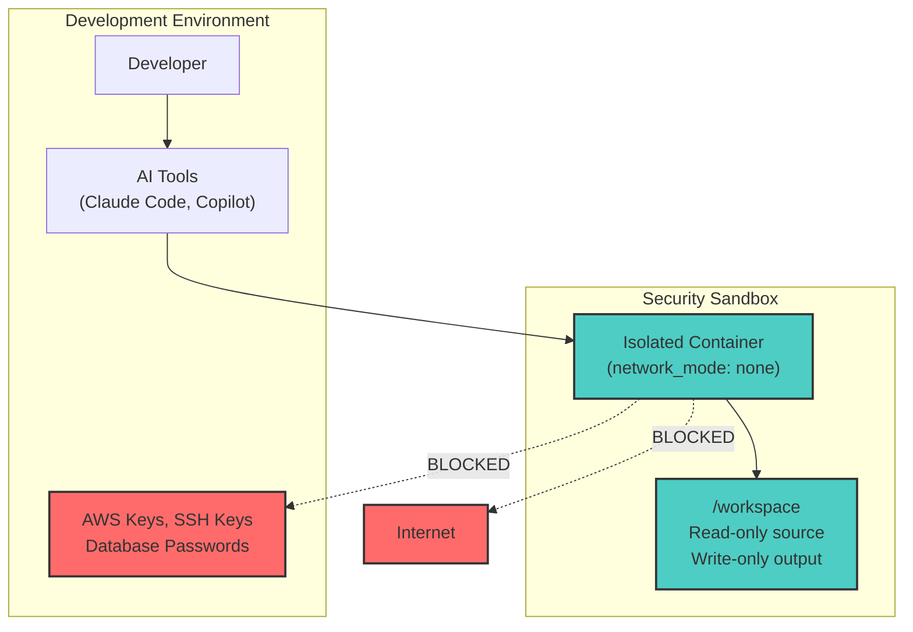
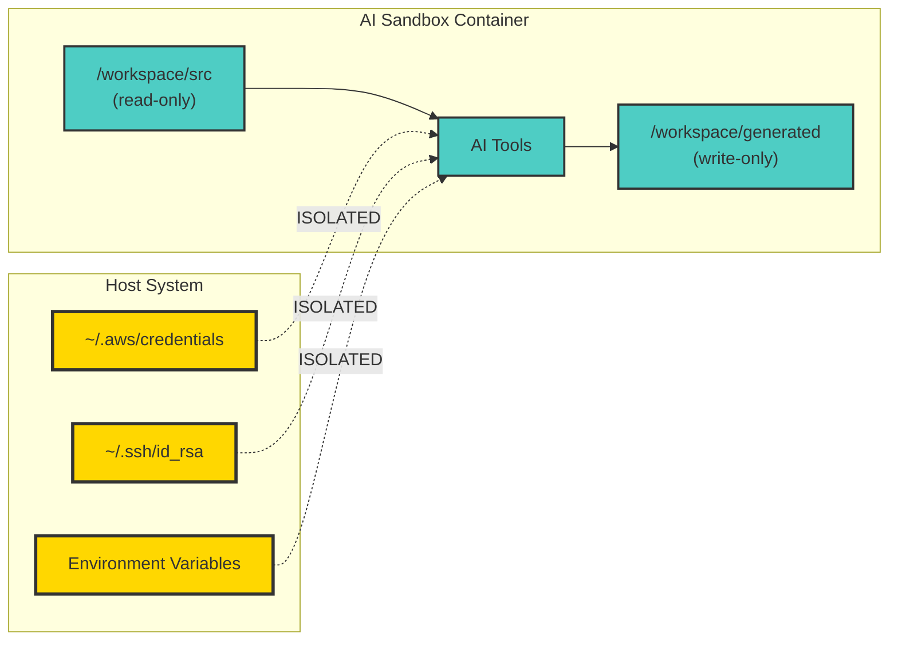
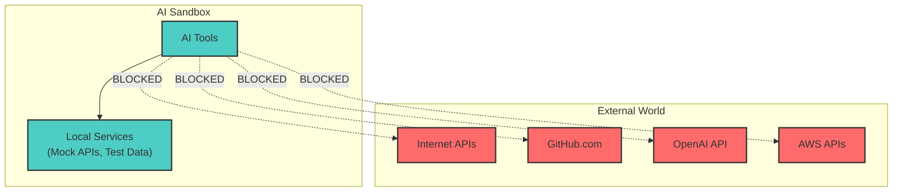

# Security Sandbox: Isolating AI Development Tools from Your Credentials

## The Problem

AI development tools like Claude Code, GitHub Copilot, and ChatGPT plugins can access your entire development environment—including AWS keys, SSH keys, database credentials, and API tokens. A single credential leak costs organizations an average of $4.88 million according to IBM's 2024 Cost of a Data Breach Report.

**The AI risk multiplier**: Unlike traditional development tools, AI tools actively process your code content, learn from your patterns, and send telemetry data back to their parent companies. This creates new attack vectors for credential exposure.

## The Solution: Complete Network Isolation

The **Security Sandbox** provides complete credential isolation using Docker containers with `network_mode: none`. Even if AI tools suggest real credentials or generate malicious code, they cannot exfiltrate data or make external API calls.

## Quick Start (5 Minutes)

1. **Clone and start:**
   ```bash
   git clone https://github.com/PaulDuvall/ai-development-patterns.git
   cd ai-development-patterns
   ./examples/security-sandbox/ai-sandbox.sh start
   ```

2. **Enter the sandbox:**
   ```bash
   ./examples/security-sandbox/ai-sandbox.sh shell
   ```

3. **Verify isolation (these should ALL FAIL):**
   ```bash
   # Test network isolation
   python3 -c "import socket; socket.create_connection(('8.8.8.8', 53), timeout=5)"
   python3 -c "import urllib.request; urllib.request.urlopen('https://google.com')"
   
   # Test credential isolation
   ls ~/.aws     # Should fail - no AWS credentials
   ls ~/.ssh     # Should fail - no SSH keys
   ```

## How It Works

### Core Security Features

```yaml
# Complete network isolation
network_mode: none

# Non-root execution
user: "1000:1000"

# No elevated privileges
security_opt:
  - no-new-privileges:true
cap_drop:
  - ALL

# Resource limits
deploy:
  resources:
    limits:
      cpus: '2.0'
      memory: 4G

# Controlled file access
volumes:
  - ./src:/workspace/src:ro              # Read-only source
  - ./generated:/workspace/generated:rw  # AI output only
  # NO access to ~/.aws, ~/.ssh, .env files
```

### What's Protected
- ✅ **Network isolation**: No DNS, HTTP, or external communication
- ✅ **Credential protection**: AWS keys, SSH keys, environment variables isolated
- ✅ **Privilege isolation**: Non-root execution with no elevated permissions
- ✅ **Resource limits**: Prevents system impact from AI processing
- ✅ **Source protection**: Read-only access prevents accidental modifications

## Running Claude Code Safely

```bash
# Start sandbox
./examples/security-sandbox/ai-sandbox.sh start

# Run Claude Code in isolation
./examples/security-sandbox/ai-sandbox.sh exec "claude 'Review this code for security issues' --file src/auth.py"

# Interactive session
./examples/security-sandbox/ai-sandbox.sh shell
# Inside sandbox:
claude "Generate unit tests" --output tests/test_auth.py
```

## Security Validation

```bash
# Built-in security checks
./examples/security-sandbox/ai-sandbox.sh validate

# Expected output:
# ✅ Network isolation: ENABLED (network_mode: none)
# ✅ Non-root user: ENABLED (UID 1000)
# ✅ Capabilities dropped: ALL
# ✅ No sensitive mounts detected
# ✅ Memory limit: 4GB

# Test isolation
./examples/security-sandbox/ai-sandbox.sh demo
```

## Common Limitations and Solutions

### 1. No Internet Access for Documentation
**Solution**: Pre-download docs and mount them:
```bash
# Download documentation
curl https://docs.python.org/3/library/index.html > ./docs/python-docs.html

# Mount in sandbox (edit examples/security-sandbox/docker-compose.ai-sandbox.yml)
volumes:
  - ./docs:/workspace/docs:ro
```

### 2. No Real-time API Testing
**Solution**: Use mock servers inside sandbox:
```bash
# Create mock API responses
mkdir -p ./mocks/api/
echo '{"status": "success", "data": {"id": 123}}' > ./mocks/api/user.json

# Start mock server inside sandbox
./examples/security-sandbox/ai-sandbox.sh shell
cd /workspace/mocks && python -m http.server 8000 &
```

### 3. No Dynamic Package Installation
**Solution**: Pre-install packages:
```bash
# Edit examples/security-sandbox/requirements-sandbox.txt
echo "requests==2.31.0" >> examples/security-sandbox/requirements-sandbox.txt

# Rebuild sandbox
./examples/security-sandbox/ai-sandbox.sh stop
./examples/security-sandbox/ai-sandbox.sh build
./examples/security-sandbox/ai-sandbox.sh start
```

## Architecture Overview

### Security Layers



### Container Isolation



### Network Isolation



## Anti-Patterns to Avoid

```yaml
# ❌ DON'T DO THIS
volumes:
  - ~/.aws:/workspace/.aws    # Exposes credentials
network_mode: bridge         # Allows network access

# ✅ DO THIS
network_mode: none          # Complete isolation
volumes:
  - ./src:/workspace/src:ro # Read-only source only
```

## Team Usage

```bash
# Each developer runs isolated sandbox
./examples/security-sandbox/ai-sandbox.sh start

# Version control shared configuration
cp examples/security-sandbox/docker-compose.ai-sandbox.yml team-sandbox.yml
git add team-sandbox.yml
git commit -m "Add team sandbox configuration"
```

## Troubleshooting

### Common Issues:
1. **Slow AI responses**: Increase resource limits in examples/security-sandbox/docker-compose.ai-sandbox.yml
2. **Need API access**: Use mock servers or fixture files
3. **Missing packages**: Pre-install in requirements-sandbox.txt
4. **File permissions**: Check user ID mapping (1000:1000)

### Quick Diagnostics:
```bash
./examples/security-sandbox/ai-sandbox.sh status    # Check sandbox health
./examples/security-sandbox/ai-sandbox.sh validate  # Security validation
./examples/security-sandbox/ai-sandbox.sh demo      # Test isolation
```

## The Challenge

**Don't use any AI development tool again until you've implemented the Security Sandbox.**

Why? Every AI session without the sandbox is a potential credential leak. The 5-minute setup time is nothing compared to the months of recovery from a security incident.

## Get Started Now

1. **Clone**: `git clone https://github.com/PaulDuvall/ai-development-patterns.git`
2. **Start**: `./examples/security-sandbox/ai-sandbox.sh start`
3. **Validate**: `./examples/security-sandbox/ai-sandbox.sh validate`

**The result**: Complete credential isolation with zero impact on AI productivity.

---

*Complete implementation available in the [AI Development Patterns repository](https://github.com/PaulDuvall/ai-development-patterns/tree/main/examples/security-sandbox).*
