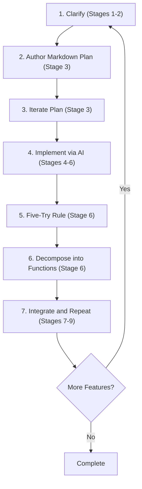

# Comprehensive AI Developer Lifecycle Workflow

This example demonstrates how to implement the complete AI Developer Lifecycle using the enhanced implementation techniques, including the Five-Try Rule, markdown iteration, and function-level decomposition.

## Overview: 7-Step Implementation of 9-Stage Lifecycle

The enhanced AI Developer Lifecycle can be implemented using this proven 7-step workflow that incorporates the lifecycle's nine stages:



## Complete Feature Example: JWT Authentication

### Step 1: Clarify (Lifecycle Stages 1-2: Problem Definition + Technical Planning)

**Business Context Gathering**
```bash
ai "Help me clarify the JWT authentication requirements:

Business Context:
- SaaS application with 1000+ users
- Currently using session-based auth
- Need to support mobile app integration
- Must maintain backward compatibility

Technical Constraints:
- Node.js Express API
- PostgreSQL database with existing users table
- Redis available for caching
- Production deployment every Friday
- 15-hour implementation time limit

Generate comprehensive problem definition and technical approach."
```

**Generated Problem Statement**
```markdown
# JWT Authentication Implementation

## Problem Definition
Migrate session-based authentication to JWT tokens to support mobile clients while maintaining web app compatibility.

## Success Criteria
- [ ] Mobile app can authenticate using JWT tokens
- [ ] Existing web sessions continue working during transition
- [ ] Token refresh mechanism implemented
- [ ] Security audit passes (no vulnerabilities)
- [ ] Performance: <50ms token validation time
```

### Step 2: Author Markdown Plan (Lifecycle Stage 3: Requirements Analysis)

**Initial Plan Creation**
```markdown
# JWT Authentication Implementation Plan

## Technical Approach
### Database Changes
- Add `jwt_tokens` table for refresh token storage
- Add `token_version` column to `users` table for invalidation

### API Endpoints
- POST /auth/login (returns JWT + refresh token)
- POST /auth/refresh (extends session with new JWT)
- POST /auth/logout (invalidates refresh token)

### Implementation Strategy
- Phase 1: JWT generation and validation (2 hours)
- Phase 2: Refresh token mechanism (3 hours)
- Phase 3: Integration with existing auth middleware (2 hours)
- Phase 4: Testing and security validation (3 hours)

### Security Considerations
- JWT signing with RSA-256
- 15-minute access token expiration
- 7-day refresh token expiration
- Rate limiting on auth endpoints
```

### Step 3: Iterate Plan (Enhanced Planning with Stakeholder Review)

**Stakeholder Review Cycle**
```bash
ai "Review this JWT authentication plan for security gaps and implementation issues:

[paste plan from Step 2]

Focus on:
- Security best practices for JWT implementation
- Database performance impact
- Backward compatibility strategy
- Production deployment risks
- Testing approach"
```

**Enhanced Plan (Draft 2)**
```markdown
# JWT Authentication Implementation Plan (Refined)

## Enhanced Security Approach
### JWT Configuration
- RSA-256 signing with 2048-bit keys
- Access tokens: 15 minutes expiration
- Refresh tokens: 7 days expiration with rotation
- Secure httpOnly cookies for web clients

### Database Optimization
- Index on `jwt_tokens.user_id` and `jwt_tokens.expires_at`
- Scheduled cleanup job for expired tokens
- Connection pooling considerations

### Backward Compatibility Strategy
- Dual authentication support (sessions + JWT)
- Feature flag for gradual rollout
- Migration plan for existing sessions

### Security Enhancements
- Rate limiting: 5 login attempts per minute per IP
- CSRF protection for cookie-based tokens
- JWT blacklisting for immediate revocation
- Security headers (Content-Security-Policy, etc.)

### Production Deployment
- Blue-green deployment strategy
- Database migration with rollback plan
- Monitoring for authentication failures
- A/B testing with 10% JWT traffic initially
```

### Step 4: Implement via AI (Lifecycle Stages 4-6: Issues → Specifications → Implementation)

**Generate Executable Tests First**
```bash
ai "Generate comprehensive test suite for JWT authentication:

Create:
1. Unit tests for JWT service functions
2. Integration tests for auth endpoints
3. Security tests for token validation
4. Performance tests for token operations

Use Mocha/Chai testing framework. Include edge cases like expired tokens, invalid signatures, and malformed requests."
```

**Generate API Specifications**
```bash
ai "Create OpenAPI specification for JWT authentication endpoints:

Include:
- POST /auth/login with request/response schemas
- POST /auth/refresh with token validation
- POST /auth/logout with secure cleanup
- Error response formats
- Security requirements and examples"
```

**Implement Core JWT Service**
```bash
ai "Implement JWT service following the OpenAPI specification:

Requirements:
- Use Node.js jsonwebtoken library
- Implement RSA-256 signing
- Include token generation, validation, and refresh
- Add comprehensive error handling
- Follow generated test specifications"
```

### Step 5: Five-Try Rule (When AI Struggles)

*Concept from [Jessica Kerr's insights on implementation testing design](https://www.linkedin.com/posts/jessicakerr_the-implementation-is-a-test-of-the-design-activity-7367649800193761281-LzCu/)*

**When Implementation Fails After 3-4 Attempts**

If AI cannot implement the JWT service successfully:

```bash
# Attempt 1-3 failed, apply Five-Try Rule
ai "I've tried implementing the JWT service 3 times without success.
Let's break this down into smaller functions.

Instead of implementing the entire service, just implement JWT token generation:
- Input: user object, expiration time
- Output: signed JWT string
- Use only jsonwebtoken.sign()
- Pure function, no database calls"
```

### Step 6: Decompose into Functions (Function-Level Breakdown)

**Individual Function Implementation**

```bash
# Function 1: Token Generation
ai "Implement JWT token generation function:
export function generateAccessToken(user: User, expiresIn: string): string
- Input: user object with id, email, role
- Output: signed JWT string
- Use RSA-256 algorithm
- Include standard claims (iat, exp, sub)"

# Function 2: Token Validation
ai "Implement JWT token validation function:
export function validateAccessToken(token: string): Promise<DecodedToken>
- Input: JWT token string
- Output: decoded user payload or throws error
- Verify signature and expiration
- Return typed user information"

# Function 3: Refresh Token Management
ai "Implement refresh token database operations:
export async function storeRefreshToken(userId: number, token: string, expiresAt: Date): Promise<void>
export async function validateRefreshToken(token: string): Promise<number>
- Store/retrieve refresh tokens from database
- Handle token rotation and cleanup"

# Integration Function
ai "Combine JWT functions into authentication service:
Use: generateAccessToken(), validateAccessToken(), storeRefreshToken()
Create: AuthenticationService class with login(), refresh(), logout() methods"
```

**Function Contract Validation**
```typescript
// Clear interfaces for each function
interface JWTTokenGenerator {
  (user: User, expiresIn: string): string;
}

interface JWTTokenValidator {
  (token: string): Promise<DecodedToken>;
}

interface RefreshTokenManager {
  store(userId: number, token: string, expiresAt: Date): Promise<void>;
  validate(token: string): Promise<number>;
  cleanup(userId: number): Promise<void>;
}
```

### Step 7: Integrate and Repeat (Lifecycle Stages 7-9: Testing → Deployment → Monitoring)

**Integration Testing**
```bash
ai "Create integration tests for the complete authentication flow:
1. User login with valid credentials
2. Access protected endpoint with JWT
3. Refresh token before expiration
4. Handle token expiration gracefully
5. Test logout and token invalidation

Use supertest for HTTP testing and ensure all edge cases are covered."
```

**Deployment Preparation**
```bash
ai "Generate deployment checklist and monitoring setup:

Deployment:
- Database migration scripts for jwt_tokens table
- Environment variable configuration for JWT secrets
- Feature flag setup for gradual rollout
- Health check endpoints for load balancers

Monitoring:
- Authentication success/failure rates
- Token validation latency metrics
- Refresh token usage patterns
- Security alerts for unusual login patterns"
```

**Production Validation**
```bash
# After deployment, validate the implementation
ai "Create production validation script that:
1. Tests login endpoint with test user
2. Validates JWT token structure and claims
3. Confirms refresh token mechanism
4. Verifies rate limiting is active
5. Checks security headers are present

Generate monitoring dashboard configuration for authentication metrics."
```

## Key Success Patterns from This Example

### Effective Clarification
- **Specific constraints**: Time limits, technology stack, compatibility requirements
- **Measurable success criteria**: Performance targets, security requirements
- **Business context**: User scale, deployment patterns, existing systems

### Structured Planning with Iteration
- **Draft → Review → Refine**: 2-3 planning cycles maximum
- **Stakeholder feedback**: Security and operational perspectives
- **Version control**: Track plan evolution and decisions

### Implementation with Failure Recovery
- **Test-first approach**: Specifications drive implementation
- **Five-Try Rule**: Systematic decomposition when AI struggles
- **Function-level breakdown**: Clear contracts and isolated testing

### Comprehensive Integration
- **Incremental integration**: Functions → services → endpoints
- **Comprehensive testing**: Unit, integration, security, performance
- **Production readiness**: Monitoring, deployment automation, rollback plans

## Tool-Specific Implementation

### Claude Code
```bash
# Use Plan Mode for initial planning
claude plan "Implement JWT authentication for SaaS application"

# Use implementation mode for function development
claude implement "Generate JWT service following OpenAPI specification"

# Use review mode for integration testing
claude review "Validate complete authentication flow implementation"
```

### Cursor
```bash
# Use /plan command for structured planning
/plan JWT authentication implementation with security requirements

# Use @codebase for implementation with context
/implement JWT service @codebase following test specifications

# Use /fix for handling implementation issues
/fix authentication endpoint failing test cases
```

## Success Metrics

- **Planning efficiency**: 2-3 plan iterations before implementation
- **Implementation success**: <5 AI attempts per function
- **Integration time**: Minimal debugging due to clear function contracts
- **Production readiness**: Comprehensive tests and monitoring before deployment

This comprehensive workflow demonstrates how the enhanced AI Developer Lifecycle pattern creates systematic, high-quality implementations through structured planning, systematic failure recovery, and comprehensive integration practices.