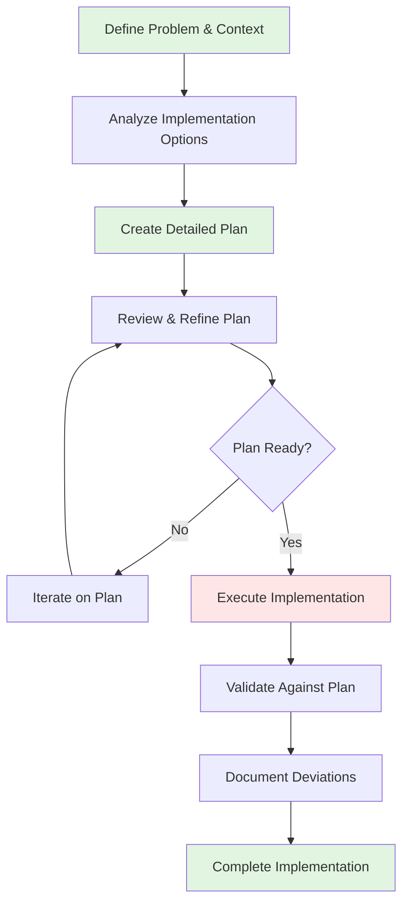

# AI Plan-First Development - Complete Implementation

This directory contains comprehensive examples and templates for implementing the **AI Plan-First Development** pattern across different AI coding tools and development scenarios.

## Pattern Overview

AI Plan-First Development leverages the planning capabilities built into modern AI coding tools to create structured implementation approaches before writing any code. This pattern reduces iterations, improves code quality, and enables better team collaboration.

**Core Principle**: Generate explicit implementation plans before writing code to improve quality, reduce iterations, and enable better collaboration.

## Directory Contents

### Tool-Specific Examples

| File | Tool | Scenario | Key Features Demonstrated |
|------|------|----------|---------------------------|
| [`claude-code-example.md`](claude-code-example.md) | Claude Code | Node.js JWT Authentication | Plan Mode workflow, plan iteration, execution validation |
| [`cursor-example.md`](cursor-example.md) | Cursor | React Component Library | `/plan` command, interactive refinement, progress tracking |

### Universal Templates

| File | Purpose | Use Case |
|------|---------|-----------|
| [`planning-template.md`](planning-template.md) | Universal planning template | Any AI tool, any project type |

## Quick Start Guide

### 1. Choose Your Tool Approach

**Claude Code Users**:
- Activate Plan Mode before implementation
- Use the planning template for complex features
- Review and iterate on plans before execution

**Cursor Users**:
- Use `/plan` command for structured planning
- Leverage interactive chat for plan refinement
- Track progress with inline comments

**Other AI Tools**:
- Adapt the planning template format
- Request structured plans before code generation
- Break complex tasks into planning phases

### 2. Planning Session Workflow



### 3. Implementation Steps

1. **Problem Definition**: Clearly articulate what needs to be built
2. **Context Analysis**: Identify constraints, requirements, and dependencies
3. **Option Evaluation**: Consider multiple implementation approaches
4. **Plan Creation**: Generate detailed, actionable implementation steps
5. **Plan Review**: Validate approach and refine as needed
6. **Execution**: Implement following the approved plan
7. **Validation**: Verify implementation meets plan objectives

## Example Scenarios by Complexity

### Beginner: Simple Feature Addition
**Scenario**: Adding a search filter to an existing page
**Planning Time**: 10-15 minutes
**Tools**: Any AI coding tool
**Template**: Simplified planning with 3-5 implementation steps

### Intermediate: New System Component
**Scenario**: Building a notification service
**Planning Time**: 30-45 minutes
**Tools**: Claude Code Plan Mode, Cursor `/plan`
**Template**: Full planning template with risk analysis

### Advanced: Multi-Service Integration
**Scenario**: Microservices architecture deployment
**Planning Time**: 1-2 hours
**Tools**: Any AI tool with extended planning capabilities
**Template**: Extended template with multiple phases

## Planning Best Practices

### ✅ Effective Planning

1. **Start with Clear Objectives**: Define specific, measurable outcomes
2. **Consider Multiple Options**: Evaluate 2-3 implementation approaches
3. **Include Time Estimates**: Realistic planning includes effort estimation
4. **Address Dependencies**: Identify external systems, APIs, or data requirements
5. **Plan for Testing**: Include validation strategy from the start
6. **Document Assumptions**: Record decisions and rationale for future reference

### ❌ Planning Anti-Patterns

1. **Over-Planning**: Spending more time planning than implementing simple features
2. **Under-Planning**: Jumping to code without understanding the problem scope
3. **Rigid Planning**: Not adapting plans when new information emerges
4. **Isolated Planning**: Not involving team members in complex planning decisions
5. **Implementation Drift**: Not validating actual implementation against the plan

## Integration with Development Workflows

### Agile/Kanban Integration
```markdown
## User Story Planning
**Story**: As a user, I want to reset my password via email

**Planning Session**:
- Problem: Secure password reset without SMS dependency
- Options: Email link vs. temporary password vs. security questions
- Plan: Email-based JWT token approach with 15-minute expiration
- Acceptance: User receives email, clicks link, sets new password successfully
```

### Code Review Integration
```markdown
## Plan-Based Code Review Checklist
- [ ] Implementation follows approved plan structure
- [ ] Deviations from plan are documented and justified
- [ ] All plan acceptance criteria are met
- [ ] Test coverage matches planned testing strategy
- [ ] Performance meets plan requirements
```

### Documentation Integration
Plans become living documentation that evolves with the implementation:
- Initial plan captures decision rationale
- Implementation updates reflect actual approach
- Final documentation includes lessons learned

## Tool-Specific Setup Instructions

### Claude Code
1. Ensure you have access to Plan Mode feature
2. Practice plan iteration workflow
3. Use planning template for consistency

### Cursor
1. Familiarize yourself with `/plan` command syntax
2. Learn interactive chat planning techniques
3. Set up progress tracking workflows

### Universal Approach
1. Copy planning template to your preferred format
2. Adapt template sections for your tool's capabilities
3. Establish team conventions for plan sharing and review

## Measuring Planning Effectiveness

### Quality Metrics
- **Plan Accuracy**: Percentage of implementation matching original plan
- **Time Estimation**: Actual vs. estimated implementation time
- **Issue Prevention**: Number of problems caught during planning vs. implementation
- **Team Alignment**: Reduced back-and-forth during implementation

### Process Metrics
- **Planning Time**: Time spent planning vs. total implementation time
- **Iteration Reduction**: Fewer code rewrite cycles
- **Review Efficiency**: Faster code reviews with clear plan reference
- **Knowledge Sharing**: Team understanding of implementation approach

## Advanced Planning Techniques

### Multi-Agent Planning
For complex features requiring multiple AI agents:
```markdown
## Agent Coordination Plan
- **Planning Agent**: Creates overall architecture and task breakdown
- **Implementation Agents**: Handle specific components following plan
- **Validation Agent**: Ensures implementation meets plan requirements
- **Integration Agent**: Coordinates cross-component interactions
```

### Risk-Driven Planning
For high-stakes implementations:
```markdown
## Risk Assessment Matrix
| Risk | Likelihood | Impact | Mitigation |
|------|------------|--------|------------|
| Database migration failure | Medium | High | Test migration on staging, prepare rollback |
| API rate limiting | Low | Medium | Implement retry logic, cache responses |
| Security vulnerability | Low | High | Security review, penetration testing |
```

## Contributing to This Pattern

### Adding New Tool Examples
1. Create `[tool-name]-example.md` following the existing format
2. Include specific tool features and commands
3. Demonstrate the complete planning workflow
4. Add entry to the tool-specific examples table

### Improving Templates
1. Test templates with real implementation scenarios
2. Gather feedback from development teams
3. Update based on tool capability changes
4. Maintain tool-agnostic core structure

### Sharing Success Stories
Document successful applications of this pattern:
- Implementation scenarios where planning saved significant time
- Team collaboration improvements
- Quality improvements measured
- Lessons learned from planning failures

This implementation demonstrates how AI Plan-First Development transforms ad-hoc coding into structured, predictable development workflows that scale across teams and project complexity levels.