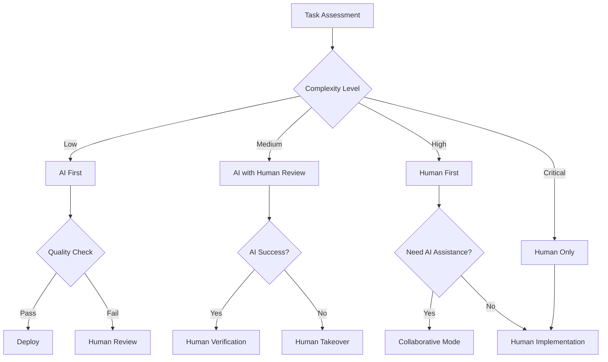
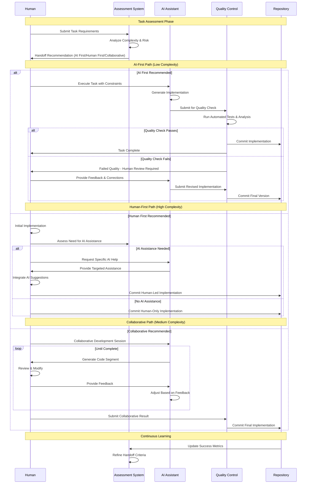
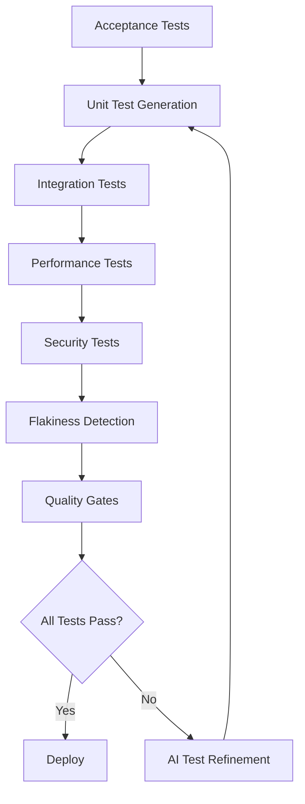
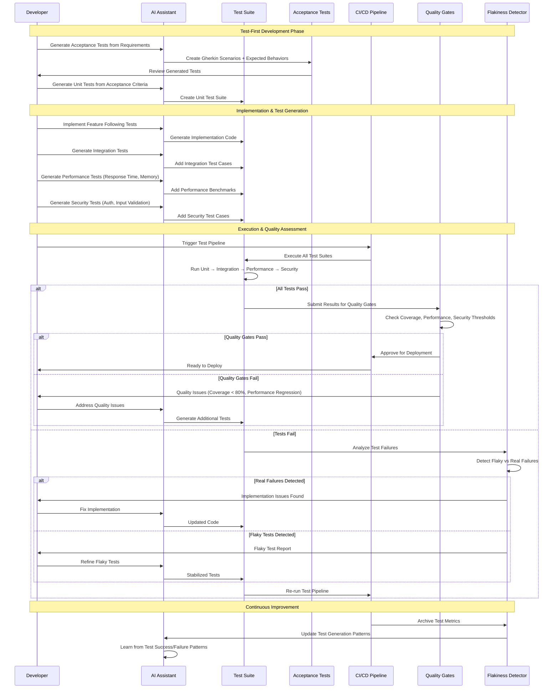
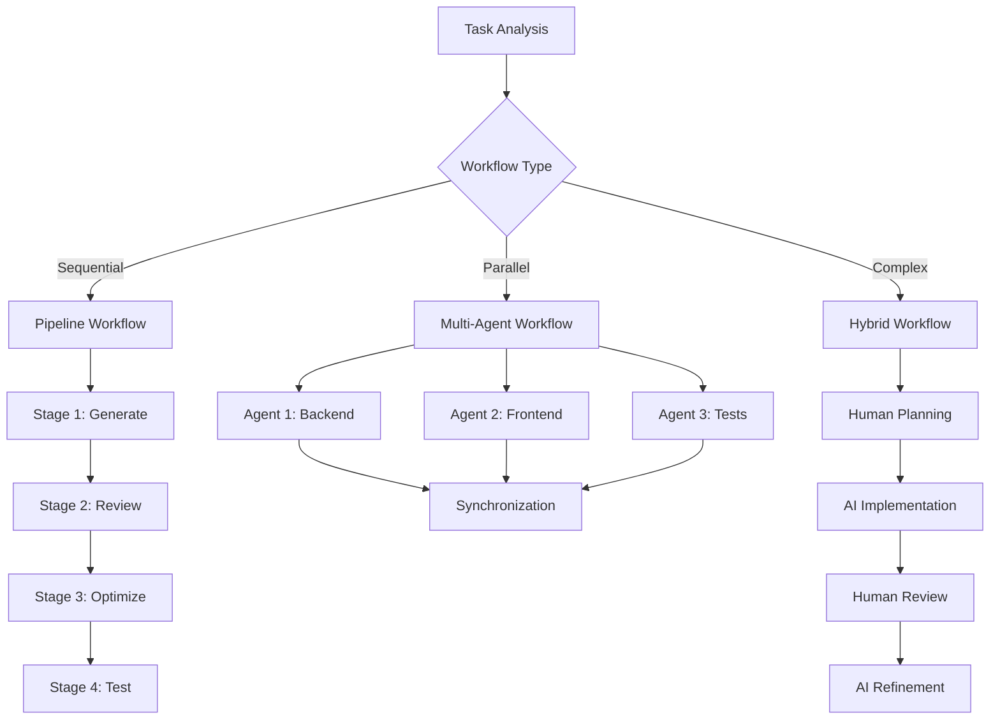
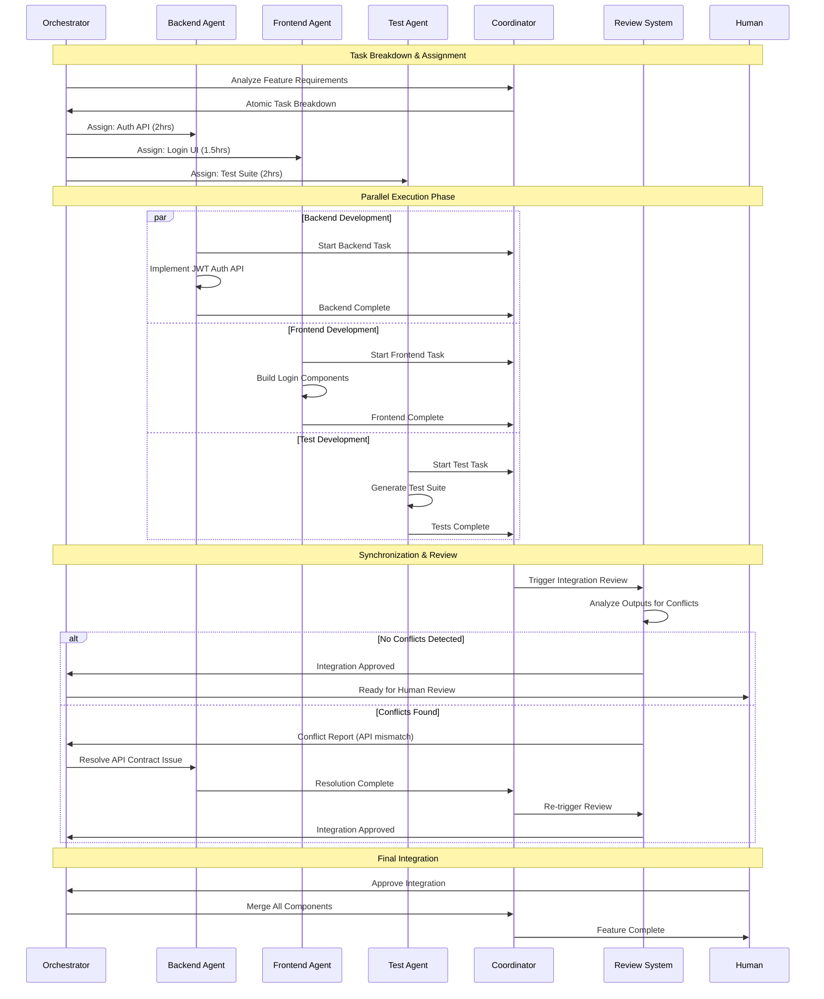

# Experimental AI Development Patterns

A collection of experimental patterns for AI-assisted development that are under active development and evaluation. These patterns represent cutting-edge approaches that may be refined, consolidated, or evolved based on community feedback and real-world usage.

## Pattern Organization

These experimental patterns extend the core AI development patterns with advanced workflows and emerging practices:

- **[Advanced Workflows](#advanced-workflows)** - Complex orchestration patterns for mature AI development teams
- **[Operations Automation](#operations-automation)** - Experimental automation patterns for CI/CD and production management
- **[Monitoring & Intelligence](#monitoring--intelligence)** - Advanced observability and predictive maintenance patterns

## Experimental Pattern Reference

| Pattern | Maturity | Type | Description | Dependencies |
|---------|----------|------|-------------|--------------|
| **[Human-AI Handoff Protocol](#human-ai-handoff-protocol)** | Intermediate | Foundation | Clear boundaries and procedures for transitioning work between human developers and AI | AI Developer Lifecycle |
| **[Comprehensive AI Testing Strategy](#comprehensive-ai-testing-strategy)** | Intermediate | Workflow | Unified approach to test-first development, automated generation, and quality assurance | Specification Driven Development |
| **[AI Workflow Orchestration](#ai-workflow-orchestration)** | Advanced | Workflow | Coordinate sequential pipelines, parallel workflows, and hybrid human-AI processes | Comprehensive AI Testing Strategy, AI Tool Integration |
| **[AI Review Automation](#ai-review-automation)** | Intermediate | Operations | Automate review process for parallel agent outputs using AI to detect conflicts and coordinate integration | AI Workflow Orchestration, Atomic Task Decomposition |
| **[Technical Debt Forecasting](#technical-debt-forecasting)** | Intermediate | Operations | Proactively identify and prioritize technical debt using AI-powered code analysis | AI-Driven Refactoring, AI-Driven Architecture Design, AI Tool Integration |
| **[Pipeline Synthesis](#pipeline-synthesis)** | Intermediate | Workflow | Convert plain-English build specifications into CI/CD pipeline configurations | AI Workflow Orchestration, AI Tool Integration |
| **[AI-Guided Blue-Green Deployment](#ai-guided-blue-green-deployment)** | Advanced | Operations | Generate blue-green deployment scripts with validation to prevent AI misconceptions | Pipeline Synthesis |
| **[Drift Detection & Remediation](#drift-detection--remediation)** | Advanced | Operations | Detect infrastructure configuration drift and generate corrective patches automatically | Pipeline Synthesis |
| **[Release Note Synthesis](#release-note-synthesis)** | Beginner | Operations | Automatically generate structured release notes by analyzing git commit history | Pipeline Synthesis |
| **[Incident Response Automation](#incident-response-automation)** | Advanced | Operations | Generate actionable incident response playbooks from historical incident data | Performance Baseline Management |
| **[Test Suite Health Management](#test-suite-health-management)** | Intermediate | Operations | Analyze build history to identify and remediate flaky tests automatically | Comprehensive AI Testing Strategy |
| **[Dependency Upgrade Advisor](#dependency-upgrade-advisor)** | Intermediate | Operations | Intelligently manage dependency upgrades with compatibility analysis and risk assessment | Technical Debt Forecasting |
| **[On-Call Handoff Automation](#on-call-handoff-automation)** | Intermediate | Operations | Generate comprehensive handoff briefs that summarize system state and active issues | Incident Response Automation |
| **[Chaos Engineering Scenarios](#chaos-engineering-scenarios)** | Advanced | Operations | Generate targeted chaos experiments based on system architecture and dependencies | Performance Baseline Management |
| **[ChatOps Security Integration](#chatops-security-integration)** | Beginner | Operations | Deploy security scanning capabilities through chat commands for immediate feedback | Security Scanning Orchestration |
| **[Compliance Evidence Automation](#compliance-evidence-automation)** | Advanced | Operations | Generate audit evidence matrices from logs and configuration changes automatically | Security Scanning Orchestration |
| **[Context Window Optimization](#context-window-optimization)** | Advanced | Development | Match AI tool selection to task complexity and optimize cost/performance trade-offs | Progressive AI Enhancement |

---

## Advanced Workflows

### Human-AI Handoff Protocol

**Maturity**: Intermediate  
**Description**: Clear boundaries and procedures for transitioning work between human developers and AI tools based on complexity, security requirements, and creative problem-solving needs.

**Related Patterns**: [AI Developer Lifecycle](../README.md#ai-developer-lifecycle), [Observable AI Development](../README.md#observable-ai-development), [AI Workflow Orchestration](#ai-workflow-orchestration)

**Handoff Decision Framework**



**Handoff Execution Sequence**



**Anti-pattern: Unclear Boundaries**
Allowing AI and humans to work on the same task simultaneously without clear handoff points leads to conflicts, duplicated effort, and inconsistent quality.

---

### Comprehensive AI Testing Strategy

**Maturity**: Intermediate  
**Description**: Unified approach combining test-first development, automated test generation, and quality assurance patterns to ensure AI-generated code meets quality and behavioral specifications.

**Pattern Boundary Clarification**:
- **This pattern** focuses on overall testing strategy and test generation
- **Specification Driven Development** focuses on writing specs before implementation
- **Observable AI Development** focuses on logging and debugging for AI understanding
- **AI-Driven Traceability** focuses on linking requirements to tests and implementation

**Related Patterns**: [Specification Driven Development](../README.md#specification-driven-development), [Observable AI Development](../README.md#observable-ai-development)

**Integrated Testing Framework**



**Testing Workflow Execution Sequence**



**Anti-pattern: Test Generation Without Strategy**
Generating tests with AI without a coherent strategy leads to poor coverage, flaky tests, and false confidence in code quality.

---

### AI Workflow Orchestration

**Maturity**: Advanced  
**Description**: Coordinate sequential pipelines, parallel agent workflows, and hybrid human-AI processes for complex development tasks. Transform synchronous single-agent workflows into asynchronous, event-driven multi-agent architectures while maintaining safety and consistency.

**Related Patterns**: [Human-AI Handoff Protocol](#human-ai-handoff-protocol), [AI Tool Integration](../README.md#ai-tool-integration), [Comprehensive AI Testing Strategy](#comprehensive-ai-testing-strategy), [Atomic Task Decomposition](../README.md#atomic-task-decomposition)

**Workflow Types & Selection**



**Parallel Agent Coordination Sequence**



**Parallel Agent Coordination Examples**

```bash
# Atomic task breakdown for parallel execution
ai_task_manager "Break down user authentication feature into atomic tasks:
- Each task <2 hours completion time
- Independent implementation (no shared state)
- Clear input/output contracts
- Parallelizable across agents"

# Parallel agent execution with safety
ai_orchestrator --parallel --safe-mode \
  --task="backend-auth-api" --agent="backend-specialist" \
  --task="frontend-login-ui" --agent="frontend-specialist" \
  --task="integration-tests" --agent="testing-specialist" \
  --sync-point="integration-review"

# Safety-first parallel review
ai_reviewer --parallel-output \
  --check-conflicts \
  --verify-contracts \
  --merge-strategy="human-approval"
```

**Parallel Agent Safety Framework**

```yaml
# .ai/parallel-config.yml
parallel_safety:
  max_concurrent_agents: 3
  conflict_detection: enabled
  shared_resources:
    - "src/shared/"
    - "package.json"
    - "database/migrations/"
  isolation_boundaries:
    - backend: "src/api/"
    - frontend: "src/components/"
    - testing: "tests/"
  sync_points:
    - after_implementation
    - before_integration
    - before_deployment
```

**Anti-pattern: Uncoordinated Multi-Tool Usage**
Using multiple AI tools without proper orchestration leads to inconsistent code, integration conflicts, and wasted effort from competing implementations.

**Anti-pattern: Unsafe Parallel Execution**
Running parallel agents without proper isolation, conflict detection, or sync points risks data corruption, merge conflicts, and system instability.

---

### Context Window Optimization

**Maturity**: Advanced  
**Description**: Match AI tool selection to task complexity and optimize cost/performance trade-offs by understanding different AI models' context window capabilities and computational costs.

**Related Patterns**: [Progressive AI Enhancement](../README.md#progressive-ai-enhancement), [AI Choice Generation](../README.md#ai-choice-generation)

**Tool Selection Decision Matrix**

| Task Complexity | Context Needed | Recommended Tool | Cost Level | Use Case |
|-----------------|----------------|------------------|------------|----------|
| Simple queries | <1K tokens | GPT-3.5, Claude Haiku | Low | Quick questions, simple code |
| Medium features | 1K-8K tokens | GPT-4, Claude Sonnet | Medium | Feature implementation |
| Complex systems | 8K-32K tokens | GPT-4 Turbo, Claude Opus | High | Architecture, large refactors |
| Massive codebases | 32K+ tokens | Claude-100K, GPT-4-128K | Premium | Full system analysis |

**Anti-pattern: One-Size-Fits-All**
Always using the most powerful (expensive) AI model for simple tasks wastes resources and increases latency for routine operations.

---

## Operations Automation

### AI Review Automation

**Maturity**: Intermediate  
**Description**: Automate review process for parallel agent outputs using AI to detect conflicts and coordinate integration.

**Related Patterns**: [AI Workflow Orchestration](#ai-workflow-orchestration), [Atomic Task Decomposition](../README.md#atomic-task-decomposition), [Parallelized AI Coding Agents](../README.md#parallelized-ai-coding-agents)

**Automated Review and Merge System**

```bash
#!/bin/bash
# automated-review.sh - Complete parallel agent review and integration

echo "=== AI Review Automation for Parallel Agents ==="

# 1. Detect conflicts between agent outputs
echo "Scanning for conflicts across agent workspaces..."

ai "Analyze parallel agent outputs for integration issues:

Agent workspaces: $(ls -d workspace/agent-* 2>/dev/null || echo 'none')

Check for:
1. File conflicts (same files modified by multiple agents)
2. API contract mismatches (function signatures, return types)
3. Dependency version conflicts
4. Naming collisions (classes, functions, variables)
5. Integration compatibility issues

For each conflict found:
- Identify which agents are involved
- Assess conflict severity (critical/medium/low)
- Suggest resolution strategy
- Generate merge commands when possible

Output structured JSON with conflicts and resolutions."

# 2. Run quality gates and validation
echo "Running quality gates on combined outputs..."

ai "Validate merged agent outputs meet quality standards:

Quality checks:
- Syntax validation (python -m py_compile)
- Type checking (mypy)
- Security scan (bandit)
- Test coverage (>80% requirement)
- Performance regression check

Generate integration tests that:
- Import all agent outputs without conflicts
- Test cross-agent functionality
- Verify API compatibility
- Check end-to-end workflows

Return pass/fail status with specific issues found."

# 3. Auto-merge or request human review
if [ $? -eq 0 ]; then
    echo "✅ Quality gates passed - proceeding with automatic merge"
    
    # Merge agent outputs
    mkdir -p workspace/merged
    for agent_dir in workspace/agent-*; do
        rsync -av --ignore-existing "$agent_dir/" workspace/merged/
    done
    
    # Run integration tests
    cd workspace/merged && python -m pytest tests/integration/ -v
    
    if [ $? -eq 0 ]; then
        echo "✅ Integration tests passed - merge complete"
        rsync -av workspace/merged/ src/
        rm -rf workspace/agent-*
    else
        echo "❌ Integration tests failed - manual review required"
    fi
else
    echo "⚠️ Quality gates failed - human review required"
    # Create review report for humans
    ai "Generate human-readable review report with:
    - Summary of all conflicts found
    - Recommended resolution steps
    - Risk assessment for each issue
    - Estimated effort to resolve manually"
fi
```

**Anti-pattern: Manual-Only Review**
Relying entirely on human reviewers for parallel agent outputs creates bottlenecks and misses systematic integration issues that automated tools can catch.

---

### Technical Debt Forecasting

**Maturity**: Intermediate  
**Description**: Proactively identify and prioritize technical debt using AI-powered code analysis.

**Related Patterns**: [AI-Driven Refactoring](../README.md#ai-driven-refactoring), [AI-Driven Architecture Design](../README.md#ai-driven-architecture-design), [AI Tool Integration](../README.md#ai-tool-integration)

```bash
ai "Analyze codebase for technical debt indicators and forecast maintenance burden:
1. Code complexity hotspots
2. Cyclomatic complexity trends  
3. Dependency staleness
4. Test coverage gaps
5. Documentation drift
Prioritize by maintenance cost and business impact."
```

**Anti-pattern: Reactive Debt Management**
Waiting until technical debt becomes a crisis instead of continuously monitoring and addressing it through predictive analysis.

---

### Pipeline Synthesis

**Maturity**: Intermediate  
**Description**: Convert plain-English build specifications into CI/CD pipeline configurations.

**Related Patterns**: [AI Workflow Orchestration](#ai-workflow-orchestration), [AI Tool Integration](../README.md#ai-tool-integration)

```bash
ai "Generate GitHub Actions workflow from specification:
Build Requirements:
- Node.js 18 with npm ci
- Run tests with jest
- Deploy to AWS on main branch push
- Require test coverage >80%

Output complete .github/workflows/ci.yml with security best practices."
```

**Anti-pattern: Manual Pipeline Maintenance**
Hand-crafting and updating CI/CD configurations instead of generating them from requirements specifications leads to inconsistency and maintenance burden.

---

### AI-Guided Blue-Green Deployment

**Maturity**: Advanced  
**Description**: Generate blue-green deployment scripts with validation to prevent AI misconceptions about deployment strategies.

**Related Patterns**: [Pipeline Synthesis](#pipeline-synthesis)

**Important**: AI tools often confuse blue-green with canary deployments. Blue-green requires full environment duplication and instant traffic switching.

```yaml
# blue-green-deploy.yml - Full environment switch pattern
deployment_strategy: "blue-green"
traffic_routing:
  method: "dns_switch"  # Instant 100% traffic switch
  rollback_time: "< 30 seconds"
environments:
  blue:
    infrastructure: "complete duplicate"
    traffic_percentage: "100% OR 0%"  # Never split
  green:
    infrastructure: "complete duplicate" 
    traffic_percentage: "0% OR 100%"  # Never split
validation:
  health_checks: ["api_health", "database_connection"]
  smoke_tests: ["critical_user_flows"]
  approval_required: true
```

**Anti-pattern: Blue-Green-Canary Confusion**
AI-generated deployment scripts that mix blue-green and canary strategies, resulting in complex traffic splitting instead of simple environment switching.

---

### Drift Detection & Remediation

**Maturity**: Advanced  
**Description**: Detect infrastructure configuration drift and generate corrective patches automatically.

**Related Patterns**: [Pipeline Synthesis](#pipeline-synthesis)

```bash
ai "Compare current AWS infrastructure against Terraform state:
1. Identify configuration drift in EC2, RDS, S3
2. Generate corrective Terraform plan
3. Assess drift risk level (critical/medium/low)
4. Create automated remediation script with approval gates"
```

**Anti-pattern: Manual Drift Checking**
Relying on periodic manual infrastructure audits instead of continuous automated drift detection and remediation.

---

### Release Note Synthesis

**Maturity**: Beginner  
**Description**: Automatically generate structured release notes by analyzing git commit history.

**Related Patterns**: [Pipeline Synthesis](#pipeline-synthesis)

```bash
ai "Generate release notes from git log --since='2 weeks ago':
Format:
## Features
## Bug Fixes  
## Breaking Changes
## Dependencies

Group by conventional commit prefixes and business impact."
```

**Anti-pattern: Manual Release Notes**
Writing release notes manually from memory instead of systematically analyzing commit history and pull request descriptions.

---

## Monitoring & Intelligence

### Incident Response Automation

**Maturity**: Advanced  
**Description**: Generate actionable incident response playbooks from historical incident data.

**Related Patterns**: [Performance Baseline Management](../README.md#performance-baseline-management)

```bash
ai "Analyze last 50 incidents in PagerDuty/AWS CloudWatch to:
1. Identify common failure patterns
2. Generate step-by-step runbooks
3. Create automated triage rules
4. Suggest preventive monitoring alerts"
```

**Anti-pattern: Static Runbooks**
Maintaining outdated incident response procedures instead of continuously improving them based on actual incident patterns and outcomes.

---

### Test Suite Health Management

**Maturity**: Intermediate  
**Description**: Analyze build history to identify and remediate flaky tests automatically.

**Related Patterns**: [Comprehensive AI Testing Strategy](#comprehensive-ai-testing-strategy)

```bash
ai "Analyze Jenkins/GitHub Actions history for flaky tests:
1. Calculate test reliability scores
2. Identify environmental vs code-related failures  
3. Generate test stabilization patches
4. Recommend test suite restructuring"
```

**Anti-pattern: Ignoring Flaky Tests**
Accepting unreliable tests as normal instead of systematically identifying and fixing test suite stability issues.

---

### Dependency Upgrade Advisor

**Maturity**: Intermediate  
**Description**: Intelligently manage dependency upgrades with compatibility analysis and risk assessment.

**Related Patterns**: [Technical Debt Forecasting](#technical-debt-forecasting)

```bash
ai "Analyze package.json/requirements.txt for upgrade opportunities:
1. Check security vulnerabilities (npm audit, safety)
2. Assess breaking change risk
3. Generate staged upgrade plan
4. Create rollback procedures"
```

**Anti-pattern: Batch Upgrades**
Upgrading all dependencies simultaneously without risk assessment or staged rollout plans.

---

### On-Call Handoff Automation

**Maturity**: Intermediate  
**Description**: Generate comprehensive handoff briefs that summarize system state and active issues.

**Related Patterns**: [Incident Response Automation](#incident-response-automation)

```bash
ai "Generate on-call handoff brief from last 24h:
1. Active alerts and their context
2. Recent deployments and their status
3. Known issues and workarounds
4. Escalation contacts and procedures
Include trending metrics and anomaly detection."
```

**Anti-pattern: Verbal-Only Handoffs**
Relying on informal verbal communication for critical system state transfer instead of structured, documented handoff procedures.

---

### Chaos Engineering Scenarios

**Maturity**: Advanced  
**Description**: Generate targeted chaos experiments based on system architecture and dependencies.

**Related Patterns**: [Performance Baseline Management](../README.md#performance-baseline-management)

```bash
ai "Design chaos experiments for microservices architecture:
1. Service dependency mapping
2. Failure mode identification (network, CPU, memory)
3. Blast radius calculation
4. Recovery validation scenarios
Generate Chaos Monkey/Litmus configurations."
```

**Anti-pattern: Random Chaos**
Running unfocused chaos experiments without clear hypotheses or measurement criteria instead of systematic resilience testing.

---

### ChatOps Security Integration

**Maturity**: Beginner  
**Description**: Deploy security scanning capabilities through chat commands for immediate feedback.

**Related Patterns**: [Security Scanning Orchestration](../README.md#security-scanning-orchestration)

```bash
# Slack bot integration for security scanning
ai "Create Slack command handlers for:
/security-scan [repo] - Run full security audit
/vulnerability-check [package] - Check specific dependency
/compliance-status [environment] - Check policy compliance
Include results formatting and alert escalation."
```

**Anti-pattern: Delayed Security Feedback**
Waiting for scheduled security scans instead of enabling on-demand security validation through developer workflows.

---

### Compliance Evidence Automation

**Maturity**: Advanced  
**Description**: Generate audit evidence matrices from logs and configuration changes automatically.

**Related Patterns**: [Security Scanning Orchestration](../README.md#security-scanning-orchestration)

```bash
ai "Generate SOC 2 compliance evidence from AWS CloudTrail:
1. Access control changes (IAM policy modifications)
2. Data encryption validation (S3 bucket policies)
3. Network security controls (Security Group changes)
4. Monitoring coverage (CloudWatch alarm configurations)
Format as audit-ready evidence matrix with timestamps and responsible parties."
```

**Anti-pattern: Manual Evidence Collection**
Manually gathering compliance evidence during audits instead of continuously collecting and organizing audit trail data.
