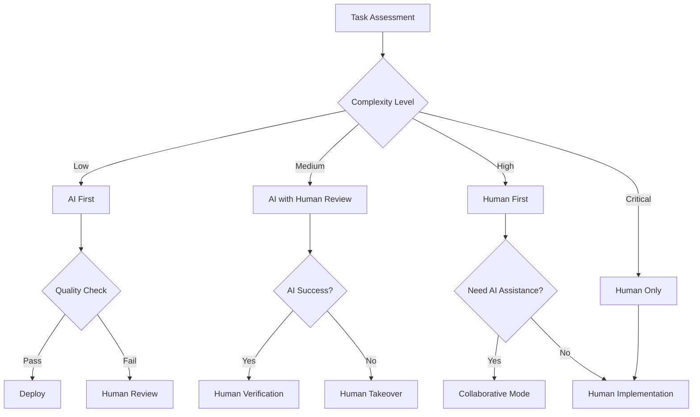
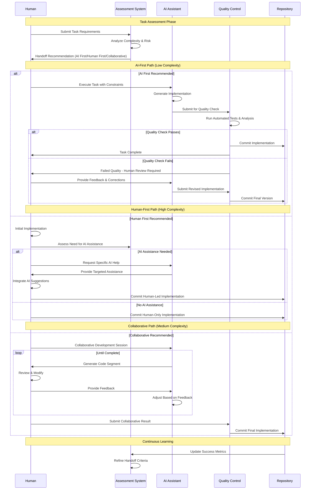
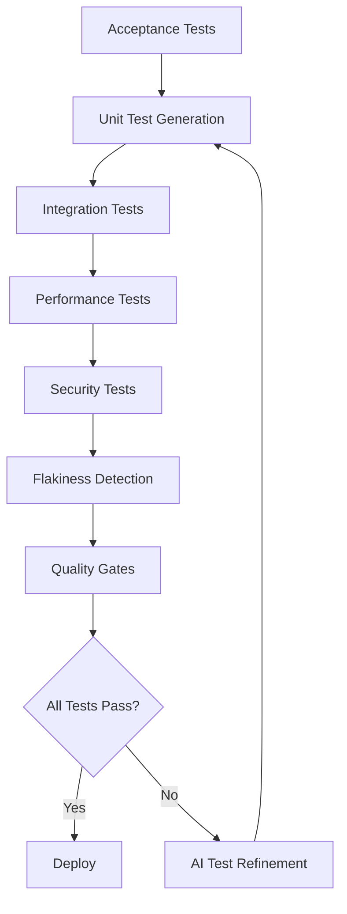
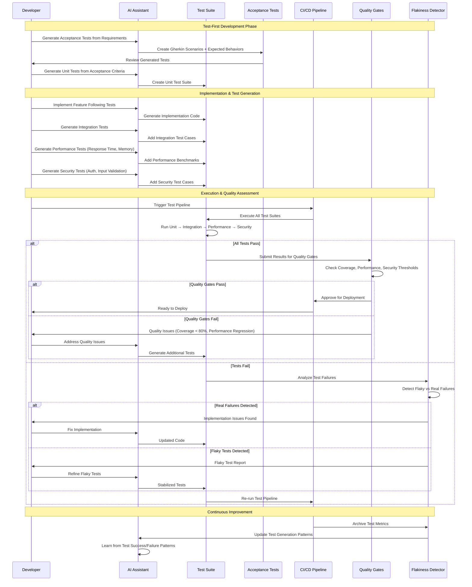
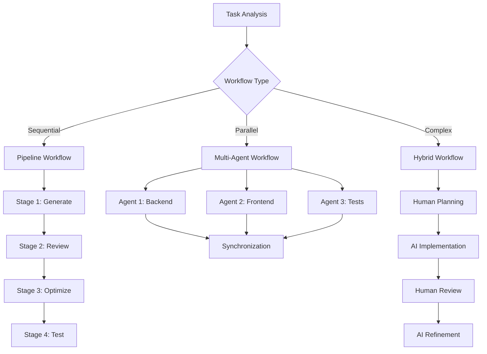
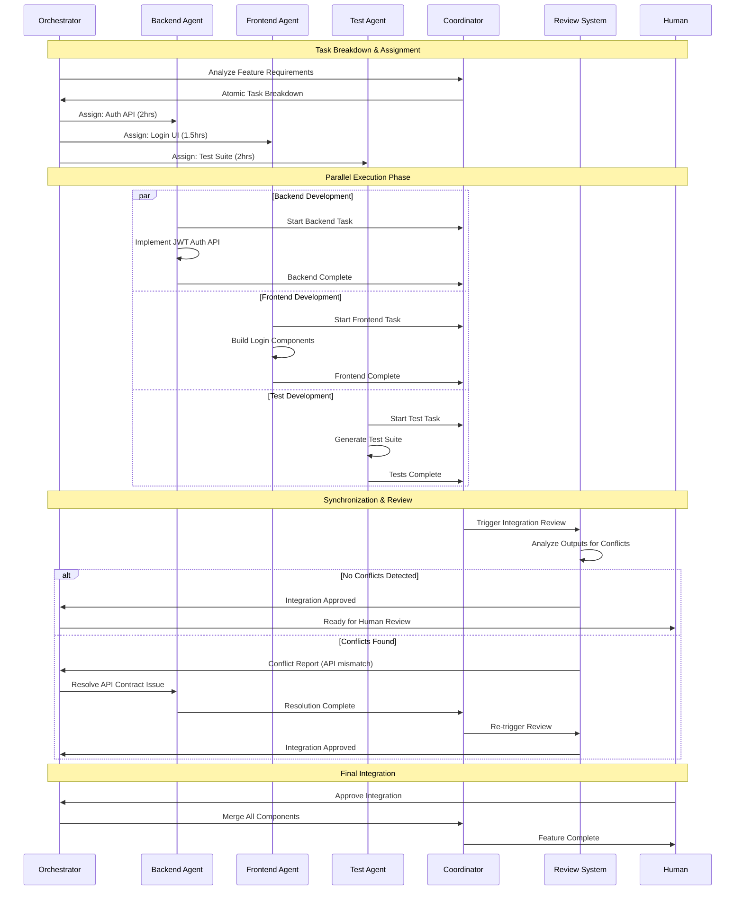
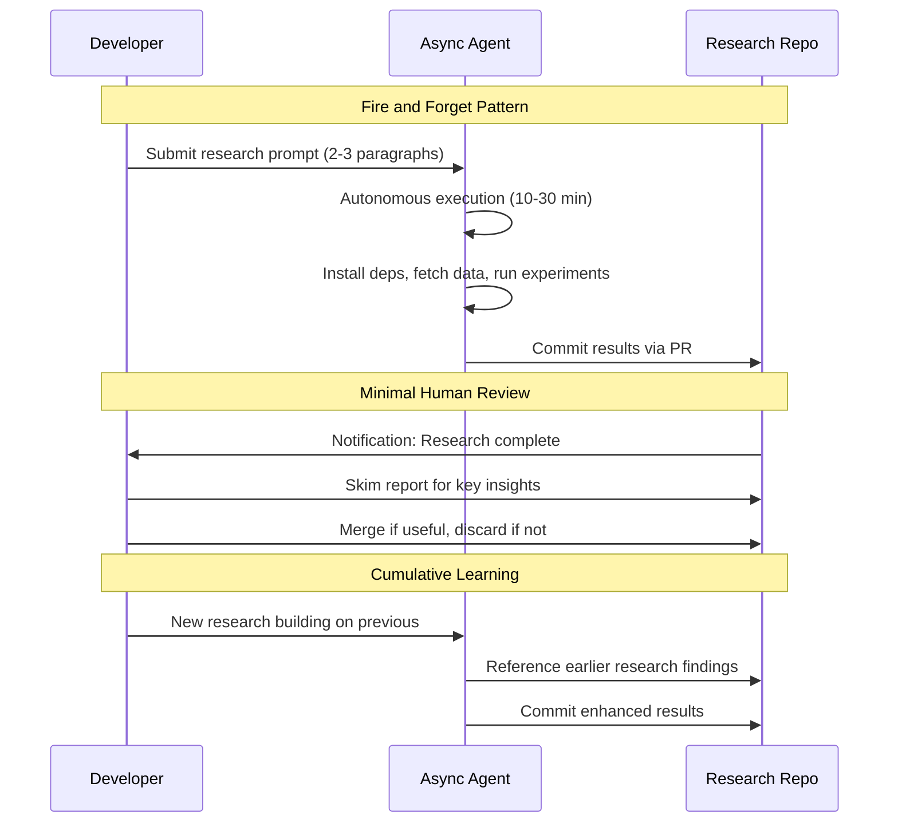
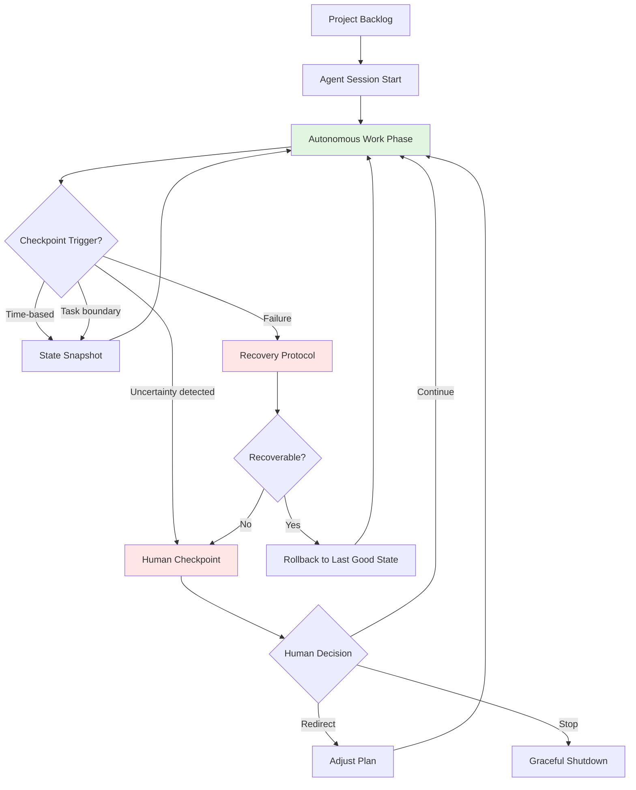
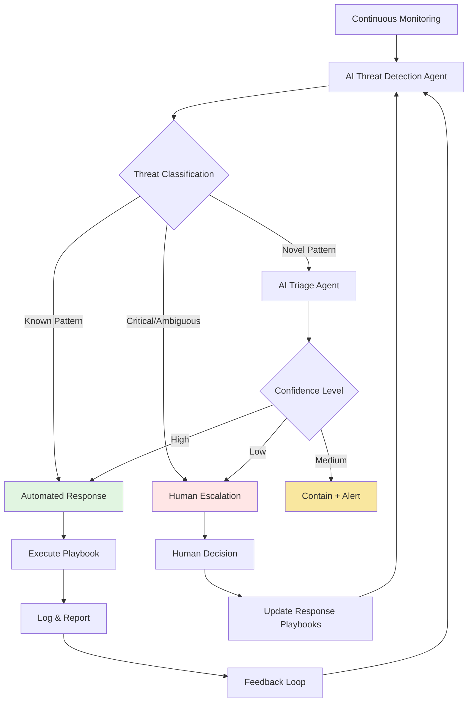

# Experimental AI Development Patterns

A collection of experimental patterns for AI-assisted development that are under active development and evaluation. These patterns represent cutting-edge approaches that may be refined, consolidated, or evolved based on community feedback and real-world usage.

## Pattern Organization

These experimental patterns extend the core AI development patterns with advanced workflows and emerging practices:

- **[Advanced Workflows](#advanced-workflows)** - Complex orchestration patterns for mature AI development teams
- **[Operations Automation](#operations-automation)** - Experimental automation patterns for CI/CD and production management
- **[Monitoring & Intelligence](#monitoring--intelligence)** - Advanced observability and predictive maintenance patterns

## Pattern Exploration

**[NOTES.md](NOTES.md)** - Tracks patterns under early exploration before formalization. This is where new pattern ideas are documented, evaluated, and refined before becoming full experimental patterns. Current explorations include voice-to-code interfaces and other emerging AI development approaches.

## Experimental Pattern Reference

| Pattern | Maturity | Type | Description | Dependencies |
|---------|----------|------|-------------|--------------|
| **[Handoff Protocols](#handoff-protocols)** | Intermediate | Foundation | Clear boundaries and procedures for transitioning work between human developers and AI | Developer Lifecycle |
| **[Testing Orchestration](#testing-orchestration)** | Intermediate | Workflow | Unified approach to test-first development, automated generation, and quality assurance | Spec-Driven Development |
| **[Workflow Orchestration](#workflow-orchestration)** | Advanced | Workflow | Coordinate sequential pipelines, parallel workflows, and hybrid human-AI processes | Testing Orchestration, Tool Integration |
| **[Review Automation](#review-automation)** | Intermediate | Operations | Automate review process for parallel agent outputs using AI to detect conflicts and coordinate integration | Workflow Orchestration, Atomic Decomposition |
| **[Debt Forecasting](#debt-forecasting)** | Intermediate | Operations | Proactively identify and prioritize technical debt using AI-powered code analysis | Guided Refactoring, Guided Architecture, Tool Integration |
| **[Pipeline Synthesis](#pipeline-synthesis)** | Intermediate | Workflow | Convert plain-English build specifications into CI/CD pipeline configurations | Workflow Orchestration, Tool Integration |
| **[Deployment Synthesis](#deployment-synthesis)** | Advanced | Operations | Generate blue-green deployment scripts with validation to prevent AI misconceptions | Pipeline Synthesis |
| **[Drift Remediation](#drift-remediation)** | Advanced | Operations | Detect infrastructure configuration drift and generate corrective patches automatically | Pipeline Synthesis |
| **[Release Synthesis](#release-synthesis)** | Beginner | Operations | Automatically generate structured release notes by analyzing git commit history | Pipeline Synthesis |
| **[Incident Automation](#incident-automation)** | Advanced | Operations | Generate actionable incident response playbooks from historical incident data | Baseline Management |
| **[Suite Health](#suite-health)** | Intermediate | Operations | Analyze build history to identify and remediate flaky tests automatically | Testing Orchestration |
| **[Test Promotion](#test-promotion)** | Intermediate | Development | Separate AI-generated tests from immutable golden tests to prevent AI from weakening test assertions | Testing Orchestration, Spec-Driven Development |
| **[Upgrade Advisor](#upgrade-advisor)** | Intermediate | Operations | Intelligently manage dependency upgrades with compatibility analysis and risk assessment | Debt Forecasting |
| **[Handoff Automation](#handoff-automation)** | Intermediate | Operations | Generate comprehensive handoff briefs that summarize system state and active issues | Incident Automation |
| **[Chaos Engineering](#chaos-engineering)** | Advanced | Operations | Generate targeted chaos experiments based on system architecture and dependencies | Baseline Management |
| **[ChatOps Security](#chatops-security)** | Beginner | Operations | Deploy security scanning capabilities through chat commands for immediate feedback | Security Orchestration |
| **[Evidence Automation](#evidence-automation)** | Advanced | Operations | Generate audit evidence matrices from logs and configuration changes automatically | Security Orchestration |
| **[Context Optimization](#context-optimization)** | Advanced | Development | Match AI tool selection to task complexity and optimize cost/performance trade-offs | Progressive Enhancement |
| **[Asynchronous Research](#asynchronous-research)** | Intermediate | Development | Use fire-and-forget coding agents in dedicated repositories to conduct autonomous code investigations that prove technical feasibility through executable experiments | Parallel Agents, Context Persistence, Choice Generation |
| **[Long-Running Orchestration](#long-running-orchestration)** | Advanced | Workflow | Coordinate agents working autonomously for hours or days, maintaining coherent state across sessions with strategic human checkpoints | Parallel Agents, Context Persistence, Workflow Orchestration |
| **[Autonomous Defense](#autonomous-defense)** | Advanced | Operations | Deploy AI agents for real-time security threat detection and automated response at machine speed to match the pace of autonomous threats | Security Orchestration, Incident Automation |

---

## Advanced Workflows

### Handoff Protocols

**Maturity**: Intermediate  
**Description**: Clear boundaries and procedures for transitioning work between human developers and AI tools based on complexity, security requirements, and creative problem-solving needs.

**Related Patterns**: [Developer Lifecycle](../README.md#developer-lifecycle), [Observable Development](../README.md#observable-development), [Workflow Orchestration](#workflow-orchestration)

**Handoff Decision Framework**



**Handoff Execution Sequence**



**Anti-pattern: Broken Boundaries**
Allowing AI and humans to work on the same task simultaneously without clear handoff points leads to conflicts, duplicated effort, and inconsistent quality.

---

### Testing Orchestration

**Maturity**: Intermediate  
**Description**: Unified approach combining test-first development, automated test generation, and quality assurance patterns to ensure AI-generated code meets quality and behavioral specifications.

**Pattern Boundary Clarification**:
- **This pattern** focuses on overall testing strategy and test generation
- **Spec-Driven Development** focuses on writing specs before implementation
- **Observable Development** focuses on logging and debugging for AI understanding
- **Automated Traceability** focuses on linking requirements to tests and implementation

**Related Patterns**: [Spec-Driven Development](../README.md#spec-driven-development), [Observable Development](../README.md#observable-development)

**Integrated Testing Framework**



**Testing Workflow Execution Sequence**



**Anti-pattern: Scattered Testing**
Generating tests with AI without a coherent strategy leads to poor coverage, flaky tests, and false confidence in code quality.

---

### Workflow Orchestration

**Maturity**: Advanced  
**Description**: Coordinate sequential pipelines, parallel agent workflows, and hybrid human-AI processes for complex development tasks. Transform synchronous single-agent workflows into asynchronous, event-driven multi-agent architectures while maintaining safety and consistency.

**Related Patterns**: [Handoff Protocols](#handoff-protocols), [Tool Integration](../README.md#tool-integration), [Testing Orchestration](#testing-orchestration), [Atomic Decomposition](../README.md#atomic-decomposition)

**Workflow Types & Selection**



**Parallel Agent Coordination Sequence**



**Parallel Agent Coordination Examples**

```bash
# Atomic task breakdown for parallel execution
ai_task_manager "Break down user authentication feature into atomic tasks:
- Each task <2 hours completion time
- Independent implementation (no shared state)
- Clear input/output contracts
- Parallelizable across agents"

# Parallel agent execution with safety
ai_orchestrator --parallel --safe-mode \
  --task="backend-auth-api" --agent="backend-specialist" \
  --task="frontend-login-ui" --agent="frontend-specialist" \
  --task="integration-tests" --agent="testing-specialist" \
  --sync-point="integration-review"

# Safety-first parallel review
ai_reviewer --parallel-output \
  --check-conflicts \
  --verify-contracts \
  --merge-strategy="human-approval"
```

**Parallel Agent Safety Framework**

```yaml
# .ai/parallel-config.yml
parallel_safety:
  max_concurrent_agents: 3
  conflict_detection: enabled
  shared_resources:
    - "src/shared/"
    - "package.json"
    - "database/migrations/"
  isolation_boundaries:
    - backend: "src/api/"
    - frontend: "src/components/"
    - testing: "tests/"
  sync_points:
    - after_implementation
    - before_integration
    - before_deployment
```

**Anti-pattern: Chaotic Orchestration**
Using multiple AI tools without proper orchestration leads to inconsistent code, integration conflicts, and wasted effort from competing implementations.

**Anti-pattern: Unsafe Parallelism**
Running parallel agents without proper isolation, conflict detection, or sync points risks data corruption, merge conflicts, and system instability.

---

### Context Optimization

**Maturity**: Advanced  
**Description**: Match AI tool selection to task complexity and optimize cost/performance trade-offs by understanding different AI models' context window capabilities and computational costs.

**Related Patterns**: [Progressive Enhancement](../README.md#progressive-enhancement), [Choice Generation](../README.md#choice-generation)

**Tool Selection Decision Matrix**

| Task Complexity | Context Needed | Recommended Tool | Cost Level | Use Case |
|-----------------|----------------|------------------|------------|----------|
| Simple queries | <1K tokens | GPT-3.5, Claude Haiku | Low | Quick questions, simple code |
| Medium features | 1K-8K tokens | GPT-4, Claude Sonnet | Medium | Feature implementation |
| Complex systems | 8K-32K tokens | GPT-4 Turbo, Claude Opus | High | Architecture, large refactors |
| Massive codebases | 32K+ tokens | Claude-100K, GPT-4-128K | Premium | Full system analysis |

**Anti-pattern: Wasteful Context**
Always using the most powerful (expensive) AI model for simple tasks wastes resources and increases latency for routine operations.

---
### Asynchronous Research

**Maturity**: Intermediate
**Description**: Use fire-and-forget coding agents in dedicated repositories to conduct autonomous code investigations that prove technical feasibility through executable experiments.

**Related Patterns**: [Parallel Agents](../README.md#parallel-agents), [Context Persistence](../README.md#context-persistence), [Choice Generation](../README.md#choice-generation)

**Source**: Simon Willison, "[Code research projects with async coding agents](https://simonwillison.net/2025/Nov/6/async-code-research/)", November 6, 2025

#### Core Concept

**"Code research"** - answering technical questions definitively by writing and executing code. Simon's key insight: *"The great thing about questions about code is that they can often be definitively answered by writing and executing code."*

Use asynchronous coding agents (Claude Code for web, Codex Cloud, Gemini Jules, GitHub Copilot) to conduct autonomous investigations in dedicated research repositories. Fire-and-forget execution allows 2-3 research tasks per day with minimal human oversight.

**Why it works**: *"LLMs hallucinate and make mistakes. This is far less important for code research tasks because the code itself doesn't lie: if they write code and execute it and it does the right things then they've demonstrated to both themselves and to you that something really does work."*

#### Implementation Pattern

**1. Dedicated Research Repository**

Create separate repository from production code to enable unrestricted experimentation:

```bash
# Create dedicated research repo (public or private)
gh repo create my-research --private

# Configure for unrestricted network access
# Claude Code: Settings → Enable network access
# Codex Cloud: Enable full sandbox permissions
# Jules: Default unrestricted access
```

**Key benefits:**
- Safe to grant full network access (no production secrets)
- One folder per research task
- Archive of explorations for future reference
- "Slop containment" - keeps AI-generated content separate

**2. Research Question Formulation**

Convert technical curiosity into testable hypothesis with clear deliverables:

**Good research questions (from Simon's examples):**
- "Could Redis Streams handle 10k concurrent notification subscribers?"
- "How do 7 Python Markdown libraries compare on performance?"
- "Can cmarkgfm C extension compile for Pyodide WebAssembly?"

**Example prompt (Simon's markdown comparison):**
```
Create a performance benchmark and feature comparison report on PyPI cmarkgfm
compared to other popular Python markdown libraries—check all of them out from
github and read the source to get an idea for features, then design and run a
benchmark including generating some charts, then create a report in a new
python-markdown-comparison folder. Make sure the performance chart images are
directly displayed in the README.md in the folder.
```

**3. Asynchronous Execution Workflow**



**4. Network Access Configuration**

Simon's critical insight: For dedicated research repos, **unrestricted network access is safe and essential**.

**Why it's safe:** "Lethal trifecta" prompt injection attacks only matter if there are secrets to steal. Research repos have no production credentials.

**What unrestricted access enables:**
- Install any dependencies (pip, npm, cargo, apt-get)
- Fetch data from web APIs and documentation
- Clone external repositories
- Download datasets for benchmarking
- Access Stack Overflow, documentation sites

**5. Result Capture & Deliverables**

**Typical agent outputs:**
- Working proof-of-concept code
- Benchmark results with charts/visualizations
- Test scripts proving functionality
- Markdown reports explaining findings
- JSON data files with measurements

**Simon's example results:**

**python-markdown-comparison:**
- Benchmarked 7 Markdown libraries
- Generated performance bar charts
- Found cmarkgfm 10-52x faster than alternatives
- Feature comparison matrix

**cmarkgfm-in-pyodide:**
- Compiled 88.4KB `.whl` with C extension for WebAssembly
- Proved it loads in Pyodide inside Node.js
- When stuck, Simon prompted: *"Complete this project, actually run emscripten, I do not care how long it takes"*

**blog-tags-scikit-learn:**
- Downloaded SQLite database, trained ML models
- Generated JSON results for multiple approaches
- Python scripts for reproduction

**Human review approach:**
- Skim report for key insights
- Verify research question was answered
- Don't audit code line-by-line (it's exploratory)
- Accept as "slop" (AI-generated, not production-quality)

**6. Cross-Project Learning**

Research tasks build on each other within same repository:

```bash
# Research task 1: Prove Node.js can run Pyodide
# Result: node-pyodide/ folder with working example

# Research task 2: Build on previous finding
# Prompt: "Building on the node-pyodide example, compile cmarkgfm
# C extension for Pyodide and prove it works in Node.js"
# Result: cmarkgfm-in-pyodide/ folder reusing earlier work
```

Simon added `AGENTS.md` to his research repo with guidance for future agent runs—creating institutional memory.

#### Example Research Tasks

**Performance Benchmark:**
```
Work in new folder: redis-performance/

Build Redis Streams notification system.
Simulate 10,000 users receiving 100 notifications/second.
Run for 1 hour and measure:
- Memory usage over time
- P95 latency for delivery
- Behavior under network partition
- Recovery after Redis restart

Produce Python code, charts, detailed markdown report.
```

**Library Comparison:**
```
Work in new folder: python-markdown-comparison/

Benchmark these Python Markdown libraries:
- cmarkgfm, mistune, markdown2, commonmark, mistletoe, marko, markdown

For each library:
1. Clone from GitHub, analyze features from source
2. Run performance tests (small/medium/large documents)
3. Measure parsing speed, memory usage
4. Generate comparison charts
5. Create feature matrix

Output: README.md with embedded charts, raw benchmark data as JSON.
```

**Feasibility Study:**
```
Work in new folder: rust-wasm-integration/

Investigate if Rust crate 'pulldown-cmark' can compile to WebAssembly
and run in browser with acceptable performance.

Tasks:
1. Compile pulldown-cmark to wasm32-unknown-unknown target
2. Create minimal HTML page loading the WASM module
3. Benchmark parse time vs JavaScript alternatives
4. Document build process and dependencies
5. Identify any browser compatibility issues

Deliverable: Working demo + performance comparison + build guide.
```

#### Platforms (as of November 2025)

| Platform | Free Tier | Network Access | Best For |
|----------|-----------|----------------|----------|
| **Claude Code (web)** | $250 credits for $20/month users (until Nov 18, 2025) | Configurable | Complex research, multi-file projects |
| **Gemini Jules** | Free tier available | Default unrestricted | Quick explorations, proof-of-concepts |
| **Codex Cloud** | Pay-as-you-go | Configurable | Enterprise research workflows |
| **GitHub Copilot Agent** | Enterprise plans | Configurable | GitHub-integrated research |

#### Simon's Success Metrics

From 2 weeks of practice (as of November 6, 2025):

- **13 research projects** completed in 2 weeks (~1/day average)
- **2-3 research tasks/day** at peak
- **Minutes of human time** per task (just prompt formulation + review)
- **10-30 minutes** typical agent execution time
- **Frequent useful results** informing development decisions

**Quote from Simon:** *"I'm firing off 2-3 code research projects a day right now. My own time commitment is minimal and they frequently come back with useful or interesting results."*

#### Integration with Development Workflow

**Research → Decision → Implementation cycle:**

```
Technical Question
  ↓
Research Prompt (2-3 paragraphs)
  ↓
Async Agent Execution (10-30 min)
  ↓
Working Code + Findings
  ↓
Informed Decision
  ↓
Choice Generation / Planned Implementation
  ↓
Production Code
```

**How it complements other patterns:**

- **Before Choice Generation**: Validate which options are technically feasible
- **Before Planned Implementation**: Provide real performance data for planning
- **With Context Persistence**: Archive research for future sessions
- **With Parallel Agents**: Run multiple research questions simultaneously

#### Complete Example

See [examples/asynchronous-research/](examples/asynchronous-research/) for:
- Setup scripts for research repositories
- Platform configuration guides (Claude Code, Jules, Codex)
- Reusable prompt templates
- Sample research projects
- GitHub Action for auto-generating research index

#### Anti-pattern: Blind Investigation

**Problem**: Vague research prompts without clear goals or success criteria.

```bash
# Bad - No clear objective
"Investigate Redis and try some stuff with notifications"

# Why it fails:
# - Agent doesn't know what to prove
# - No measurable success criteria
# - Results won't connect to actual use case
# - Wastes compute on unfocused exploration

# Good - Specific, testable hypothesis
"Build proof-of-concept notification system using Redis Streams.
Simulate 10,000 concurrent users, 100 notifications/second.
Measure memory, P95 latency, partition behavior over 1 hour.
Produce Python code, charts, detailed report."
```

#### Anti-pattern: Uncontained Slop

**Problem**: Publishing AI-generated research directly to main documentation without review.

Simon's approach:
- Keep research in dedicated repo
- Mark repo as `noindex` for search engines
- *"I still like to keep AI-generated content out of search, to avoid contributing more to the dead internet."*

#### Anti-pattern: Leaked Secrets

**Problem**: Running unrestricted agents on production repos containing credentials.

Simon warns: *"A prompt injection attack of the lethal trifecta variety could easily be used to steal sensitive code or environment variables."*

**Solution**: Only use unrestricted access on dedicated, secret-free research repos.

#### Anti-pattern: Unfounded Impossibility

**Problem**: Expecting agents to prove something can't be done.

Simon's caveat: *"They can't prove something is impossible—just because the coding agent couldn't find a way to do something doesn't mean it can't be done."*

**Use for**: Proving feasibility, not impossibility.

---

### Long-Running Orchestration

**Maturity**: Advanced
**Description**: Coordinate agents working autonomously for hours or days, maintaining coherent state across work sessions with strategic human checkpoints and failure recovery.

**Related Patterns**: [Parallel Agents](../README.md#parallel-agents), [Context Persistence](../README.md#context-persistence), [Workflow Orchestration](#workflow-orchestration), [Handoff Protocols](#handoff-protocols)

**Source**: [Anthropic 2026 Agentic Coding Trends Report](https://resources.anthropic.com/hubfs/2026%20Agentic%20Coding%20Trends%20Report.pdf) (Trend 3: Long-running agents build complete systems)

#### Core Concept

Early agents handled one-shot tasks in minutes. Long-running orchestration enables agents to work autonomously for extended periods—building entire applications and systems with minimal human intervention focused on strategic oversight at key decision points.

**Key shift**: Task horizons expand from minutes to days or weeks. Agents plan, iterate, and refine across dozens of work sessions, adapting to discoveries, recovering from failures, and maintaining coherent state throughout complex projects.

**Long-Running Orchestration Lifecycle**



#### Implementation

**1. Session State Persistence**

Maintain coherent state across agent restarts and context window resets:

```markdown
# .agent/session-state.md

## Current Session
- **Session ID**: session-2026-02-10-001
- **Started**: 2026-02-10T08:00:00Z
- **Phase**: Implementation (3 of 5)
- **Completed Tasks**: 12/23

## Active Context
- Working on: Payment service integration
- Blocked by: None
- Last checkpoint: 2026-02-10T14:30:00Z (all tests passing)

## Decision Log
- 14:15: Chose Redis Streams over Kafka for event bus (lower ops complexity)
- 11:30: Switched from REST to gRPC for inter-service calls (latency requirements)

## Recovery Points
- checkpoint-003: Pre-payment-integration (clean, tests green)
- checkpoint-002: Post-auth-service (clean, tests green)
- checkpoint-001: Initial scaffold (clean)
```

**2. Checkpoint Strategy**

```bash
# Define checkpoint triggers in agent configuration
# .agent/orchestration.yml
checkpoints:
  time_based:
    interval: 2h              # Snapshot every 2 hours
    actions: [commit, test, report]

  task_boundary:
    on: task_complete          # Checkpoint between tasks
    actions: [commit, test, update_state]

  uncertainty:
    confidence_threshold: 0.6  # Escalate to human below 60% confidence
    actions: [pause, notify_human, wait_for_input]

  failure:
    max_retries: 3             # Three-strike rule
    actions: [rollback, notify_human, create_handoff]

recovery:
  strategy: rollback_to_last_green
  state_dir: .agent/checkpoints/
  max_checkpoints: 10
```

**3. Backlog-Driven Autonomous Execution**

```bash
#!/bin/bash
# agent-runner.sh - Long-running agent with checkpoint management

SESSION_ID="session-$(date +%Y%m%d-%H%M%S)"
CHECKPOINT_DIR=".agent/checkpoints"
STATE_FILE=".agent/session-state.md"
mkdir -p "$CHECKPOINT_DIR"

# Create checkpoint before each task
create_checkpoint() {
    local name="$1"
    git add -A && git commit -m "checkpoint: $name [$SESSION_ID]"
    git tag "checkpoint-$SESSION_ID-$(date +%s)"
    cp "$STATE_FILE" "$CHECKPOINT_DIR/$name.md"
    echo "Checkpoint created: $name"
}

# Recover from failure
recover() {
    local last_good=$(git tag -l "checkpoint-$SESSION_ID-*" | tail -1)
    if [ -n "$last_good" ]; then
        echo "Rolling back to: $last_good"
        git checkout "$last_good" -- .
        return 0
    fi
    return 1
}

# Process backlog items sequentially with checkpoints
while read -r task; do
    echo "Starting task: $task"
    create_checkpoint "pre-$task"

    # Agent executes task with retry logic
    attempts=0
    while [ $attempts -lt 3 ]; do
        if ai "Execute task: $task
            Context: $(cat $STATE_FILE)
            Constraints: Run tests after changes, commit atomically"; then
            create_checkpoint "post-$task"
            break
        fi
        attempts=$((attempts + 1))
        echo "Attempt $attempts failed for: $task"
        recover
    done

    if [ $attempts -eq 3 ]; then
        echo "Task failed after 3 attempts: $task"
        ai "Create HANDOFF.md for blocked task: $task"
        # Notify human and continue with next task
    fi
done < backlog.txt
```

**4. Human Checkpoint Protocol**

```bash
# Periodic human review of autonomous work
ai "Generate progress report for human checkpoint:

1. Tasks completed since last review (with test results)
2. Architectural decisions made (with rationale)
3. Current blockers or uncertainties
4. Remaining backlog estimate
5. Any deviations from original plan

Format for 2-minute executive review."
```

#### When to Use Long-Running Orchestration

- **Multi-day feature builds**: Complete features or applications spanning multiple work sessions
- **Technical debt elimination**: Agents systematically working through debt backlogs
- **Large-scale migrations**: Database migrations, API versioning, framework upgrades
- **Greenfield applications**: Building entire applications from specifications

#### Case Study

From the Anthropic report: Rakuten engineers tested Claude Code on a complex task—implementing a specific activation vector extraction method in vLLM, a massive open-source library with 12.5 million lines of code in multiple programming languages. Claude Code finished the entire job in seven hours of autonomous work in a single run. The implementation achieved 99.9% numerical accuracy compared to the reference method.

#### Anti-pattern: Unmonitored Autonomy

Running agents for extended periods without checkpoint strategies, state persistence, or human review cadence.

**Why it's problematic:**
- Agents can drift from requirements over long sessions
- Failures compound without early detection
- Context window resets lose critical decision history
- No rollback points when something goes wrong

```bash
# Bad: Fire and forget for days
ai "Build the entire payment system" &  # No checkpoints, no monitoring

# Good: Structured autonomy with checkpoints
./agent-runner.sh \
  --backlog backlog.txt \
  --checkpoint-interval 2h \
  --human-review-cadence 4h \
  --max-retries 3 \
  --state-dir .agent/
```

#### Anti-pattern: Brittle Sessions

Relying on a single context window for multi-day work without external state persistence, causing complete context loss on restart.

```bash
# Bad: All state lives in the conversation
# (Context window resets = lost decisions, duplicated work)

# Good: Externalize state to files that survive restarts
# session-state.md, DECISIONS.log, TODO.md, checkpoints/
```

---

## Operations Automation

### Review Automation

**Maturity**: Intermediate  
**Description**: Automate review process for parallel agent outputs using AI to detect conflicts and coordinate integration.

**Related Patterns**: [Workflow Orchestration](#workflow-orchestration), [Atomic Decomposition](../README.md#atomic-decomposition), [Parallel Agents](../README.md#parallel-agents)

**Automated Review and Merge System**

```bash
#!/bin/bash
# automated-review.sh - Complete parallel agent review and integration

echo "=== Review Automation for Parallel Agents ==="

# 1. Detect conflicts between agent outputs
echo "Scanning for conflicts across agent workspaces..."

ai "Analyze parallel agent outputs for integration issues:

Agent workspaces: $(ls -d workspace/agent-* 2>/dev/null || echo 'none')

Check for:
1. File conflicts (same files modified by multiple agents)
2. API contract mismatches (function signatures, return types)
3. Dependency version conflicts
4. Naming collisions (classes, functions, variables)
5. Integration compatibility issues

For each conflict found:
- Identify which agents are involved
- Assess conflict severity (critical/medium/low)
- Suggest resolution strategy
- Generate merge commands when possible

Output structured JSON with conflicts and resolutions."

# 2. Run quality gates and validation
echo "Running quality gates on combined outputs..."

ai "Validate merged agent outputs meet quality standards:

Quality checks:
- Syntax validation (python -m py_compile)
- Type checking (mypy)
- Security scan (bandit)
- Test coverage (>80% requirement)
- Performance regression check

Generate integration tests that:
- Import all agent outputs without conflicts
- Test cross-agent functionality
- Verify API compatibility
- Check end-to-end workflows

Return pass/fail status with specific issues found."

# 3. Auto-merge or request human review
if [ $? -eq 0 ]; then
    echo "✅ Quality gates passed - proceeding with automatic merge"
    
    # Merge agent outputs
    mkdir -p workspace/merged
    for agent_dir in workspace/agent-*; do
        rsync -av --ignore-existing "$agent_dir/" workspace/merged/
    done
    
    # Run integration tests
    cd workspace/merged && python -m pytest tests/integration/ -v
    
    if [ $? -eq 0 ]; then
        echo "✅ Integration tests passed - merge complete"
        rsync -av workspace/merged/ src/
        rm -rf workspace/agent-*
    else
        echo "❌ Integration tests failed - manual review required"
    fi
else
    echo "⚠️ Quality gates failed - human review required"
    # Create review report for humans
    ai "Generate human-readable review report with:
    - Summary of all conflicts found
    - Recommended resolution steps
    - Risk assessment for each issue
    - Estimated effort to resolve manually"
fi
```

**Anti-pattern: Manual Reviews**
Relying entirely on human reviewers for parallel agent outputs creates bottlenecks and misses systematic integration issues that automated tools can catch.

---

### Debt Forecasting

**Maturity**: Intermediate  
**Description**: Proactively identify and prioritize technical debt using AI-powered code analysis.

**Related Patterns**: [Guided Refactoring](../README.md#guided-refactoring), [Guided Architecture](../README.md#guided-architecture), [Tool Integration](../README.md#tool-integration)

```bash
ai "Analyze codebase for technical debt indicators and forecast maintenance burden:
1. Code complexity hotspots
2. Cyclomatic complexity trends  
3. Dependency staleness
4. Test coverage gaps
5. Documentation drift
Prioritize by maintenance cost and business impact."
```

**Anti-pattern: Reactive Debt**
Waiting until technical debt becomes a crisis instead of continuously monitoring and addressing it through predictive analysis.

---

### Pipeline Synthesis

**Maturity**: Intermediate  
**Description**: Convert plain-English build specifications into CI/CD pipeline configurations.

**Related Patterns**: [Workflow Orchestration](#workflow-orchestration), [Tool Integration](../README.md#tool-integration)

```bash
ai "Generate GitHub Actions workflow from specification:
Build Requirements:
- Node.js 18 with npm ci
- Run tests with jest
- Deploy to AWS on main branch push
- Require test coverage >80%

Output complete .github/workflows/ci.yml with security best practices."
```

**Anti-pattern: Manual Pipelines**
Hand-crafting and updating CI/CD configurations instead of generating them from requirements specifications leads to inconsistency and maintenance burden.

---

### Deployment Synthesis

**Maturity**: Advanced  
**Description**: Generate blue-green deployment scripts with validation to prevent AI misconceptions about deployment strategies.

**Related Patterns**: [Pipeline Synthesis](#pipeline-synthesis)

**Important**: AI tools often confuse blue-green with canary deployments. Blue-green requires full environment duplication and instant traffic switching.

```yaml
# blue-green-deploy.yml - Full environment switch pattern
deployment_strategy: "blue-green"
traffic_routing:
  method: "dns_switch"  # Instant 100% traffic switch
  rollback_time: "< 30 seconds"
environments:
  blue:
    infrastructure: "complete duplicate"
    traffic_percentage: "100% OR 0%"  # Never split
  green:
    infrastructure: "complete duplicate" 
    traffic_percentage: "0% OR 100%"  # Never split
validation:
  health_checks: ["api_health", "database_connection"]
  smoke_tests: ["critical_user_flows"]
  approval_required: true
```

**Anti-pattern: Confused Deployment**
AI-generated deployment scripts that mix blue-green and canary strategies, resulting in complex traffic splitting instead of simple environment switching.

---

### Drift Remediation

**Maturity**: Advanced  
**Description**: Detect infrastructure configuration drift and generate corrective patches automatically.

**Related Patterns**: [Pipeline Synthesis](#pipeline-synthesis)

```bash
ai "Compare current AWS infrastructure against Terraform state:
1. Identify configuration drift in EC2, RDS, S3
2. Generate corrective Terraform plan
3. Assess drift risk level (critical/medium/low)
4. Create automated remediation script with approval gates"
```

**Anti-pattern: Manual Drift**
Relying on periodic manual infrastructure audits instead of continuous automated drift detection and remediation.

---

### Release Synthesis

**Maturity**: Beginner  
**Description**: Automatically generate structured release notes by analyzing git commit history.

**Related Patterns**: [Pipeline Synthesis](#pipeline-synthesis)

```bash
ai "Generate release notes from git log --since='2 weeks ago':
Format:
## Features
## Bug Fixes  
## Breaking Changes
## Dependencies

Group by conventional commit prefixes and business impact."
```

**Anti-pattern: Manual Releases**
Writing release notes manually from memory instead of systematically analyzing commit history and pull request descriptions.

---

## Monitoring & Intelligence

### Incident Automation

**Maturity**: Advanced  
**Description**: Generate actionable incident response playbooks from historical incident data.

**Related Patterns**: [Baseline Management](../README.md#baseline-management)

```bash
ai "Analyze last 50 incidents in PagerDuty/AWS CloudWatch to:
1. Identify common failure patterns
2. Generate step-by-step runbooks
3. Create automated triage rules
4. Suggest preventive monitoring alerts"
```

**Anti-pattern: Static Runbooks**
Maintaining outdated incident response procedures instead of continuously improving them based on actual incident patterns and outcomes.

---

### Suite Health

**Maturity**: Intermediate  
**Description**: Analyze build history to identify and remediate flaky tests automatically.

**Related Patterns**: [Testing Orchestration](#testing-orchestration)

```bash
ai "Analyze Jenkins/GitHub Actions history for flaky tests:
1. Calculate test reliability scores
2. Identify environmental vs code-related failures  
3. Generate test stabilization patches
4. Recommend test suite restructuring"
```

**Anti-pattern: Ignored Flakiness**
Accepting unreliable tests as normal instead of systematically identifying and fixing test suite stability issues.

---

### Test Promotion

**Maturity**: Intermediate
**Description**: Separate AI-generated tests from immutable golden tests to prevent AI from weakening test assertions, with human-approved promotion ensuring only validated tests become behavioral contracts.

**Related Patterns**: [Testing Orchestration](#testing-orchestration), [Spec-Driven Development](../README.md#spec-driven-development), [Suite Health](#suite-health)

**Core Problem**

When AI generates both code AND tests, it can make tests pass by weakening them—the "self-grading student" problem. This applies to all AI code generation: new features, bug fixes, refactoring, or any implementation task.

**Test Separation Architecture**

```
tests/
├── golden/          # Immutable (444 permissions) - AI blocked
│   ├── auth/
│   │   └── test_jwt_validation.py
│   └── api/
│       └── test_payment.py
└── generated/       # Mutable - AI can freely generate/modify
    ├── test_edge_cases.py
    └── test_new_feature.py
```

**Defense-in-Depth Enforcement**

The pattern uses multiple enforcement layers because **file permissions alone are insufficient** - AI with bash access could bypass them with `chmod`.

```bash
# Layer 1: File permissions (prevents accidental edits)
chmod 444 tests/golden/**/*.py
# ⚠️  NOT SUFFICIENT: AI can run "chmod 644" via Bash to bypass

# Layer 2: AI hooks (blocks Edit/Write tools)
# .ai/hooks/protect-golden.sh
[[ "$TOOL_INPUT_FILE_PATH" =~ ^tests/golden/ ]] && exit 2  # BLOCK
# ⚠️  NOT SUFFICIENT: AI can still modify via Bash commands

# Layer 3: CI/CD enforcement (detects ANY git diff)
git diff --name-only origin/main...HEAD | grep '^tests/golden/' && {
  echo "❌ BLOCKED: Golden tests cannot be modified"
  exit 1
}
# ✅ RELIABLE: Catches all modifications regardless of method

# Layer 4: CODEOWNERS (requires human approval)
# .github/CODEOWNERS
tests/golden/**  @tech-leads @qa-leads
# ✅ RELIABLE: Human gate prevents merge even if AI commits changes
```

**Threat Model:**
- **Accidental Edit**: Blocked by file permissions (444)
- **AI Edit/Write Tool**: Blocked by AI hooks
- **AI Bash Bypass**: Detected by CI/CD git diff check
- **Committed Changes**: Blocked by CODEOWNERS requiring human approval

**Primary Enforcement**: CI/CD + CODEOWNERS, not file permissions.

**Promotion Workflow**

```bash
# AI generates test freely in tests/generated/
ai "Write payment idempotency test in tests/generated/test_payment.py"

# Human reviews and promotes
./scripts/promote-test.sh tests/generated/test_payment.py
# → Runs pytest validation
# → Interactive quality checklist
# → Copies to tests/golden/ with 444 permissions
# → Creates promotion PR requiring 2+ approvals
```

**Example: Golden Test Protection**

```python
# AI generates test freely
# tests/generated/test_new_feature.py
def test_payment_idempotency():
    """Payment processing should prevent duplicate charges."""
    process_payment(id="123", amount=100)
    with pytest.raises(DuplicateTransactionError):
        process_payment(id="123", amount=100)

# Human reviews → promotes to golden
# tests/golden/test_payment.py (444 perms, AI blocked)
```

**Complete Implementation**

See [examples/test-promotion/](examples/test-promotion/) for:
- Complete promotion workflow scripts
- CI/CD enforcement configuration
- AI protection hooks
- Example application demonstrating the pattern

**Anti-pattern: Mutable Baselines**

Allowing AI to modify existing tests to make its code pass, removing critical assertions.

```python
# BEFORE (correct test):
def test_payment_idempotency():
    process_payment(id="123", amount=100)
    with pytest.raises(DuplicateTransactionError):
        process_payment(id="123", amount=100)

# AFTER AI weakens test to pass buggy code:
def test_payment_idempotency():
    process_payment(id="123", amount=100)
    process_payment(id="123", amount=100)  # No error check!
    # BUG: Allows double-charging customers in production
```

Without immutable golden tests, AI can weaken assertions to make failing tests pass, eliminating regression protection.

**Anti-pattern: Permission-Only Protection**

Relying solely on file permissions (444) without CI/CD enforcement.

```bash
# INSUFFICIENT: AI can bypass via Bash
chmod 444 tests/golden/**  # AI runs: chmod 644 && edit && chmod 444

# REQUIRED: CI/CD + CODEOWNERS as primary enforcement
git diff tests/golden/ → CI blocks merge
tests/golden/** → CODEOWNERS requires human approval
```

File permissions provide defense-in-depth but are not sufficient alone. CI/CD git diff detection and CODEOWNERS are the primary enforcement mechanisms.

---

### Upgrade Advisor

**Maturity**: Intermediate  
**Description**: Intelligently manage dependency upgrades with compatibility analysis and risk assessment.

**Related Patterns**: [Debt Forecasting](#debt-forecasting)

```bash
ai "Analyze package.json/requirements.txt for upgrade opportunities:
1. Check security vulnerabilities (npm audit, safety)
2. Assess breaking change risk
3. Generate staged upgrade plan
4. Create rollback procedures"
```

**Anti-pattern: Reckless Upgrades**
Upgrading all dependencies simultaneously without risk assessment or staged rollout plans.

---

### Handoff Automation

**Maturity**: Intermediate  
**Description**: Generate comprehensive handoff briefs that summarize system state and active issues.

**Related Patterns**: [Incident Automation](#incident-automation)

```bash
ai "Generate on-call handoff brief from last 24h:
1. Active alerts and their context
2. Recent deployments and their status
3. Known issues and workarounds
4. Escalation contacts and procedures
Include trending metrics and anomaly detection."
```

**Anti-pattern: Undocumented Handoffs**
Relying on informal verbal communication for critical system state transfer instead of structured, documented handoff procedures.

---

### Chaos Engineering

**Maturity**: Advanced  
**Description**: Generate targeted chaos experiments based on system architecture and dependencies.

**Related Patterns**: [Baseline Management](../README.md#baseline-management)

```bash
ai "Design chaos experiments for microservices architecture:
1. Service dependency mapping
2. Failure mode identification (network, CPU, memory)
3. Blast radius calculation
4. Recovery validation scenarios
Generate Chaos Monkey/Litmus configurations."
```

**Anti-pattern: Random Chaos**
Running unfocused chaos experiments without clear hypotheses or measurement criteria instead of systematic resilience testing.

---

### ChatOps Security

**Maturity**: Beginner  
**Description**: Deploy security scanning capabilities through chat commands for immediate feedback.

**Related Patterns**: [Security Orchestration](../README.md#security-orchestration)

```bash
# Slack bot integration for security scanning
ai "Create Slack command handlers for:
/security-scan [repo] - Run full security audit
/vulnerability-check [package] - Check specific dependency
/compliance-status [environment] - Check policy compliance
Include results formatting and alert escalation."
```

**Anti-pattern: Delayed Security**
Waiting for scheduled security scans instead of enabling on-demand security validation through developer workflows.

---

### Evidence Automation

**Maturity**: Advanced  
**Description**: Generate audit evidence matrices from logs and configuration changes automatically.

**Related Patterns**: [Security Orchestration](../README.md#security-orchestration)

```bash
ai "Generate SOC 2 compliance evidence from AWS CloudTrail:
1. Access control changes (IAM policy modifications)
2. Data encryption validation (S3 bucket policies)
3. Network security controls (Security Group changes)
4. Monitoring coverage (CloudWatch alarm configurations)
Format as audit-ready evidence matrix with timestamps and responsible parties."
```

**Anti-pattern: Manual Evidence**
Manually gathering compliance evidence during audits instead of continuously collecting and organizing audit trail data.

---

### Autonomous Defense

**Maturity**: Advanced
**Description**: Deploy AI agents for real-time security threat detection and automated response at machine speed to match the pace of autonomous threats.

**Related Patterns**: [Security Orchestration](../README.md#security-orchestration), [Incident Automation](#incident-automation), [Security Sandbox](../README.md#security-sandbox), [Event Automation](../README.md#event-automation)

**Source**: [Anthropic 2026 Agentic Coding Trends Report](https://resources.anthropic.com/hubfs/2026%20Agentic%20Coding%20Trends%20Report.pdf) (Trend 8: Dual-use risk requires security-first architecture)

#### Core Concept

As AI agents become more capable, the same capabilities that help defenders also empower attackers. Traditional security workflows—aggregate findings, create tickets, wait for human review—are too slow against autonomous threats. Autonomous Defense uses AI agents to detect, triage, and respond to security events at machine speed, escalating to humans only for strategic decisions.

**Key insight from the report**: "Automated agentic systems enable security responses at machine speed, automating detection and response to match the pace of autonomous threats." Teams that use agentic tools to bake security in from the start will be better positioned to defend against adversaries using the same technology.

**How Autonomous Defense differs from existing security patterns:**

| Pattern | Focus | Response Time | Human Role |
|---------|-------|---------------|------------|
| [Security Orchestration](../README.md#security-orchestration) | Aggregate tool findings, AI summarizes | Minutes-hours (batch) | Reviews all findings |
| [ChatOps Security](#chatops-security) | On-demand scanning via chat | Minutes (on-demand) | Initiates scans |
| **Autonomous Defense** | **Real-time detection + automated response** | **Seconds (continuous)** | **Strategic oversight only** |

**Autonomous Defense Workflow**



#### Implementation

**1. Defense Agent Architecture**

```yaml
# .security/autonomous-defense.yml
defense_agents:
  detection:
    description: "Continuous monitoring of code changes, dependencies, and runtime"
    sources:
      - git_commits          # New code analysis
      - dependency_updates   # Supply chain monitoring
      - runtime_logs         # Application behavior anomalies
      - network_traffic      # Unusual API patterns
    scan_interval: "continuous"

  triage:
    description: "Classify threats and determine response"
    confidence_thresholds:
      auto_respond: 0.95     # High confidence → automated response
      contain_alert: 0.75    # Medium → contain and alert team
      human_escalate: 0.0    # Low confidence → human decision

  response:
    description: "Execute automated countermeasures"
    playbooks:
      credential_leak:
        actions: [rotate_secrets, revoke_tokens, audit_access, notify_team]
        max_auto_response_time: 30s
      dependency_vulnerability:
        actions: [block_deploy, create_patch_pr, notify_team]
        max_auto_response_time: 60s
      anomalous_behavior:
        actions: [isolate_service, capture_forensics, escalate_human]
        max_auto_response_time: 15s

escalation:
  channels: [pagerduty, slack_security]
  require_human_for:
    - infrastructure_changes
    - data_access_modifications
    - novel_attack_patterns
    - false_positive_overrides
```

**2. Real-Time Threat Detection**

```bash
#!/bin/bash
# defense-agent.sh - Continuous security monitoring with AI triage

# Monitor git pushes for security issues in real-time
monitor_commits() {
    ai "Analyze this commit for security threats:

    Commit: $(git log -1 --format='%H %s')
    Diff: $(git diff HEAD~1 --stat)
    Changed files: $(git diff HEAD~1 --name-only)

    Check for:
    1. Hardcoded secrets or API keys
    2. SQL injection vulnerabilities
    3. Dependency version downgrades
    4. Permission escalation patterns
    5. Suspicious file additions (.env, certificates, key files)
    6. Known CVE patterns in new dependencies

    Classify: CRITICAL / WARNING / CLEAN
    If CRITICAL: specify immediate response actions
    Output as structured JSON."
}

# Monitor dependency changes for supply chain attacks
monitor_dependencies() {
    ai "Analyze dependency changes for supply chain risks:

    Lock file diff: $(git diff HEAD~1 -- '*lock*' '*requirements*' '*package*')

    Check for:
    1. New packages from unknown publishers
    2. Version downgrades (potential rollback attacks)
    3. Typosquatting (similar names to popular packages)
    4. Packages with post-install scripts
    5. Known compromised package versions
    6. Unusual maintainer changes

    Risk level: HIGH / MEDIUM / LOW
    If HIGH: block deployment pipeline and alert team."
}

# Automated response for detected threats
respond_to_threat() {
    local threat_type="$1"
    local severity="$2"
    local context="$3"

    case "$threat_type" in
        "credential_leak")
            echo "Rotating affected credentials..."
            ./scripts/rotate-secrets.sh "$context"
            ./scripts/revoke-active-tokens.sh
            ./scripts/audit-recent-access.sh > forensics.log
            notify_team "CRITICAL: Credential leak detected and mitigated"
            ;;
        "vulnerable_dependency")
            echo "Blocking deployment pipeline..."
            gh workflow disable deploy.yml
            ai "Generate patch PR to update vulnerable dependency:
                Vulnerability: $context
                Create minimal fix with tests."
            notify_team "WARNING: Vulnerable dependency blocked, patch PR created"
            ;;
        "anomalous_pattern")
            echo "Isolating affected service..."
            kubectl scale deployment "$context" --replicas=0
            kubectl logs deployment/"$context" --since=1h > forensics.log
            notify_team "CRITICAL: Anomalous behavior detected, service isolated"
            ;;
    esac
}
```

**3. Proactive Security Hardening**

```bash
# AI agent continuously improves security posture
ai "Perform proactive security hardening analysis:

1. Scan codebase for OWASP Top 10 patterns
2. Review IAM policies for least-privilege violations
3. Check container configurations for security misconfigurations
4. Validate network policies and firewall rules
5. Audit logging coverage for forensic completeness

For each finding:
- Severity (CRITICAL/HIGH/MEDIUM/LOW)
- Specific file and line number
- Recommended fix with code snippet
- Whether fix can be auto-applied safely

Auto-apply LOW-risk fixes. Create PRs for MEDIUM. Alert for HIGH/CRITICAL."
```

**4. CI/CD Security Gate Integration**

```yaml
# .github/workflows/security-defense.yml
name: Autonomous Security Defense
on:
  push:
    branches: [main, develop]
  pull_request:
  schedule:
    - cron: '0 */4 * * *'  # Every 4 hours

jobs:
  threat-detection:
    runs-on: ubuntu-latest
    steps:
      - uses: actions/checkout@v4
        with:
          fetch-depth: 0

      - name: AI Threat Analysis
        run: |
          # Analyze changes for security threats
          ai "Analyze all changes since last successful scan:
          $(git diff ${{ github.event.before }}..HEAD)

          Check for: secrets, vulnerabilities, supply chain risks
          Output: JSON with threat_level, findings, recommended_actions"

      - name: Dependency Supply Chain Check
        run: |
          ai "Audit all dependency changes for supply chain risks:
          $(git diff ${{ github.event.before }}..HEAD -- '*lock*' '*requirements*')

          Flag: typosquatting, version downgrades, unknown publishers"

      - name: Automated Response
        if: failure()
        run: |
          # Block deployment and notify team
          gh workflow disable deploy.yml
          gh issue create --title "Security: Autonomous defense triggered" \
            --body "$(cat security-findings.json)"
```

#### When to Use Autonomous Defense

- **High-value targets**: Applications handling financial data, PII, or critical infrastructure
- **Rapid deployment cycles**: When deployment frequency outpaces manual security review capacity
- **Supply chain exposure**: Projects with large dependency trees vulnerable to supply chain attacks
- **Compliance requirements**: Environments requiring continuous security monitoring (SOC 2, PCI-DSS)
- **Adversarial environments**: Systems likely to face automated/AI-powered attacks

#### Security Democratization

The Anthropic report notes that "security knowledge becomes democratized" with AI agents—any engineer can deliver in-depth security reviews, hardening, and monitoring that previously required specialized expertise. This pattern operationalizes that prediction by embedding security agents directly into the development workflow.

#### Anti-pattern: Passive Scanning

Relying on periodic batch security scans (weekly/monthly) instead of continuous real-time monitoring, leaving windows where threats go undetected.

```bash
# Bad: Weekly cron job that generates a report nobody reads
0 0 * * 0 ./run-security-scan.sh > /var/log/security-weekly.log

# Good: Continuous monitoring with automated response
# - Every commit analyzed in real-time
# - Every dependency change evaluated for supply chain risk
# - Automated containment for high-confidence threats
# - Human escalation for novel or ambiguous patterns
```

**Why it's problematic:**
- Attackers exploit the gap between scans
- Alert backlogs create review fatigue
- Remediation happens days or weeks after introduction
- No automated response capability

#### Anti-pattern: Unchecked Response

Allowing defense agents to take drastic automated actions (shutting down production services, revoking all access tokens) without confidence thresholds, blast radius limits, or human escalation paths.

```yaml
# Bad: Automated response with no guardrails
response:
  on_any_threat: shutdown_everything  # No confidence check, no limits

# Good: Tiered response with guardrails
response:
  high_confidence_known_threat:
    actions: [rotate_credentials, block_deploy]
    require_human: false
  medium_confidence:
    actions: [contain, alert]
    require_human: within_15_minutes
  low_confidence_or_novel:
    actions: [log, alert]
    require_human: true  # Always escalate
```

**Why it's problematic:**
- False positives cause outages
- Over-aggressive response is a denial-of-service against yourself
- No human oversight for novel situations
- Can mask real attacks behind automated noise
