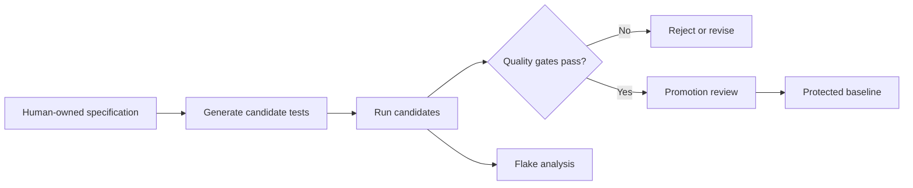
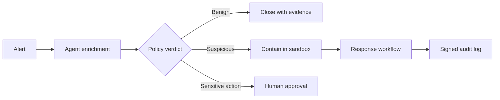

# Experimental AI Development Patterns

These patterns are under active evaluation. They follow the same naming, structure, and evidence
rules as the main catalog, but remain here while their boundaries, implementation guidance, or
adoption evidence mature.

## Experimental Pattern Reference

| Pattern | Maturity | Category | Type | Description | Dependencies |
|---|---|---|---|---|---|
| **Foundation** |  |  |  |  |  |
| **[Handoff Protocols](#handoff-protocols)** | Intermediate | Foundation | Foundation | Define how delegated work returns for review, approval, correction, or human takeover | [Developer Lifecycle](../README.md#developer-lifecycle) |
| **Development** |  |  |  |  |  |
| **[Testing Orchestration](#testing-orchestration)** | Intermediate | Development | Workflow | Coordinate AI-assisted test generation, execution, and quality gates without weakening behavioral contracts | [Spec-Driven Development](../README.md#spec-driven-development) |
| **[Workflow Orchestration](#workflow-orchestration)** | Advanced | Development | Workflow | Coordinate stateful sequential, parallel, and human-in-the-loop agent workflows | [Atomic Decomposition](../README.md#atomic-decomposition), [Tool Integration](../README.md#tool-integration) |
| **[Review Automation](#review-automation)** | Intermediate | Development | Workflow | Apply AI-assisted pull-request and code review while deterministic checks remain authoritative | [Adversarial Evaluator](../README.md#adversarial-evaluator) |
| **[Test Promotion](#test-promotion)** | Intermediate | Development | Development | Keep AI-generated candidate tests separate from human-approved behavioral baselines | [Testing Orchestration](#testing-orchestration), [Spec-Driven Development](../README.md#spec-driven-development) |
| **[Feedback Flywheel](#feedback-flywheel)** | Intermediate | Development | Development | Turn recurring agent-session corrections into durable rules, skills, and commands | [Codified Rules](../README.md#codified-rules), [Agent Memory](../README.md#agent-memory) |
| **[Long-Running Orchestration](#long-running-orchestration)** | Advanced | Development | Workflow | Maintain coherent state and checkpoints while agents work for hours or days | [Agent Memory](../README.md#agent-memory), [Bounded Autonomy](../README.md#bounded-autonomy) |
| **[Guided Architecture](#guided-architecture)** | Intermediate | Development | Development | Apply explicit architecture frameworks and decision records during AI-assisted design | [Developer Lifecycle](../README.md#developer-lifecycle), [Codified Rules](../README.md#codified-rules) |
| **[Autonomous Remediation](#autonomous-remediation)** | Intermediate | Development | Workflow | Pair deterministic detectors with bounded LLM repair loops | [Codified Rules](../README.md#codified-rules), [Bounded Autonomy](../README.md#bounded-autonomy) |
| **Operations — Security & Compliance** |  |  |  |  |  |
| **[ChatOps Security](#chatops-security)** | Beginner | Operations | Operations | Expose governed security checks through team chat commands | [Security Orchestration](#security-orchestration) |
| **[Autonomous SOC](#autonomous-soc)** | Advanced | Operations | Operations | Use agents to investigate, triage, and respond to SOC alerts with policy-bounded escalation | [Security Orchestration](#security-orchestration), [Security Sandbox](../README.md#security-sandbox) |
| **[Security Orchestration](#security-orchestration)** | Intermediate | Operations | Operations | Aggregate security tools and summarize findings into prioritized actions | [Tool Integration](../README.md#tool-integration), [Policy Generation](../README.md#policy-generation) |
| **Operations — Deployment Automation** |  |  |  |  |  |
| **[Autonomous Acceptance](#autonomous-acceptance)** | Advanced | Operations | Operations | Evaluate changes against separately owned executable acceptance policies and signed evidence | [Review Automation](#review-automation), [Test Promotion](#test-promotion) |
| **[Pipeline Synthesis](#pipeline-synthesis)** | Intermediate | Operations | Workflow | Generate validated CI/CD pipelines from plain-language requirements, including deployment strategies | [Workflow Orchestration](#workflow-orchestration), [Tool Integration](../README.md#tool-integration) |
| **[Dependency Migration](#dependency-migration)** | Intermediate | Operations | Operations | Have an agent analyze changelogs, compatibility, code edits, and validation for dependency migrations | [Autonomous Remediation](#autonomous-remediation), [Pipeline Synthesis](#pipeline-synthesis) |
| **Operations — Monitoring & Maintenance** |  |  |  |  |  |
| **[Incident Automation](#incident-automation)** | Advanced | Operations | Operations | Derive and execute incident-response workflows from telemetry and incident history | [Agent Observability](../README.md#agent-observability) |
| **[Flake Management](#flake-management)** | Intermediate | Operations | Operations | Detect, classify, quarantine, and suppress flaky tests from build history | [Testing Orchestration](#testing-orchestration) |
| **[On-Call Handoff](#on-call-handoff)** | Intermediate | Operations | Operations | Generate structured on-call briefs from active incidents, alerts, deployments, and responder context | [Incident Automation](#incident-automation), [Handoff Protocols](#handoff-protocols) |

Early ideas that are not yet catalog patterns remain in [NOTES.md](NOTES.md).

## Promotion Redirects

The following compatibility anchors preserve links to patterns that moved from this document to
the main catalog. These notices are redirects, not experimental catalog entries.

<a id="bounded-autonomy"></a>
- **Promoted:** [Bounded Autonomy](../README.md#bounded-autonomy)

<a id="context-optimization"></a>
- **Renamed and promoted:** [Model Routing](../README.md#model-routing)

<a id="asynchronous-research"></a>
- **Renamed and promoted:** [Code Research](../README.md#code-research)

<a id="drift-remediation"></a>
- **Promoted:** [Drift Remediation](../README.md#drift-remediation)

<a id="chaos-engineering"></a>
- **Renamed and promoted:** [Guided Chaos](../README.md#guided-chaos)

<a id="evidence-automation"></a>
- **Promoted:** [Evidence Automation](../README.md#evidence-automation)

<a id="debt-forecasting"></a>
- **Promoted:** [Debt Forecasting](../README.md#debt-forecasting)

## Foundation Patterns

### Handoff Protocols

**Maturity**: Intermediate<br>
**Description**: Define how delegated work returns from an agent for review, approval, correction, escalation, or human takeover.

**Related Patterns**: [Developer Lifecycle](../README.md#developer-lifecycle), [Workflow Orchestration](#workflow-orchestration), [Long-Running Orchestration](#long-running-orchestration)

#### Return Contract

Treat a handoff as a typed return contract rather than an informal status message:

```yaml
handoff:
  task_id: auth-api
  outcome: ready_for_review
  head_sha: 7f83b16
  checks:
    unit_tests: passed
    security_scan: passed
  changed_paths: [src/auth.py, tests/test_auth.py]
  unresolved: []
  requested_action: approve_or_redirect
```

The human chooses whether to approve, redirect, request corrections, or take over. This pattern owns
the return and approval boundary. [Mention Delegation](NOTES.md#mention-delegation) owns how work is
triggered; [Code Research](../README.md#code-research) owns investigative intent;
[Long-Running Orchestration](#long-running-orchestration) owns extended duration and state; and
[Bounded Autonomy](../README.md#bounded-autonomy) owns runtime caps.

Complete Example: See [examples/handoff-protocols/](examples/handoff-protocols/).

#### Anti-pattern: Broken Boundaries

Letting humans and agents modify the same task without an explicit return state causes duplicated
work, hidden conflicts, and ambiguous approval authority.

## Development Patterns

### Testing Orchestration

**Maturity**: Intermediate<br>
**Description**: Coordinate AI-assisted test generation, execution, and quality gates without allowing generated tests to redefine expected behavior.

**Related Patterns**: [Spec-Driven Development](../README.md#spec-driven-development), [Test Promotion](#test-promotion), [Flake Management](#flake-management)

#### Testing Flow


```mermaid
graph LR
    S[Human-owned specification] --> G[Generate candidate tests]
    G --> R[Run candidates]
    R --> Q{Quality gates pass?}
    Q -->|No| X[Reject or revise]
    Q -->|Yes| P[Promotion review]
    P --> B[Protected baseline]
    R --> F[Flake analysis]
```

The orchestration layer records exact prompts, test commands, coverage deltas, failures, and the
candidate-to-baseline decision. It never treats a model-generated assertion as authoritative merely
because the implementation passes it.

Complete Example: See [examples/testing-orchestration/](examples/testing-orchestration/).

#### Anti-pattern: Scattered Testing

Generating tests ad hoc without a specification, execution record, or promotion gate produces
duplicated coverage and false confidence.

### Workflow Orchestration

**Maturity**: Advanced<br>
**Description**: Coordinate stateful sequential, parallel, and human-in-the-loop agent workflows through explicit contracts and synchronization points.

**Related Patterns**: [Atomic Decomposition](../README.md#atomic-decomposition), [Parallel Agents](../README.md#parallel-agents), [Handoff Protocols](#handoff-protocols)

#### Workflow Contract

```yaml
workflow:
  stages:
    - id: plan
      owner: planner
      produces: plan.json
    - id: implement
      owners: [backend, frontend, tests]
      requires: plan.json
      isolated_worktrees: true
    - id: integrate
      requires: [backend, frontend, tests]
      gate: make verify
    - id: handoff
      requested_action: human_review
```

Canonicalize work-item keys before fan-out, keep one writer per resource, and synchronize only at
declared artifacts or checks. Extended execution uses [Long-Running Orchestration](#long-running-orchestration);
runtime ceilings come from [Bounded Autonomy](../README.md#bounded-autonomy).

Complete Example: See [examples/workflow-orchestration/](examples/workflow-orchestration/).

#### Anti-pattern: Chaotic Orchestration

Dispatching agents without input/output contracts or synchronization points creates incompatible
outputs and makes recovery depend on guesswork.

#### Anti-pattern: Unsafe Parallelism

Giving multiple agents write access to the same resource invites corruption even when every agent
individually follows its instructions.

### Review Automation

**Maturity**: Intermediate<br>
**Description**: Apply AI-assisted pull-request and code review while deterministic checks and human-owned merge policy remain authoritative.

**Related Patterns**: [Adversarial Evaluator](../README.md#adversarial-evaluator), [Workflow Orchestration](#workflow-orchestration), [Autonomous Acceptance](#autonomous-acceptance)

#### Review Contract

This pattern is strictly about reviewing a code change or pull request. It does not merge parallel
workspaces, resolve ownership conflicts, or authorize a merge.

```yaml
review:
  input:
    base_sha: 21a7c9d
    head_sha: 7f83b16
  lenses: [correctness, security, tests, maintainability]
  output:
    schema: review-findings-v1
    fields: [path, line, priority, evidence, recommendation]
  deterministic_checks: required
  merge_authority: human_policy
```

Run semantic reviewers independently, deduplicate findings, and require claims to identify concrete
code or behavior. Never treat an empty AI review as proof that a change is safe.

Complete Example: See [examples/review-automation/](examples/review-automation/).

#### Anti-pattern: Blind Review

Auto-approving because a model returned no findings lets a probabilistic reviewer become its own
quality gate and hides missed defects behind a green status.

### Test Promotion

**Maturity**: Intermediate<br>
**Description**: Keep AI-generated candidate tests separate from human-approved behavioral baselines and promote them only through protected review.

**Related Patterns**: [Testing Orchestration](#testing-orchestration), [Spec-Driven Development](../README.md#spec-driven-development), [Autonomous Acceptance](#autonomous-acceptance)

#### Promotion Layers

```text
tests/
├── generated/   # agent may create and revise candidates
└── golden/      # protected behavioral contracts
```

Enforce the boundary with CI path checks and ownership rules, not file permissions alone. Promotion
must run the candidate, inspect its assertion quality, copy it through a human-owned change, and
record who approved the new contract. This pattern remains experimental because current evidence
supports golden baselines and human acceptance separately, not the full combined mechanism.

Complete Example: See [examples/test-promotion/](examples/test-promotion/).

#### Anti-pattern: Mutable Baselines

Allowing the code-writing agent to weaken protected assertions makes the same system both author and
grader.

#### Anti-pattern: Permission-Only Protection

Relying only on read-only file modes fails when an agent can change permissions or rewrite the file
through another tool.

### Feedback Flywheel

**Maturity**: Intermediate<br>
**Description**: Turn recurring agent-session corrections into reviewed updates to durable rules, skills, prompts, and commands.

**Related Patterns**: [Codified Rules](../README.md#codified-rules), [Agent Memory](../README.md#agent-memory), [Progressive Disclosure](../README.md#progressive-disclosure)

**Source**: Rahul Garg, "[Patterns for Reducing Friction in AI-Assisted Development](https://martinfowler.com/articles/reduce-friction-ai/)", February–March 2026

#### Retrospective Loop

```yaml
session_outcome:
  task_type: feature
  first_pass_accepted: false
  correction: returned 200 instead of 201
  root_cause: missing HTTP status convention
  proposed_rule: Use 201 for successful resource creation
```

Periodically group repeated corrections, validate the proposed rule with maintainers, and update the
smallest durable artifact that would prevent recurrence. Measure first-pass acceptance and repeated
correction rates rather than raw prompt volume.

Complete Example: See [examples/feedback-flywheel/](examples/feedback-flywheel/).

#### Anti-pattern: Blind Iteration

Correcting the same failure in isolated sessions without improving shared guidance wastes feedback
and makes every agent rediscover the same rule.

### Long-Running Orchestration

**Maturity**: Advanced<br>
**Description**: Maintain coherent state, recovery points, and strategic checkpoints while agents work autonomously for hours or days.

**Related Patterns**: [Agent Memory](../README.md#agent-memory), [Workflow Orchestration](#workflow-orchestration), [Bounded Autonomy](../README.md#bounded-autonomy)

**Source**: Anthropic, "[2026 Agentic Coding Trends Report](https://resources.anthropic.com/hubfs/2026%20Agentic%20Coding%20Trends%20Report.pdf)", Trend 3

#### Boundary Map

| Concern | Owning pattern or exploration |
|---|---|
| Why the agent runs: an executable technical investigation | [Code Research](../README.md#code-research) |
| How work is triggered from a collaboration surface | [Mention Delegation](NOTES.md#mention-delegation) |
| Duration, persisted state, recovery, and strategic checkpoints | [Long-Running Orchestration](#long-running-orchestration) |
| Turn, spend, time, stall, and divergence caps | [Bounded Autonomy](../README.md#bounded-autonomy) |
| How results return for approval or takeover | [Handoff Protocols](#handoff-protocols) |

#### Durable State

```yaml
run_state:
  goal: migrate payment service
  phase: implementation
  completed_tasks: [schema, adapter]
  active_task: integration-tests
  head_sha: 7f83b16
  last_green_sha: 21a7c9d
  checkpoint_reason: uncertainty_detected
  requested_action: continue_or_redirect
```

Persist state outside the model context, checkpoint at phase boundaries, and recover from the last
known-green revision. Agentic retry loops are an implementation technique inside this pattern, but
their caps and stop conditions belong to [Bounded Autonomy](../README.md#bounded-autonomy).

#### Anti-pattern: Unmonitored Autonomy

Letting a long-running agent continue without durable state or checkpoints turns a context reset or
wrong decision into an unrecoverable project-wide failure.

#### Anti-pattern: Brittle Sessions

Keeping the only plan and progress record inside one model conversation makes the workflow unable to
survive compaction, restart, or provider failure.

### Guided Architecture

**Maturity**: Intermediate<br>
**Description**: Apply explicit architecture frameworks and decision records during AI-assisted design so generated systems remain coherent and reviewable.

**Related Patterns**: [Developer Lifecycle](../README.md#developer-lifecycle), [Codified Rules](../README.md#codified-rules), [Planned Implementation](../README.md#planned-implementation)

#### Architecture Contract

```yaml
architecture_review:
  framework: well-architected
  inputs: [requirements.md, system-context.md]
  outputs:
    - adr/004-event-delivery.md
    - risks/availability.md
  required_checks:
    - boundary_consistency
    - dependency_direction
    - operational_tradeoffs
```

Give the agent an explicit framework, system context, constraints, and decision-record template.
Require alternatives and tradeoffs; a framework label alone is not architectural reasoning.

#### Anti-pattern: Over-Architecting

Applying every available framework to a small change adds ceremony without improving the decisions
that govern the system.

### Autonomous Remediation

**Maturity**: Intermediate<br>
**Description**: Pair deterministic rule-based detectors with bounded LLM repair loops so mechanical violations are fixed and rechecked immediately.

**Related Patterns**: [Codified Rules](../README.md#codified-rules), [Guided Refactoring](../README.md#guided-refactoring), [Bounded Autonomy](../README.md#bounded-autonomy)

**Source**: Paul Duvall, "[Code Quality Gates: Using Claude Code Hooks to Block Code Smells on Every Write](https://www.paulmduvall.com/claude-code-hooks-code-quality-guardrails/)", February 24, 2026

#### Detect-Fix-Verify Loop

This demoted pattern retains the mechanism from the main catalog while evidence is strengthened.
Four components must be present:

1. A deterministic detector such as an AST rule, linter, scanner, or policy engine.
2. A structured finding containing path, line, rule ID, severity, and a prescribed fix hint.
3. An LLM remediator operating on the bounded finding scope.
4. A retry budget, escape hatch, and rerun of the same detector.

```yaml
remediation:
  detector: make lint-json
  finding_schema: findings-v1
  max_attempts: 3
  remediator_scope: changed-files
  done_check: make lint-json
  on_exhaustion: human_handoff
```

Use [Flake Management](#flake-management) for test instability and [Dependency Migration](#dependency-migration)
for dependency-wide code migrations; both may invoke this loop as a local repair mechanism.

Complete Example: See [examples/autonomous-remediation/](examples/autonomous-remediation/).

#### Anti-pattern: Manual Remediation

Detecting mechanical violations during an agent session but deferring every fix to a later human
review lets defects compound across subsequent generated changes.

#### Anti-pattern: Unbounded Loop

Allowing detector and remediator to disagree indefinitely spends tokens without increasing the
chance of convergence.

## Operations Patterns: Security & Compliance

### ChatOps Security

**Maturity**: Beginner<br>
**Description**: Expose governed security checks through team chat commands so developers can request immediate, attributable feedback.

**Related Patterns**: [Security Orchestration](#security-orchestration), [Tool Integration](../README.md#tool-integration), [Handoff Protocols](#handoff-protocols)

#### Command Contract

```yaml
chatops_command:
  name: security-scan
  arguments: [repository, revision]
  authorization: security-scanner-users
  action: run-approved-security-workflow
  result:
    destination: originating-thread
    includes: [run_id, revision, findings_summary]
  write_actions: require_separate_approval
```

The chat surface is only a trigger. Identity, repository scope, allowed tools, and any mutation must
be enforced outside the language model. Route aggregated results through
[Security Orchestration](#security-orchestration).

#### Anti-pattern: Delayed Security

Making immediate checks available only through a scheduled scan delays actionable feedback and
encourages developers to merge before security results exist.

<a id="autonomous-defense"></a>
### Autonomous SOC

**Maturity**: Advanced<br>
**Description**: Use policy-bounded agents to investigate, enrich, triage, and respond to SOC alerts at machine speed while escalating sensitive actions.

**Related Patterns**: [Security Orchestration](#security-orchestration), [Incident Automation](#incident-automation), [Security Sandbox](../README.md#security-sandbox)

**Source**: Anthropic, "[2026 Agentic Coding Trends Report](https://resources.anthropic.com/hubfs/2026%20Agentic%20Coding%20Trends%20Report.pdf)", Trend 8

#### SOC Control Plane

The renamed pattern is deliberately SOC-specific. It does not claim autonomous defense of every
software asset or replace secure development controls.


```mermaid
graph LR
    A[Alert] --> E[Agent enrichment]
    E --> V{Policy verdict}
    V -->|Benign| C[Close with evidence]
    V -->|Suspicious| Q[Contain in sandbox]
    V -->|Sensitive action| H[Human approval]
    Q --> R[Response workflow]
    R --> L[Signed audit log]
```

Allow autonomous enrichment, correlation, and reversible containment. Require explicit approval for
identity suspension, destructive isolation, production firewall changes, or other high-impact
actions. Bind every response to the alert, evidence, policy version, actor, and outcome.

#### Anti-pattern: Passive Scanning

Collecting alerts without an investigation or response path preserves the same human bottleneck
while adding model cost.

#### Anti-pattern: Unchecked Response

Giving an agent unrestricted authority to disable accounts or alter production networks turns a
false positive into an outage or security incident.

### Security Orchestration

**Maturity**: Intermediate<br>
**Description**: Aggregate multiple security tools and use AI to deduplicate, prioritize, and summarize findings into actionable review output.

**Related Patterns**: [Tool Integration](../README.md#tool-integration), [Policy Generation](../README.md#policy-generation), [ChatOps Security](#chatops-security)

#### Findings Pipeline

This demoted pattern retains the original multi-tool aggregation mechanism while evidence is
strengthened:

```bash
snyk test --json > snyk.json
bandit -r src -f json > bandit.json
trivy fs --format json . > trivy.json
ai "Deduplicate these findings and summarize critical issues with source tool and rule IDs" \
  snyk.json bandit.json trivy.json > pr-comment.md
```

The source scanners remain authoritative. The model may group and explain findings, but it must not
silently lower severity or erase a scanner result. Preserve source tool, rule ID, file, revision,
and suppression rationale.

Complete Example: See [examples/security-orchestration/](examples/security-orchestration/).

#### Anti-pattern: Over-Alerting

Posting every low-confidence or duplicate result without prioritization buries critical findings and
teaches developers to ignore the channel.

## Operations Patterns: Deployment Automation

### Autonomous Acceptance

**Maturity**: Advanced<br>
**Description**: Evaluate agent-authored changes against a separately owned executable acceptance policy and emit commit-bound signed evidence before release.

**Related Patterns**: [Review Automation](#review-automation), [Test Promotion](#test-promotion), [Bounded Autonomy](../README.md#bounded-autonomy)

**Source**: StrongDM, "[Software Factory](https://factory.strongdm.ai/)", February 2026; Simon Willison, "[How StrongDM's AI team build serious software without even looking at the code](https://simonwillison.net/2026/Feb/7/software-factory/)", February 7, 2026

#### Experimental Control Model

This remains a weak experimental pattern. Current evidence supports software-factory acceptance,
machine-enforced merge gates, and signed attestations separately; it does not yet prove the complete
combined mechanism as one widely implemented system.

```yaml
acceptance:
  policy_ref: acceptance-policy@v7
  policy_owner: platform-governance
  author_may_edit_policy: false
  evidence:
    - acceptance-tests.json
    - dependency-scan.json
    - sbom.spdx.json
    - deployment-telemetry.json
  attestation:
    binds: [control_id, commit_sha, signer_identity]
    signer: policy-owner-key
```

The author and policy owner must be different identities. Escalate judgments the executable policy
cannot encode, and retain human review for architecture learning, sensitive changes, and exceptions.
The checkpoint/gate idea formerly tracked in `NOTES.md` is incorporated here and in
[Testing Orchestration](#testing-orchestration); it is not a separate catalog pattern.

#### Anti-pattern: Blind Acceptance

Replacing human review with one model-produced satisfaction score lets an authoring system approve
its own blind spots without reproducible evidence or separation of duties.

<a id="deployment-synthesis"></a>
### Pipeline Synthesis

**Maturity**: Intermediate<br>
**Description**: Generate validated CI/CD pipeline configuration from plain-language requirements, including explicit build, deployment, rollback, and release constraints.

**Related Patterns**: [Workflow Orchestration](#workflow-orchestration), [Tool Integration](../README.md#tool-integration), [Autonomous Acceptance](#autonomous-acceptance)

#### Pipeline Contract

```yaml
pipeline_spec:
  build:
    runtime: node-22
    install: npm-ci
    checks: [unit, lint, security]
  deployment:
    strategy: blue-green
    environments: [blue, green]
    traffic_switch: all-at-once
    smoke_tests: [api-health, critical-flow]
    rollback: switch-to-previous
  release:
    notes_from: conventional-commits
    require_human_summary_review: true
```

Generate configuration into a reviewable branch, validate its syntax, pin third-party actions, and
run it in a disposable environment before promotion. The retired standalone deployment entry is
a subtype: blue-green means two complete environments and an all-at-once traffic switch, not canary
traffic splitting. The retired release-note material is retained as a deterministic release stage;
generated notes are pipeline output, not a standalone AI pattern.

Complete Example: See [examples/pipeline-synthesis/](examples/pipeline-synthesis/), including the
[blue-green deployment subtype](examples/pipeline-synthesis/blue_green_deployment.md).

#### Anti-pattern: Manual Pipelines

Hand-editing generated pipeline fragments without a source specification or validation path makes
configuration drift impossible to distinguish from intentional change.

#### Anti-pattern: Confused Deployment

Mixing blue-green and canary semantics produces an unreviewable strategy whose rollback behavior is
different from the stated requirement.

### Dependency Migration

**Maturity**: Intermediate<br>
**Description**: Have an agent analyze changelogs and compatibility, update dependent code, and validate a staged dependency migration.

**Related Patterns**: [Autonomous Remediation](#autonomous-remediation), [Pipeline Synthesis](#pipeline-synthesis), [Code Research](../README.md#code-research)

#### Evidence Status

**Pending evidence**: the previous dependency-update entry mostly demonstrated Dependabot- or
Renovate-style version PRs rather than agentic compatibility analysis and code migration. Do not
claim adoption until evidence directly demonstrates changelog interpretation, downstream code
edits, and migration validation.

#### Migration Plan

```yaml
dependency_migration:
  package: example-sdk
  from: 4.8.2
  to: 5.0.0
  evidence:
    changelog: docs/vendor-v5.md
    breaking_changes: [removed-client-method, async-pagination]
  stages:
    - update-lockfile
    - migrate-call-sites
    - run-contract-tests
    - run-integration-tests
  rollback: revert-migration-commit
  approval_required: true
```

The agent must cite the changelog or migration guide for every breaking-change assertion. Separate
mechanical version updates from source changes requiring judgment, and stage major migrations so
failures can be isolated.

Complete Example: See [examples/dependency-migration/](examples/dependency-migration/).

#### Anti-pattern: Reckless Upgrades

Changing versions and generated call sites in one unbounded step without cited compatibility
evidence or rollback makes failures difficult to attribute and recover.

## Operations Patterns: Monitoring & Maintenance

### Incident Automation

**Maturity**: Advanced<br>
**Description**: Derive and execute governed incident-response workflows from telemetry, current system state, and historical incidents.

**Related Patterns**: [Agent Observability](../README.md#agent-observability), [On-Call Handoff](#on-call-handoff), [Autonomous SOC](#autonomous-soc)

#### Incident Workflow

```yaml
incident_automation:
  inputs: [alerts, traces, deployment-history, prior-incidents]
  outputs:
    triage: incident/triage.md
    runbook: incident/runbook.yml
  reversible_actions: [restart-canary, scale-read-replica]
  approval_actions: [rollback-production, disable-account]
  verification: make incident-check
```

Use historical incidents as evidence, not authority. Test generated runbook steps in a sandbox,
separate reversible automation from high-impact actions, and record which telemetry justified each
step.

Complete Example: See [examples/incident-automation/](examples/incident-automation/).

#### Anti-pattern: Static Runbooks

Maintaining response procedures that never incorporate observed failure modes causes responders to
repeat obsolete or unsafe steps during an incident.

<a id="suite-health"></a>
### Flake Management

**Maturity**: Intermediate<br>
**Description**: Detect, classify, quarantine, and suppress flaky tests from build history without silently treating real failures as noise.

**Related Patterns**: [Testing Orchestration](#testing-orchestration), [Autonomous Remediation](#autonomous-remediation), [Agent Observability](../README.md#agent-observability)

#### Classification Record

The renamed and narrowed pattern covers the mechanism supported by current evidence. Automated code
repair is outside its required scope.

```yaml
flake_record:
  test: tests/integration/test_payment.py::test_retry
  runs_observed: 120
  failures: 9
  classification: timing-dependent
  action: quarantine
  owner: payments
  expires: 2026-08-01
  linked_issue: PAY-431
```

Require repeated-run evidence before quarantine, retain a visible owner and expiry, and keep the
failure in quality metrics. Suppression without a repair ticket is not resolution.

#### Anti-pattern: Ignored Flakiness

Accepting intermittent failures as normal erodes trust in the suite until genuine regressions are
dismissed as noise.

<a id="handoff-automation"></a>
### On-Call Handoff

**Maturity**: Intermediate<br>
**Description**: Generate structured on-call briefs from active incidents, alerts, deployments, responder context, and explicit escalation needs.

**Related Patterns**: [Incident Automation](#incident-automation), [Handoff Protocols](#handoff-protocols), [Agent Observability](../README.md#agent-observability)

#### Handoff Brief

```yaml
on_call_handoff:
  window: 2026-07-10T20:00Z/2026-07-11T08:00Z
  active_incidents: [INC-431]
  alerts_requiring_followup: [ALERT-99]
  deployments: [payments@7f83b16]
  known_workarounds: [runbooks/payments-latency.md]
  next_responder: primary-us-east
  requested_acknowledgement: true
```

Generate the brief from source-linked operational data, distinguish facts from model summaries, and
require the receiving responder to acknowledge or ask for clarification. This pattern owns the
operational brief; [Handoff Protocols](#handoff-protocols) owns the general return and approval
contract.

#### Anti-pattern: Undocumented Handoffs

Relying on an unrecorded verbal summary drops active risks and forces the next responder to rebuild
system state during an incident.
