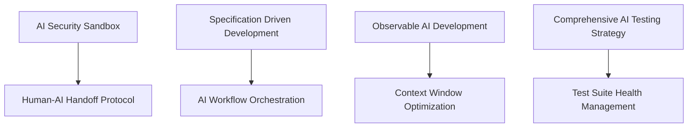

# Experimental Pattern Examples

This directory contains working implementations of experimental AI development patterns. These examples demonstrate cutting-edge approaches that are under active development and evaluation.

## Pattern Implementation Status

| Pattern | Implementation Status | Directory | Description |
|---------|----------------------|-----------|-------------|
| **Human-AI Handoff Protocol** | ✅ Complete | `human-ai-handoff/` | Decision framework and automation for task transitions |
| **AI Workflow Orchestration** | ✅ Complete | `ai-workflow-orchestration/` | Multi-agent coordination and parallel execution |
| **Context Window Optimization** | 🚧 In Progress | `context-window-optimization/` | AI tool selection and cost optimization |
| **AI Review Automation** | ✅ Complete | `ai-review-automation/` | Automated parallel agent output review |
| **Test Suite Health Management** | 🚧 In Progress | `test-suite-health/` | Flaky test detection and remediation |
| **On-Call Handoff Automation** | 📋 Planned | `on-call-handoff/` | Automated handoff brief generation |

## Usage Guidelines

### Experimental Nature Warning
⚠️ **These patterns are experimental and may:**
- Contain incomplete implementations
- Change significantly based on feedback
- Have limited testing and validation
- Require advanced AI development experience

### Implementation Approach
Each experimental pattern example includes:
- **Working code samples** demonstrating the core concepts
- **Configuration files** for setup and customization  
- **Documentation** explaining usage and limitations
- **Integration examples** showing how to combine with stable patterns

### Prerequisites
- Familiarity with core AI development patterns
- Experience with AI tool integration
- Understanding of advanced development workflows
- Access to multiple AI development tools

## Getting Started

### 1. Review Core Patterns First
Before implementing experimental patterns, ensure you have:
- Established [AI Security Sandbox](../../examples/ai-security-sandbox/)
- Implemented [Specification Driven Development](../../examples/specification-driven-development/)
- Set up [Observable AI Development](../../examples/observable-ai-development/)

### 2. Choose Appropriate Patterns
Select experimental patterns based on:
- **Team maturity**: Advanced patterns require experienced AI developers
- **Use case complexity**: Match pattern sophistication to problem complexity
- **Risk tolerance**: Experimental patterns may have unexpected behaviors

### 3. Implement with Caution
- Start with small, isolated experiments
- Monitor results carefully and document learnings
- Have rollback plans for production systems
- Share findings with the community

## Contributing to Experimental Patterns

### Pattern Development Lifecycle
1. **Concept**: Initial pattern idea and problem statement
2. **Prototype**: Basic implementation and validation
3. **Experiment**: Extended testing and refinement
4. **Stabilization**: Production-ready implementation
5. **Graduation**: Move to core patterns in main examples/

### Feedback and Iteration
- Report issues and suggestions via GitHub issues
- Share implementation experiences and learnings
- Contribute improvements and extensions
- Help validate patterns in different environments

## Integration with Stable Patterns

### Dependency Management
Experimental patterns often build on stable patterns:

### Migration Path
As experimental patterns mature:
1. **Validation**: Thorough testing across multiple use cases
2. **Documentation**: Complete usage guides and best practices
3. **Standardization**: Consistent APIs and integration patterns
4. **Community Adoption**: Widespread usage and feedback
5. **Graduation**: Move to main examples/ directory

## Safety Considerations

### Risk Assessment
Before implementing experimental patterns:
- **Impact Analysis**: Assess potential effects on existing systems
- **Rollback Planning**: Ensure ability to revert changes quickly
- **Monitoring**: Set up observability for experimental features
- **Isolation**: Use sandboxed environments for initial testing

### Best Practices
- **Gradual Rollout**: Implement patterns incrementally
- **Team Training**: Ensure team understands experimental nature
- **Documentation**: Maintain detailed logs of experiments
- **Community Engagement**: Share learnings and get feedback

## Support and Resources

### Getting Help
- Review pattern documentation thoroughly
- Check GitHub issues for known problems
- Engage with the community on discussions
- Consider consulting for complex implementations

### Additional Resources
- [Main AI Development Patterns](../../README.md)
- [Pattern Creation Specification](../../pattern-spec.md)
- [Community Guidelines](../../docs/)
- [Integration Examples](../../examples/)

---

**Remember**: Experimental patterns are evolving rapidly. Always check for updates and community feedback before production deployment.