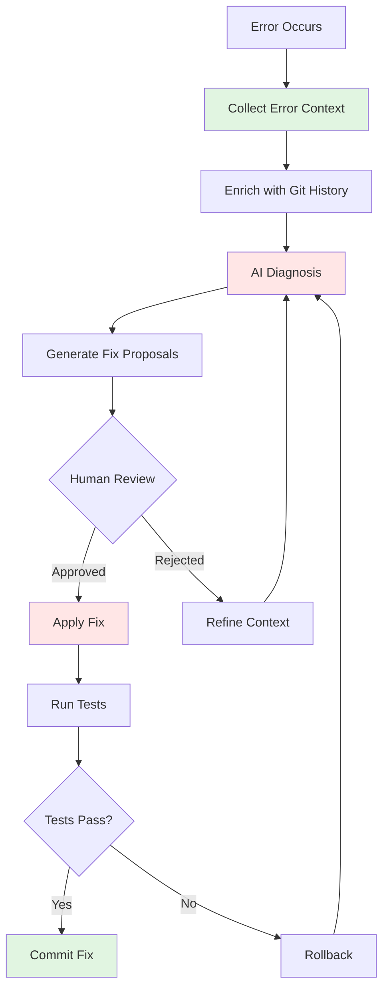

# Error Resolution Pattern

This experimental pattern demonstrates how to leverage AI for diagnosing and fixing errors by providing comprehensive context from logs, system state, git history, and error output.

## Pattern Definition

### Error Resolution

**Maturity**: Intermediate
**Description**: Automatically collect comprehensive error context from logs, system state, and git history, then use AI to diagnose root causes and generate validated fixes.

**Related Patterns**: [AI Tool Integration](../../../README.md#ai-tool-integration), [Observable AI Development](../../../README.md#observable-ai-development), [AI Security Sandbox](../../../README.md#ai-security-sandbox)

**Current Status**: Experimental - Pattern under active validation and refinement

**Known Limitations**:
- Requires structured error output for best results
- AI diagnosis quality depends on context completeness
- Manual validation of fixes still required

**Potential Path to Full Pattern**:
- Validate across diverse error types and CI/CD platforms
- Build confidence scoring for AI-suggested fixes
- Establish success metrics for automated resolution

## Core Workflow



## Core Implementation

**Step 1: Collect Error Context** (tool-agnostic)

```bash
# Create error context file with all relevant information
cat > .error-context.md << 'EOF'
# Error Analysis

## Error Output
[Paste complete error message, stack trace, and exit codes]

## Recent Changes
$(git log --oneline -5)

## Affected Files
$(git diff --name-only HEAD~1)

## File Contents (for affected files)
$(cat path/to/affected/file.ext)

## Environment
- OS: $(uname -s)
- Shell: $SHELL
- Working Directory: $(pwd)
EOF
```

**Step 2: AI-Powered Diagnosis**

```bash
# Send structured context to AI for analysis
ai "Analyze this error and provide actionable fixes:

CONTEXT:
$(cat .error-context.md)

REQUIRED OUTPUT:
1. Root cause analysis
2. Specific fix commands (copy-pasteable)
3. Prevention strategy (pre-commit hooks, tests, etc.)

Format fixes as executable bash commands."
```

**Step 3: Validate and Apply Fixes**

```bash
# Review AI suggestions
cat ai-suggestions.md

# Apply fixes with validation
bash fix-commands.sh

# Verify with tests
./run-tests.sh

# Commit if successful
git add .
git commit -m "fix: [description based on AI analysis]"
```

## Practical Workflow Example

```bash
# 1. Capture error from any source (CI, terminal, logs)
ERROR_LOG="path/to/error.log"

# 2. Enrich with context
cat > error-analysis.md << EOF
## Error
$(cat $ERROR_LOG)

## Recent Commits
$(git log --oneline -3)

## Changed Files
$(git diff --name-only HEAD~1)

## File Contents
$(for file in $(git diff --name-only HEAD~1); do
    echo "### $file"
    cat $file
done)
EOF

# 3. AI diagnosis
ai "Diagnose and fix:
$(cat error-analysis.md)

Provide:
1. Root cause
2. Exact fix commands
3. How to prevent recurrence"

# 4. Apply and validate
# [Review AI output]
# [Execute suggested fixes]
# [Run tests]
# [Commit]
```

## When to Use Error Resolution

- **CI/CD Failures**: Diagnose build, test, or deployment failures
- **Local Development Errors**: Debug unexpected errors during development
- **Configuration Issues**: Resolve environment or configuration problems
- **Dependency Conflicts**: Analyze and resolve version conflicts
- **Integration Failures**: Debug issues with external services or APIs

## Integration Examples

This pattern works with any error source. See the `examples/` directory for:

- **GitHub Actions**: Fetch error context from workflow runs using `gh` CLI
- **Common Error Types**: Dependency conflicts, configuration errors, test failures

## Templates

Reusable templates for different scenarios:

- **templates/error-context-template.md**: Generic error context collection
- **templates/ai-prompt-template.md**: Structured AI prompts for diagnosis

## Anti-Patterns

### Anti-pattern: Context-Free Error Messages

**Problem**: Sending only the error message to AI without surrounding context.

```bash
# ❌ Bad: No context
ai "Fix error: Process completed with exit code 1"
```

**Why it's problematic**: AI cannot diagnose the issue without seeing:
- What command failed
- Recent changes that might have caused it
- File contents or configuration
- System environment

**Instead, provide full context:**

```bash
# ✅ Good: Comprehensive context
ai "Fix this error:

Error: Process completed with exit code 1

Command that failed: terraform fmt -check -recursive
Files affected: main.tf, outputs.tf

Recent change:
$(git log -1 --oneline)

File content:
$(cat terraform/main.tf)

Environment: Terraform v1.6.0"
```

### Anti-pattern: Blind Fix Application

**Problem**: Applying AI-suggested fixes without validation or understanding.

```bash
# ❌ Bad: Apply without review
ai "Fix this error" | bash
```

**Why it's problematic**:
- AI suggestions may introduce new bugs
- May break existing functionality
- Could make security or data loss mistakes
- No rollback strategy if fix fails

**Instead, validate fixes before applying:**

```bash
# ✅ Good: Validate before applying
ai "Fix this error" > proposed-fix.sh

# Review the proposed changes
cat proposed-fix.sh

# Apply fix
bash proposed-fix.sh

# Verify changes
git diff

# Run tests to validate
./run-tests.sh

# Rollback if tests fail
if [ $? -ne 0 ]; then
    git checkout .
    echo "Fix failed validation, rolled back"
fi
```

### Anti-pattern: Missing Rollback Strategy

**Problem**: No way to undo AI-generated fixes that make things worse.

**Instead, always create a checkpoint:**

```bash
# ✅ Good: Create checkpoint before fixes
git stash push -m "Pre-fix checkpoint"

# Apply AI fix
bash ai-fix.sh

# Test
if ./run-tests.sh; then
    git stash drop  # Fix worked
else
    git stash pop   # Rollback
fi
```

## Success Metrics

Track these metrics to evaluate pattern effectiveness:

- **Resolution Time**: Time from error occurrence to fix commit
- **Fix Success Rate**: Percentage of AI-suggested fixes that resolve the issue
- **Iteration Count**: Number of AI diagnosis cycles needed
- **Recurrence Prevention**: Errors that don't reoccur after fix + prevention steps

## Contributing

This is an experimental pattern. If you use it successfully or identify improvements:

1. Document your use case and results
2. Share successful error diagnosis examples
3. Suggest improvements to context collection or AI prompts
4. Report issues or limitations discovered

## Files in This Implementation

- **README.md**: This pattern documentation
- **templates/**: Reusable templates for error context and AI prompts
- **examples/github-actions/**: GitHub Actions-specific integration
- **examples/common-errors/**: Example error scenarios and resolutions

## Quick Start

```bash
# 1. Copy error context template
cp templates/error-context-template.md .error-context.md

# 2. Fill in your error details
vim .error-context.md

# 3. Use AI prompt template
cat templates/ai-prompt-template.md | sed "s/ERROR_CONTEXT/$(cat .error-context.md)/" | ai

# 4. Review, apply, test, commit
```
