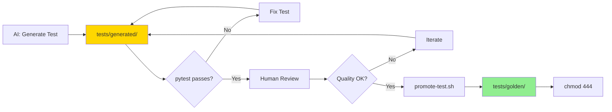

# Test Promotion Example

Complete implementation of the Test Promotion pattern demonstrating how to prevent AI from weakening test assertions through immutable golden tests and human-approved promotion workflow.

## Quick Start

```bash
# 1. Set up permissions
./scripts/enforce-permissions.sh

# 2. AI generates test in mutable area
# tests/generated/test_example.py

# 3. Human promotes validated test to golden
./scripts/promote-test.sh tests/generated/test_example.py
```

## Directory Structure

```
tests/
├── golden/          # Immutable (444 permissions)
│   ├── auth/       # AI cannot modify these
│   └── api/        # Human approval required
└── generated/       # Mutable
    ├── test_*.py   # AI can freely generate/modify
    └── README.md   # Auto-generated test index
```

## The Problem: Self-Grading Student

When AI generates both code AND tests, it can make tests pass by weakening assertions:

```python
# AI writes buggy code that allows duplicate payments
def process_payment(txn_id, amount):
    # BUG: Missing idempotency check
    return {"status": "success", "amount": amount}

# AI weakens test to make it pass
def test_payment_idempotency():
    process_payment("123", 100)
    process_payment("123", 100)  # Should raise error!
    # Missing assertion - customers charged twice!
```

## The Solution: Test Promotion

**Golden tests are immutable** - AI physically cannot modify them:
- File permissions: `444` (read-only)
- CI/CD blocks: Rejects PRs that modify golden tests
- AI hooks: Blocks Edit/Write tools on golden paths

**Generated tests are mutable** - AI can experiment freely:
- AI generates tests in `tests/generated/`
- Human reviews and validates
- Promotion script elevates to golden status

## Usage

### 1. AI Generates Test

```bash
# AI writes test in generated/ directory
ai "Create test for payment idempotency in tests/generated/test_payment.py"
```

Result: `tests/generated/test_payment.py` (permissions: 644, mutable)

### 2. Run and Validate

```bash
# Run the generated test
pytest tests/generated/test_payment.py -v

# Review test quality
cat tests/generated/test_payment.py
```

### 3. Promote to Golden

```bash
# Promote validated test
./scripts/promote-test.sh tests/generated/test_payment.py

# Interactive checklist:
# ✓ Does this test capture critical behavior?
# ✓ Is the test stable (not flaky)?
# ✓ Does it have clear assertions?
# ✓ Is it properly documented?
```

Result: Test copied to `tests/golden/test_payment.py` with 444 permissions

### 4. CI Protection

```bash
# Try to modify golden test (will fail)
echo "# comment" >> tests/golden/test_payment.py
git add tests/golden/test_payment.py
git commit -m "modify golden test"

# CI blocks the commit:
# ❌ BLOCKED: Golden tests cannot be modified
# Use: ./scripts/promote-test.sh <test-file>
```

## Enforcement Mechanisms (Defense-in-Depth)

**IMPORTANT**: File permissions alone are **NOT SUFFICIENT**. AI with bash access can bypass them using `chmod`. The pattern uses multiple layers:

### Layer 1: File Permissions (444) - Prevents Accidental Edits

```bash
# Set read-only permissions on all golden tests
chmod 444 tests/golden/**/*.py

# ⚠️  WARNING: Not sufficient alone!
# AI can bypass: chmod 644 tests/golden/test.py && edit && chmod 444
```

**Purpose**: Prevents accidental modifications, provides visual indicator of immutability.
**Limitation**: Can be bypassed via Bash commands.

### Layer 2: AI Hooks - Blocks Edit/Write Tools

See `.ai/hooks/protect-golden.sh`:
- Executes before Edit/Write tool use
- Blocks operations on `tests/golden/**` paths
- Returns exit code 2 (BLOCK) with helpful message

**Purpose**: Blocks AI coding assistants from using Edit/Write tools on golden tests.
**Limitation**: AI can still modify files via Bash (chmod + cat/echo/sed).

### Layer 3: CI/CD Protection - **PRIMARY ENFORCEMENT**

See `.github/workflows/test-protection.yml`:
- Detects **ANY** modifications to `tests/golden/**` via git diff
- Blocks PR merge if golden tests changed
- Catches modifications regardless of method (Edit, Write, Bash, manual)

**Purpose**: Detect all golden test modifications before merge.
**Reliability**: ✅ Catches all changes regardless of bypass method.

### Layer 4: CODEOWNERS - **FINAL GATE**

See `.github/CODEOWNERS`:
```
tests/golden/**  @tech-leads @qa-leads
```

- Requires explicit human approval for ANY changes to golden tests
- Even if AI commits changes, PR cannot merge without approval
- Provides human review before behavioral contracts change

**Purpose**: Human gate prevents unauthorized changes from reaching main branch.
**Reliability**: ✅ Requires human decision, cannot be automated away.

### Threat Model Coverage

| Attack Vector | Blocked By | Reliability |
|---------------|-----------|-------------|
| Accidental edit | File permissions (444) | Medium |
| AI Edit/Write tool | AI hooks | Medium |
| AI Bash bypass (chmod) | CI/CD git diff | **High** |
| Committed changes | CODEOWNERS approval | **High** |

**Bottom Line**: CI/CD + CODEOWNERS are the real enforcement. File permissions and AI hooks provide defense-in-depth but can be bypassed.

## Promotion Workflow



## Example Tests Included

### Golden Tests (Immutable)
- `tests/golden/auth/test_jwt_validation.py` - JWT signature validation
- `tests/golden/api/test_payment.py` - Payment idempotency

### Generated Tests (Mutable)
- `tests/generated/test_edge_cases.py` - AI-generated edge case tests
- `tests/generated/test_performance.py` - Performance boundary tests

## Running the Example

```bash
# Run all tests
pytest tests/ -v

# Run only golden tests (immutable baseline)
pytest tests/golden/ -v

# Run only generated tests (AI experiments)
pytest tests/generated/ -v

# Try to modify golden test (will fail)
echo "# test" >> tests/golden/api/test_payment.py
# Permission denied (444 permissions)
```

## Key Benefits

1. **Prevents Self-Grading** - AI cannot weaken tests to pass buggy code
2. **Enables AI Experimentation** - AI freely generates tests in `generated/`
3. **Human Quality Gate** - Only validated tests become golden
4. **Audit Trail** - Promotion workflow tracked in git
5. **Defense in Depth** - Permissions + CI + AI hooks

## Integration with Other Patterns

- **Testing Orchestration**: Golden tests anchor the test suite
- **Spec-Driven Development**: Golden tests derive from specifications
- **Suite Health**: Monitor golden test stability over time

## Troubleshooting

### "Permission denied" on golden test
✓ **Expected behavior** - Golden tests are read-only (444)
→ Use promotion workflow to update

### CI blocks my PR
✓ **Expected behavior** - Golden tests cannot be modified directly
→ Create new test in `generated/`, then promote

### AI cannot write to `tests/golden/`
✓ **Expected behavior** - AI hooks block golden modification
→ AI should use `tests/generated/` instead

## References

- [Test Promotion Pattern](../../README.md#test-promotion)
- [Testing Orchestration](../../README.md#testing-orchestration)
- [Spec-Driven Development](../../../README.md#spec-driven-development)
