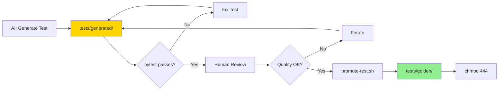

# Test Promotion Example

This example implements the experimental [Test Promotion](../../README.md#test-promotion) pattern:
protected golden tests serve as behavioral contracts, candidate tests remain mutable, and a
separate human-owned workflow decides which validated additions become golden.

## Current Status

The local permission and promotion scripts are runnable. The AI hook, CI workflow, and CODEOWNERS
file are installation templates: their nested paths are inert in this repository and adopters must
copy or merge them into their own assistant and repository-root configuration. Git stores the
golden test as ordinary `100644`; `scripts/enforce-permissions.sh` applies advisory `444` mode only
to the active checkout. The example ships one golden test against a small payment module and no
generated tests.

## Quick Start

```bash
# 1. Install and run the example
python -m pip install -r requirements.txt
pytest tests/golden -q

# 2. Create a candidate test in the mutable area, then edit/review it
mkdir -p tests/generated
cp tests/golden/test_payment.py tests/generated/test_payment_contract.py
chmod 644 tests/generated/test_payment_contract.py

# 3. Apply the advisory local read-only mode to golden tests
./scripts/enforce-permissions.sh

# 4. A human runs the interactive add-only promotion
./scripts/promote-test.sh tests/generated/test_payment_contract.py
```

## Directory Structure

```
tests/
├── golden/              # Protected contracts — human approval required
│   └── test_payment.py  # Payment behavioral contract
└── generated/           # Mutable local candidates; created by the adopter
    └── test_*.py        # Generated or written locally, then reviewed
```

## The Problem: Self-Grading Student

When AI generates both code AND tests, it can make tests pass by weakening assertions:

```python
# AI writes buggy code that allows duplicate payments
def process_payment(txn_id, amount):
    # BUG: Missing idempotency check
    return {"status": "success", "amount": amount}

# AI weakens test to make it pass
def test_payment_idempotency():
    process_payment("123", 100)
    process_payment("123", 100)  # Should raise error!
    # Missing assertion - customers charged twice!
```

## The Solution: Test Promotion

**Golden tests are protected contracts** when the templates are installed:
- Local `444` mode discourages accidental edits in one checkout
- Required CI rejects direct modification, rename, or deletion
- Required CODEOWNERS review governs add-only promotion pull requests
- An assistant hook can block normal Edit/Write tools on golden paths

**Generated tests are mutable** - AI can experiment freely:
- AI generates tests in `tests/generated/`
- Human reviews and validates
- Promotion script elevates to golden status

## Usage

### 1. AI Generates Test

```bash
# AI writes test in generated/ directory
ai "Create test for payment idempotency in tests/generated/test_payment.py"
```

Result: `tests/generated/test_payment.py` (permissions: 644, mutable)

### 2. Run and Validate

```bash
# Run the generated test
pytest tests/generated/test_payment.py -v

# Review test quality
cat tests/generated/test_payment.py
```

### 3. Promote to Golden

```bash
# Promote validated test
./scripts/promote-test.sh tests/generated/test_payment.py

# Interactive checklist:
# ✓ Does this test capture critical behavior?
# ✓ Is the test stable (not flaky)?
# ✓ Does it have clear assertions?
# ✓ Is it properly documented?
```

Result: A new test is copied under `tests/golden/` with advisory `444` mode and committed for
CODEOWNERS review. The script refuses to overwrite an existing golden contract.

### 4. CI Protection

```bash
# Try to modify golden test (will fail)
echo "# comment" >> tests/golden/test_payment.py
git add tests/golden/test_payment.py
git commit -m "modify golden test"

# After the root templates are installed, the required check rejects this PR.
```

## Enforcement Mechanisms (Defense-in-Depth)

**IMPORTANT**: File permissions alone are **NOT SUFFICIENT**. AI with bash access can bypass them using `chmod`. The pattern uses multiple layers:

### Layer 1: File Permissions (444) - Prevents Accidental Edits

```bash
# Set read-only permissions on all golden tests
chmod 444 tests/golden/*.py

# ⚠️  WARNING: Not sufficient alone!
# AI can bypass: chmod 644 tests/golden/test.py && edit && chmod 444
```

**Purpose**: Prevents accidental modifications in the configured checkout.
**Limitation**: Git does not preserve `444` across clones, and Bash can change the mode.

### Layer 2: AI Hooks - Blocks Edit/Write Tools

The template at `.ai/hooks/protect-golden.sh` must be installed in the assistant's active hook
configuration. When installed, it:
- Executes before Edit/Write tool use
- Blocks operations on `tests/golden/**` paths
- Returns exit code 2 (BLOCK) with helpful message

**Purpose**: Blocks AI coding assistants from using Edit/Write tools on golden tests.
**Limitation**: AI can still modify files via Bash (chmod + cat/echo/sed).

### Layer 3: CI/CD Protection - **PRIMARY ENFORCEMENT**

Copy `.github/workflows/test-protection.yml` to the target repository's root
`.github/workflows/` directory and make its check required. It:
- Rejects golden changes without the `test-promotion` label
- Allows labeled additions to proceed to human review
- Rejects modifications, renames, and deletions even on a promotion pull request

**Purpose**: Detect all golden test modifications before merge.
**Reliability**: High only when the root workflow and its required-check configuration are protected
from the candidate pull request.

### Layer 4: CODEOWNERS - **FINAL GATE**

Merge the sample `.github/CODEOWNERS` rule into the target repository's root CODEOWNERS file,
replace its placeholder teams, and require code-owner review:
```
tests/golden/**  @tech-leads @qa-leads
```

- Requires explicit human approval for additions to golden tests
- Keeps the promotion decision separate from the generating agent
- Provides human review before behavioral contracts change

**Purpose**: Human gate prevents unauthorized changes from reaching main branch.
**Reliability**: High only when branch protection requires code-owner review and protects the
workflow, CODEOWNERS, and ruleset from unreviewed changes.

### Threat Model Coverage

| Attack Vector | Blocked By | Reliability |
|---------------|-----------|-------------|
| Accidental edit | File permissions (444) | Medium |
| AI Edit/Write tool | AI hooks | Medium |
| AI Bash bypass (chmod) | Required root CI diff check | **High when installed** |
| Committed additions | Required CODEOWNERS approval | **High when installed** |

**Bottom Line**: A protected root CI workflow plus required CODEOWNERS review are the binding
controls. File permissions and hooks are optional defense-in-depth.

## Promotion Workflow


```mermaid
graph LR
    A[AI: Generate Test] --> B[tests/generated/]
    B --> C{pytest passes?}
    C -->|No| D[Fix Test]
    D --> B
    C -->|Yes| E[Human Review]
    E --> F{Quality OK?}
    F -->|No| G[Iterate]
    G --> B
    F -->|Yes| H[promote-test.sh]
    H --> I[tests/golden/]
    I --> J[chmod 444]

    style B fill:#FFD700
    style I fill:#90EE90
```

## Example Tests Included

### Golden Tests (Protected)
- `tests/golden/test_payment.py` - Payment behavioral contract with three tests:
  - `test_payment_idempotency` - duplicate transaction IDs must raise `DuplicateTransactionError`
  - `test_payment_validation` - payment amount must be positive
  - `test_payment_requires_transaction_id` - a valid transaction ID is required

### Generated Tests (Mutable)
No generated tests ship with the example. Adopters or their assistants create candidates in
`tests/generated/`, where they stay until deterministic validation and human promotion.

## Running the Example

```bash
# Run all tests
pytest tests/ -v

# Run only golden tests (protected baseline)
pytest tests/golden/ -v

# Run generated tests after you create candidates locally
pytest tests/generated/ -v

# Try to modify a golden test after enforce-permissions.sh (will fail locally)
echo "# test" >> tests/golden/test_payment.py
# Permission denied (444 permissions)
```

## Key Benefits

1. **Separates Grading** - The generator does not own approval of golden contracts
2. **Enables AI Experimentation** - AI freely generates tests in `generated/`
3. **Human Quality Gate** - Only validated tests become golden
4. **Audit Trail** - Promotion workflow tracked in git
5. **Defense in Depth** - Permissions + CI + AI hooks

## Integration with Other Patterns

- **Testing Orchestration**: Golden tests anchor the test suite
- **Spec-Driven Development**: Golden tests derive from specifications
- **[Flake Management](../../README.md#flake-management)**: Monitor golden test stability over time

## Troubleshooting

### "Permission denied" on golden test
✓ **Expected after running the local permission script** - Golden tests are read-only in that
checkout
→ Use the add-only promotion path for a new contract

### CI blocks my PR
✓ **Expected after installing and requiring the root workflow** - Existing golden tests cannot be
modified through the add-only promotion path
→ Create a new test in `generated/`, then promote it for CODEOWNERS review

### The configured assistant hook blocks writes to `tests/golden/`
✓ **Expected after installing the hook in the active assistant** - Normal Edit/Write tools are
blocked
→ The assistant should use `tests/generated/` instead

## Known Limitations

- File permissions and the AI hook are advisory layers; anything with shell access can bypass them. Git restores tracked files as writable in a fresh checkout.
- The nested workflow and CODEOWNERS files are inactive templates until copied or merged into repository-root `.github/` paths. Their checks must be required and their trust-root configuration protected.
- `.github/CODEOWNERS` names placeholder teams (`@tech-leads`, `@qa-leads`) that adopters must replace, and branch protection must require code-owner review for the gate to bind.
- `.ai/hooks/protect-golden.sh` assumes a pre-tool-use hook interface that supplies `TOOL_NAME` and `TOOL_INPUT_FILE_PATH`; wiring differs across AI coding assistants.
- The example covers one module and one golden test; suite-scale concerns such as batch promotion and flake quarantine are out of scope.

## Promotion Path

Promotion of the underlying pattern requires evidence from real repositories: adopters wiring the CI gate and CODEOWNERS into live branch protection, promotion commits observed in practice, demonstrated prevention of assertion-weakening, and integration with [Flake Management](../../README.md#flake-management) so unstable tests are not promoted.

## References

- [Test Promotion Pattern](../../README.md#test-promotion)
- [Testing Orchestration](../../README.md#testing-orchestration)
- [Spec-Driven Development](../../../README.md#spec-driven-development)
