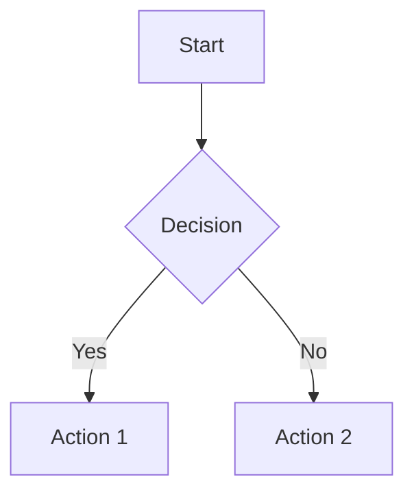
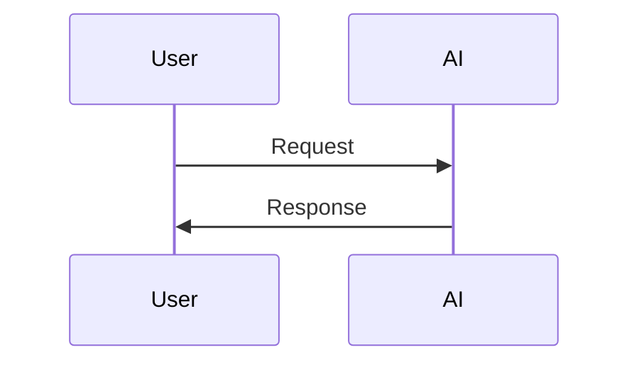
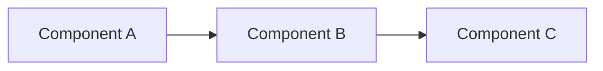

# AI Development Patterns Specification

This document defines the standard structure, content requirements, and formatting guidelines for AI development patterns in this collection.

## Document Structure Requirements

### Complete Pattern Reference Table
The main documentation MUST include a comprehensive reference table at the beginning that:
- Lists ALL patterns in the collection
- Includes maturity level, category, description, and dependencies for each pattern
- Provides internal reference links to each pattern using format:
  ```markdown
  [Pattern Name](#pattern-name-anchor)
  ```
- Organizes patterns by category (Foundation → Development → Operations)
- Uses sub-category headers for Operations patterns (Security & Compliance, Deployment Automation, Monitoring & Maintenance)

### Internal Reference Links
- EVERY pattern mentioned anywhere in the document MUST be hyperlinked to its section
- Use consistent anchor format: `#pattern-name-in-lowercase-with-hyphens`
- Ensure all internal links work correctly throughout the document
- Pattern names in "Related Patterns" sections MUST always be hyperlinked

## Pattern Structure

Each pattern MUST follow this exact structure:

### Pattern Header
```markdown
### Pattern Name

**Maturity**: [Beginner|Intermediate|Advanced]  
**Description**: [One-sentence description of what the pattern accomplishes]

**Related Patterns**: [List of hyperlinked related patterns]
```

### Required Content Sections

1. **Implementation Section** - Primary examples showing pattern in action (flexible section naming: "Core Implementation", "Assessment Framework", "Workflow Implementation", etc.)
2. **Anti-pattern** - What NOT to do, with specific example

**Note**: Each pattern should focus on the most important implementation approaches without overwhelming detail. Complex patterns may include multiple focused examples if they demonstrate different aspects of the same core concept.

### Pattern Categories

Patterns are organized into three main categories:

- **Foundation Patterns**: Team readiness and basic AI integration infrastructure
- **Development Patterns**: Daily coding workflows and tactical approaches
- **Operations Patterns**: CI/CD, security, compliance, and production management
  - Sub-categories: Security & Compliance, Deployment Automation, Monitoring & Maintenance

## Content Requirements

### Pattern Name

All pattern names MUST follow these strict naming conventions:

#### Pattern Naming Rules

1. **Exactly two words, Title Case**
   - No more, no less (e.g., "Context Persistence", "Guided Refactoring")
   - Hyphenated compounds count as one word (e.g., "Spec-Driven" = 1 word)
   - Special case: "-Driven Development" patterns (e.g., "Spec-Driven Development", "Test-Driven Development") follow industry convention where "X-Driven" + "Development" = 2 words

2. **Format: Noun + Noun OR Adjective + Noun**
   - Noun + Noun: "Pipeline Synthesis", "Context Persistence", "Error Resolution"
   - Adjective + Noun: "Parallel Agents", "Guided Architecture", "Atomic Decomposition"
   - Avoid verbs unless absolutely essential to meaning

3. **Must clearly imply what the pattern solves or how it works**
   - Pattern name should pass the "so what" test
   - Users should understand the pattern's purpose from the name alone
   - Example: "Workflow Orchestration" clearly implies coordinating multiple workflows

4. **Use concrete, domain-specific AI-native engineering terms**
   - Prefer: Prompting, Agents, Orchestration, Generation, Synthesis, Automation
   - Prefer: DevSecOps, Observability, Traceability, Remediation, Forecasting
   - Avoid: Generic software terms (Adapter, Manager, Handler, Service)
   - Avoid: Vague terms (Helper, Utility, Common, General)

5. **Each word must be short, clear, and recognizable to engineers**
   - Avoid jargon requiring specialized knowledge
   - Prefer common technical vocabulary
   - Each word should be 2-4 syllables maximum

6. **Unique within catalog**
   - No duplicate pattern names
   - Reuse root words ONLY for related sub-patterns
   - Example: "Context Persistence" and "Context Optimization" share "Context" because they're related

7. **Parallel structure across related pattern sets**
   - Synthesis family: "Pipeline Synthesis", "Deployment Synthesis", "Release Synthesis"
   - Automation family: "Event Automation", "Review Automation", "Evidence Automation"
   - Consistent naming helps users understand pattern relationships

8. **Test: "Use the X Y pattern to..." must sound natural**
   - "Use the Pipeline Synthesis pattern to..." ✅
   - "Use the AI-Guided Blue-Green Deployment pattern to..." ❌ (too long)
   - The pattern name describes a principle, not a tool

#### Antipattern Naming Rules

All antipattern names MUST follow these strict conventions:

1. **Prefix with negative or cautionary modifier**
   - Use: "Broken", "Blind", "Over", "Under", "False"
   - Use: "Un-" prefix (Unplanned, Unchecked, Undocumented)
   - Use: Negative adjectives (Premature, Reckless, Static, Manual, Scattered)
   - Example: "Broken Context", "Blind Generation", "Over-Alerting"

2. **Two words, Title Case**
   - Same format as pattern names
   - Negative prefix counts as part of the first word
   - Example: "Uncoordinated Agents" (not "Un Coordinated Agents")

3. **Must imply a failure mode or misuse of a valid pattern**
   - Should describe what went wrong, not just criticize
   - Example: "Scattered Testing" implies lack of strategy (failure mode)
   - Example: "Lazy Testing" is judgmental (avoid)

4. **Symmetrical with positive patterns where logical**
   - Pattern: "Spec-Driven Development" → Antipattern: "Spec-Ignored"
   - Pattern: "Pipeline Synthesis" → Antipattern: "Manual Pipelines"
   - Pattern: "Workflow Orchestration" → Antipattern: "Chaotic Orchestration"
   - Symmetry helps learners understand the contrast

5. **Technical focus, not judgmental or humorous**
   - Focus on the technical cause of failure
   - Avoid: "Silly Prompting", "Lazy Context", "Dumb Automation"
   - Prefer: "Blind Prompting", "Bloated Context", "Unplanned Automation"

#### Examples of Good Pattern Names

| Pattern Name | Format | Why It Works |
|--------------|--------|--------------|
| Pipeline Synthesis | Noun + Noun | Clear meaning, domain-specific, 2 words |
| Parallel Agents | Adj + Noun | Describes multiple agents working together |
| Context Persistence | Noun + Noun | Technical term + clear benefit |
| Guided Refactoring | Adj + Noun | Implies AI assistance in refactoring |
| Error Resolution | Noun + Noun | Simple, clear problem-solving pattern |
| Deployment Synthesis | Noun + Noun | Parallels "Pipeline Synthesis", clear meaning |

#### Examples of Pattern Names Violating Rules

| Bad Pattern Name | Violation | Fixed Version |
|------------------|-----------|---------------|
| AI Readiness Assessment | 3 words, "AI" redundant | Readiness Assessment |
| Comprehensive AI Testing Strategy | 4 words, vague | Testing Orchestration |
| AI-Guided Blue-Green Deployment | 4 words, too specific | Deployment Synthesis |
| Rules as Code | 3 words, preposition | Codified Rules |
| Constraint-Based AI Development | 4 words, "AI" redundant | Constrained Generation |

#### Examples of Good Antipattern Names

| Antipattern Name | Format | Why It Works |
|------------------|--------|--------------|
| Broken Context | Negative + Noun | "Broken" prefix, describes failure mode |
| Blind Generation | Negative + Noun | "Blind" prefix, technical focus |
| Over-Alerting | Negative + Noun | "Over-" prefix, clear excess problem |
| Uncoordinated Agents | Negative + Noun | "Un-" prefix, symmetrical with "Parallel Agents" |
| Spec-Ignored | Negative + Noun | Symmetrical with "Spec-Driven Development" pattern |

#### Examples of Antipattern Names Violating Rules

| Bad Antipattern Name | Violation | Fixed Version |
|----------------------|-----------|---------------|
| Rushing Into AI | 3 words, no clear prefix | Premature Adoption |
| Test Generation Without Strategy | 4 words, no negative prefix | Scattered Testing |
| Kitchen Sink Upload | 3 words, informal/humorous | Overwhelming Visuals |
| Analysis Paralysis | No negative prefix (common phrase) | Over-Analysis |
| Blue-Green-Canary Confusion | 3+ words, too specific | Confused Deployment |

#### Validation Checklist for Pattern Names

Before finalizing a pattern name, verify:

- [ ] Exactly 2 words
- [ ] Title Case formatting
- [ ] Noun+Noun or Adj+Noun format
- [ ] No "AI" prefix (redundant in AI development context)
- [ ] Domain-specific, technical vocabulary
- [ ] Passes "Use the X Y pattern to..." test
- [ ] Unique within the catalog
- [ ] Clear, concise, recognizable words
- [ ] Describes principle or approach, not a tool

#### Validation Checklist for Antipattern Names

Before finalizing an antipattern name, verify:

- [ ] Exactly 2 words
- [ ] Has negative/cautionary prefix or adjective
- [ ] Describes technical failure mode
- [ ] Not judgmental or humorous
- [ ] Symmetrical with related pattern (if applicable)
- [ ] Passes the professional naming test

### Maturity Levels
- **Beginner**: No prerequisites, immediate implementation, low complexity
- **Intermediate**: Requires foundation patterns, moderate complexity, some AI experience
- **Advanced**: Complex dependencies, high expertise required, sophisticated implementation

### Description
- Single sentence that clearly states the pattern's purpose
- Focus on outcomes and value delivered
- Avoid implementation details in the description

### Related Patterns
- Link to 1-3 most relevant patterns using markdown hyperlinks
- Include patterns this one depends on or builds upon
- Avoid circular references

### Implementation Sections
- Provide concrete, focused examples that demonstrate the pattern's key concepts
- Keep primary examples concise and scannable (aim for clarity over strict line limits)
- Use real commands, file paths, and tool names to show the pattern's essence
- Show the most critical code snippets that illustrate the core concept
- ALWAYS reference detailed implementations in `examples/pattern-name/` directories for complete working code
- Focus on the most important use cases that capture the pattern's value
- Complex patterns may include multiple examples if they address different aspects (e.g., workflow diagrams + code examples + configuration)

### Anti-patterns
- Name the anti-pattern with a descriptive title
- Explain why it's problematic
- Provide specific consequences
- Examples: "Manual Policy Translation", "Alert Fatigue", "Blind Chaos Testing"

### Pattern Length Guidelines

**Recommended maximum lengths:**
- **Complete pattern**: 200-400 lines (target), 600 lines (max before splitting)
- **Description**: 1-2 sentences
- **Core implementation**: 150-300 lines
- **Individual anti-patterns**: 50-100 lines each
- **Code examples in README**: 30-50 lines max

**When a pattern exceeds 600 lines:**
1. Review for unnecessary repetition or verbosity
2. Move detailed implementations to `examples/pattern-name/` directory
3. Consider splitting into multiple focused patterns
4. Remove "nice-to-have" scenarios that don't demonstrate core concepts

**Philosophy**: Patterns should be **scannable in 2-3 minutes**. Readers should grasp the core concept quickly and reference examples/ for deep implementation details.

**Enforcement Strategy**

For AI-generated patterns:
1. **Auto-warning at 500+ lines**: "This pattern is getting long. Review for bloat."
2. **Hard review at 600+ lines**: "Consider splitting or moving detail to examples/"
3. **Guidance**: "Each additional 100 lines should add significant new value"

**Quality over quantity:**
- ✅ 300 well-focused lines > 600 lines with repetition
- ✅ Clear core examples > exhaustive scenario coverage
- ✅ Scannable structure > comprehensive documentation

## Formatting Standards

### Code Blocks
- Use appropriate language tags (bash, yaml, json, python, etc.)
- Include comments explaining non-obvious steps
- Use realistic file paths and tool names
- Show both input and expected output where applicable

### Diagrams
Consider adding diagrams when the pattern would benefit from visual explanation:

**When to use diagrams:**
- Multi-step workflows or processes (use flowcharts)
- System interactions or data flow (use sequence diagrams)
- Component relationships or architecture (use component diagrams)
- State transitions or decision trees (use state diagrams)
- Timeline-based processes (use timeline or Gantt charts)

**Diagram guidelines:**
- Use Mermaid syntax for consistency and maintainability
- Place diagrams where they best support understanding (typically after description or within implementation sections)
- Keep diagrams simple and focused on the core concept
- Label all components clearly with descriptive names
- Use consistent styling and colors within the same pattern
- Use diagrams judiciously - include them when they clarify complex workflows, relationships, or processes

**Mermaid diagram types to consider:**

**Flowchart for decision flows and processes:**


**Sequence diagram for interactions over time:**


**Component diagram for system architecture:**


### Hyperlinks
- ALL pattern references MUST be hyperlinked using format:
  ```markdown
  [Pattern Name](#pattern-name-anchor)
  ```
- This applies to: Reference table, Related Patterns sections, pattern mentions in descriptions, implementation examples, and any other pattern references
- External links should include brief context
- Ensure all internal links work correctly
- Use consistent anchor naming: convert pattern names to lowercase with hyphens replacing spaces and special characters

### Examples
- Each pattern should include focused examples that demonstrate the core concept clearly
- Keep README examples concise and scannable (prioritize clarity and understanding)
- Show the pattern's essence and core value proposition with practical detail
- For complex patterns, create `examples/pattern-name/` directories with complete working code
- ALWAYS reference detailed implementations using non-clickable code formatting (so the spec itself never contains broken links), for example:
  ```markdown
  Complete Example: See `examples/pattern-name/` for a full implementation.
  ```
- Prefer real-world scenarios over abstract examples
- Use consistent naming conventions (e.g., "myapp" for applications)
- Include the most important commands, code snippets, or configurations that demonstrate the pattern
- Complex patterns may include multiple examples (workflow diagrams, code samples, configuration files) if they illustrate different essential aspects

### Examples Directory Structure
For complex patterns requiring extensive implementation details:

- Create `examples/pattern-name/` directory with complete, working implementations
- Include `README.md` in examples directory explaining the full implementation
- Provide all necessary configuration files, scripts, and dependencies
- Examples directory should be immediately runnable with clear setup instructions
- Use examples directory for:
  - Multi-file implementations (>3 files)
  - Complex configuration setups
  - Complete working applications demonstrating the pattern
  - Advanced usage scenarios and variations

### Experiments Directory Structure
For experimental or future patterns not yet ready for the main documentation:

- Create `experiments/examples/pattern-name/` directory for experimental implementations
- Each experimental pattern should have its own subdirectory with descriptive naming
- Include `README.md` in each experimental directory explaining:
  - The experimental concept being explored
  - Current implementation status
  - Known limitations or areas for development
  - Potential path to becoming a full pattern
- Use experiments directory for:
  - Early-stage pattern exploration and validation
  - Advanced concepts requiring further research
  - Patterns dependent on emerging tools or techniques
  - Complex multi-pattern integrations being tested
- Experimental patterns should follow the same code quality standards as main patterns
- Consider adding experimental patterns to main documentation once they're validated and stable

## Quality Standards

### Actionability
- Each pattern must be immediately implementable
- Provide specific commands, not general guidance
- Include validation steps where appropriate

### Specificity
- Address specific problems, not general categories
- Provide concrete examples rather than abstract concepts
- Focus on practical implementation details

### Completeness
- Include all necessary context for implementation
- Address common failure modes through anti-patterns
- Provide clear success criteria where applicable

## Pattern Dependencies

### Dependency Rules
- Foundation patterns should have minimal dependencies
- Development patterns can depend on Foundation patterns
- Operations patterns can depend on both Foundation and Development patterns
- Avoid circular dependencies between patterns

### Reference Table Requirements
- MUST be the first major section after introduction/overview
- Include maturity level, category, and brief description for each pattern
- List primary dependencies for each pattern
- Organize by logical grouping (Foundation → Development → Operations)
- Every pattern name MUST be a working hyperlink to its section
- Use category headers to group related patterns visually
- Maintain consistent formatting across all entries

## Writing Style

### Tone
- Direct and action-oriented
- Assume reader familiarity with basic AI tools
- Focus on practical implementation over theory
- Use imperative voice for instructions

### Technical Accuracy
- Test all commands and scripts before publication
- Use current tool versions and syntax
- Verify all hyperlinks work correctly
- Ensure examples match real-world usage

### Consistency
- Use consistent terminology throughout
- Follow established naming conventions
- Maintain parallel structure across similar patterns
- Use the same format for all patterns

## Validation Checklist

Before adding a new pattern, verify:

- [ ] **Pattern name follows strict two-word naming convention**
- [ ] **Pattern name uses Noun+Noun or Adj+Noun format**
- [ ] **Pattern name passes "Use the X Y pattern to..." test**
- [ ] **Pattern name is unique within catalog**
- [ ] **Antipattern name has negative prefix and follows naming rules**
- [ ] Follows exact header structure
- [ ] Has clear, single-sentence description
- [ ] Includes appropriate maturity level
- [ ] Contains focused working examples that demonstrate the core concept
- [ ] Defines specific anti-pattern with clear explanation
- [ ] Uses correct markdown formatting
- [ ] Links to related patterns correctly
- [ ] Addresses specific, actionable problem
- [ ] Dependencies are clearly stated
- [ ] Examples show the pattern's essence with practical detail
- [ ] References examples directory for detailed implementation (if directory exists)
- [ ] Considers whether a diagram would enhance understanding of the pattern
- [ ] If diagram included, uses Mermaid syntax and follows diagram guidelines
- [ ] Diagrams are placed where they best support understanding
- [ ] Writing is clear and concise
- [ ] Fits logically within existing pattern organization
- [ ] Added to Complete Pattern Reference table with correct hyperlink
- [ ] All pattern references throughout document are hyperlinked
- [ ] Internal anchor link works correctly from reference table
- [ ] Examples are focused and demonstrate different essential aspects when multiple are included

## Pattern Evolution

### Updates
- Patterns may evolve based on tool updates and community feedback
- Maintain backward compatibility in examples where possible
- Update dependencies when patterns are modified
- Document significant changes in commit messages

### Deprecation
- Mark deprecated patterns clearly
- Provide migration path to replacement patterns
- Remove deprecated patterns after reasonable transition period
- Update all references when patterns are removed

This specification ensures consistency, quality, and usability across all patterns in the AI Development Patterns collection.
